# GRUPO 3

**Ultima actualización:** 25 de marzo 2026

|#|Integrantes|
|---|--------|
|  1  |Leidy Dayana Avendaño Moreno|
|  2 |Jeisson Andres Hernandez Martinez|
|  3  |Michael Giovanny Sierra Leon|
| 4 |John Edilvar Gutierrez Rojas|


LABORATORIO: Implementación de entorno WordPress + MySQL + phpMyAdmin con Docker Compose en Windows

🎯 Objetivo del laboratorio
Implementar un entorno funcional de desarrollo WordPress utilizando Docker Compose, con los siguientes componentes:

WordPress: CMS (Content Management System) para crear sitios web.
MySQL: Base de datos relacional para almacenar la información del sitio.
phpMyAdmin: Interfaz web para administrar la base de datos.
Volúmenes locales en disco D:\DevSecOps\data para persistir datos y poder visualizarlos desde Windows


## **Estructura del proyecto**

Crearemos la siguiente estructura en el disco D:

```
D:\
└── DevSecOps\
    ├── docker-compose.yml
    ├── .env
    ├── data\
    │   ├── db\       ← datos de MySQL
    │   └── wp\       ← archivos del sitio WordPress
    ├── backups\
    └── logs\
```

# Crear carpeta base

<p align="center">
     
</p>

<p align="center">
     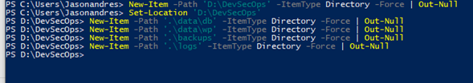
</p>


## ⚙️ **Paso 2: Crear archivo `.env`**

<p align="center">
     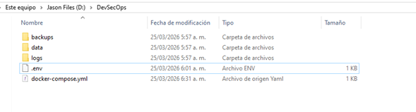
</p>

---

## **Paso 3: Crear archivo `docker-compose.yml` (opción B - volúmenes locales)**
 <p align="center">
     
</p>

---

## **Paso 4: Construcción y despliegue**

Si todo es correcto, se deberá ver los tres servicios en ejecución: `db`, `wordpress`, y `phpmyadmin`.

 <p align="center">
     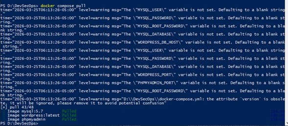
</p>

 <p align="center">
     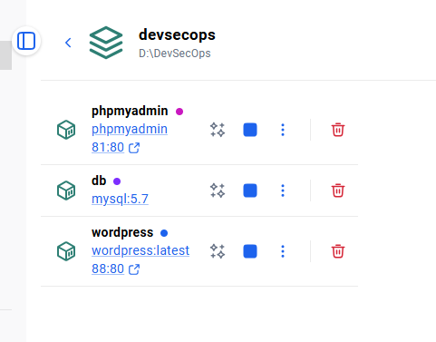
</p>

---

## **Paso 5: Verificación**

* Acceder a **WordPress**:
  [http://localhost:88](http://localhost:88)

 <p align="center">
     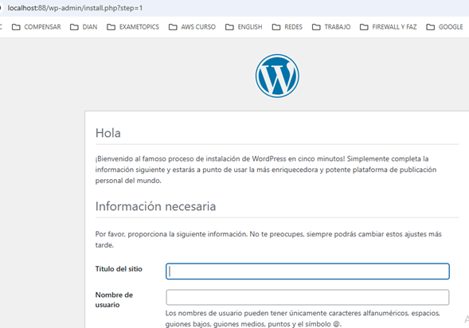
</p>


  Completar el asistente de instalación de WordPress.

* Accede a **phpMyAdmin**:
  [http://localhost:81](http://localhost:81)

 <p align="center">
     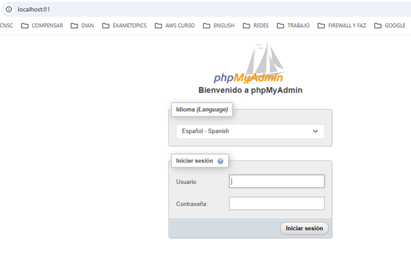
</p>

  ---
## **Paso 6: Validación de persistencia**
1. Crear una publicación o cambia un tema en WordPress.

<p align="center">
     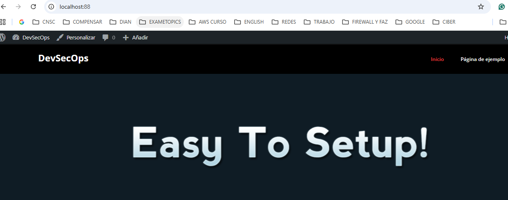
</p>


2. Ejecutar:

   ```powershell
   docker compose down
   docker compose up -d

<p align="center">
     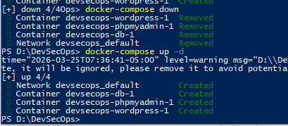
</p>


   ```
3. Comprobar que los cambios siguen presentes.
   Esto confirma que los datos se guardan en `D:\DevSecOps\data`.

   ```
D:\DevSecOps\data\db
<p align="center">
     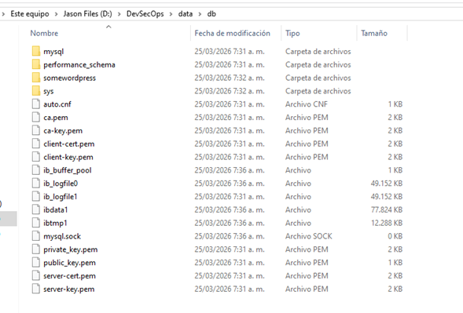
</p>

D:\DevSecOps\data\wp
<p align="center">
     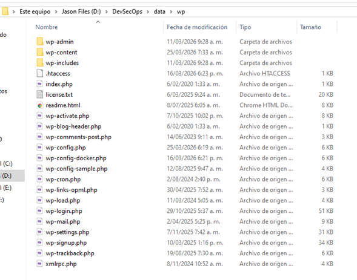
</p>

---

**Backup de la base de datos:**
## **Resultado esperado**

<p align="center">
     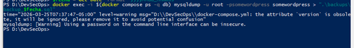
</p>


```


```

---
