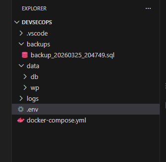
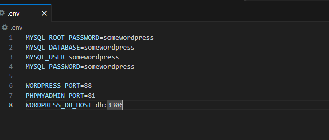
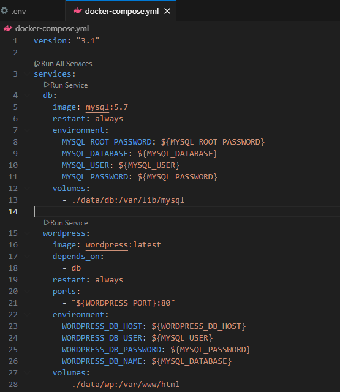
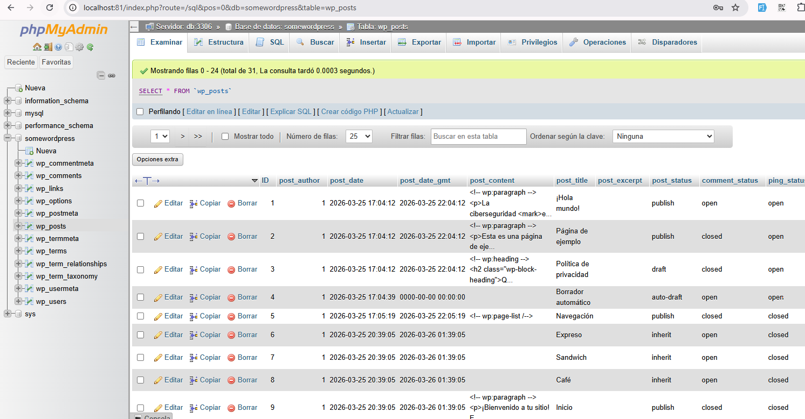
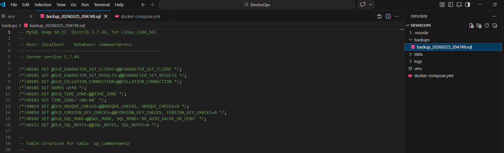

# Resolución del Laboratorio Docker (WordPress + MySQL + phpMyAdmin)


## 👥 Integrantes

- Ing. Argel Ochoa Ronald David  
- Ing. Baquero Soto Mauricio  
- Ing. Buitrago Guiot Oscar Javier  
- Ing. Estefania Naranjo Novoa  

---

## Introducción

En este documento se describe la resolución completa del laboratorio
propuesto, donde se implementa un entorno de desarrollo con WordPress,
MySQL y phpMyAdmin utilizando Docker Compose en Windows.

------------------------------------------------------------------------

## Arquitectura del entorno

Nota: poner imagen aquí (diagrama de arquitectura WordPress + MySQL +
phpMyAdmin)

El entorno está compuesto por: - WordPress (frontend) - MySQL (base de
datos) - phpMyAdmin (administración de BD) - Volúmenes locales para
persistencia

------------------------------------------------------------------------

## Paso 1: Creación de estructura de carpetas

Se ejecutaron los siguientes comandos en PowerShell:

``` powershell
New-Item -Path 'C:\DevSecOps' -ItemType Directory -Force | Out-Null
Set-Location 'C:\DevSecOps'

New-Item -Path '.\data\db' -ItemType Directory -Force | Out-Null
New-Item -Path '.\data\wp' -ItemType Directory -Force | Out-Null
New-Item -Path '.\backups' -ItemType Directory -Force | Out-Null
New-Item -Path '.\logs' -ItemType Directory -Force | Out-Null
```



------------------------------------------------------------------------

## Paso 2: Configuración de variables de entorno

Se creó el archivo `.env` con las siguientes variables:

``` env
MYSQL_ROOT_PASSWORD=somewordpress
MYSQL_DATABASE=somewordpress
MYSQL_USER=somewordpress
MYSQL_PASSWORD=somewordpress

WORDPRESS_PORT=88
PHPMYADMIN_PORT=81
WORDPRESS_DB_HOST=db:3306
```



------------------------------------------------------------------------

## Paso 3: Creación del docker-compose.yml

Se definieron los servicios necesarios:

``` yaml
version: "3.1"

services:
  db:
    image: mysql:5.7
    restart: always
    environment:
      MYSQL_ROOT_PASSWORD: ${MYSQL_ROOT_PASSWORD}
      MYSQL_DATABASE: ${MYSQL_DATABASE}
      MYSQL_USER: ${MYSQL_USER}
      MYSQL_PASSWORD: ${MYSQL_PASSWORD}
    volumes:
      - ./data/db:/var/lib/mysql

  wordpress:
    image: wordpress:latest
    depends_on:
      - db
    restart: always
    ports:
      - "${WORDPRESS_PORT}:80"
    environment:
      WORDPRESS_DB_HOST: ${WORDPRESS_DB_HOST}
      WORDPRESS_DB_USER: ${MYSQL_USER}
      WORDPRESS_DB_PASSWORD: ${MYSQL_PASSWORD}
      WORDPRESS_DB_NAME: ${MYSQL_DATABASE}
    volumes:
      - ./data/wp:/var/www/html

  phpmyadmin:
    image: phpmyadmin
    restart: always
    ports:
      - "${PHPMYADMIN_PORT}:80"
    environment:
      PMA_HOST: db
      PMA_PORT: 3306
      MYSQL_ROOT_PASSWORD: ${MYSQL_ROOT_PASSWORD}
```


------------------------------------------------------------------------

## Paso 4: Despliegue de servicios

Se ejecutaron los siguientes comandos:

``` powershell
docker compose pull
docker compose up -d
docker compose ps
```

Resultado esperado: los tres servicios en estado "running".


------------------------------------------------------------------------

## Paso 5: Verificación del entorno

### WordPress

Acceso: http://localhost:88

Se completó el asistente de instalación.

Nota: poner imagen aquí (pantalla de instalación de WordPress)

### phpMyAdmin

Acceso: http://localhost:81

Credenciales: - Usuario: root - Contraseña: somewordpress



------------------------------------------------------------------------

## Paso 6: Validación de persistencia

Se realizó: 1. Creación de contenido en WordPress 2. Reinicio de
contenedores:

``` powershell
docker compose down
docker compose up -d
```

3.  Validación de que los datos permanecen

Esto confirma el uso correcto de volúmenes.


------------------------------------------------------------------------

## Paso 7: Comandos utilizados

``` bash
docker compose logs -f
docker compose stop
docker compose restart
docker compose down
docker compose down -v
docker compose pull && docker compose up -d
```

------------------------------------------------------------------------

## Paso 8: Backups

### Backup

``` powershell
$fecha = Get-Date -Format "yyyyMMdd_HHmmss"
docker exec -i $(docker compose ps -q db) mysqldump -u root -psomewordpress somewordpress > ".\backups\backup_$fecha.sql"
```



### Restauración

``` powershell
Get-Content ".\backups\backup_YYYYMMDD_HHmmss.sql" | docker exec -i $(docker compose ps -q db) mysql -u root -psomewordpress somewordpress
```

------------------------------------------------------------------------

## Resultado final

Se logró desplegar exitosamente: - WordPress operativo - Base de datos
MySQL funcional - phpMyAdmin accesible - Persistencia de datos
garantizada

Rutas de almacenamiento: -
D:`\DevSecOps`{=tex}`\data`{=tex}`\db`{=tex} -
D:`\DevSecOps`{=tex}`\data`{=tex}`\wp`{=tex}

------------------------------------------------------------------------

## Conclusión

El laboratorio permitió comprender: - Orquestación con Docker Compose -
Uso de volúmenes para persistencia - Configuración de múltiples
servicios - Gestión de contenedores en entorno local
