# Laboratorio Docker (WordPress + MySQL + phpMyAdmin)

# INTEGRANTES

* Lady Bautista  
* Vicente Rueda  
* Juan Carlos Murcia  
* Juan Diaz
* Jonathan Garzon

  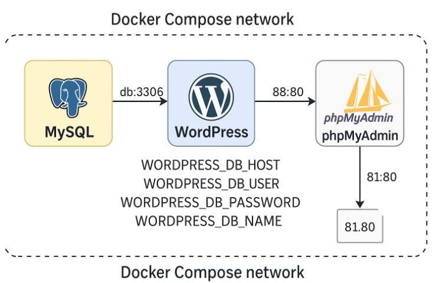

  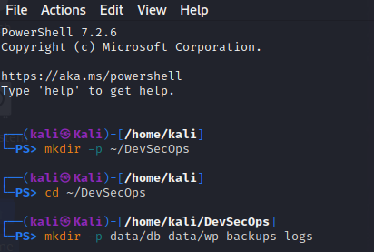

  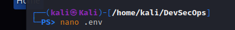

  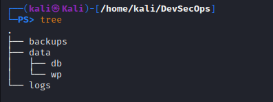

  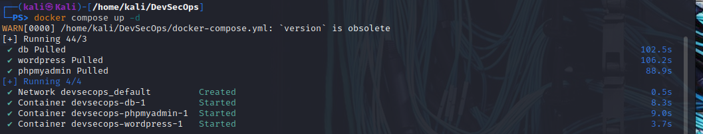

  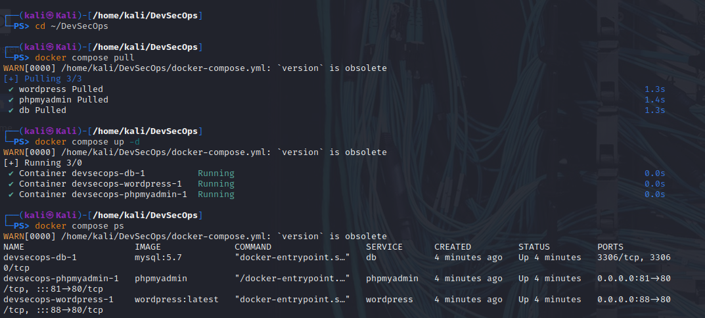

  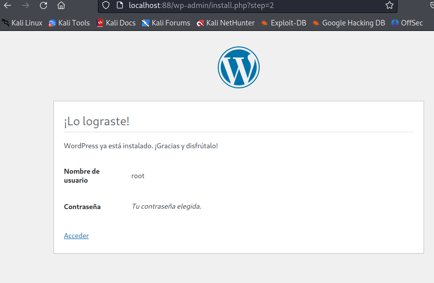

  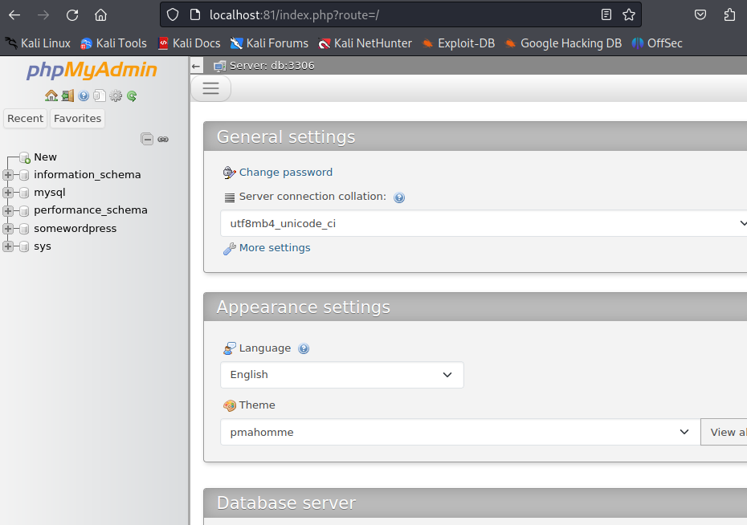

  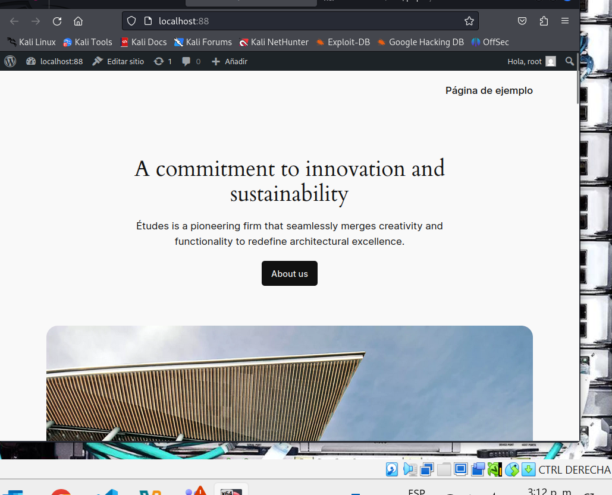

  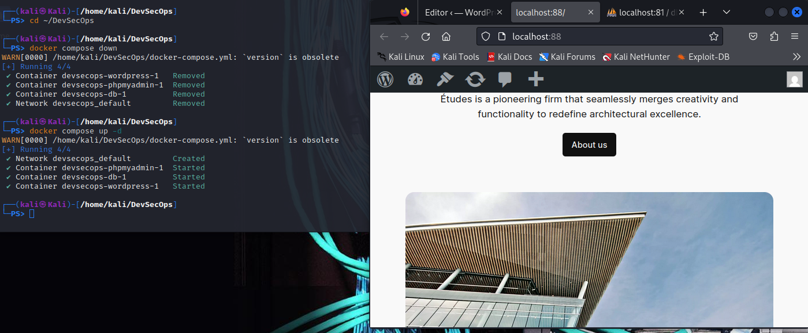

  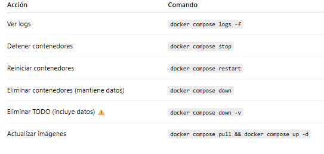
</p

