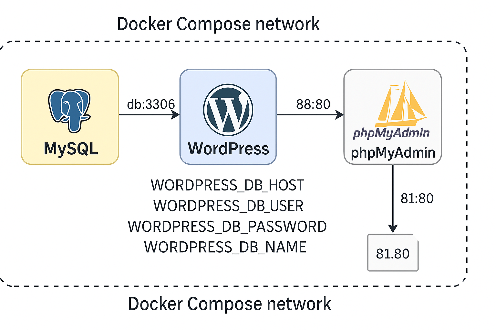

---

# Docker Compose

**Docker Compose** es una herramienta que permite **definir, configurar y ejecutar aplicaciones multicontenedor** de manera automatizada.
Su funcionamiento se basa en un **archivo YAML** denominado `docker-compose.yml`, en el cual se describen todos los servicios, redes y volúmenes necesarios para el despliegue de una aplicación.

En lugar de ejecutar manualmente cada contenedor mediante comandos `docker run`, Docker Compose facilita la orquestación del entorno con un solo comando (`docker compose up`), levantando simultáneamente todos los contenedores definidos.

---

## Objetivo de Docker Compose

El propósito principal de Docker Compose es **simplificar la creación y gestión de entornos formados por múltiples contenedores interdependientes**.

Por ejemplo, en un entorno típico de desarrollo como el implementado en el laboratorio, los componentes se estructuran de la siguiente manera:

* **WordPress**: aplicación web principal.
* **MySQL**: servicio de base de datos.
* **phpMyAdmin**: interfaz de administración de la base de datos.

Cada uno se ejecuta en un contenedor independiente, pero Docker Compose gestiona su conexión y coordinación de forma automática.

---

# Estructura básica de un archivo `docker-compose.yml`

El archivo `docker-compose.yml` utiliza el formato **YAML** (Yet Another Markup Language), el cual organiza la información mediante **sangrías y pares clave–valor**.
A continuación, se describen los elementos estructurales fundamentales del archivo.

---

## Versión (`version`)

```yaml
version: "3.1"
```

* Indica la **versión del esquema de configuración** compatible con Docker Compose.
* Versiones comunes son `"3"`, `"3.1"` o `"3.8"`, dependiendo de la versión de Docker Engine instalada.
* La versión seleccionada determina las características disponibles dentro del archivo.

---

## Servicios (`services`)

```yaml
services:
  wordpress:
    image: wordpress:latest
```

* Constituye el **bloque principal** del archivo.
* Cada **servicio** representa un contenedor que será desplegado como parte del entorno.
* Dentro de cada servicio se pueden definir configuraciones como variables de entorno, puertos, volúmenes y dependencias.

En el laboratorio, los servicios definidos son:

* `db`: contenedor con MySQL.
* `wordpress`: contenedor con WordPress.
* `phpmyadmin`: contenedor con phpMyAdmin.

---

## Imagen (`image`)

```yaml
image: mysql:5.7
```

* Define la **imagen base** que se usará para crear el contenedor.
* Puede provenir de un repositorio público (como Docker Hub) o ser una imagen personalizada construida previamente.

---

## Volúmenes (`volumes`)

```yaml
volumes:
  - ./data/db:/var/lib/mysql
```

* Permiten **persistir datos** o compartir archivos entre el host y el contenedor.
* Al utilizar *bind mounts*, se pueden visualizar los datos directamente en el sistema de archivos del host.

🔹 En el laboratorio (opción B), los volúmenes locales son:

* `./data/db` → almacena los datos de MySQL en `D:\DevSecOps\data\db`.
* `./data/wp` → almacena los archivos de WordPress en `D:\DevSecOps\data\wp`.

---

## Puertos (`ports`)

```yaml
ports:
  - "88:80"
```

* Define el **mapeo de puertos** entre el host y el contenedor.
* En este ejemplo, el puerto `88` del host redirige al puerto `80` del contenedor, permitiendo acceder a la aplicación mediante `http://localhost:88`.

---

## Variables de entorno (`environment`)

```yaml
environment:
  MYSQL_ROOT_PASSWORD: somewordpress
  MYSQL_DATABASE: somewordpress
```

* Establecen parámetros de configuración internos del servicio.
* Estas variables pueden declararse directamente o referirse a valores definidos en un archivo externo `.env`.

En el laboratorio, el archivo `.env` centraliza la configuración de credenciales, nombres de base de datos y puertos, facilitando la modificación o reutilización del entorno.

---

## Dependencias (`depends_on`)

```yaml
depends_on:
  - db
```

* Especifica que un servicio debe **iniciarse después** de otro.
* En este caso, WordPress depende de la base de datos (`db`), por lo que Docker Compose asegura que el servicio `db` se inicie primero.

---

## Política de reinicio (`restart`)

```yaml
restart: always
```

* Define el comportamiento del contenedor ante fallos o reinicios del sistema.
* Opciones comunes incluyen:

  * `no`: no reinicia el contenedor (valor por defecto).
  * `always`: reinicia siempre que se apague o falle.
  * `unless-stopped`: reinicia automáticamente salvo que se detenga manualmente.
  * `on-failure`: reinicia solo si ocurre un error en la ejecución.

---

## Red interna (`network`)

Si no se define explícitamente una red, Docker Compose **crea una red predeterminada** donde todos los servicios pueden comunicarse entre sí mediante su nombre.

En el laboratorio, WordPress accede a la base de datos a través del nombre del servicio:

```
WORDPRESS_DB_HOST=db:3306
```

El nombre `db` funciona como un alias DNS dentro de la red interna generada por Docker Compose.

---

# Comandos esenciales de Docker Compose

| Comando                  | Descripción                                               |
| ------------------------ | --------------------------------------------------------- |
| `docker compose up -d`   | Construye e inicia los servicios en modo “detached”.      |
| `docker compose down`    | Detiene y elimina los contenedores.                       |
| `docker compose ps`      | Muestra los servicios activos y sus puertos.              |
| `docker compose logs -f` | Muestra los registros de los contenedores en tiempo real. |
| `docker compose stop`    | Detiene los servicios sin eliminarlos.                    |
| `docker compose restart` | Reinicia los servicios activos.                           |
| `docker compose config`  | Valida la sintaxis del archivo `docker-compose.yml`.      |

---

# Ventajas de Docker Compose

**Simplificación operativa:**
Permite iniciar todo el entorno con un solo comando.

**Reproducibilidad:**
Garantiza la misma configuración en diferentes máquinas o equipos de desarrollo.

**Aislamiento:**
Cada servicio se ejecuta en su propio contenedor, evitando conflictos de dependencias.

**Portabilidad:**
El archivo `docker-compose.yml` es compatible con Windows, macOS y Linux.

**Persistencia de datos:**
Los volúmenes aseguran que la información se conserve incluso si los contenedores se eliminan o reinician.

---

# Resumen conceptual

| Concepto                | Descripción                                                     |
| ----------------------- | --------------------------------------------------------------- |
| **Servicio**            | Contenedor definido dentro del archivo `docker-compose.yml`.    |
| **Imagen**              | Plantilla base utilizada para crear el contenedor.              |
| **Volumen**             | Carpeta compartida para almacenar datos persistentes.           |
| **Puerto**              | Canal de comunicación entre el host y el contenedor.            |
| **Variable de entorno** | Parámetro configurable del servicio.                            |
| **Red interna**         | Espacio virtual que permite la comunicación entre contenedores. |
| **Archivo `.env`**      | Fichero que centraliza configuraciones reutilizables.           |

---

*
*
*


# LABORATORIO: Implementación de entorno WordPress + MySQL + phpMyAdmin con Docker Compose en Windows

##  **Objetivo del laboratorio**

Implementar un entorno funcional de desarrollo **WordPress** utilizando **Docker Compose**, con los siguientes componentes:

* **WordPress**: CMS (Content Management System) para crear sitios web.
* **MySQL**: Base de datos relacional para almacenar la información del sitio.
* **phpMyAdmin**: Interfaz web para administrar la base de datos.
* **Volúmenes locales** en disco **D:\DevSecOps\data** para persistir datos y poder visualizarlos desde Windows.

---
# Arquitectura.


---

## **Requisitos previos**

1. **Windows 10/11** con virtualización habilitada (Claramente se peuede realizar el laboratorio en linux, con los respectivos ajustes requeridos)
2. **Docker Desktop** instalado y funcionando (configurado para usar **WSL2**).
3. **PowerShell** (ejecutado como Administrador).


---

## **Estructura del proyecto**

Crearemos la siguiente estructura en el disco D:

```
D:\
└── DevSecOps\
    ├── docker-compose.yml
    ├── .env
    ├── data\
    │   ├── db\       ← datos de MySQL
    │   └── wp\       ← archivos del sitio WordPress
    ├── backups\
    └── logs\
```

---

## **Paso 1: Crear la estructura de carpetas**

Ejecutar en **PowerShell**:

```powershell
# Crear carpeta base
New-Item -Path 'D:\DevSecOps' -ItemType Directory -Force | Out-Null
Set-Location 'D:\DevSecOps'

# Crear subcarpetas
New-Item -Path '.\data\db' -ItemType Directory -Force | Out-Null
New-Item -Path '.\data\wp' -ItemType Directory -Force | Out-Null
New-Item -Path '.\backups' -ItemType Directory -Force | Out-Null
New-Item -Path '.\logs' -ItemType Directory -Force | Out-Null
```

---

## ⚙️ **Paso 2: Crear archivo `.env`**

Guardar las variables de entorno con los parámetros de conexión y configuración:

```powershell
@"
MYSQL_ROOT_PASSWORD=somewordpress
MYSQL_DATABASE=somewordpress
MYSQL_USER=somewordpress
MYSQL_PASSWORD=somewordpress

WORDPRESS_PORT=88
PHPMYADMIN_PORT=81
WORDPRESS_DB_HOST=db:3306
"@ | Set-Content -Path '.env' -Encoding UTF8
```

---

## **Paso 3: Crear archivo `docker-compose.yml` (opción B - volúmenes locales)**

Copia este contenido:

```yaml
version: "3.1"

services:
  db:
    image: mysql:5.7
    restart: always
    environment:
      MYSQL_ROOT_PASSWORD: ${MYSQL_ROOT_PASSWORD}
      MYSQL_DATABASE: ${MYSQL_DATABASE}
      MYSQL_USER: ${MYSQL_USER}
      MYSQL_PASSWORD: ${MYSQL_PASSWORD}
    volumes:
      - ./data/db:/var/lib/mysql

  wordpress:
    image: wordpress:latest
    depends_on:
      - db
    restart: always
    ports:
      - "${WORDPRESS_PORT}:80"
    environment:
      WORDPRESS_DB_HOST: ${WORDPRESS_DB_HOST}
      WORDPRESS_DB_USER: ${MYSQL_USER}
      WORDPRESS_DB_PASSWORD: ${MYSQL_PASSWORD}
      WORDPRESS_DB_NAME: ${MYSQL_DATABASE}
    volumes:
      - ./data/wp:/var/www/html

  phpmyadmin:
    image: phpmyadmin
    restart: always
    ports:
      - "${PHPMYADMIN_PORT}:80"
    environment:
      PMA_HOST: db
      PMA_PORT: 3306
      MYSQL_ROOT_PASSWORD: ${MYSQL_ROOT_PASSWORD}
```

**Nota importante:**
Cuando Docker pida acceso a la unidad `D:` (en la primera ejecución), **acéptar**. Esto permite compartir archivos entre Docker y Windows.

---

## **Paso 4: Construcción y despliegue**

Ejecutar los siguientes comandos desde `D:\DevSecOps`:

```powershell
# Descargar imágenes
docker compose pull

# Iniciar los servicios
docker compose up -d

# Verificar estado
docker compose ps
```

Si todo es correcto, se deberá ver los tres servicios en ejecución: `db`, `wordpress`, y `phpmyadmin`.

---

## **Paso 5: Verificación**

* Acceder a **WordPress**:
  [http://localhost:88](http://localhost:88)

  Completar el asistente de instalación de WordPress.

* Accede a **phpMyAdmin**:
  [http://localhost:81](http://localhost:81)

  Usa las credenciales:

  * **Usuario:** root
  * **Contraseña:** `somewordpress`

---

## **Paso 6: Validación de persistencia**

1. Crear una publicación o cambia un tema en WordPress.
2. Ejecutar:

   ```powershell
   docker compose down
   docker compose up -d
   ```
3. Comprobar que los cambios siguen presentes.
   Esto confirma que los datos se guardan en `D:\DevSecOps\data`.

---

## **Paso 7: Comandos útiles**

| Acción                                           | Comando                                       |
| ------------------------------------------------ | --------------------------------------------- |
| Ver logs                                         | `docker compose logs -f`                      |
| Detener contenedores                             | `docker compose stop`                         |
| Reiniciar contenedores                           | `docker compose restart`                      |
| Eliminar contenedores (manteniendo datos)        | `docker compose down`                         |
| Eliminar contenedores y volúmenes (borrar datos) | `docker compose down -v`                      |
| Actualizar imágenes                              | `docker compose pull && docker compose up -d` |

---

## **Paso 8: Backups y restauración**

**Backup de la base de datos:**

```powershell
$fecha = Get-Date -Format "yyyyMMdd_HHmmss"
docker exec -i $(docker compose ps -q db) mysqldump -u root -psomewordpress somewordpress > ".\backups\backup_$fecha.sql"
```

**Restaurar backup:**

```powershell
Get-Content ".\backups\backup_YYYYMMDD_HHmmss.sql" | docker exec -i $(docker compose ps -q db) mysql -u root -psomewordpress somewordpress
```

---

## **Resultado esperado**

Al finalizar el laboratorio se tendrá un entorno completo de WordPress corriendo en local:

| Servicio   | URL                                        | Descripción                     |
| ---------- | ------------------------------------------ | ------------------------------- |
| WordPress  | [http://localhost:88](http://localhost:88) | Sitio web principal             |
| phpMyAdmin | [http://localhost:81](http://localhost:81) | Administración de base de datos |
| MySQL      | Interno (db:3306)                          | Base de datos del CMS           |

Los datos estarán almacenados de forma persistente en:

```
D:\DevSecOps\data\db
D:\DevSecOps\data\wp
```

---

