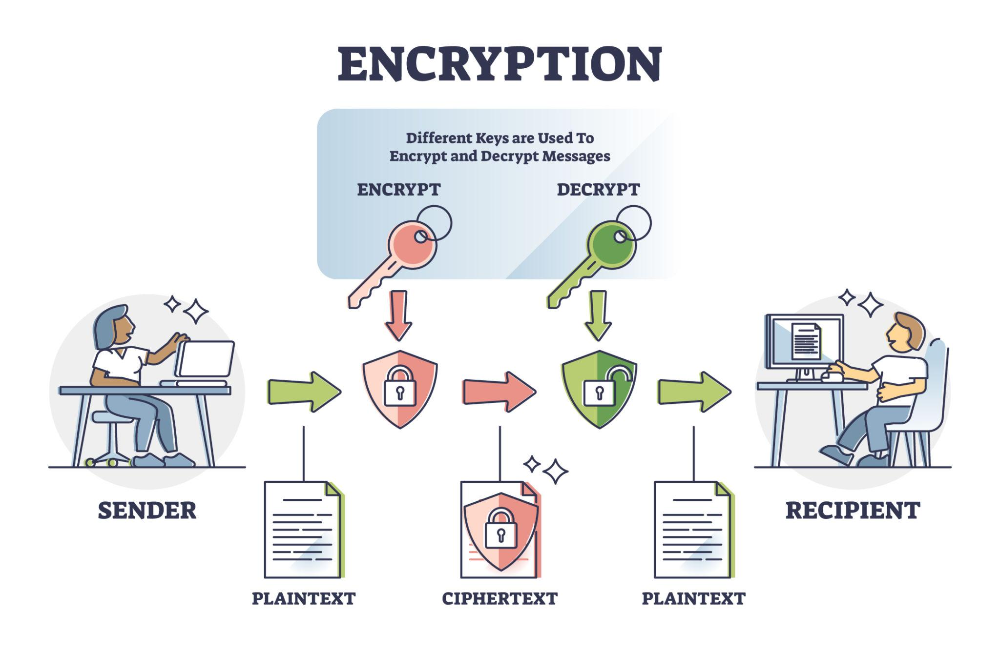

## Integrantes

1. Milton Beltrán
2. Juan Mesa
3. Daniel Bermúdez
4. Jhon Alexander Ariza Ariza

### Objetivos del Trabajo:

Investigar y analizar cada vulnerabilidad del OWASP Top 10.
Documentar métodos de explotación asociados con cada vulnerabilidad.
Proporcionar recomendaciones prácticas para prevenir y mitigar los riesgos asociados.

<h1 align="center">OWASP Top 10</h1>

## 1. Cryptographic Failures (Fallos criptográficos)

### Descripción

Ocurre cuando los datos sensibles no están correctamente protegidos mediante mecanismos de cifrado adecuados. Esto puede permitir que atacantes accedan a información confidencial como contraseñas, datos personales o información financiera.

  

---

### Métodos de Explotación

- Interceptar datos transmitidos sin HTTPS.
- Acceder a bases de datos sin cifrado.
- Obtener contraseñas almacenadas en texto plano.
- Aprovechar el uso de algoritmos criptográficos débiles u obsoletos.

---

### Prevención

- Utilizar HTTPS (TLS) para proteger la comunicación.
- Implementar hash seguro para contraseñas (bcrypt, Argon2).
- Cifrar datos sensibles almacenados en bases de datos.
- Evitar el uso de algoritmos obsoletos como MD5 o SHA1.
- Gestionar adecuadamente claves criptográficas y certificados digitales.

---

## 2. Control de acceso roto (Broken Access Control)

### Descripción

Ocurre cuando una aplicación no impone correctamente las reglas que limitan lo que un usuario puede ver o hacer.

  

### Métodos de Explotación

- Manipulación de URL y parámetros para acceder a recursos de otro usuario.
- Escalada de privilegios (p.ej., de usuario normal a administrador).
- Explotar lógica que no verifica roles antes de ejecutar acciones.
- (Esta vulnerabilidad fue una de las más comunes en pruebas de OWASP.)

---

### Prevención

- Verificar siempre permisos en el backend.
- Aplicar principio de mínimo privilegio.
- Uso de roles con control de acceso fuerte y pruebas automatizadas de autorización.

---

## 3.Injection (Inyección)

### Descripción

Cuando el atacante envía datos maliciosos que se interpretan como comandos.

  

### Métodos de Explotación

- SQL Injection
- Command Injection
- LDAP Injection

---

### Prevención

- Consultas preparadas (Prepared Statements)
- Validación y sanitización de entradas
- ORM seguro
- WAF (Web Application Firewall)

---

## 4.Insecure Design (Diseño inseguro)

### Descripción

Fallas desde el diseño de la aplicación.

  

### Métodos de Explotación

- No limitar intentos de login
- No validar procesos críticos

---

### Prevención

- Modelado de amenazas
- Revisiones de arquitectura
- Diseño seguro desde el inicio (Security by Design)

---

## 5.Security Misconfiguration (Mala configuración)

### Descripción

Errores en configuraciones del servidor o aplicación.

  

### Métodos de Explotación

- Directorios abiertos
- Credenciales por defecto
- Mensajes de error detallados

---

### Prevención y mitigacion 

- Hardening del servidor
- Eliminar configuraciones por defecto
- Revisiones periódicas

---

## 6.Broken Access Control

### Descripción

Ocurre cuando una aplicación no controla correctamente qué recursos puede acceder cada usuario. Esto permite que usuarios accedan a información o funciones que no deberían.

  

### Métodos de Explotación

- Modificar parámetros en la URL (IDOR).
- Escalación de privilegios.
- Acceso a funciones administrativas sin autorización.
- Manipulación de cookies o tokens.

---

### Prevención y mitigacion 

- Implementar control de acceso basado en roles (RBAC).
- Validar permisos en el servidor.
- Aplicar principio de mínimo privilegio.
- Realizar pruebas de autorización.

---

## 7.Injection

### Descripción

Se produce cuando una aplicación ejecuta código malicioso enviado por un atacante.

---

### Métodos de Explotación

- SQL Injection.
- Command Injection.
- LDAP Injection.
- Cross-site scripting (XSS).

---

### Prevención y mitigacion 

- Validación de entradas.
- Uso de consultas parametrizadas.
- Sanitización de datos.
- Implementación de WAF.

---

## 8.Authentication Failures

### Descripción

Problemas en los mecanismos de autenticación que permiten el acceso no autorizado.

---

### Métodos de Explotación

- Ataques de fuerza bruta.
- Robo de sesiones.
- Credential stuffing.

---

### Prevención y mitigacion 

- Implementar autenticación multifactor (MFA).
- Políticas de contraseñas seguras.
- Bloqueo tras múltiples intentos fallidos.
- Gestión segura de sesiones.

---

## 9.Logging and Monitoring Failures

### Descripción

Se produce cuando no se registran ni monitorean eventos de seguridad correctamente.

  

### Métodos de Explotación

- Ataques sin detección.
- Falta de alertas de seguridad.
- Actividades maliciosas sin registro.

---

### Prevención y mitigacion 

- Implementar registros de seguridad.
- Sistemas SIEM.
- Monitoreo continuo.
- Alertas en tiempo real.

---

## 10.Server Side Request Forgery (SSRF)

### Descripción

Permite a un atacante hacer que el servidor realice solicitudes a recursos internos o externos.

  

### Métodos de Explotación

- Acceso a servicios internos.
- Acceso a metadata de nube.
- Manipulación de URLs.

---

### Prevención y mitigacion 

- Validación de URLs.
- Bloqueo de direcciones internas.
- Uso de listas blancas.
- Firewalls de red.

---

## Referencias

- https://owasp.org/www-project-top-ten/
- https://owasp.org/Top10/
- https://www.checkpoint.com/cyber-hub/cloud-security/what-is-application-security-appsec/owasp-top-10-vulnerabilities/
- https://www.akamai.com/blog/security/owasp-top-10-api-security-risks

