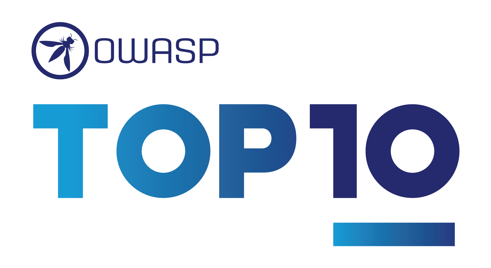
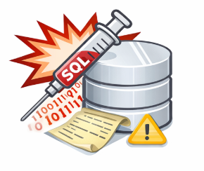
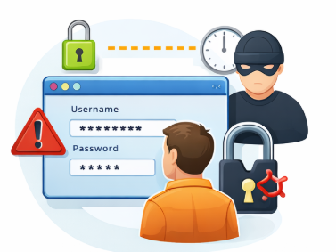
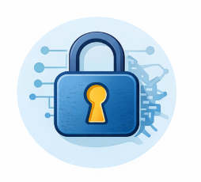
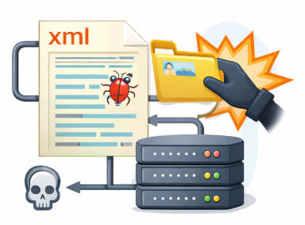
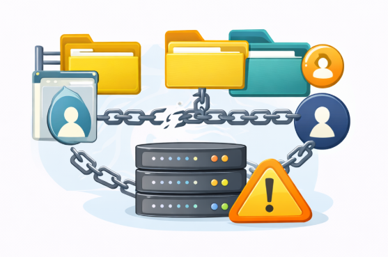
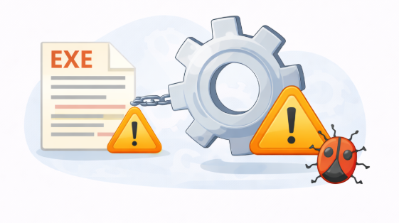
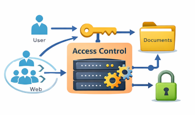

# 🌐 Análisis de Vulnerabilidades en el OWASP Top 10: Métodos de Explotación y Prevención

 
## 📖 Descripción del trabajo:
En la actualidad, la seguridad de las aplicaciones web es fundamental para proteger datos sensibles y mantener la integridad de los sistemas. El **OWASP Top 10** identifica las 10 vulnerabilidades más críticas en aplicaciones web, y este trabajo tiene como objetivo investigar cada una de ellas, documentar los métodos de explotación más comunes y proporcionar recomendaciones de prevención y mitigación.
 
## 1. Introducción
La seguridad en las aplicaciones web es esencial para prevenir riesgos de seguridad y proteger la integridad de la información. El **OWASP Top 10** se ha establecido como un estándar reconocido a nivel global para identificar las principales amenazas y vulnerabilidades en las aplicaciones web.
 
**Objetivo**: Investigar y mitigar las vulnerabilidades comunes en aplicaciones web para mejorar la seguridad.
 
---
 
## 2. Vulnerabilidades del OWASP Top 10
 
### 🔴 Vulnerabilidad 1: **A1 - Inyección**

- **Descripción**: Las vulnerabilidades de inyección ocurren cuando los datos proporcionados por el usuario no se validan correctamente y son insertados directamente en una consulta SQL.
- **Métodos de Explotación**: Inyección SQL, donde el atacante puede modificar una consulta SQL para acceder a la base de datos.
- **Herramientas Comunes**: [SQLmap](https://github.com/sqlmapproject/sqlmap), Burp Suite.
- **Recomendaciones**:
  - Usar consultas parametrizadas.
  - Validación estricta de entradas.
  - Implementación de un WAF (Web Application Firewall).
 
---
 
### 🟠 Vulnerabilidad 2: **A2 - Autenticación y gestión de sesiones**

- **Descripción**: La falta de mecanismos robustos de autenticación permite que un atacante secuestre o adivine credenciales de usuario.
- **Métodos de Explotación**: Ataques de **fuerza bruta** o **robo de sesión**.
- **Herramientas Comunes**: Hydra, Burp Suite.
- **Recomendaciones**:
  - Implementar autenticación multifactor.
  - Tokens de sesión seguros.
  - Revocar sesiones tras cambios críticos.
 
---
 
### 🟢 Vulnerabilidad 3: **A3 - Exposición de datos sensibles**

- **Descripción**: Los datos sensibles no cifrados son vulnerables a ataques de intercepción, como los realizados mediante herramientas de sniffing.
- **Métodos de Explotación**: Uso de **Wireshark** para interceptar tráfico no cifrado.
- **Recomendaciones**:
  - Cifrar datos en reposo y tránsito con TLS/SSL.
  - Uso exclusivo de HTTPS para comunicación segura.
 
---
 
### 🟡 Vulnerabilidad 4: **A4 - Entidades externas XML (XXE)**

- **Descripción**: Las vulnerabilidades XXE ocurren cuando el procesador XML permite la inclusión de entidades externas maliciosas.
- **Métodos de Explotación**: Un atacante puede enviar un archivo XML malicioso que revele archivos del sistema o ejecute comandos en el servidor.
- **Recomendaciones**:
  - Deshabilitar la resolución de entidades externas.
  - Validar adecuadamente todas las entradas XML.
 
---
 
### 🔵 Vulnerabilidad 5: **A5 - Control de acceso roto**

- **Descripción**: Las fallas en los controles de acceso permiten a los atacantes acceder a recursos no autorizados.
- **Métodos de Explotación**: Manipulación de URLs o explotación de configuraciones incorrectas de permisos.
- **Recomendaciones**:
  - Implementar controles de acceso basados en roles (RBAC).
  - Validación de permisos antes de realizar acciones.
 
---
 
### 🟣 Vulnerabilidad 6: **A6 - Configuración de seguridad incorrecta**

- **Descripción**: Configuraciones inseguras o desactualizadas en servidores, bases de datos o aplicaciones.
- **Métodos de Explotación**: Utilización de configuraciones predeterminadas o debilidades en las configuraciones.
- **Recomendaciones**:
  - Deshabilitar servicios innecesarios.
  - Revisar y actualizar configuraciones regularmente.
 
---
 
### 🟤 Vulnerabilidad 7: **A7 - Cross-Site Scripting (XSS)**

- **Descripción**: Inyección de scripts maliciosos en páginas web que afectan a otros usuarios.
- **Métodos de Explotación**: Inserción de JavaScript en formularios o entradas de usuario.
- **Recomendaciones**:
  - Validar y sanear todas las entradas del usuario.
  - Implementar políticas de seguridad como **Content Security Policy** (CSP).
 
---
 
### 🔶 Vulnerabilidad 8: **A8 - Deserialización insegura**

- **Descripción**: Ejecución de código malicioso desde datos deserializados sin control.
- **Métodos de Explotación**: Inyección de objetos maliciosos durante la deserialización.
- **Recomendaciones**:
  - Evitar el uso de datos deserializados no confiables.
  - Validar y verificar los objetos antes de deserializarlos.
 
---
 
### 🔴 Vulnerabilidad 9: **A9 - Uso de componentes con vulnerabilidades conocidas**

- **Descripción**: El uso de bibliotecas o componentes con fallos de seguridad conocidos.
- **Métodos de Explotación**: Explotación de vulnerabilidades conocidas en bibliotecas populares.
- **Recomendaciones**:
  - Mantener todos los componentes y bibliotecas actualizados.
  - Utilizar herramientas para escanear vulnerabilidades en las dependencias.
 
---
 
### 🟠 Vulnerabilidad 10: **A10 - Insuficiente registro y monitoreo**

- **Descripción**: La falta de registro adecuado de eventos de seguridad y monitoreo puede dificultar la detección de incidentes.
- **Métodos de Explotación**: Aprovechar la falta de auditoría de seguridad.
- **Recomendaciones**:
  - Implementar un sistema de monitoreo y registros detallados.
  - Realizar auditorías regulares de los logs de seguridad.
 
---
 
## 3. Métodos de Explotación
Para cada vulnerabilidad mencionada, los atacantes utilizan diferentes métodos y herramientas para aprovechar estas debilidades. A continuación, un resumen de las técnicas comunes:
 
| Vulnerabilidad                      | Métodos de Explotación |
|-------------------------------------|------------------------|
| **A1 - Inyección**                 | SQLmap, Inyección XSS |
| **A2 - Autenticación**             | Ataque de fuerza bruta, secuestro de sesión |
| **A3 - Exposición de Datos**       | Sniffing de red con Wireshark |
| **A4 - XXE**                       | Envío de XML maliciosos, extracción de archivos |
| **A5 - Control de Acceso Roto**    | Manipulación de URLs, explotación de permisos |
| **A6 - Configuración Incorrecta**  | Uso de configuraciones predeterminadas |
| **A7 - XSS**                       | Inyección de scripts en formularios |
| **A8 - Deserialización**           | Inyección de objetos maliciosos |
| **A9 - Componentes Vulnerables**   | Explotación de vulnerabilidades conocidas |
| **A10 - Monitoreo Insuficiente**   | Falta de registros de seguridad |
 
---
 
## 4. Mejores Prácticas de Prevención y Mitigación
### 🛡️ Prácticas generales:
- **Autenticación Segura**: Implementar autenticación multifactor (MFA).
- **Cifrado**: Usar cifrado AES-256 para datos sensibles en reposo.
- **Control de Acceso**: Usar RBAC (Role-Based Access Control).
- **Protección contra Inyección**: Validación de entradas, uso de ORM (Object-Relational Mapping).
 
**Imagen de implementación de control de acceso:**

 
---
 
## 5. Conclusiones
El **OWASP Top 10** es un marco fundamental para proteger aplicaciones web contra amenazas comunes. La implementación de las mejores prácticas de prevención y mitigación, como el uso de cifrado, autenticación segura, y control de acceso, ayudará a reducir los riesgos asociados con estas vulnerabilidades.
 
---
 
## 6. Referencias
- [OWASP Top 10](https://owasp.org/Top10/es/)
- [Checkpoint - OWASP Top 10](https://www.checkpoint.com/es/cyber-hub/cloud-security/what-is-application-security-appsec/owasp-top-10-vulnerabilities/)
- [Certera - Mitigación de Vulnerabilidades OWASP](https://certera.com/blog/mitigating-the-owasp-top-10-vulnerabilities/)
- [Akamai - Riesgos de Seguridad API](https://www.akamai.com/es/blog/security/owasp-top-10-api-security-risks-2023-edition)
- [CloudKul - OWASP Top 10 2021](https://cloudkul.com/blog/owasp-top-10-2021/)
 
**Integrantes del grupo**
- Juan Lara
- Angel Ahumada
