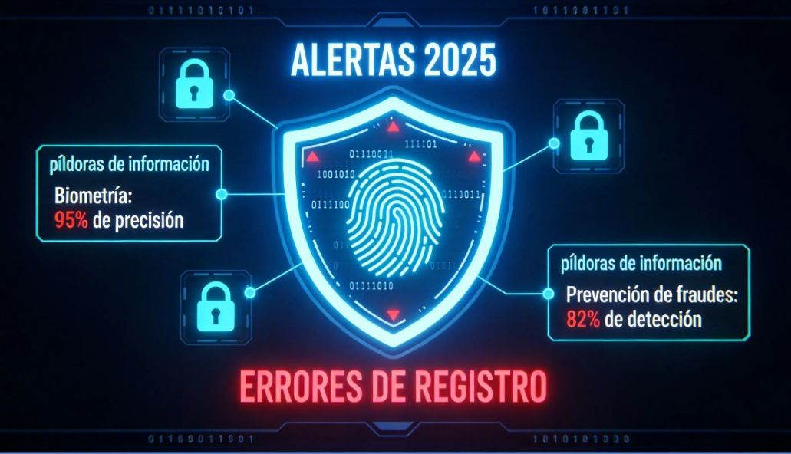
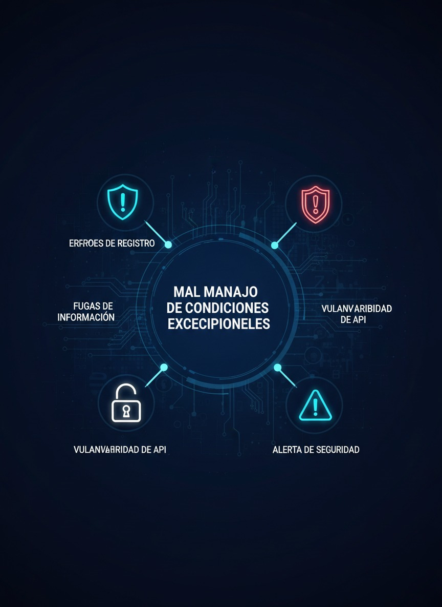

 # OWASP TOP 10 


# Integrantes

- Bernal Arcieri Laura Vanessa
- Reynel Alfonso Cely Gomez
- Bayardo Alejandro Medina Diaz
- Johanna Ortiz Pacheco

## Introducción

OWASP (Open Web Application Security Project) es una organización sin ánimo de lucro enfocada en mejorar la seguridad del software.
El OWASP Top 10 es un documento de concientización que identifica los riesgos de seguridad más críticos en aplicaciones web. Representa un amplio consenso de expertos en seguridad a nivel mundial y sirve como referencia para desarrolladores, arquitectos de software y equipos de gestión de riesgos.
Esta clasificación se actualiza aproximadamente cada cuatro años, evaluando y priorizando las vulnerabilidades más relevantes según su impacto y frecuencia. En el presente trabajo se analizarán diez vulnerabilidades incluidas en el Top 10, detallando su descripción, métodos de explotación y mejores prácticas de mitigación.
El OWASP Top 10 no es simplemente una lista de vulnerabilidades, sino un reflejo de cómo la seguridad en el desarrollo de software evoluciona constantemente. A continuación, se presenta una imagen comparativa que muestra cómo las vulnerabilidades han cambiado su posición entre 2021 y 2025, evidenciando la actualización más reciente realizada por la organización y cómo el panorama de amenazas continúa transformándose a nivel mundial.

<p align="center">
  
</p>

# A01:2025 – Broken Access Control
Es vulnerabilidad se lleva acabo cuando una aplicación no restringe adecuadamente las acciones que un usuario autenticado puede realizar, basicamente nos indica el Broken Access Control el usuario está autenticado, pero puede acceder a recursos o funciones que no debería, como se evidencia en la siguiente imagen.
<p align="center">
  
</p>

## Naturaleza del problema

- Falta de validación en backend
- Validaciones solo en frontend
- Uso incorrecto de roles
- Ausencia de controles de autorización


## Impacto potencial

- Acceso a datos sensibles
- Escalamiento de privilegios
- Modificación o eliminación de información
- Compromiso total del sistema

## Métodos de Explotación

### IDOR (Insecure Direct Object Reference)

Un **IDOR** ocurre cuando una aplicación utiliza un identificador directo (por ejemplo, un número de usuario o de cuenta) en la URL o en un parámetro, sin validar correctamente si el usuario autenticado tiene permisos para acceder a ese recurso.


**1️⃣ suario  legítimo accede a su cuenta:**
https://app.universidad.com/account?id=1001


El sistema muestra la información correspondiente a la cuenta **1001**.

---

**2️ Manipulación  del parámetro por parte del atacante:**

El atacante modifica manualmente el valor del identificador en la URL:
https://app.universidad.com/account?id=1002


Si el sistema **no valida la autorización correctamente**, mostrará la información de la cuenta **1002**, que pertenece a otro usuario. Como resultado acceso no autorizado a información de otra cuenta de usuario.

---

## Escalamiento Vertical de Privilegios

El **escalamiento vertical de privilegios** ocurre cuando un usuario con permisos básicos logra acceder a funcionalidades restringidas para administradores u otros roles con mayor nivel de acceso.


### Ejemplo de acceso indebido

Un usuario normal intenta acceder directamente a un recurso administrativo:
/admin/deleteUser


Si la aplicación no valida correctamente los permisos en el backend, el usuario podría ejecutar acciones exclusivas de administrador.

---

### Bypass de autorización mediante manipulación de JWT

En aplicaciones que utilizan **JSON Web Tokens (JWT)** para la autenticación, el atacante puede intentar modificar el contenido del token si este no está correctamente firmado o validado.

Ejemplo de campo manipulado:

```json
{
  "role": "admin"
}
```

Si el servidor no verifica correctamente la firma del token o confía únicamente en el contenido del campo role, el atacante podría obtener privilegios de administrador.

### Las herramientas más usadas para explotar este tipo de vulnerabilidades son:
- Burp Suite
- OWASP ZAP
- Postman

## Casos reales 

- Exposición masiva de datos en APIs por falta de validación de permisos en endpoints REST.
- Un atacante simplemente fuerza a los navegadores a acceder a las URL objetivo. Se requieren derechos de administrador para acceder a la página de administración.

## Mejores practicas 

- Implementar control de acceso en el backend
- Aplicar el principio de mínimo privilegio
- Validar permisos en cada request
- Usar RBAC o ABAC correctamente
- No confiar en datos del cliente (JWT sin validar)
- Realizar pruebas de autorización automatizadas

---

## A02:2025 Security Misconfiguration
Ocurre cuando los sistemas, frameworks, servidores o aplicaciones están mal configurados generando vulnerabilidades

<p align="center">
  
</p>

## Causas comunes

- Credenciales por defecto
- Puertos abiertos innecesarios
- Servicios expuestos
- Headers de seguridad ausentes
- Directory listing habilitado
- Errores detallados visibles

## Impacto

- Acceso no autorizado
- Filtración de información
- Compromiso del servidor
- RCE (Remote Code Execution)

## Métodos de Explotación 

Uso de credenciales por defecto
Ejemplo:

admin / admin

## Acceso a paneles expuestos


/phpmyadmin
/admin

## Enumeración de directorios

https://site.university.com/uploads/


## Exploits conocidos en software sin parches
Herramientas usadas
- Nmap
- Nikto


## Casos reales
- Exposición pública de bases de datos Elasticsearch sin autenticación.
- Consolas administrativas expuestas en la nube.


## Mejores Prácticas de Prevención
- Hardening de servidores
- Eliminar credenciales por defecto
- Aplicar parches regularmente
- Deshabilitar servicios innecesarios
- Implementar Infrastructure as Code segura

---

## A03:2025 Software Supply Chain Failures
Se refiere a vulnerabilidades introducidas a través de dependencias externas, librerías, paquetes, contenedores o procesos CI/CD comprometidos. O cambios maliciosos en código, herramientas u otras dependencias de terceros de las que depende el sistema.

<p align="center">
  
</p>

## Naturaleza
- Uso de librerías vulnerables
- Dependencias maliciosas
- Ataques de dependency confusion
- Compromiso de repositorios

## Impacto
- Ejecución remota de código
- Robo de credenciales
- Compromiso de pipelines
- Distribución de malware a clientes


## Métodos de Explotación

## Dependency Confusion

Publicar un paquete malicioso con el mismo nombre que uno interno.

## Compromiso de repositorios
Ejemplo:
Ataque a SolarWinds, Cisco, FORTINET

## Inyección en pipeline CI/CD
- Modificar artefactos antes del despliegue.

 Herramientas utilizadas
- Snyk
- OWASP Dependency-Check
- npm audit

## Casos reales
- Actualizaciones comprometidas
- Dependencias vulnerables ampliamente utilizadas
- Publicación de paquetes maliciosos

---

## Mejores Prácticas de Prevención
- Inventario de dependencias (SBOM)
- Escaneo continuo de vulnerabilidades
- Verificación de integridad (hashes)
- Firmado de artefactos
- Uso de repositorios privados
- Revisión manual de dependencias críticas
- Implementar DevSecOps en CI/CD


## A04:2025 Cryptographic Failures

<p align="center">
  
</p>

## Descripción:  
Esta vulnerabilidad ocurre cuando los datos no se cifran correctamente en tránsito o en reposo, o cuando se utilizan mecanismos criptográficos débiles. La ausencia de cifrado en la capa de transporte (capa 4) o de protección adicional para información sensible en la capa de aplicación (capa 7) puede permitir que atacantes intercepten, roben o manipulen datos críticos como contraseñas, números de tarjeta o información personal.

El impacto puede incluir fuga de información, incumplimiento normativo (como el Reglamento General de Protección de Datos (RGPD) o PCI DSS) y graves daños financieros y reputacionales para la organización.

## Naturaleza del problema: 

- Se usan algoritmos débiles u obsoletos (ej: MD5, SHA1).
- No se cifra información sensible.
- Se almacenan contraseñas sin hash.
- Se usan claves débiles o mal gestionadas.
- No se protege correctamente la información en tránsito (HTTP en vez de HTTPS).
- Problema técnico en la protección de datos.

## Causas comunes:

- Desconocimiento de buenas prácticas.
- Uso de librerías antiguas.
- Configuración incorrecta de TLS.
- Mala gestión de llaves criptográficas.

## Impacto

- Robo de contraseñas.
- Filtración de datos personales.
- Incumplimiento legal (protección de datos).
- Ataques de suplantación de identidad.

## Métodos de Explotación

## Ataques Man-in-the-Middle (MITM)

- Si el tráfico no está cifrado correctamente, el atacante intercepta la comunicación.
- Herramientas: Wireshark, Burp Suite

## Fuerza bruta sobre hashes débiles

- -Si se almacenan contraseñas con MD5 o SHA1:
- Herramientas: Hashcat, John the Ripper

## Robo de base de datos mal cifrada

Si no hay cifrado en reposo, el atacante obtiene datos en texto plano. Muchas brechas de seguridad han ocurrido porque las empresas almacenaban contraseñas: En texto plano, o Con algoritmos débiles como MD5 o SHA1, Sin aplicar “salt”, Sin funciones de hash adaptativas. 

## ¿Qué significa esto?

Cuando un atacante logra acceder a la base de datos (por ejemplo, mediante SQL Injection), puede encontrar algo así:

usuario: admin
password: 123456
Si la contraseña está en texto plano, el atacante obtiene acceso inmediato.
Peor aún, si está hasheada con MD5: 5f4dcc3b5aa765d61d8327deb882cf99

Ese hash puede ser descifrado en segundos usando herramientas como:

- Hashcat
- Rainbow Tables

Mejores practicas: 
Usar algoritmos fuertes
 AES-256: Se usa para cifrado simétrico (misma clave para cifrar y descifrar).

## A05:2025 - Inyección

La vulnerabilidad de Inyección ocurre cuando una aplicación incorpora datos controlados por el usuario dentro de un comando o consulta que será interpretada por otro sistema, sin validación ni control adecuado.

<p align="center">
  
</p>

## Naturaleza 

Es una vulnerabilidad de manipulación de intérpretes.

- La entrada del usuario se concatena dinámicamente.
- Se construyen consultas o comandos como cadenas de texto.
- No se usan mecanismos de separación segura (parametrización).

## Causas

- Concatenación directa en consultas SQL.
- Falta de validación.
- Falta de parametrización.
- Exposición directa del intérprete

## Impacto

- Acceso no autorizado a base de datos.
- Modificación o eliminación de datos.
- Control total del servidor.
- Confidencialidad, integridad y disponibilidad


## Métodos de Explotación

- SQL Injection

Ejemplo vulnerable:
SELECT * FROM usuarios WHERE usuario = 'admin' AND password = '123';
Ataque: ' OR '1'='1
Herramientas:
SQLMap
Burp Suite
OWASP ZAP

- Command Injection:

Entrada mal validada: ping {input_usuario}
Ataque: 8.8.8.8; rm -rf /

- NoSQL Injection:
En MongoDB: { "$ne": null }


## Mejores Prácticas 

Usar consultas parametrizadas (Prepared Statements)

- Ejemplo seguro:
SELECT * FROM usuarios WHERE usuario = ? AND password = ?
Validar y sanitizar entradas
Principio de mínimo privilegio en BD
 WAF (Firewall de Aplicaciones Web)
 Escaneo SAST y DAST


## A06:2025 - Insecure Design


<p align="center">
  
</p>

El Diseño Inseguro no es una vulnerabilidad puntual de código, sino una falla estructural en la forma en que el sistema fue concebido.

- La arquitectura no incorpora controles de seguridad desde el inicio.
- La lógica del negocio permite comportamientos abusivos.
- No se anticiparon escenarios de ataque.

## Naturaleza

Es una vulnerabilidad de arquitectura y lógica de negocio, no técnica aislada relacionada con:

- Diseño de flujos
- Control de acceso
- Procesos transaccionales
- Gestión de estados
- Confianza excesiva en el cliente

## Impacto

El impacto suele ser crítico porque afecta la base del sistema.


- Bypass de autenticación
- Escalamiento de privilegios
- Exposición masiva de datos
- Fraudes financieros
- Daño reputacional severo
- Sanciones legales


## Métodos de Explotación

- Falta de control de autorización (Broken Access Control por diseño)

Ejemplo:
/api/usuarios/123

el atacante puede cambiar el ID:
/api/usuarios/124

- Falta de límites en transacciones

Si el diseño no establece controles como:

- Límite por hora
- Límite por día
- Verificación adicional en operaciones sensibles
- Manipulación de lógica de negocio

Ejemplo típico:
https://tienda.com/checkout?precio=100

el atacante puede modificarlo: 
https://tienda.com/checkout?precio=1

Confianza excesiva en el lado cliente, errores: 

- Validaciones solo en JavaScript
- Restricciones de rol ocultas en frontend
- Controles de acceso visibles pero no aplicados en backend


## Mejores Prácticas

- Modelado de amenazas (STRIDE)
- Principio de mínimo privilegio
- Validación estricta del lado servidor
- Controles de autorización centralizados
- Revisión de arquitectura de seguridad
- Integrar seguridad en DevSecOps


# A07:2021 – Identification and Authentication Failures

## 01 Naturaleza de la vulnerabilidad 

Antes conocida como “Broken Authentication”. Se presenta cuando los mecanismos de autenticación (login, manejo de sesiones, recuperación de contraseña, tokens, etc.) están mal implementados o mal configurados, permitiendo que un atacante suplante la identidad de un usuario.

## Afecta:
- Inicio de sesión
- Gestión de sesiones
- Restablecimiento de contraseñas
- Tokens JWT
- MFA mal implementado

## Causas principales

- Contraseñas débiles o sin política de complejidad.
- No limitar intentos de inicio de sesión (fuerza bruta).
- Sesiones que no expiran.
- Uso inseguro de tokens JWT.
- Falta de autenticación multifactor (MFA).
- IDs de sesión predecibles.
- Cookies sin flags de seguridad (HttpOnly, Secure).

## Impacto potencial

- Secuestro de cuentas.
- Acceso no autorizado a información sensible.
- Escalamiento de privilegios.
- Robo de identidad digital.
- Compromiso total de la aplicación.
- Es una de las vulnerabilidades más explotadas en ataques reales.

## 02 ¿Cómo explotan los atacantes esta vulnerabilidad?

Intentan muchas combinaciones de usuario/contraseña hasta adivinar la correcta. Envía miles de intentos de login rápidamente. Cuando no hay bloqueo por intentos fallidos, el atacante entra.

- Escenario 1: Relleno de credenciales (Credential Stuffing)

El relleno de credenciales es un ataque común que consiste en utilizar listas de usuarios y contraseñas filtradas previamente en otras brechas de seguridad. Supongamos que una aplicación no implementa mecanismos de protección contra ataques automatizados, como limitación de intentos de inicio de sesión, CAPTCHA o detección de comportamiento anómalo. En ese caso, la aplicación puede convertirse en un “oráculo de contraseñas”, permitiendo al atacante verificar automáticamente si las credenciales probadas son válidas. Si la aplicación responde de manera diferente cuando el usuario o la contraseña son incorrectos, el atacante puede confirmar qué combinaciones funcionan, logrando así el acceso no autorizado a cuentas legítimas.

- Escenario 2: Uso exclusivo de contraseñas como único factor de autenticación

La mayoría de los ataques de autenticación ocurren debido al uso continuo de contraseñas como único factor de autenticación. Aunque anteriormente se recomendaban políticas estrictas de complejidad y rotación frecuente de contraseñas, estas prácticas han demostrado incentivar a los usuarios a crear contraseñas débiles o reutilizarlas en múltiples servicios. Esto incrementa el riesgo de ataques como fuerza bruta o credential stuffing. De acuerdo con las recomendaciones del estándar NIST SP 800-63, las organizaciones deberían abandonar prácticas obsoletas como la rotación obligatoria frecuente y, en su lugar, implementar autenticación multifactor (MFA). El uso de MFA reduce significativamente el riesgo, incluso si la contraseña ha sido comprometida.

## Herramientas comunes:

Hydra es una herramienta de código abierto diseñada para realizar ataques de fuerza bruta contra servicios de autenticación. Su principal funcionalidad es probar múltiples combinaciones de usuarios y contraseñas de manera automatizada hasta encontrar credenciales válidas. Soporta numerosos protocolos como HTTP, HTTPS, FTP, SSH, RDP, SMTP y bases de datos, lo que la convierte en una herramienta versátil en pruebas de penetración. Hydra es ampliamente utilizada por profesionales de seguridad para evaluar la fortaleza de los mecanismos de autenticación y detectar configuraciones débiles que permitan accesos no autorizados.

Medusa es otra herramienta de fuerza bruta orientada a la auditoría de servicios de autenticación remotos. Su funcionamiento es similar al de Hydra, pero está optimizada para realizar ataques paralelos y multihilo, lo que mejora su velocidad y eficiencia al probar grandes volúmenes de credenciales. Permite evaluar distintos protocolos y es utilizada en pruebas de seguridad para identificar vulnerabilidades relacionadas con la ausencia de limitación de intentos de inicio de sesión o políticas débiles de contraseñas. Su enfoque modular facilita su adaptación a diferentes entornos.

Patator es una herramienta modular de pruebas de fuerza bruta que permite ejecutar ataques personalizados contra diversos servicios y aplicaciones. A diferencia de Hydra y Medusa, Patator ofrece mayor flexibilidad, ya que permite definir parámetros específicos y realizar ataques más complejos, incluyendo pruebas contra formularios web, autenticación HTTP y otros mecanismos personalizados. Es especialmente útil cuando se requiere adaptar el ataque a escenarios específicos o cuando se necesitan técnicas más avanzadas para evadir controles básicos de seguridad. En el contexto de pruebas de penetración, se emplea para validar la resistencia de los sistemas ante intentos automatizados de autenticación.


## 03 Mejores practicas de prevención y mitigación

Para prevenir vulnerabilidades relacionadas con errores de autenticación (A07), es fundamental aplicar controles sólidos que reduzcan el riesgo de accesos no autorizados. En primer lugar, se recomienda implementar autenticación multifactor (MFA), ya que añade una capa adicional de seguridad más allá de la contraseña y mitiga ataques como fuerza bruta, relleno de credenciales y reutilización de contraseñas filtradas.

En segundo lugar, es importante establecer políticas modernas de contraseñas alineadas con las recomendaciones del NIST SP 800-63B. Esto implica priorizar contraseñas largas y robustas, evitar requisitos de complejidad excesivos que incentiven malas prácticas y bloquear el uso de contraseñas comunes o previamente comprometidas. Asimismo, nunca se deben utilizar credenciales predeterminadas, especialmente en cuentas administrativas.

En tercer lugar, se deben proteger los mecanismos de autenticación contra la enumeración de cuentas y ataques automatizados. Para ello, es necesario utilizar mensajes de error genéricos, limitar o retrasar progresivamente los intentos fallidos de inicio de sesión y monitorear patrones sospechosos, evitando al mismo tiempo generar escenarios de denegación de servicio.

Finalmente, se debe implementar una gestión segura de sesiones. Esto incluye generar identificadores de sesión aleatorios con alta entropía, almacenarlos de forma segura, invalidarlos después del cierre de sesión o períodos de inactividad y evitar su exposición en la URL. Una correcta administración de sesiones reduce significativamente el riesgo de secuestro de sesión y acceso indebido a la aplicación.


# A08:2021 – Software and Data Integrity Failures

## 01 Naturaleza de la vulnerabilidad 

Esta vulnerabilidad se centra en la falta de verificación de integridad del software y los datos críticos. Ocurre cuando una aplicación confía en código, actualizaciones, bibliotecas o datos externos sin validar su autenticidad o integridad.

También incluye problemas en:

Procesos de integración y despliegue continuo (CI/CD)
Descarga automática de actualizaciones
Uso de dependencias de fuentes no confiables
Deserialización de datos manipulables

## Causas principales

Las causas más comunes incluyen:

- No validar firmas digitales o hashes de archivos descargados
- Uso de librerías desde repositorios o CDN sin verificación de integridad
- Pipelines CI/CD sin controles de acceso adecuados
- Falta de control en actualizaciones automáticas
- Deserialización de datos provenientes de usuarios sin validación
- Dependencia excesiva de componentes de terceros sin monitoreo

En muchos casos, el problema es confiar en fuentes externas sin aplicar controles criptográficos.

## Impacto potencial

Las consecuencias pueden ser críticas:

- Ejecución remota de código (RCE)
- Compromiso total del sistema
- Distribución masiva de malware mediante actualizaciones falsas
- Manipulación o alteración de datos sensibles
- Escalamiento de privilegios
- Afectación de toda la cadena de suministro del software

Este tipo de vulnerabilidad puede permitir que un atacante inyecte código malicioso que se distribuya automáticamente a todos los usuarios del sistema comprometido.

## 02 ¿Cómo explotan los atacantes esta vulnerabilidad?

Los atacantes explotan la vulnerabilidad aprovechando que la aplicación no verifica la integridad del software o de los datos que utiliza. Cuando un sistema descarga actualizaciones, dependencias o componentes externos sin validar su firma digital o su hash, un atacante puede modificar esos archivos e introducir código malicioso. También pueden comprometer repositorios, servidores de actualización o pipelines de CI/CD para insertar código antes de que el software sea distribuido. En otros casos, manipulan datos serializados que la aplicación procesa sin validación, logrando ejecutar instrucciones maliciosas. En todos los escenarios, el ataque funciona porque el sistema confía en código o información externa sin comprobar su autenticidad, lo que puede permitir ejecución remota de código, control del sistema o distribución masiva de malware.

- Escenario 1 – Actualizaciones de firmware sin firma digital

Muchos enrutadores domésticos, decodificadores y dispositivos IoT no verifican la integridad de sus actualizaciones mediante firmas digitales. Esto permite que un atacante modifique o reemplace el firmware por una versión maliciosa. El problema es crítico porque, una vez comprometido el firmware, no siempre existe un mecanismo sencillo de remediación. En muchos casos, la única solución es lanzar una nueva versión y esperar a que los dispositivos antiguos queden obsoletos, dejando a numerosos usuarios expuestos durante largos periodos.


- Escenario 2 – Ataque a SolarWinds (2020)

El caso más conocido es el ataque a SolarWinds, específicamente a su plataforma SolarWinds Orion. En este incidente, atacantes comprometieron el proceso de compilación y actualización del software. Lograron insertar código malicioso en una actualización legítima que fue distribuida a más de 18.000 organizaciones en todo el mundo. Aunque no todas fueron explotadas activamente, alrededor de 100 organizaciones de alto perfil resultaron afectadas, incluyendo agencias gubernamentales y grandes corporaciones. Este ataque es considerado una de las violaciones de cadena de suministro más graves de la historia moderna.

https://www.fortinet.com/lat/resources/cyberglossary/solarwinds-cyber-attack

- Escenario #3 – Ataque a Kaseya (2021)

Otro caso altamente relevante fue el ataque contra Kaseya, específicamente su producto Kaseya VSA.Los atacantes explotaron vulnerabilidades en el sistema de gestión remota para distribuir ransomware a través de proveedores de servicios gestionados (MSP). Como resultado, cientos de empresas fueron afectadas indirectamente. Este caso demostró cómo comprometer una plataforma de administración o actualización puede permitir la distribución masiva de malware a múltiples víctimas al mismo tiempo.


https://en.wikipedia.org/wiki/Kaseya
https://en.wikipedia.org/wiki/Kaseya_VSA_ransomware_attack

## Herramientas comunes:

- Frameworks de explotación y post-explotación, como Metasploit, para ejecutar cargas maliciosas una vez insertado el código en una actualización o dependencia comprometida.
- Herramientas de análisis y manipulación de tráfico, como Burp Suite o Wireshark, para interceptar y modificar actualizaciones si no están protegidas adecuadamente.
- Herramientas de deserialización maliciosa, como ysoserial, que generan payloads diseñados para explotar deserialización insegura en aplicaciones Java.

## 03 Mejores practicas de prevención y mitigación

Para prevenir y mitigar la vulnerabilidad es fundamental implementar mecanismos que garanticen la integridad y autenticidad del software y los datos. Se deben utilizar firmas digitales, hashes u otros controles criptográficos para verificar que las actualizaciones, archivos y componentes provienen de fuentes legítimas y no han sido alterados.

También debe existir un proceso formal de revisión de cambios en el código y en la configuración para evitar la introducción de código malicioso. Los pipelines de CI/CD deben contar con controles de acceso adecuados, segregación de funciones y configuraciones seguras que protejan la integridad del proceso de construcción y despliegue.

## A09:2025 – Errores de Registro y Alertas de Seguridad 

 

La vulnerabilidad A09:2025 se refiere a la ausencia, deficiencia o mala implementación de mecanismos de registro (logging), monitoreo y generación de alertas dentro de una aplicación web. 

En términos técnicos, esta vulnerabilidad impacta directamente la capacidad de detección y respuesta ante incidentes de seguridad. Cuando una aplicación no registra adecuadamente eventos relevantes, se reduce el MTTD (Mean Time To Detect) y aumenta el MTTR (Mean Time To Respond), debilitando la postura defensiva de la organización. 

Esta vulnerabilidad se manifiesta cuando: 

- No se registran intentos fallidos de autenticación. 

- No se monitorean cambios de privilegios. 

- No se registran accesos a recursos sensibles. 

- No se generan alertas ante comportamientos anómalos. 

- Los logs pueden ser modificados o eliminados sin control. 

- Desde una perspectiva de gestión de riesgos, la falta de registros adecuados impide identificar amenazas persistentes avanzadas (APT) y compromete el análisis forense posterior a un incidente. 

<p align="center">
  
</p>
 

## Naturaleza del problema 

Se produce cuando las aplicaciones no registran eventos críticos o no generan alertas adecuadas ante fallos o ataques. 

Esto incluye: 

- Logs incompletos o inconsistentes. 

- Alertas deshabilitadas, ignoradas o enviadas tarde. 

- Falta de trazabilidad para detectar actividad sospechosa. 

Causa principal: mala configuración, desconocimiento de la importancia del logging o falta de integración con sistemas de monitoreo de seguridad. 

 

## Impacto potencial 

- Detección tardía de ataques: un atacante puede explotar vulnerabilidades sin ser detectado. 

- Difícil investigación forense: sin logs claros, no se puede reconstruir un incidente de seguridad. 

- Pérdida de datos o exposición de información sensible antes de que se pueda reaccionar. 

- Riesgo reputacional y financiero para la organización si el ataque pasa desapercibido. 

 

## Métodos de explotación 

A diferencia de otras vulnerabilidades, A09 no suele ser explotada directamente, sino que el atacante se beneficia de su existencia. 

## Ataques “low and slow” 

Un atacante sofisticado puede ejecutar ataques de bajo perfil, distribuidos en el tiempo, evitando generar patrones evidentes. Si no existen mecanismos de correlación de eventos, la actividad maliciosa puede permanecer indetectada durante meses. 

## Fuerza bruta sin detección 

Si el sistema no registra intentos fallidos ni genera alertas automáticas, un atacante puede realizar miles de intentos de autenticación sin ser detectado. 

## Escalada de privilegios silenciosa 

Cuando los cambios de permisos no se registran correctamente, un atacante que obtenga acceso inicial puede elevar privilegios sin dejar evidencia clara. 

## Eliminación o alteración de registros 

Si los logs no están protegidos con mecanismos de integridad (hashing, almacenamiento centralizado), un atacante puede borrar rastros tras comprometer el sistema. 

En ejercicios de Red Team, esta vulnerabilidad suele explotarse como parte de fases posteriores a la intrusión, particularmente durante la etapa de persistencia y movimiento lateral. 

 

## Caso real 

- Equifax 2017 
Aunque el ataque se debió a una vulnerabilidad de Apache Struts, una mejor implementación de logging y alertas podría haber detectado actividad inusual antes de que el atacante accediera a millones de registros. 
Esto demuestra que la falta de monitoreo y alertas agrava la magnitud de un incidente. 

 

## Mejores prácticas de prevención y mitigación 

Para mitigar A09:2025 se requiere un enfoque integral que combine controles técnicos y procesos organizacionales. 

## Implementación de logging estructurado 

- Registros detallados de autenticación. 

- Cambios de privilegios. 

- Acceso a datos sensibles. 

- Eventos administrativos críticos. 

- Errores del sistema. 

Se recomienda el uso de logs estructurados (por ejemplo, en formato JSON) para facilitar su análisis automatizado. 

## Centralización y correlación 

- Implementación de un SIEM para correlación en tiempo real. 

- Integración con soluciones EDR/XDR. 

- Monitoreo continuo 24/7 en entornos críticos. 

## Protección de la integridad de los logs 

- Almacenamiento en servidores separados. 

- Control de acceso estricto. 

- Verificación de integridad mediante hashing. 

- Políticas de retención alineadas con requisitos regulatorios. 

## Generación de alertas inteligentes 

- Alertas por múltiples intentos fallidos. 

- Alertas por accesos fuera de horario. 

- Detección basada en comportamiento (behavioral analytics). 

Este enfoque se alinea con buenas prácticas descritas por marcos como ISO/IEC 27001 (controles de monitoreo) y NIST SP 800-92 (Log Management).


## A10:2025 – Mal Manejo de Condiciones Excepcionales 

La vulnerabilidad A10:2025 se relaciona con la gestión inadecuada de errores y excepciones dentro de aplicaciones web, lo que puede derivar en exposición de información sensible o en estados operativos inseguros. 

Desde una perspectiva arquitectónica, esta vulnerabilidad refleja una falla en la aplicación del principio “Secure by Design”. No se trata únicamente de mostrar mensajes de error detallados, sino de no diseñar el sistema para manejar fallos de forma segura y resiliente. 

Se manifiesta cuando: 

- Se muestran stack traces completos al usuario. 

- Se exponen consultas SQL en mensajes de error. 

- Se revelan rutas internas del sistema. 

- Se mantiene el modo debug activo en producción. 

- No se implementan controladores globales de excepciones. 

- El impacto potencial incluye divulgación de información crítica, facilitación de ataques posteriores, generación de condiciones de denegación de servicio y estados inconsistentes en aplicaciones distribuidas. 

 
<p align="center">
  
</p>
 

## Naturaleza del problema 

Esta vulnerabilidad ocurre cuando las aplicaciones no manejan correctamente los errores o excepciones, dejando información sensible expuesta o permitiendo comportamiento inesperado. 

Puede incluir: 

- Mensajes de error detallados visibles para usuarios finales. 

- Fallos que detienen procesos críticos sin generar logs adecuados. 

- Condiciones excepcionales que no se validan ni controlan, dejando la puerta abierta a ataques. 

- Causa principal: manejo deficiente de excepciones por programación insegura o falta de políticas de control de errores. 

 

## Impacto potencial 

- Exposición de información sensible 

- Posible escalada de privilegios o ejecución de código no autorizado 

- Interrupción de servicios críticos 

- Riesgo reputacional y financiero 

 

## Métodos de explotación 

Los atacantes suelen provocar errores deliberadamente para obtener información técnica. 

## Fingerprinting tecnológico 

Mediante la manipulación de entradas (caracteres especiales, datos malformados), el atacante puede generar errores que revelen: 

- Motor de base de datos utilizado. 

- Versión del servidor. 

- Framework empleado. 

- Estructura interna del sistema. 

Esta información permite planificar ataques dirigidos. 

## Generación de fallos en cascada 

En arquitecturas basadas en microservicios, un mal manejo de excepciones puede generar cascading failures, donde el fallo de un servicio impacta a otros, provocando indisponibilidad generalizada. 

## Denegación de servicio 

Si las excepciones no se gestionan eficientemente, un atacante puede enviar múltiples solicitudes diseñadas para provocar errores costosos en recursos, saturando el sistema. 

## Caso real 

GitLab 2018 

Una falla en el manejo de excepciones provocó que ciertos mensajes de error mostraran detalles internos de la aplicación a usuarios no autorizados. 

Este caso muestra cómo un mal manejo de errores puede exponer información crítica incluso sin un ataque directo. 

  

## Mejores prácticas de prevención y mitigación 

La mitigación de A10 requiere controles a nivel de desarrollo, arquitectura y operaciones. 

## Manejo global de excepciones 

- Implementación de controladores centralizados. 

- Captura segura de errores. 

- Registro interno detallado. 

- Mensajes genéricos hacia el usuario final. 

Ejemplo adecuado: 
“Ha ocurrido un error. Intente nuevamente más tarde.” 

## Separación de entornos 

- Desactivar modo debug en producción. 

- Configuración diferenciada entre desarrollo y producción. 

## Validación y sanitización de entradas 

- Validación estricta del lado del servidor. 

- Uso de listas blancas (whitelisting). 

- Prevención de inyecciones. 

## Diseño resiliente 

- Aplicación del principio Fail Secure. 

- Implementación del patrón Circuit Breaker en arquitecturas distribuidas. 

- Observabilidad completa (logs, métricas y trazas). 

## Integración con Secure SDLC y DevSecOps 

- Análisis estático (SAST). 

- Análisis dinámico (DAST). 

- Pruebas de manejo de errores en fases tempranas del desarrollo. 

Este enfoque fortalece la resiliencia del sistema y reduce significativamente la exposición ante ataques basados en errores controlados.


#Referencias 
https://owasp.org/www-project-top-ten/
https://www.indusface.com/learning/owasp-top-10-vulnerabilities/
https://owasp-org.translate.goog/Top10/2025/A01_2025-Broken_Access_Control/?_x_tr_sl=en&_x_tr_tl=es&_x_tr_hl=es&_x_tr_pto=tc
https://owasp-org.translate.goog/Top10/2025/A02_2025-Security_Misconfiguration/?_x_tr_sl=en&_x_tr_tl=es&_x_tr_hl=es&_x_tr_pto=tc
https://owasp-org.translate.goog/Top10/2025/A03_2025-Software_Supply_Chain_Failures/?_x_tr_sl=en&_x_tr_tl=es&_x_tr_hl=es&_x_tr_pto=tc
https://csrc.nist.gov/Projects/ssdf
https://www.enisa.europa.eu/publications/threat-landscape-for-supply-chain-attacks


