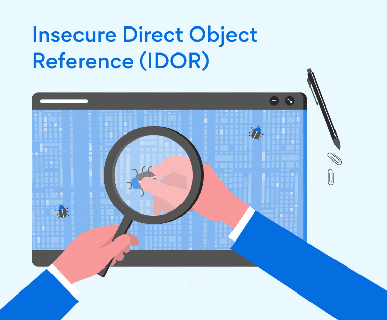
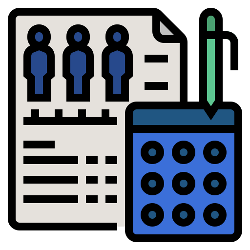

# Control de acceso 

  

El control de acceso aplica políticas que impiden a los usuarios actuar fuera de sus permisos previstos.

### Vulnerabilidades mas comunes 

  

* Violación del principio de mínimo privilegio

* Evitar los controles de acceso modificando la URL (manipulación de parámetros o navegación forzada),.

* Permitir ver o editar la cuenta de otra persona proporcionando su identificador único

* Una API accesible con controles de acceso faltantes para POST, PUT y DELETE.

* Actuar como usuario sin iniciar sesión o obtener privilegios adicionales a los esperados para el usuario que inició sesión

* Reproducir o alterar un token de control de acceso JSON Web Token (JWT), una cookie o un campo oculto manipulado para elevar privilegios o abusar de la invalidación de JWT.

* La configuración incorrecta de CORS permite el acceso a la API desde orígenes no autorizados o no confiables.

* Forzar la navegación (adivinar URL) a páginas autenticadas como un usuario no autenticado o a páginas privilegiadas como un usuario estándar.

### IDOR (Insecure Direct Object Reference) 

  

Ocurre cuando un usuario puede acceder a recursos cambiando un identificador.

### Elevación de Privilegios

  

uando un usuario normal obtiene permisos de administrador.

### Manipulación de Parámetros

  

Modificar parámetros en:

* URL
* Formularios
* Cookies
* JWT

### Fuerza bruta sobre endpoints restringidos

  

Intentar acceder directamente a rutas como:

/admin
/dashboard
/config

Sin estar autenticado o sin permisos.

### Bypass de controles en Frontend

  

Cuando el backend no valida permisos y solo el frontend oculta botones.

#Ejemplo:

* Botón "Eliminar usuario" oculto en la interfaz

* Pero el endpoint sigue activo

