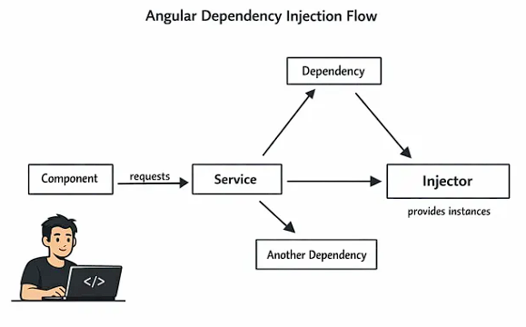
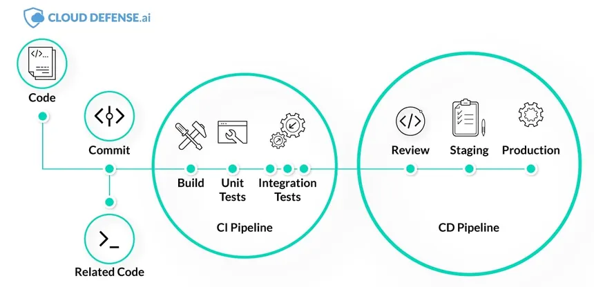
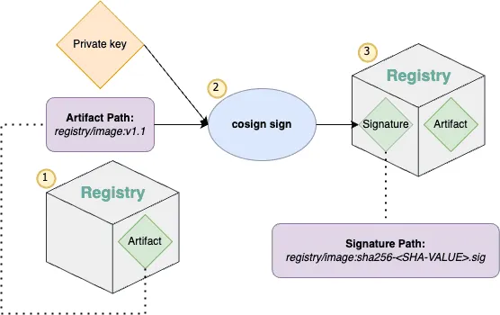

# A03:2025 - Software Supply Chain Failures

## Que es

Las fallas en la cadena de suministro de un software(Software Supply Chain Failures) es cualquier compromiso o falla de los procesos, componentes o herramientas que intervente en la creación hasta la distribución o actualización del software. Esto incluyendo librerías, compilación, pipeline, artefactos y cualquier elemento en la cadena de suministro del software.

Desde su aparición en el **OWASP top 10 2013** con el nombre de **A9:Uso de componentes con vulnerabilidades conocidas** la categoría a evolucionado esto con el fin de abarcar no solo componentes sino las fallas y debilidades que se puedan presentar en la cadena de suministro.

esta categoría se base en dependencias y herramientas externas que el software requiere de manera directa o indirecta, esto incluyendo componentes obsoletos, no mantenidos o que tengan vulnerabilidades conocidas, pero no solo cubre estas área también compromisos como un paquete que ya contenga un malware o errores en procesos como la compilación o distribución.

De esa manera se puede intuir que las causas posible son dependencias sin versionamiento o inventario, no hacer un constante monitoreo de los componentes, herramientas o dependencias que depende el software, falta de controles en los artefactos generados, no actualizar dependencias, paquetes y herramientas entre otros fallos que se puedan presentar en la cadena de suministro.

Estas vulnerabilidades pueden permitir que un sistema sea completamente comprometido si un componente malicioso se ejecuta con los mismos permisos que la aplicación, lo que puede derivar en la exposición, alteración o indisponibilidad de datos, la distribución de software malicioso en entornos de desarrollo como npm, PyPI o Maven, y generar altos costos de recuperación además de afectar gravemente la reputación de la organización.

## Explotación

Los atacantes explotan la cadena de suministro comprometiendo cualquier punto entre el desarrollo y la distribución del software:

### Inyección o Envenenamiento de Dependencias

Se trata de meter código dañino en una librería o paquete que otros proyectos bajarán después. Esto se puede hacer subiendo versiones cambiadas o adueñándose de cuentas de responsables. Ya instalado, el código dañino funciona con los mismos permisos que la aplicación.

#### Caso real ####

el mayor y más peligroso compromiso de la cadena de suministro de npm de la historia

En 2025 se halló un ataque con software dañino en el sistema de npm que afectó a cientos de elementos JavaScript, incluyendo herramientas conocidas como @ctrl/tinycolor. El criminal añadió códigos dañinos que corren al instalarse, sacando credenciales y quedando dentro de procesos de CI/CD.

#### Fuentes: 
[Tom’s Hardware](https://www.tomshardware.com/tech-industry/cyber-security/shai-hulud-malware-campaign-dubbed-the-largest-and-most-dangerous-npm-supply-chain-compromise-in-history-hundreds-of-javascript-packages-affected)

[Versprite Security Report](https://versprite.com/security-resources/npm-supply-chain-attack-shai-hulud-worm-compromises-500-packages/)

[CISA Alert 2025](https://www.cisa.gov/news-events/alerts/2025/09/23/widespread-supply-chain-compromise-impacting-npm-ecosystem)

### Confusión de Dependencias

El atacante sube a sitios públicos un paquete con igual nombre a una dependencia interna de una empresa. Si el sistema prefiere la fuente pública, instalará la versión dañina sin que el programador se dé cuenta.

#### Caso real ####

se descubrió un ataque de phishing dirigido a usuarios de PyPI por correo electrónico.

Publicación no autorizada de versiones de num2words en PyPI
En julio de 2025, se descubrió un envío en PyPI de la versión 0.5.15 del paquete num2words que no concordaba con el repositorio oficial de código (GitHub), lo cual sugirió una posible apropiación de la cuenta del mantenedor y un envío malicioso de la librería.

#### fuentes

[blog.pypi.org](https://blog.pypi.org/posts/2025-07-31-incident-report-phishing-attack/)

[Gitlab](https://advisories.gitlab.com/pkg/pypi/num2words/GHSA-jxr6-qrxx-2ph2/)

### Riesgo del pipeline CI/CD

Se entra a servidores de integración y despliegue continuo para cambiar el modo en que se crea el programa. Aunque el código original sea bueno, el resultado final puede tener trampas o instrucciones escondidas.

#### Caso real

tj-actions/changed-files (CVE-2025-30066)

Este incidente afectó una acción muy popular de GitHub Actions (tj-actions/changed-files) utilizada en decenas de miles de repositorios. Los atacantes introdujeron un commit malicioso en la librería, provocando que se ejecutara un comando oculto durante las compilaciones de CI/CD. Esto resultó en la exposición de claves, tokens y contraseñas almacenadas en variables de entorno o logs.

#### fuentes

[Cybersecurity Dive](https://www.cybersecuritydive.com/news/supply-chain-github-exposure-secrets/742693/)

[Linkedin](https://www.linkedin.com/pulse/responding-march-2025-github-actions-supply-chain-attack-liatrio-bythc)

### Cambio de artefactos

Se cambian archivos o paquetes en sitios mal protegidos. Si no se mira que todo esté bien con firmas digitales o claves, el software malo se reparte como si fuera bueno.

#### caso real

Codecov Bash Uploader (2021)

Aunque anterior a 2025, este aún resulta ser uno de los casos más claros de cómo cambiar elementos de compilación puede poner en riesgo la cadena de suministro.

En este incidente:

El script de Bash que usaba Codecov para cargar reportes de alcance de prueba fue cambiado por atacantes.

El cambio metió una línea dañina que sacaba datos de variables de entorno (incluyendo claves de acceso) desde miles de conductos CI/CD.

Compañías como Rapid7 dijeron que claves internas fueron posiblemente reveladas por culpa del incidente.

#### fuente

[cyberscoop](https://cyberscoop.com/rapid7-codecov-supply-chain-bash-uploader/)

### Aprovechar componentes antiguos

Los atacantes usan fallos conocidos en dependencias sin arreglar para ejecutar código a distancia, subir permisos o entrar a información privada.