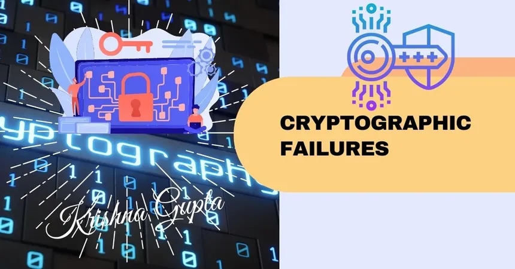
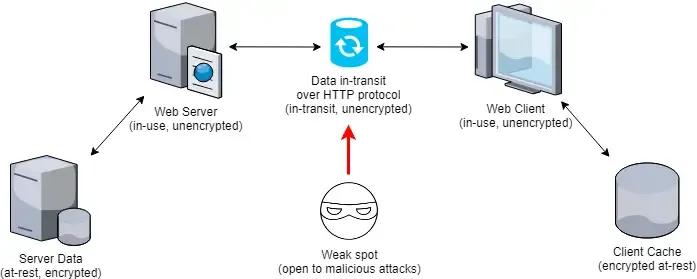
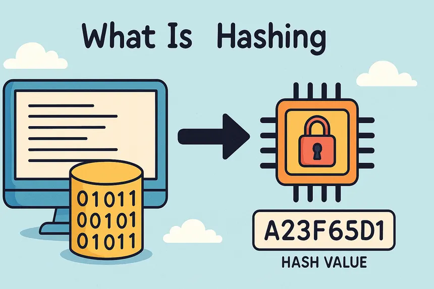

# A04:2025 - Cryptographic Failures

## que es

Las fallas criptográficas, según el ***OWASP Top 10 2025***, son errores al usar, ajustar o manejar sistemas criptográficos que hacen peligrar la privacidad, exactitud o validez de los datos. Esto puede incluir no cifrar al mover o guardar, usar métodos viejos o inseguros, manejar mal las claves criptográficas, usar mal el hashing de contraseñas o generar números al azar pobres o fáciles de adivinar. En otras palabras, la categoría mira no solo qué datos se cifran, sino cómo se cifran, qué métodos se usan, qué controles hay y cómo se manejan las claves.

El peligro de estas fallas es grande: métodos débiles o rotos (como MD5, SHA1, DES o modos ECB), poca o mala entropía para claves, vectores de inicio o nonces, usar claves de nuevo, guardar mal secretos y protocolos débiles activados por ajuste pueden hacer que un atacante vea datos delicados, descifre mensajes cifrados, robe sesiones o finja ser otro.

Entre las causas más normales están creer que “HTTPS es suficiente”, usar sistemas de cifrado sin mirar, no actualizar librerías o reglas de seguridad, guardar claves o secretos en el código o lugares, y no cambiar ni renovar las claves.

El golpe posible de estas fallas es clave. Un atacante podría ver y leer tráfico HTTPS, descifrar datos guardados, sacar claves de sesión o tokens, suplantar usuarios o servicios, y sacar info delicada como contraseñas o datos de dinero. En resumen, sin una criptografía bien puesta y llevada, hasta sistemas seguros pueden quedar vistos a entradas sin permiso.

## Explotación

OWASP proporciona escenarios genéricos de explotación de fallas criptográficas que sirven como base para entender cómo un atacante aprovecha estas debilidades.

### Cifrado en tránsito débil o ausente

Se trata de no proteger las comunicaciones entre el cliente y el servidor con protocolos criptográficos adecuados o con configuraciones seguras. Cuando las conexiones no se cifran correctamente (p. ej. transmisión de datos sensibles usando HTTP en lugar de HTTPS, o soportando configuraciones de TLS débiles), los atacantes pueden interceptar, leer o modificar la información en tránsito.

#### Caso real

Padding Oracle On Downgraded Legacy Encryption (POODLE) se conoce como una de las mayores afectaciones criptográficas recientes que afecta al protocolo SSL 3.0 (CVE‑2014‑3566). Fue hallado por expertos de seguridad quienes enseñaron cómo un agresor puede usar el modo en que se hace el trato de versiones de protocolo entre usuario y servidor para obligar a usar SSL 3.0 y después aprovechar el manejo inseguro del padding de CBC para descubrir partes del contenido de una charla protegida.

#### Cómo

* Los clientes y servidores negocian la versión de protocolo criptográfico a usar (TLS 1.2, TLS 1.1, etc.)
* SSL 3.0 usa cifrado CBC con un esquema de padding que no está cubierto por el MAC de forma segura.
* Un atacante puede interceptar este proceso y forzar que se elija SSL 3.0, aunque el servidor soporte TLS moderno.
* Esto permite a un atacante que intercepta tráfico (hombre en el medio) modificar bloques de cifrado y observar si el servidor acepta o rechaza la modificación, lo que gradualmente revela bytes del texto plano, como cookies de sesión o tokens.

#### Fuentes

[Openssl-library](https://openssl-library.org/files/ssl-poodle.pdf)

[Oracle](https://www.oracle.com/security-alerts/poodlecve-2014-3566.html)

[acunetix](https://www.acunetix.com/vulnerabilities/web/the-poodle-attack-sslv3-with-cbc-cipher-suites/)

### Hashing de contraseñas inseguro

Cuando una aplicación almacena contraseñas usando algoritmos diseñados para velocidad e integridad de datos —como MD5 o SHA-1— en lugar de algoritmos específicos para protección de credenciales, se crea una condición ideal para ataques de recuperación masiva. Estos algoritmos rápidos pueden procesar miles de millones de hashes por segundo en una GPU moderna, haciendo que ataques de fuerza bruta o diccionario sean completamente viables.

#### Caso Real

Cuando una aplicación almacena contraseñas usando algoritmos diseñados para velocidad e integridad de datos —como MD5 o SHA-1— en lugar de algoritmos específicos para protección de credenciales, se crea una condición ideal para ataques de recuperación masiva. Estos algoritmos rápidos pueden procesar miles de millones de hashes por segundo en una GPU moderna, haciendo que ataques de fuerza bruta o diccionario sean completamente viables.

#### Como

* la aplicación generaba tokens de sesión embebiendo la contraseña directamente en un hash MD5
* Ataque de diccionario masivo
* Tablas rainbow MD5
* Cross-referencing

El error crítico fue mezclar la contraseña en un token de sesión hasheado con MD5, creando un vector de ataque paralelo que bypasseó completamente la protección bcrypt.

#### fuentes

[arstechnica](https://arstechnica.com/information-technology/2015/09/once-seen-as-bulletproof-11-million-ashley-madison-passwords-already-cracked/)

[Eset](https://www.welivesecurity.com/la-es/2015/08/31/caso-ashley-madison-cronologia/)

### Exposición de claves o secretos

Sucede cuando claves de cifrado, tokens de API, credenciales o datos secretos de configuración se muestran fuera de un sistema seguro para manejar secretos. Los sitios más usuales donde se ven son: almacenes de código fuente públicos (GitHub, GitLab), ficheros de configuración sin quitar del control de versiones (. env, config. yml), registros de la aplicación, variables del ambiente que se ven en imágenes de un contenedor, y también explicación o comentarios en el código.

#### Caso real

En marzo de 2022, el grupo Lapsus$ filtró ~190 GB de código fuente de Samsung. Dentro del dump se encontraron claves privadas de cifrado y credenciales de servicios de AWS embebidas directamente en el código fuente, exponiendo información sobre los dispositivos Galaxy y sus sistemas de autenticación biométrica.

#### como

* el atacante escanea repositorios públicos, dumps de Docker Hub o S3 buckets mal configurados buscando patrones de claves (AKIA para AWS, ghp_ para GitHub tokens, sk- para OpenAI, etc).

* prueba la clave contra la API correspondiente para verificar si sigue activa y qué permisos tiene.

* usa la clave con los mismos privilegios que el sistema original — lectura de datos, modificación de infraestructura, acceso a otros servicios encadenados.

#### fuentes

[bloomberglinea](https://www.bloomberglinea.com/2022/03/23/microsoft-confirma-que-grupo-de-piratas-informaticos-lapsus-entro-en-sus-sistemas/)

[securityweek](https://www.securityweek.com/thousands-secret-keys-found-leaked-samsung-source-code/)

### Ataques a protocolos o algoritmos obsoletos

Ocurre cuando una aplicación, servidor o protocolo de red continúa usando algoritmos criptográficos que ya han sido formalmente deprecados o cuyas debilidades matemáticas son conocidas y explotables. El problema no es solo teórico: la mayoría de servidores en producción siguen ofreciendo compatibilidad con ciphers antiguos por retrocompatibilidad, sin deshabilitar explícitamente lo que ya es inseguro. Un atacante puede aprovechar esta inercia mediante ataques de downgrade, forzando a que cliente y servidor negocien el cifrado más débil disponible en lugar del más fuerte.

#### Caso real

En agosto de 2016, los investigadores Karthikeyan Bhargavan y Gaëtan Leurent, del instituto INRIA (Francia), publicaron Sweet32, un ataque práctico de colisión de cumpleaños (birthday attack) contra cifrados de bloque de 64 bits —particularmente 3DES y Blowfish— cuando se usan en modo CBC dentro de TLS/SSL y OpenVPN.

#### Como

* El atacante se posiciona como intermediario (Man-in-the-Middle) o inyecta JavaScript malicioso en el navegador de la víctima para generar tráfico cifrado continuo hacia el servidor objetivo.

* A medida que la sesión TLS/3DES acumula datos, la probabilidad de que dos bloques distintos de texto plano produzcan el mismo bloque cifrado aumenta hasta hacerse prácticamente inevitable tras 32 GB.

* Cuando se detecta una colisión (dos bloques cifrados idénticos), el atacante deduce que los dos bloques de texto plano correspondientes son idénticos entre sí por XOR.

* Conociendo parte del contenido predecible (como un token de autenticación que se repite en cada petición), puede recuperar el texto plano y obtener la cookie de sesión o credencial.

#### fuentes

[sweet32](https://sweet32.info/)

[nvd.nist](https://nvd.nist.gov/vuln/detail/CVE-2016-2183)

[Red hat](https://access.redhat.com/articles/2548661)
