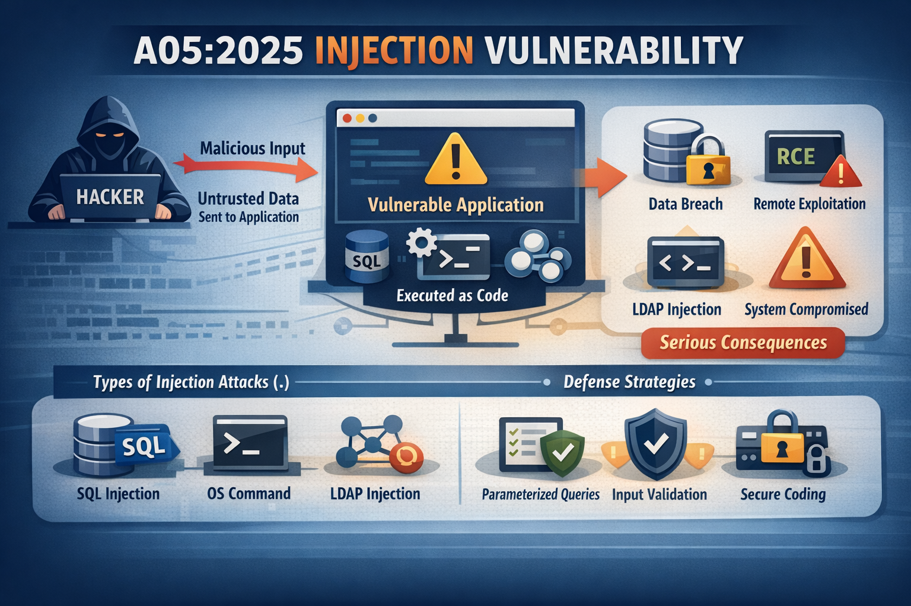

# A05_2025 Injection  

## Definición  

La vulnerabilidad de inyección es una falla de aplicación que permite que una entrada de usuario no confiable se envíe a un intérprete como por ejemplo: Bases de datos, sistemas operativos, monitores de pantalla y hace que el intérprete ejecute partes de esa entrada como comandos. En la práctica el atacante transforma datos en código o comandos que el intérprete ejecuta con los privilegios de la aplicación.

Está vulnerabilidad sigue siendo relevante ya que puede provocar exfiltración masiva de datos, corrupción de información, ejecución remota de comandos, por ende, aunque su puesto haya bajado del top 10 sigue siendo una vulnerabilidad frecuenta y de alto impacto.

La vulnerabilidad de inyección es posible debido a que no se desinfectan adecuadamente las entradas del usuario antes de procesarlas. Esto puede ser especialmente problemático en lenguajes como SQL, donde los datos y los comandos se entremezclan para que los datos proporcionados por el usuario malformados malintencionadamente puedan interpretarse como parte de un comando. Por ejemplo, SQL suele usar comillas simples (') o dobles (“) para delinear los datos del usuario dentro de una consulta, por lo que la entrada del usuario que contiene estos caracteres podría ser capaz de cambiar el comando que se está procesando.  

## Tipos de inyección y explotación  

| Tipo de inyección    | Definición | Signos comunes | Mitigación | Ejemplo |
|----------------------|------------|----------------|------------|---------|
| Inyección SQL (SQLi) | Los atacantes manipulan las consultas SQL para acceder o modificar la base de datos | Errores de SQL, acceso no autorizado a datos o manipulación | Utilice declaraciones preparadas, marcos ORM, validación de entrada y acceso a bases de datos con privilegios mínimos | Cuando la entrada del usuario no se desinfecta correctamente, los atacantes pueden crear entradas que alteren la estructura de la consulta. Por ejemplo, usando la entrada:   ' OR '1' = '1',/code>    Puede cambiar una consulta como:      SELECT * FROM users WHERE username = 'admin' AND password = 'password';     En:  SELECT * FROM users WHERE username = '' OR '1' = '1' AND password = ''; |
| Inyección de comandos | Los atacantes ejecutan comandos arbitrarios del sistema operativo a través de campos de entrada | Ejecución inesperada de comandos o errores del sistema | Evite usar comandos del sistema directamente, desinfecte las entradas del usuario y bloquee caracteres especiales (por ejemplo, &, `) | La inyección de comandos suele ocurrir cuando una aplicación toma la entrada del usuario y la pasa directamente a comandos del sistema sin una limpieza adecuada. Por ejemplo, un atacante podría introducir lo siguiente:    ; rm -rf /     Esto ordenaría al sistema eliminar archivos, lo que podría causar daños irreparables. |
| Secuencias de comandos entre sitios (XSS) | Los atacantes inyectan scripts maliciosos en las páginas web que visitan los usuarios | Ejecución de scripts no deseados o redirecciones, contenido de página manipulado | Desinfectar y escapar las entradas, implementar la Política de Seguridad de Contenido (CSP) | **XSS almacenado:** El script malicioso se almacena en el servidor y se distribuye a todos los usuarios que visitan la página afectada. Por ejemplo, un atacante puede introducir un script en la sección de comentarios de un blog y este se ejecutará cada vez que alguien vea el comentario. **XSS reflejado:** El script inyectado se refleja inmediatamente en el servidor web y se ejecuta en el navegador del usuario. Esto suele ocurrir cuando se engaña al usuario para que haga clic en un enlace malicioso que incluye una carga útil maliciosa. **XSS basado en DOM:** un ataque XSS (Cross-Site Scripting) basado en DOM es un tipo de vulnerabilidad del lado del cliente donde el script malicioso se ejecuta manipulando el modelo de objetos de documento (DOM) de una página web. |
| Inyección LDAP | Los atacantes inyectan consultas LDAP maliciosas para acceder o modificar datos del directorio | Entrada no controlada en consultas LDAP, acceso no autorizado a datos | Utilice consultas LDAP parametrizadas y valide las entradas rigurosamente | Las consultas LDAP se utilizan para buscar objetos específicos dentro de un directorio. Si la entrada no se depura correctamente, un atacante puede manipularla para devolver más datos de los previstos o incluso eludir la autenticación. Por ejemplo, un atacante podría introducir:   (&(username=*)(password=))   Esta consulta puede eludir las comprobaciones de contraseña, permitiendo el acceso no autorizado. |
| Inyección XML | Los atacantes manipulan datos XML para afectar la lógica de análisis de XML | Estructura XML alterada que provoca errores del sistema o un comportamiento inesperado | Validar la entrada XML utilizando un esquema, utilizar funciones de análisis seguras | Este tipo de ataque implica modificar la estructura o el contenido de un documento XML. Al añadir, eliminar o alterar elementos y atributos, los atacantes pueden cambiar el comportamiento de una aplicación, lo que podría eludir los controles de seguridad u obtener acceso no autorizado. |
| Inyección NoSQL | Los atacantes explotan las consultas de bases de datos NoSQL para manipular o ver datos confidenciales | Datos no validados en consultas NoSQL que provocan un comportamiento inesperado | Sanitizar y validar entradas, utilizar consultas parametrizadas para bases de datos NoSQL | Las bases de datos NoSQL suelen aceptar tipos de entrada más flexibles Un atacante puede inyectar consultas maliciosas mediante operadores como: \$ne (not equal) o \$gt( greater than), evadiendo así la lógica de la aplicación o la autenticación.    { "username": { '"\$ne"´: null }, "password": { "\$ne": null } } |
| Inyección de código | Los atacantes inyectan código (por ejemplo, PHP, JavaScript) en la aplicación | Ejecución de código inyectado, comportamiento inusual de la aplicación | Evite evaluar las entradas del usuario como código, desinfecte y valide las entradas | El código malicioso del atacante se ejecuta dentro del contexto de la aplicación. Este tipo de inyección puede afectar plataformas como PHP, Python o JavaScript. Por ejemplo, el atacante podría inyectar un script en un script del lado del servidor:     <?php eval($_GET['code']);?>   Al utilizar eval(), el servidor ejecuta cualquier código PHP que se inyecte a través del parámetro de código. |  

## Métodos de mitigación para la inyección  

La mejor manera de evitar la inyección es mantener los datos separados de los comandos y las consultas:  

- La opción preferida es usar una API segura que evite el uso del intérprete por completo, proporcione una interfaz parametrizada o migre a herramientas de mapeo relacional de objetos (ORM). Nota: Incluso con parametrización, los procedimientos almacenados pueden introducir inyección SQL si PL/SQL o T-SQL concatenan consultas y datos o ejecutan datos hostiles con EXECUTE IMMEDIATE o exec().

Cuando no es posible separar los datos de los comandos, puede reducir las amenazas utilizando las siguientes técnicas.  

- Utilice la validación de entrada positiva del lado del servidor. Esto no constituye una defensa completa, ya que muchas aplicaciones requieren caracteres especiales, como áreas de texto o API para aplicaciones móviles.
- Para cualquier consulta dinámica residual, escape los caracteres especiales utilizando la sintaxis de escape específica de ese intérprete
    **Nota:** Las estructuras SQL, como nombres de tablas y columnas, no se pueden escapar, por lo que los nombres de estructura proporcionados por el usuario son peligrosos.

- Antes de ejecutar cualquier entrada de usuario en una base de datos u otros componentes de backend, asegúrese de validarla y desinfectarla.

**Referencias:**  

https://www.checkpoint.com/es/cyber-hub/cloud-security/what-is-application-security-appsec/owasp-top-10-vulnerabilities/

https://owasp.org/Top10/2025/A05_2025-Injection

https://certera.com/blog/mitigating-the-owasp-top-10-vulnerabilities/
