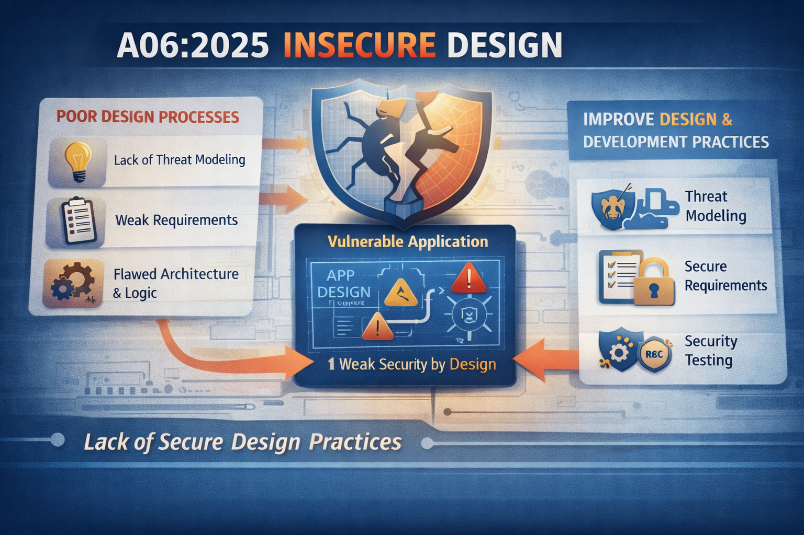
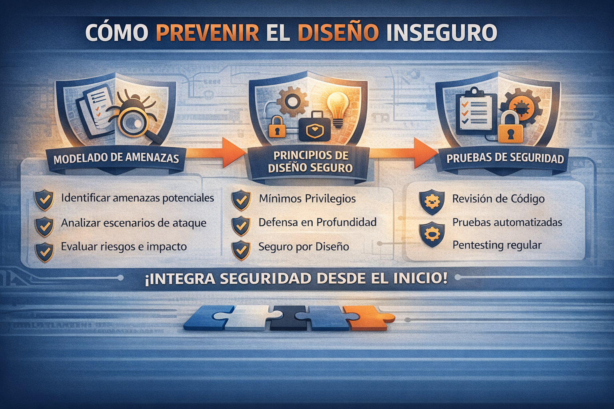

## A06:2025 - Insecure Design  

## Descripción:

Cuando un defecto de diseño o arquitectura genera una vulnerabilidad que un atacante malicioso puede aprovechar, se denomina diseño inseguro en aplicaciones en línea. Este escenario se conoce comúnmente como diseño de control deficiente o inexistente.

Esta categoría de vulnerabilidad, que abarca casi 262 000 incidencias, se centra en los peligros asociados a las debilidades en la arquitectura de una aplicación. Una implementación ideal no podrá corregir diseños inseguros. ¿Por qué? Para reducir los riesgos, se necesitan controles de seguridad.

Una configuración insegura puede afectar negativamente a personas u organizaciones, causando pérdidas económicas y de reputación. Los sistemas y aplicaciones con configuraciones inseguras son especialmente vulnerables a amenazas de seguridad, como el acceso no autorizado, la denegación de servicio y las filtraciones de datos.

Distinguimos entre fallas de diseño y defectos de implementación por una razón: tienen diferentes causas, ocurren en diferentes momentos del proceso de desarrollo y requieren diferentes soluciones. Un diseño seguro puede presentar defectos de implementación que generen vulnerabilidades susceptibles de ser explotadas. Un diseño inseguro no se puede solucionar con una implementación perfecta, ya que nunca se crearon los controles de seguridad necesarios para defenderse de ataques específicos.

Tres partes clave para tener un diseño seguro son:  

  - Recopilación de requisitos y gestión de recursos.
  - Tener un ciclo de vida de desarrollo seguro
  - Creando un diseño seguro

## Métodos de mitigación para diseños inseguros:  

- Establecer y utilizar un ciclo de vida de desarrollo seguro con profesionales de AppSec para ayudar a evaluar y diseñar controles relacionados con la seguridad y la privacidad.
- Establecer y utilizar una biblioteca de patrones de diseño seguros o componentes de carreteras pavimentadas
- Utilice el modelado de amenazas para partes críticas de la aplicación, como autenticación, control de acceso, lógica empresarial y flujos de claves.
- Integre comprobaciones de plausibilidad en cada nivel de su aplicación (desde el frontend hasta el backend)
- Redacte pruebas unitarias y de integración para validar que todos los flujos críticos sean resistentes al modelo de amenazas. Recopile casos de uso y casos de uso indebido para cada nivel de su aplicación.
 
  

## Explotación:  

Una configuración insegura puede afectar negativamente a personas u organizaciones, causando pérdidas económicas y de reputación. Los sistemas y aplicaciones con configuraciones inseguras son especialmente vulnerables a amenazas de seguridad, como el acceso no autorizado, la denegación de servicio y las filtraciones de datos

**Ejemplos de escenarios de ataque:**  

| **Escenario 1** | **Escenario 2** | **Escenario 3** | 
|-----------------|-----------------|-----------------|
| Un flujo de trabajo de recuperación de credenciales podría incluir preguntas y respuestas, lo cual está prohibido por NIST 800-63b, OWASP ASVS y OWASP Top 10. No se puede confiar en las preguntas y respuestas como prueba de identidad, ya que más de una persona puede conocerlas. Esta funcionalidad debería eliminarse y reemplazarse con un diseño más seguro. | Una cadena de cines ofrece descuentos por reserva de grupo y tiene un máximo de quince asistentes antes de exigir un depósito. Los atacantes podrían modelar este flujo y comprobar si encuentran un vector de ataque en la lógica de negocio de la aplicación; por ejemplo, reservar seiscientas entradas y todos los cines a la vez en unas pocas solicitudes, lo que causaría una pérdida masiva de ingresos. | El sitio web de comercio electrónico de una cadena minorista no cuenta con protección contra bots administrados por revendedores que compran tarjetas de video de alta gama para revenderlas en sitios web de subastas. Esto genera una mala publicidad para los fabricantes de tarjetas de video y los propietarios de las cadenas minoristas, además de generar una mala relación con los aficionados que no pueden obtener estas tarjetas a ningún precio. Un diseño antibots cuidadoso y reglas de lógica de dominio, como las compras realizadas a los pocos segundos de estar disponibles, podrían identificar compras no auténticas y rechazar dichas transacciones. |

**Referencias:**  
https://certera.com/blog/mitigating-the-owasp-top-10-vulnerabilities/  
https://owasp.org/Top10/2025/A06_2025-Insecure_Design/
