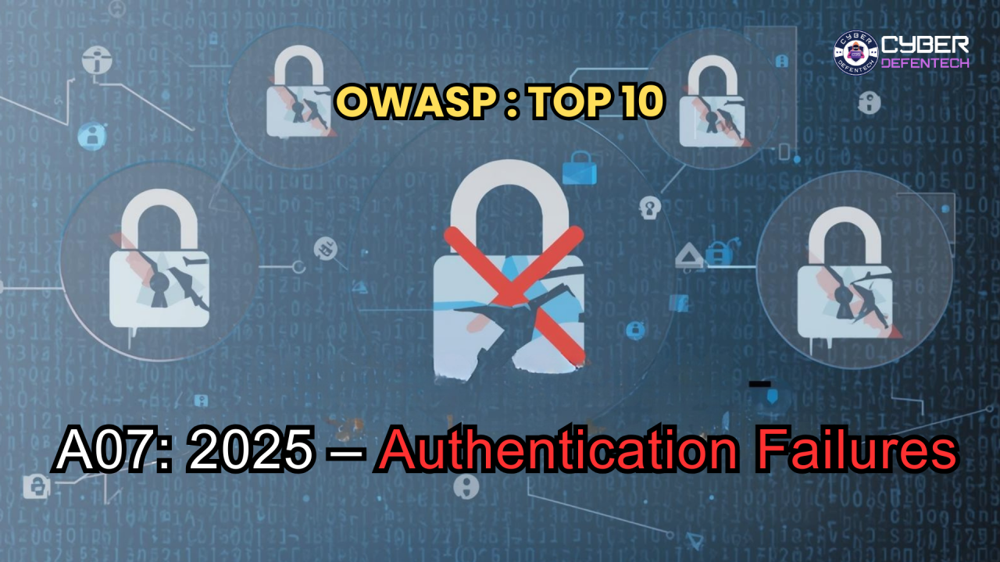
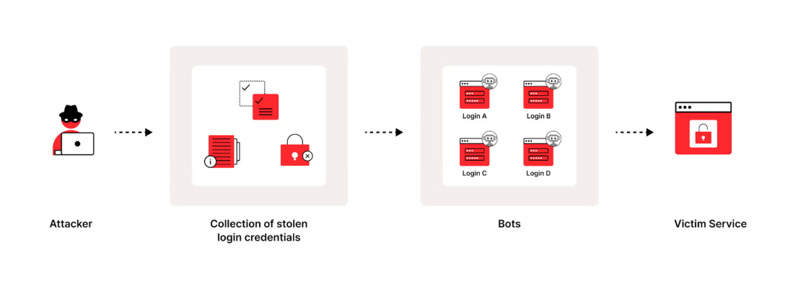
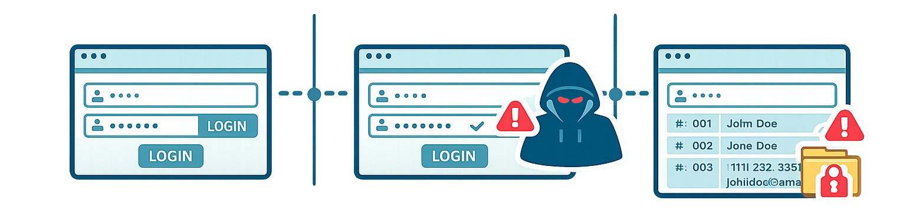
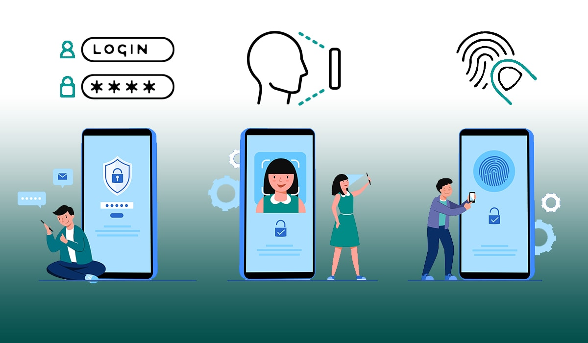

# A07:2025 – Authentication Failures

## Definición

Las fallas de autenticación son debilidades en la forma en que se gestionan los procesos de inicio de sesión. Ocurren cuando las aplicaciones no protegen adecuadamente la manera en que los usuarios se identifican.  
Estos problemas surgen cuando los mecanismos de inicio de sesión están mal diseñados o implementados. Esto puede permitir que los atacantes comprometan contraseñas, claves o tokens de sesión. También pueden aprovechar de estos errores en las aplicaciones para suplantar la identidad de los usuarios. Además, en muchos casos, las aplicaciones no está preparadas para resistir ataques automatizados.

## Formas de explotación

-   **Ataques Automatizados:**  Uso de herramientas para probar miles de credenciales conocidas (credential stuffing) o realizar fuerza bruta.
-   **Credenciales Débiles o por Defecto:**  Uso de contraseñas comunes (ej. "1234", "password") o credenciales de fábrica no cambiadas (admin/admin).
-   **Gestión de Sesiones Deficiente:**  No cerrar la sesión correctamente, exponer tokens en la URL o reutilizar identificadores de sesión, permitiendo el secuestro de la misma.
-   **Recuperación de Contraseñas Insegura:**  Fallos en preguntas de seguridad o flujos de "olvidé mi contraseña" que pueden ser burlados.
-   **Falta de MFA:**  Ausencia o ineficacia de la autenticación de múltiples factores.
-   **Almacenamiento inseguro:**  Contraseñas almacenadas en texto claro o con hashes débiles.

# *Escenario 1*

**Paso 1 – Contexto del sistema**  
La aplicación utiliza únicamente usuario y contraseña para iniciar sesión y permite múltiples intentos sin restricciones.

**Paso 2 – Acción del atacante**  
El atacante aprovecha credenciales filtradas en incidentes anteriores y las prueba de manera automatizada, intentando acceder con combinaciones que ya han sido reutilizadas por otros usuarios.

**Paso 3 – Resultado o impacto**  
Si alguna combinación funciona, logra entrar a cuentas reales, toma el control de los perfiles y puede actuar como si fuera el usuario legítimo, sin que el sistema detecte de inmediato la actividad maliciosa.

### Fuente
[seguridad cero ](https://academy.seguridadcero.com.pe/blog/a07-2025-authentication-failures)

# Escenario 2

**Paso 1 – Contexto del sistema**  
La aplicación utiliza únicamente contraseñas como método de autenticación. Además, exige cambios frecuentes y reglas de complejidad lo que provoca que muchos usuarios reutilicen contraseñas débiles o predecibles.

**Paso 2 – Acción del atacante**  
El atacante aprovecha esta práctica y prueba contraseñas filtradas o combinaciones comunes, sabiendo que es probable que los usuarios repitan las mismas credenciales en diferentes servicios.

**Paso 3 – Resultado o impacto**  
Si logra acertar, obtiene acceso a cuentas legítimas sin necesidad de vulnerar directamente el sistema. Por ello, se recomienda que las organizaciones dejen de depender solo de contraseñas e implementen autenticación multifactor (MFA) para fortalecer la seguridad

### Fuente 
[owasp.org](https://owasp.org/Top10/2025/A07_2025-Authentication_Failures/)

**Escenario 3**

**Paso 1 – Contexto del sistema**  
La aplicación no implementa correctamente los tiempos de espera de sesión o el cierre de sesión. Por ejemplo, un usuario accede desde una computadora pública y, en vez de cerrar sesión, solo cierra la pestaña del navegador. En otros casos, el sistema utiliza inicio de sesión único (SSO), pero el cierre de sesión único (SLO) no funciona correctamente, por lo que la sesión permanece activa en otras aplicaciones.

**Paso 2 – Acción del atacante**  
Otra persona utiliza el mismo navegador o equipo después de que el usuario original se retira, creyendo que ya cerró sesión. Si algunas aplicaciones siguen autenticadas, el atacante puede acceder sin necesidad de ingresar credenciales.

**Paso 3 – Resultado o impacto**  
El atacante obtiene acceso a cuentas o información sensible como si fuera el usuario legítimo. Este problema también puede ocurrir en oficinas, cuando una aplicación importante no se cierra adecuadamente y otra persona tiene acceso temporal a un equipo que quedó desbloqueado.

### Fuente
[owasp.org](https://owasp.org/Top10/2025/A07_2025-Authentication_Failures/)

## Incidente real: GitLab CVE-2024-3092

Este incidente afectó a **GitLab**, una plataforma muy utilizada para gestionar repositorios de código y proyectos de desarrollo.

La vulnerabilidad permitía un **ataque de fijación de sesión**, que ocurre cuando el sistema no maneja correctamente los identificadores de sesión. En este caso, un atacante podía manipular o establecer previamente un identificador de sesión y lograr que la víctima iniciara sesión usando esa misma sesión.

Si el ataque tenía éxito, el atacante podía reutilizar ese identificador para acceder a la cuenta del usuario sin necesidad de conocer sus credenciales. Esto representaba un riesgo importante, ya que podía permitir acceso no autorizado a repositorios, proyectos y otra información sensible dentro de la plataforma.

## Cómo disminuir las brechas en los procesos de autenticación

La forma más efectiva de reducir los riesgos en la autenticación es agregar varias capas de protección. La idea es que, si un atacante intenta avanzar, se encuentre con distintos obstáculos en cada etapa.

Primero, es importante frenar los intentos automatizados desde el principio. Esto significa implementar mecanismos para detectar y bloquear bots, establecer límites en los intentos de inicio de sesión y evitar que se pueda identificar fácilmente si un usuario existe

Segundo, aunque una contraseña se vea comprometida, el acceso no debería concederse de inmediato. Por eso es fundamental usar autenticación multifactor, preferentemente métodos resistentes al phishing. También es necesario reforzar los procesos de recuperación de cuentas, especialmente el restablecimiento de contraseñas y los factores alternativos, ya que suelen ser puntos vulnerables.

Finalmente, la protección no termina cuando el usuario inicia sesión. Es recomendable fortalecer la gestión de sesiones, por ejemplo, renovando y vinculando correctamente los tokens, limitando el tiempo para realizar acciones sensibles y monitoreando comportamientos inusuales, como el uso repetido de credenciales o accesos sospechosos.

### Fuente
[indusface](https://www.indusface.com/learning/owasp-top-10-authentication-failures/)
