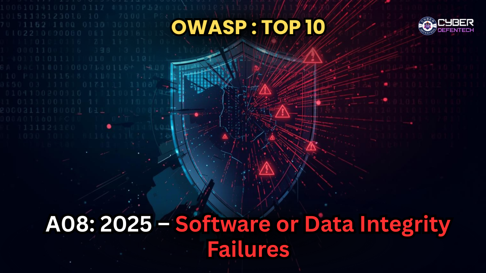
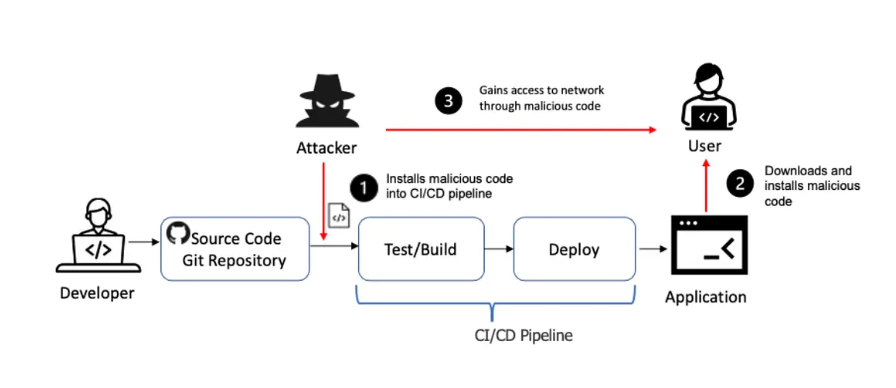
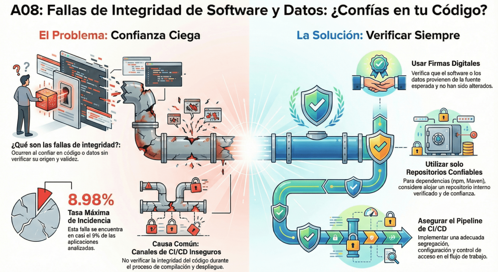

# A08:2025 - Software or Data Integrity Failures

# Definición

Los fallos de integridad del software y de los datos ocurren cuando el código o la infraestructura no cuentan con mecanismos que garanticen la protección contra modificaciones no autorizadas. Este riesgo se presenta, por ejemplo, cuando una aplicación depende de plugins, bibliotecas o módulos provenientes de fuentes, repositorios o redes de entrega de contenido (CDN) no confiables.

El principal riesgo radica en que, una vez que el código malicioso se integra en un entorno de confianza, puede ejecutarse con los mismos privilegios que el software legítimo. En el desarrollo moderno, el software suele construirse a partir de múltiples dependencias externas, por lo que cada componente, artefacto de compilación y mecanismo de actualización puede convertirse en un posible vector de ataque si no se implementan controles adecuados de integridad y verificación.

### Fuente
[Owasp](https://owasp.org/Top10/2021/A08_2021-Software_and_Data_Integrity_Failures/)

# Formas de explotación

-   **Manipulación de dependencias externas:**  
Un atacante logra comprometer una biblioteca o plugin que utiliza la aplicación. Si el sistema descarga esa dependencia sin comprobar su integridad, el código malicioso termina integrándose directamente en la aplicación.

- **Compromiso del pipeline CI/CD:**
Cuando el proceso de integración y despliegue no está bien protegido, un atacante puede alterar el código fuente, modificar artefactos o incluso añadir scripts maliciosos durante la fase de construcción del software.

-   **Actualizaciones sin verificación:**  
Si una aplicación descarga actualizaciones sin validar firmas digitales o hashes de integridad, existe el riesgo de que un atacante intercepte el proceso y distribuya una versión manipulada del software.

-   **Manipulación de archivos o configuraciones**
Si los archivos críticos del sistema no cuentan con controles de acceso ni mecanismos de verificación de integridad, alguien con acceso al servidor podría modificar scripts o configuraciones para ejecutar código malicioso.

### Fuente
[indusface](hhttps://www.indusface.com/learning/owasp-top-10-software-and-data-integrity-failures/ttps://owasp.org/Top10/2021/A08_2021-Software_and_Data_Integrity_Failures/)

# *Escenario 1*

**Paso 1 – Contexto del sistema**  
Una empresa utiliza un proveedor externo de soporte a través del subdominio **support.myCompany.com**, que pertenece al dominio principal **myCompany.com**.

**Paso 2 – Acción del atacante**  
Al compartir el mismo dominio, las cookies de autenticación pueden enviarse al subdominio del proveedor. Si alguien con acceso a esa infraestructura las intercepta, puede obtenerlas.

**Paso 3 – Resultado o impacto**  
El atacante podría usar esas cookies para secuestrar la sesión de los usuarios y acceder a sus cuentas sin conocer sus credenciales.

# Escenario 2

**Paso 1 – Contexto del sistema**  
Algunos dispositivos, como routers domésticos o equipos IoT, permiten instalar actualizaciones de firmware sin verificar si están firmadas digitalmente.

**Paso 2 – Acción del atacante**  
Un atacante distribuye una actualización de firmware modificada o maliciosa que el dispositivo acepta porque no valida su autenticidad.

**Paso 3 – Resultado o impacto**  
El dispositivo instala el firmware comprometido, lo que permite al atacante tomar control del sistema o manipular su funcionamiento.

# **Escenario 3**

**Paso 1 – Contexto del sistema**  
Un desarrollador no encuentra la versión actualizada de un paquete en el gestor de paquetes oficial y decide descargarlo desde un sitio web externo.

**Paso 2 – Acción del atacante**  
El paquete descargado no está firmado y contiene código malicioso que pasa desapercibido durante la instalación.

**Paso 3 – Resultado o impacto**  
Al instalar el paquete, el sistema queda comprometido y el atacante puede ejecutar código malicioso dentro de la aplicación o el entorno de desarrollo.
### Fuente
[laprovittera](https://laprovittera.com/owasp-top-10-a082025-fallos-de-integridad-en-software-y-datos/)

# **Incidente Real**

El **ataque a la cadena de suministro de SolarWinds** en 2020 es uno de los ejemplos más conocidos de este tipo de incidentes de seguridad.

SolarWinds desarrollaba una herramienta de monitoreo llamada **SolarWinds Orion**, utilizada por miles de empresas y organizaciones para administrar sus redes y sistemas. Los atacantes lograron infiltrarse en el proceso de desarrollo de la compañía y añadieron código malicioso dentro de una actualización legítima del software.

Debido a que la actualización provenía de una fuente confiable, muchas organizaciones la instalaron sin sospechar nada. Una vez instalada, el código malicioso permitía a los atacantes acceder a los sistemas internos de esas organizaciones y moverse dentro de sus redes sin ser detectados durante meses.

El impacto fue muy grande: miles de empresas y varias agencias del gobierno de **Estados Unidos** resultaron afectadas. Este caso demostró que, si un atacante compromete un proveedor de software confiable, puede afectar a muchas organizaciones al mismo tiempo, aprovechando la confianza que existe en las actualizaciones oficiales.

### Fuente
[Hackeo de SolarWinds](https://www.fortinet.com/lat/resources/cyberglossary/solarwinds-cyber-attack)

### Cómo prevenir fallos de integridad de software o datos

**1. Verificar la integridad con firmas digitales**  
Utiliza firmas digitales u otros mecanismos de verificación para asegurarte de que el software o los datos realmente provienen de la fuente esperada y que no han sido modificados durante su distribución.

**2. Usar repositorios de dependencias confiables**  
Asegúrate de que las bibliotecas y dependencias (por ejemplo, las obtenidas desde npm o Maven) se descarguen únicamente desde repositorios confiables. En entornos con mayor nivel de riesgo, es recomendable mantener un repositorio interno previamente validado.

**3. Analizar vulnerabilidades en los componentes**  
Utiliza herramientas de seguridad para la cadena de suministro de software, como OWASP Dependency Check o OWASP CycloneDX, que permiten analizar los componentes del proyecto y detectar vulnerabilidades conocidas.

**4. Implementar revisiones de código y configuración**  
Establece un proceso de revisión para los cambios en el código y en las configuraciones. Esto ayuda a reducir el riesgo de que se introduzca código malicioso o configuraciones incorrectas en el pipeline de desarrollo.

**5. Proteger el pipeline de CI/CD**  
Asegúrate de que el pipeline de CI/CD tenga una configuración segura, con controles de acceso adecuados y segregación de responsabilidades, para proteger la integridad del código durante las fases de construcción y despliegue.

**6. Validar la integridad de datos serializados**  
Evita enviar datos serializados sin firma o sin cifrado a clientes no confiables. Siempre que sea posible, utiliza mecanismos de verificación de integridad o firmas digitales para detectar alteraciones o reutilización indebida de esos datos.

