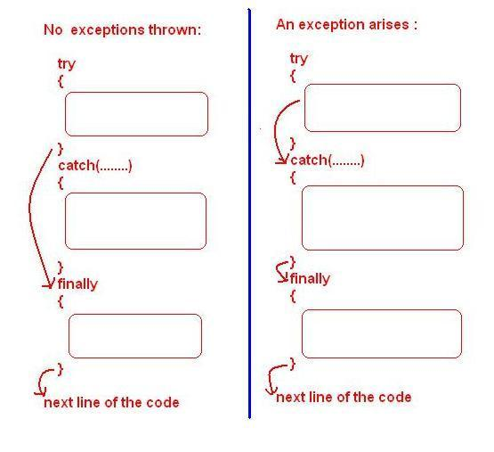
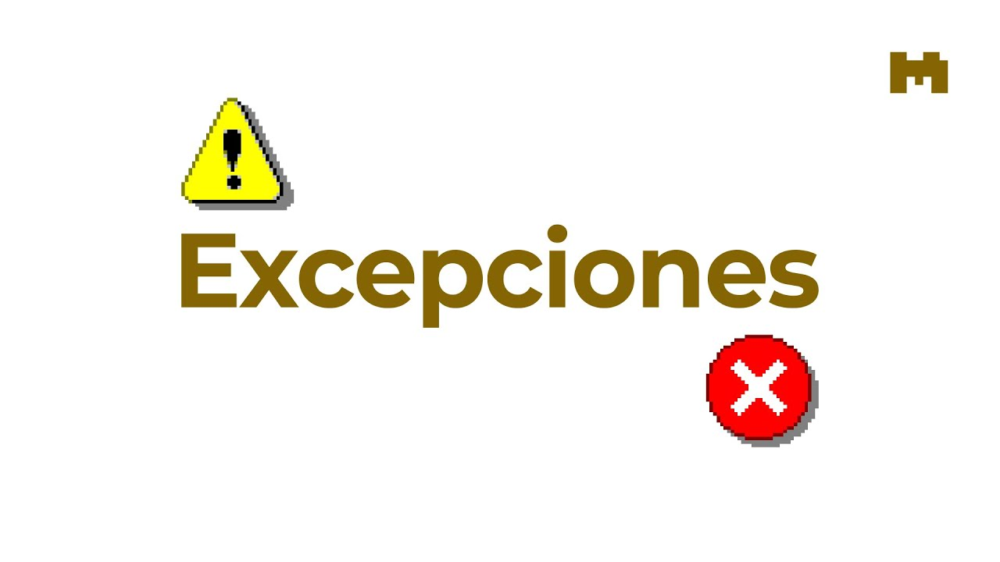

# Mal manejo de condiciones excepcionales

  

La gestión inadecuada de condiciones excepcionales en el software ocurre cuando los programas no logran prevenir, detectar ni responder a situaciones inusuales e impredecibles, lo que provoca fallos, comportamientos inesperados y, en ocasiones, vulnerabilidades. Esto puede implicar una o más de las siguientes tres fallas: la aplicación no previene la ocurrencia de una situación inusual, no la identifica en el momento en que ocurre o responde de forma deficiente o nula a la situación posteriormente.

### Métodos de explotación

* Manipulación de URLs
* Acceso a servicios internos

  
# Ejemplos 

Acceder a servicios internos mediante una URL manipulada.

# Vulnerabilidades mas comunes 

### Escenario n.° 1

La aplicación genera excepciones al cargar archivos, pero no libera los recursos correctamente. Esto provoca acumulación y agotamiento de recursos, pudiendo causar una denegación de servicio (DoS).

  

### Escenario n.° 2

Errores en la base de datos muestran mensajes detallados al usuario con información sensible. Un atacante puede aprovechar estos datos para realizar ataques más efectivos, como inyección SQL.

  

### Escenario n.° 3

En una transacción financiera de varios pasos, si ocurre un error y el sistema no revierte completamente la operación, puede generarse corrupción de datos. Un atacante podría aprovecharlo para duplicar envíos de dinero o vaciar una cuenta.

  

# Mejores Prácticas de Prevención y Mitigación 

La gestión adecuada de excepciones es esencial para la fiabilidad de una aplicación. Puedes gestionar intencionalmente las excepciones esperadas para evitar que tu aplicación se bloquee. Sin embargo, una aplicación bloqueada es más fiable y fácil de diagnosticar que una con un comportamiento indefinido.

Este artículo describe las mejores prácticas para manejar y crear excepciones.

### Utilice bloques try/catch/finally para recuperarse de errores o liberar recursos

  

Para el código que potencialmente pueda generar una excepción, y cuando tu aplicación pueda recuperarse de ella, usa bloques try/ alrededor del código. En los bloques, ordena siempre las excepciones de la más derivada a la menos derivada.

### Manejar condiciones comunes para evitar excepciones

  

Para condiciones que probablemente ocurran pero que podrían desencadenar una excepción, considere gestionarlas de forma que se evite la excepción. Por ejemplo, si intenta cerrar una conexión que ya está cerrada, obtendrá un error InvalidOperationException

### Manejar condiciones comunes para evitar excepciones

  

Si el coste de rendimiento de las excepciones es prohibitivo, algunos métodos de bibliotecas .NET ofrecen formas alternativas de gestión de errores. Por ejemplo, Int32.Parse genera una excepción OverflowException si el valor a analizar es demasiado grande para ser representado por Int32 . 

# Referencias

* https://owasp.org/Top10/2025/A10_2025-Mishandling_of_Exceptional_Conditions/
* https://learn.microsoft.com/en-us/dotnet/standard/exceptions/best-practices-for-exceptions 
