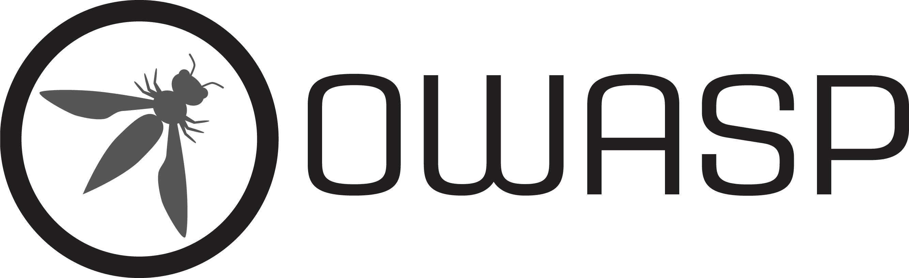

# INTEGRANTES

* Lady Bautista  
* Vicente Rueda  
* Juan Carlos Murcia  
* Juan Diaz
* Jonathan Garzon
* ## Tema del trabajo
  
**Investigación sobre el OWASP Top 10**

  

  
</p
  
Aplica políticas que impiden a los usuarios actuar fuera de sus permisos previstos. Las fallas suelen provocar la divulgación no autorizada de información, la modificación o destrucción de todos los datos, o la realización de una función empresarial fuera de los límites del usuario.

# Configuración incorrecta de seguridad

Una mala configuración de seguridad ocurre cuando un sistema, una aplicación o un servicio en la nube se configura incorrectamente desde una perspectiva de seguridad, lo que crea vulnerabilidades.

# Fallas en la cadena de suministro de software 

Las fallas en la cadena de suministro de software son averías u otros problemas en el proceso de desarrollo, distribución o actualización de software. Suelen deberse a vulnerabilidades o cambios maliciosos en código, herramientas u otras dependencias de terceros de las que depende el sistema.

# Fallas criptográficas

Los obstáculos anteriores, como el rendimiento de la CPU y la gestión de claves privadas y certificados, ahora se superan mediante CPU con instrucciones diseñadas para acelerar el cifrado (p. ej., compatibilidad con AES )

# Inyección

  
Falla de la aplicación que permite que una entrada de usuario no confiable se envíe a un intérprete (por ejemplo, un navegador, una base de datos, la línea de comandos) y hace que el intérprete ejecute partes de esa entrada como comandos.

# Diseño inseguro

categoría amplia que representa diferentes debilidades, expresadas como un diseño de control ineficaz o ausente. No es la causa de las demás diez categorías de riesgo principales.

# Errores de autenticación 

Cuando un atacante logra engañar a un sistema para que reconozca a un usuario inválido o incorrecto como legítimo, se presenta esta vulnerabilidad. Puede haber vulnerabilidades de autenticación si la aplicación:

* Permite ataques automatizados como el robo de credenciales, donde el atacante obtiene una lista vulnerada de nombres de usuario y contraseñas válidos. Recientemente, este tipo de ataque se ha ampliado para incluir ataques híbridos de contraseñas (también conocidos como ataques de rociado de contraseñas), donde el atacante utiliza variaciones o incrementos de credenciales robadas para obtener acceso, por ejemplo, probando "Contraseña1!", "Contraseña2!", "Contraseña3!", etc.

* Permite ataques de fuerza bruta u otros ataques automatizados y programados que no se bloquean rápidamente.

* Permite contraseñas predeterminadas, débiles o conocidas, como "Contraseña1" o el nombre de usuario "admin" con una contraseña "admin".

* Permite a los usuarios crear nuevas cuentas con credenciales que ya se sabe que han sido violadas.

* Permite el uso de procesos de recuperación de credenciales débiles o ineficaces y de contraseña olvidada, como "respuestas basadas en conocimiento", que no se pueden hacer seguras.

* Utiliza almacenes de datos de contraseñas de texto simple, cifradas o con algoritmos hash débiles (consulte A04:2025-Fallas criptográficas).

* Tiene autenticación multifactor faltante o ineficaz.

* Permite el uso de alternativas débiles o ineficaces si la autenticación multifactor no está disponible.

* Expone el identificador de sesión en la URL, un campo oculto u otra ubicación insegura a la que puede acceder el cliente.

* Reutiliza el mismo identificador de sesión después de un inicio de sesión exitoso.

* No invalida correctamente las sesiones de usuario o los tokens de autenticación (principalmente tokens de inicio de sesión único (SSO)) durante el cierre de sesión o un período de inactividad.

* No afirma correctamente el alcance y la audiencia prevista de las credenciales proporcionadas.

# Fallas de integridad de software o datos 

Las fallas de integridad de software y datos se relacionan con código e infraestructura que no protegen contra código o datos no válidos o no confiables que se consideran confiables y válidos. Un ejemplo de esto es cuando una aplicación depende de complementos, bibliotecas o módulos de fuentes, repositorios y redes de entrega de contenido (CDN) no confiables. 

# Fallas de registro y alertas de seguridad

Sin registro ni monitorización, no se pueden detectar ataques ni infracciones, y sin alertas es muy difícil responder con rapidez y eficacia ante un incidente de seguridad. 

# Mal manejo de condiciones excepcionales 

La gestión inadecuada de condiciones excepcionales en el software ocurre cuando los programas no logran prevenir, detectar ni responder a situaciones inusuales e impredecibles, lo que provoca fallos, comportamientos inesperados y, en ocasiones, vulnerabilidades. Esto puede implicar una o más de las siguientes tres fallas: la aplicación no previene la ocurrencia de una situación inusual, no la identifica en el momento en que ocurre o responde de forma deficiente o nula a la situación posteriormente.

