## Integrantes

| # | Nombre |
|---|--------|
| 1 | Roberto Carlos Muñoz |
| 2 | Carlos Alberto Gonzalez |
| 3 | Diego Armando Hernandez |
| 4 | Daniel Mauricio Daza Borja |


# Análisis de Vulnerabilidades en el OWASP Top 10: Métodos de Explotación y Prevención

## Introducción

El **OWASP Top 10** es un documento de referencia publicado por la organización internacional **OWASP (Open Web Application Security Project)**, que identifica las **10 vulnerabilidades más críticas en aplicaciones web** a nivel mundial.

La edición 2025 representa una actualización basada en:

* Datos reales recopilados de miles de aplicaciones
* Análisis de expertos en ciberseguridad
* Tendencias actuales de ataques
* Cambios en arquitecturas modernas (APIs, microservicios, cloud, DevSecOps)

---

## 🎯 ¿Por qué es importante?

El OWASP Top 10:

* Sirve como estándar global de referencia en seguridad web
* Es utilizado en auditorías, pentesting y cumplimiento normativo
* Orienta a desarrolladores sobre los riesgos más críticos
* Ayuda a priorizar controles de seguridad

---

## 🌍 Enfoque de la edición 2025

La versión 2025 enfatiza especialmente:

* Fallas en control de acceso
* Problemas en mecanismos de autenticación
* Seguridad en APIs
* Gestión de identidades y tokens
* Riesgos en entornos cloud y DevSecOps

---

## 🚀 Objetivo principal

El propósito del OWASP Top 10 no es solo listar vulnerabilidades, sino **crear conciencia y promover mejores prácticas de seguridad desde el diseño hasta la implementación y operación de las aplicaciones.**

## Lista del TOP 10 - 2025

1. A01 - Broken Access Control
2. A02 - Security Misconfiguration
3. A03 - Software Supply Chain Failures
4. A04 - Cryptographic Failures
5. A05 - Injection
6. A06 - Insecure Design
7. A07 - Authentication Failures
8. A08 - Software or Data Integrity Failures
9. A09 - Security Logging and Alerting Failures
10. A10 - Mishandling of Exceptional Conditions
---

# 1. A01: Broken Access Control (Control de Acceso Roto)

## 📌 1. Descripción de la Vulnerabilidad

El **A01: Broken Access Control** del OWASP Top 10 se refiere a las fallas en los mecanismos de autorización que permiten que un usuario realice acciones o acceda a recursos para los que no tiene permisos. 


El control de acceso define:

* ✅ Quién puede acceder
* ✅ A qué recursos puede acceder
* ✅ Qué acciones puede realizar

Cuando estas reglas no se aplican correctamente en el **lado del servidor**, se produce un **Broken Access Control**.

### 🚨 Naturaleza del Problema

Ocurre cuando:

* No se aplica el principio de mínimo privilegio
* No existe “deny by default”
* Se confía en validaciones del frontend
* No se valida la propiedad del recurso
* Se exponen identificadores directos (IDOR)
* Hay mala configuración CORS
* Se manipulan tokens JWT
* No se protegen endpoints POST/PUT/DELETE
* Se permite navegación forzada

---

### 🎯 Impacto Potencial

* Exposición de datos sensibles
* Modificación o eliminación de datos
* Escalada de privilegios (horizontal o vertical)
* Compromiso total del sistema
* Violaciones regulatorias (RGPD, etc.)
* Pérdida financiera
* Daño reputacional
* Interrupción operativa

📊 OWASP indica que el 100% de las aplicaciones analizadas presentaban algún tipo de fallo de control de acceso.

---

### Diagrama de Flujo

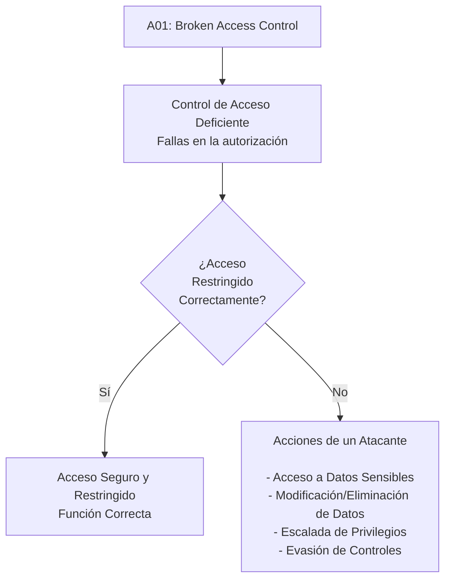
----------

## ⚔️ 2. Métodos de Explotación

Los atacantes aprovechan estas fallas mediante distintas técnicas:

### 1️⃣ Manipulación de URL y Parámetros (IDOR)

Consiste en modificar identificadores en la URL o en los parámetros de una petición para acceder a recursos de otros usuarios.

**Ejemplo cambio ID en la URL:**

Solicitud legítima:

```
GET https://app.com/profile?userId=1001

```

El atacante modifica el ID:

```
GET https://app.com/profile?userId=1002

```

Si el backend no valida la propiedad del recurso, devolverá datos del usuario 1002.

----------

### 📊 Diagrama Vulnerable

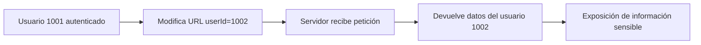

**Ejemplo descarga de archivos:**

Solicitud original:

```
GET /download?file=invoice_1001.pdf

```

Ataque:

```
GET /download?file=invoice_1002.pdf

```

Si no hay validación → descarga de factura de otro usuario.

----------

### 📊 Diagrama Secuencia

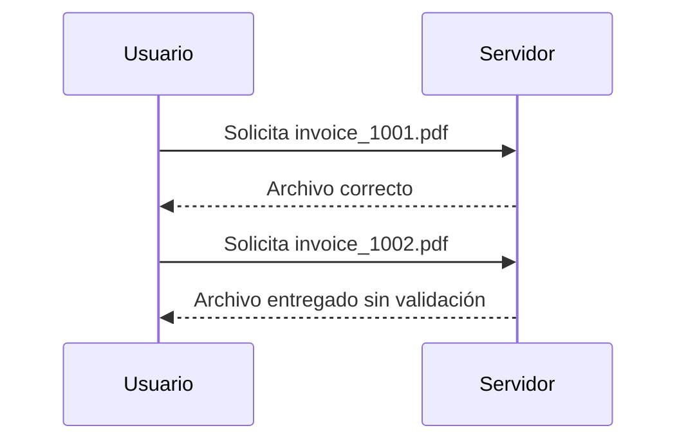

----------

### 2️⃣ Force Browsing (Navegación Forzada)

### 📌 Escenario

Un atacante intenta acceder directamente a rutas administrativas:

```
/admin/listar_mails
/admin/dashboard
/app/admin_getappInfo
```

Aunque el frontend o la interfaz gráfica no muestre estos enlaces, el atacante puede acceder manualmente usando navegador, herramientas o línea de comandos:

```bash
curl https://example.com/app/admin_getappInfo
```

---

### 🔴 Diagrama de Flujo – Escenario Vulnerable

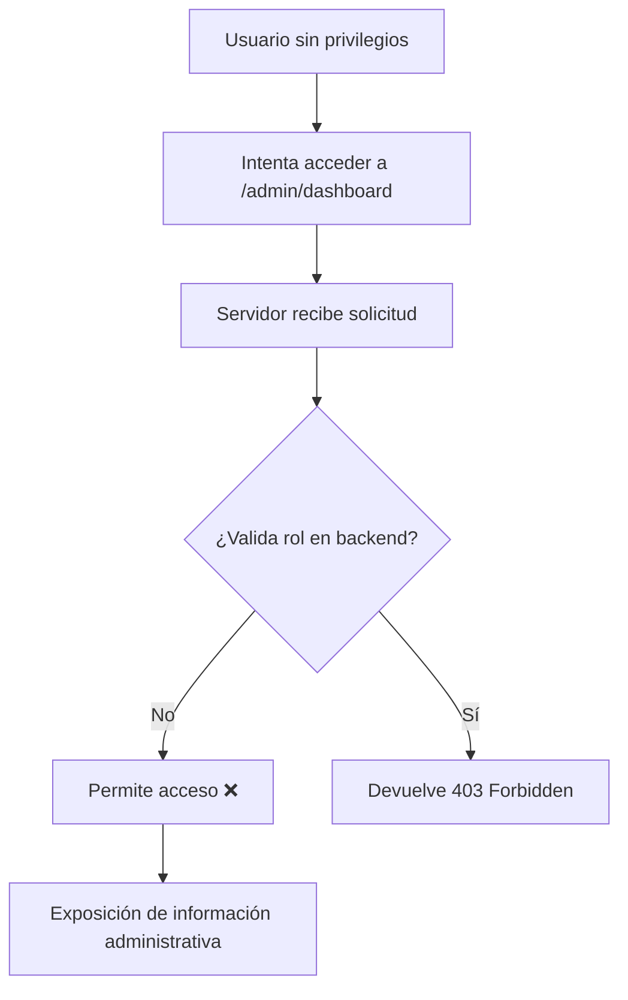

---

### 🟠 Flujo Detallado del Ataque

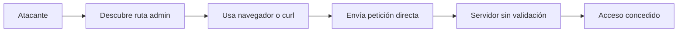

---

### 🟢 Flujo Seguro (Control Correcto)

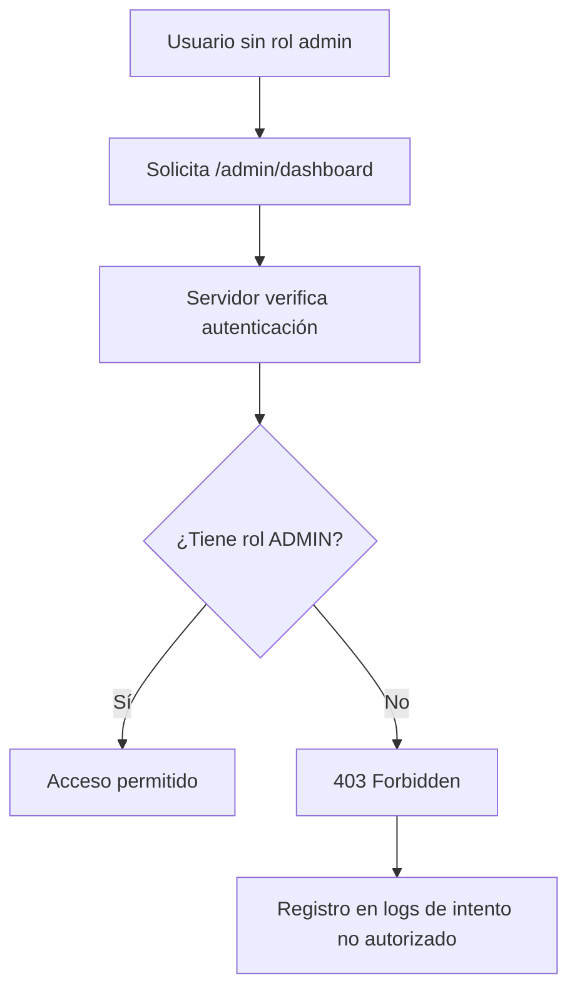

----------

### 3️⃣ Manipulación de Tokens y Cookies

### 📌 Escenario

Un atacante intenta:

* Alterar un **JWT**
* Modificar cookies
* Cambiar valores ocultos (`isAdmin=false → true`)
* Reutilizar una sesión activa (Session Hijacking)

Si el servidor **no valida la firma del token ni los privilegios reales en backend**, se produce **escalación de privilegios**.

---

### 🔴 Flujo Vulnerable – Escalación de Privilegios


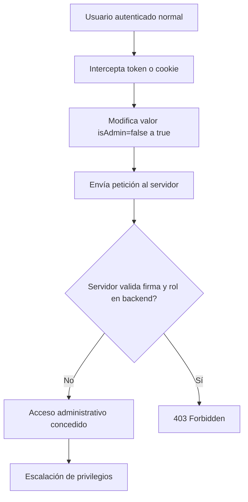

---

### 🟠 Flujo Específico – Manipulación de JWT

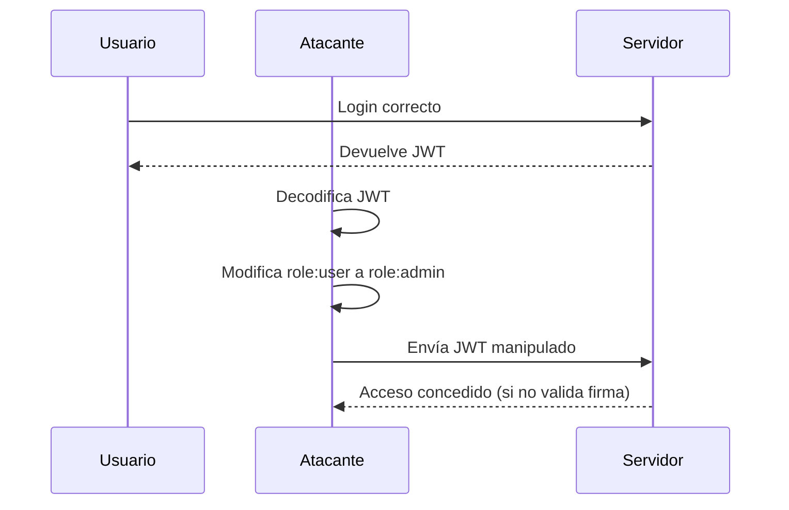

---

### 🟢 Flujo Seguro – Validación Correcta

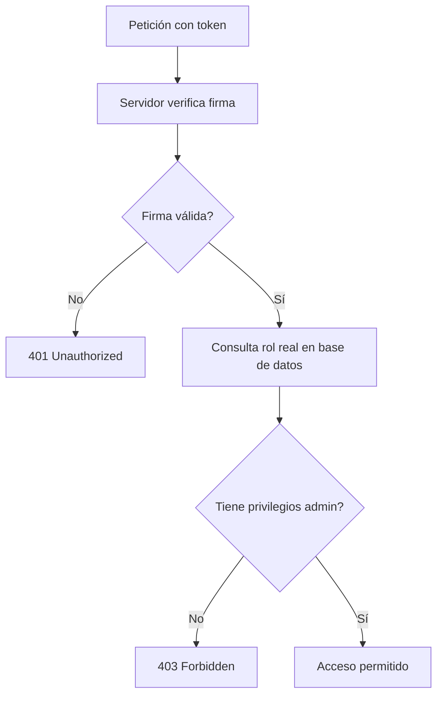

----------

## 🛠️ Herramientas Comunes Utilizadas

-   **[Burp Suite Professional](https://www.google.com/search?q=Burp+Suite+Professional&oq=Herramientas+Comunes+Utilizadas+para+A01%3A+Broken+Access+Control&gs_lcrp=EgZjaHJvbWUyBggAEEUYOdIBCTc2OTIxajBqN6gCALACAA&sourceid=chrome&ie=UTF-8&mstk=AUtExfATjnT5AHVjJJoehzKWOmL67AiPCf4MNQ3krtoVDaW07zGrlV03ZJhpdQVk4_TTTreg5Ln8P5gr51X6D5Af3AMt-4kTxbqgKXVIC6ksbQnXE60QOJdr-i1lMDdupnHFNZ8kfssE0t3u23M0vURgvYnsjIzeekLNRpAbj0O6kWTniws&csui=3&ved=2ahUKEwjP6v2XzoKTAxWUezABHWxbPQQQgK4QegQIAhAB)/Community**: La herramienta principal para interceptar, analizar y modificar peticiones HTTP/HTTPS (manipulación de parámetros, cookies, JWT) para probar IDOR (Insecure Direct Object Reference) y elevación de privilegios.
-   **[OWASP ZAP](https://www.google.com/search?q=OWASP+ZAP&oq=Herramientas+Comunes+Utilizadas+para+A01%3A+Broken+Access+Control&gs_lcrp=EgZjaHJvbWUyBggAEEUYOdIBCTc2OTIxajBqN6gCALACAA&sourceid=chrome&ie=UTF-8&mstk=AUtExfATjnT5AHVjJJoehzKWOmL67AiPCf4MNQ3krtoVDaW07zGrlV03ZJhpdQVk4_TTTreg5Ln8P5gr51X6D5Af3AMt-4kTxbqgKXVIC6ksbQnXE60QOJdr-i1lMDdupnHFNZ8kfssE0t3u23M0vURgvYnsjIzeekLNRpAbj0O6kWTniws&csui=3&ved=2ahUKEwjP6v2XzoKTAxWUezABHWxbPQQQgK4QegQIAhAD)  (Zed Attack Proxy)**: Escáner de seguridad web de código abierto, ideal para encontrar accesos no protegidos y fallos de autorización automatizados.
-   **[FFUF](https://www.google.com/search?q=FFUF&oq=Herramientas+Comunes+Utilizadas+para+A01%3A+Broken+Access+Control&gs_lcrp=EgZjaHJvbWUyBggAEEUYOdIBCTc2OTIxajBqN6gCALACAA&sourceid=chrome&ie=UTF-8&mstk=AUtExfATjnT5AHVjJJoehzKWOmL67AiPCf4MNQ3krtoVDaW07zGrlV03ZJhpdQVk4_TTTreg5Ln8P5gr51X6D5Af3AMt-4kTxbqgKXVIC6ksbQnXE60QOJdr-i1lMDdupnHFNZ8kfssE0t3u23M0vURgvYnsjIzeekLNRpAbj0O6kWTniws&csui=3&ved=2ahUKEwjP6v2XzoKTAxWUezABHWxbPQQQgK4QegQIAhAF)  (Fuzz Faster U Fool)**: Herramienta de  _fuzzing_  web de alto rendimiento utilizada para descubrir directorios ocultos, URLs no autorizadas y endpoints de API.
-   **[Gobuster](https://www.google.com/search?q=Gobuster&oq=Herramientas+Comunes+Utilizadas+para+A01%3A+Broken+Access+Control&gs_lcrp=EgZjaHJvbWUyBggAEEUYOdIBCTc2OTIxajBqN6gCALACAA&sourceid=chrome&ie=UTF-8&mstk=AUtExfATjnT5AHVjJJoehzKWOmL67AiPCf4MNQ3krtoVDaW07zGrlV03ZJhpdQVk4_TTTreg5Ln8P5gr51X6D5Af3AMt-4kTxbqgKXVIC6ksbQnXE60QOJdr-i1lMDdupnHFNZ8kfssE0t3u23M0vURgvYnsjIzeekLNRpAbj0O6kWTniws&csui=3&ved=2ahUKEwjP6v2XzoKTAxWUezABHWxbPQQQgK4QegQIAhAH)**: Utilizada para la fuerza bruta de URIs (directorios y archivos) y subdominios, lo que permite identificar páginas ocultas accesibles sin autenticación.
-   **[JWT Editor (Extensión de Burp)](https://www.google.com/search?q=JWT+Editor+%28Extensi%C3%B3n+de+Burp%29&oq=Herramientas+Comunes+Utilizadas+para+A01%3A+Broken+Access+Control&gs_lcrp=EgZjaHJvbWUyBggAEEUYOdIBCTc2OTIxajBqN6gCALACAA&sourceid=chrome&ie=UTF-8&mstk=AUtExfATjnT5AHVjJJoehzKWOmL67AiPCf4MNQ3krtoVDaW07zGrlV03ZJhpdQVk4_TTTreg5Ln8P5gr51X6D5Af3AMt-4kTxbqgKXVIC6ksbQnXE60QOJdr-i1lMDdupnHFNZ8kfssE0t3u23M0vURgvYnsjIzeekLNRpAbj0O6kWTniws&csui=3&ved=2ahUKEwjP6v2XzoKTAxWUezABHWxbPQQQgK4QegQIAhAJ)**: Fundamental para decodificar, modificar y firmar de nuevo los tokens JWT para probar la manipulación de metadatos.
-   **[Postman](https://www.google.com/search?q=Postman&oq=Herramientas+Comunes+Utilizadas+para+A01%3A+Broken+Access+Control&gs_lcrp=EgZjaHJvbWUyBggAEEUYOdIBCTc2OTIxajBqN6gCALACAA&sourceid=chrome&ie=UTF-8&mstk=AUtExfATjnT5AHVjJJoehzKWOmL67AiPCf4MNQ3krtoVDaW07zGrlV03ZJhpdQVk4_TTTreg5Ln8P5gr51X6D5Af3AMt-4kTxbqgKXVIC6ksbQnXE60QOJdr-i1lMDdupnHFNZ8kfssE0t3u23M0vURgvYnsjIzeekLNRpAbj0O6kWTniws&csui=3&ved=2ahUKEwjP6v2XzoKTAxWUezABHWxbPQQQgK4QegQIAhAL)**: Muy utilizada para probar API endpoints, permitiendo enviar peticiones con diferentes roles de usuario para verificar si un usuario sin privilegios puede ejecutar POST, PUT o DELETE.
-   **[SQLMap](https://www.google.com/search?q=SQLMap&oq=Herramientas+Comunes+Utilizadas+para+A01%3A+Broken+Access+Control&gs_lcrp=EgZjaHJvbWUyBggAEEUYOdIBCTc2OTIxajBqN6gCALACAA&sourceid=chrome&ie=UTF-8&mstk=AUtExfATjnT5AHVjJJoehzKWOmL67AiPCf4MNQ3krtoVDaW07zGrlV03ZJhpdQVk4_TTTreg5Ln8P5gr51X6D5Af3AMt-4kTxbqgKXVIC6ksbQnXE60QOJdr-i1lMDdupnHFNZ8kfssE0t3u23M0vURgvYnsjIzeekLNRpAbj0O6kWTniws&csui=3&ved=2ahUKEwjP6v2XzoKTAxWUezABHWxbPQQQgK4QegQIAhAN)**: Aunque es para SQL Injection, a menudo revela accesos de administrador o fugas de datos que ocurren por controles de acceso defectuosos.
----------
## 🚨 Ejemplos Reales

⚡ **Facebook “View As”:** Un fallo permitió a atacantes acceder a tokens de acceso de otros usuarios por una falla de control de acceso. Esto expuso millones de cuentas.

⚡ **Snapchat (2014):**  Hackers explotaron una vulnerabilidad de control de acceso para recopilar una lista de 4.6 millones de nombres de usuario y números de teléfono.

---

## 📉 3. Mejores Prácticas de Prevención y Mitigación

### 🔐 3.1 Denegar por Defecto (Deny by Default)

Todo recurso debe estar protegido a menos que sea explícitamente público.

---

### 🏗 3.2 Centralizar la Lógica de Autorización

* No dispersar validaciones
* Usar RBAC o ABAC
* Reutilizar módulos de autorización

---

### 👤 3.3 Validar Propiedad del Recurso

No basta validar rol:

```pseudo
if user.id == recurso.owner_id
```

Siempre validar que el usuario sea dueño del objeto.

---

### 🔒 3.4 Aplicar Control en el Servidor

Nunca confiar en:

* HTML
* JavaScript
* Campos ocultos

---

### 🔄 3.5 Gestión Segura de Tokens y Sesiones

* Invalidar sesiones al logout
* JWT de corta duración
* Validar claims (aud, iss, role)
* Implementar refresh tokens seguros

---

### 🌐 3.6 Configuración Segura de CORS

* Definir orígenes específicos
* No usar wildcard en APIs sensibles

---

### 🚦 3.7 Implementar Rate Limiting

Reduce:

* Enumeración de IDs
* Automatización de ataques

---

### 📊 3.8 Logging y Monitoreo

Registrar:

* Intentos fallidos
* Accesos denegados
* Escaladas sospechosas

---

### 🧪 3.9 Pruebas de Seguridad

* Pentesting
* Pruebas de navegación forzada
* Pruebas IDOR
* SAST y DAST
* Tests unitarios de autorización

---

### 📋 3.10 Aplicar Principio de Mínimo Privilegio

Cada usuario debe tener:

> Solo los permisos estrictamente necesarios

---

## 🔎 Ejemplo Seguro vs Vulnerable

### ❌ Código Vulnerable

```php
if(isset($_SESSION['loggedin'])) {
   cargar_emails();
}
```

No valida rol.

---

### ✅ Código Seguro

```php
if(isset($_SESSION['loggedin']) && $_SESSION['isadmin'] == true) {
   cargar_emails();
}
```

Valida autenticación y autorización.

---

## 🏁 Conclusión

**A01 – Broken Access Control** es la vulnerabilidad más crítica del Top 10 de OWASP.

No es un problema superficial.
Es un problema **arquitectónico**.

Requiere:

* Diseño seguro desde el inicio
* Mentalidad “deny by default”
* Validaciones del lado del servidor
* Centralización de la lógica
* Pruebas rigurosas
* Monitoreo continuo

Un control de acceso deficiente puede permitir:

* Robo de información
* Escalada de privilegios
* Manipulación del negocio
* Compromiso total del sistema

🔐 La autenticación abre la puerta.
🛑 El control de acceso decide hasta dónde puedes llegar.

---

# A02 – Security Misconfiguration (Mala configuración de seguridad)

### ¿Qué es?
Ocurre cuando una aplicación, servidor o servicio está configurado de forma insegura (por ejemplo: credenciales por defecto, permisos abiertos, errores mostrando demasiada información, CORS mal configurado, paneles/admin expuestos, etc.).  
El problema no es “el código” solamente, sino **cómo se desplegó o configuró** el sistema.

### ¿Cómo se ve en un proyecto real? (Ejemplos comunes)
- `DEBUG=True` o modo desarrollo activo en producción.
- Mensajes de error que muestran rutas, versiones o detalles internos (stack trace).
- CORS abierto: permitir `*` sin necesidad.
- Archivos sensibles públicos: `.env`, backups, logs, `/admin` sin controles.
- Permisos muy amplios en roles/usuarios, buckets o carpetas.
- Configuración TLS/HTTPS débil o inexistente.

### Impacto
- Filtración de información sensible (rutas, llaves, versiones, estructura interna).
- Acceso no autorizado a paneles o recursos internos.
- Aumento de superficie de ataque y explotación de fallas encadenadas.

### Buenas prácticas / mitigación
- Desactivar debug en producción (ej: `DEBUG=False`).
- Manejo de errores con páginas genéricas (sin detalles internos).
- Revisar CORS (permitir solo dominios necesarios).
- No exponer `.env` ni secretos; usar variables de entorno y secret managers.
- Aplicar “hardening” del servidor (headers, TLS, permisos, firewall).
- Revisiones por checklist antes de desplegar (pre-deploy).

### Evidencia en este trabajo
- Se revisó configuración de entorno (dev vs prod).
- Se verificó que no se expongan errores con detalles sensibles.
- Se limitó el acceso a recursos sensibles y se controlaron permisos.


# 7. A07: Authentication Failures (Fallos de Autenticación)

## 📌 1. Descripción de la Vulnerabilidad

Según OWASP, **A07 – Fallos de Autenticación** ocurre cuando un sistema no verifica correctamente la identidad de un usuario, dispositivo o aplicación.


La autenticación es la **puerta de entrada** a cualquier sistema.
Si falla, todo el entorno queda expuesto.

### 🔎 Naturaleza del Problema

Un fallo de autenticación ocurre cuando:

* Se permiten contraseñas débiles o predeterminadas
* No existe autenticación multifactor (MFA)
* Se permite fuerza bruta sin limitación
* Se reutilizan tokens de sesión
* Las sesiones no se invalidan correctamente
* Se almacenan contraseñas en texto plano o con hash débil
* Existen credenciales hardcodeadas (CWE-259 / CWE-798)
* Validación incorrecta de certificados (CWE-297)

---

### ⚠ Causas Principales

* Políticas de contraseña inadecuadas
* Ausencia de rate limiting
* Gestión insegura de sesiones
* Procesos débiles de recuperación de contraseña
* Uso de autenticación basada solo en contraseña
* Implementación incorrecta de SSO
* Falta de validación de JWT (aud, iss, scope)

---

### 🎯 Impacto Potencial

* Acceso no autorizado
* Secuestro de sesiones
* Escalada de privilegios
* Exfiltración de datos
* Ransomware
* Fraude financiero
* Incumplimiento normativo
* Pérdida de reputación

---

## 🧨 2. Métodos de Explotación

### 🔹 2.1 Fuerza Bruta

El atacante prueba múltiples combinaciones hasta acertar.

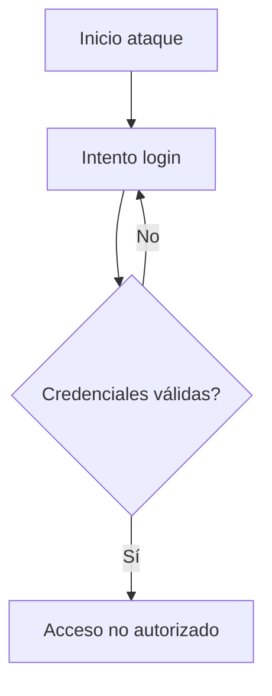

Herramientas comunes:

* Hydra
* Burp Suite Intruder
* Scripts automatizados

---

### 🔹 2.2 Credential Stuffing

Uso de listas filtradas de credenciales robadas.

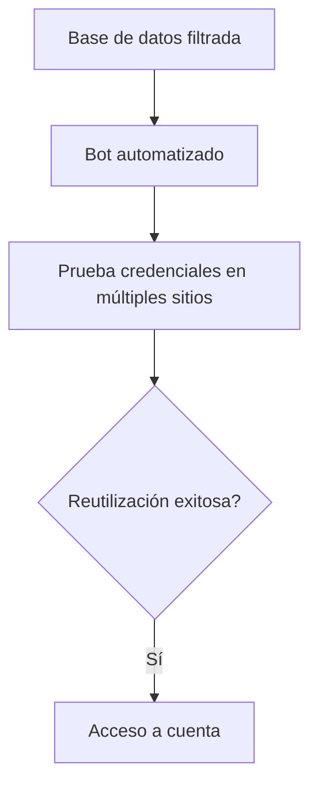

Ejemplo real:

* Exposición de contraseñas en Facebook (2019) – almacenamiento en texto plano.

---

### 🔹 2.3 Password Spraying

Probar una contraseña común contra muchos usuarios.

Ejemplo:

```
Usuario1 → Password1!
Usuario2 → Password1!
Usuario3 → Password1!
```

Muy efectivo cuando no hay bloqueo de cuentas.

---

### 🔹 2.4 Fijación de Sesión

El atacante fuerza un ID de sesión conocido antes del login.

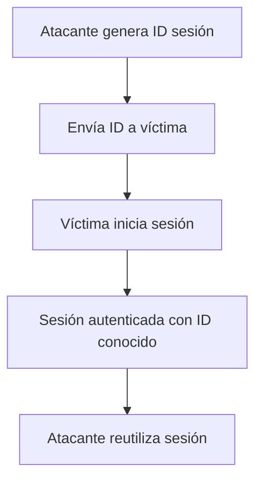

---

### 🔹 2.5 Omitir Autenticación

Errores lógicos que permiten:

* Saltar validaciones
* Manipular parámetros
* Modificar JWT sin validación adecuada

---

### 🔹 2.6 Caso Real – Colonial Pipeline (2021)

Ataque relacionado con credenciales comprometidas en:

Colonial Pipeline

Impacto:

* Ransomware
* Interrupción del suministro de combustible en EE.UU.
* Millonarias pérdidas económicas

---

## 📉 3. Mejores Prácticas de Prevención y Mitigación

### 🔐 3.1 Implementar Autenticación Multifactor (MFA)

* OTP
* Aplicaciones autenticadoras
* Biométricos
* Hardware tokens

Reduce significativamente:

* Credential stuffing
* Fuerza bruta
* Reutilización de contraseñas

---

### 🔑 3.2 Políticas Modernas de Contraseñas

Alineadas con:

NIST SP 800-63B

Recomendaciones:

* Mínimo 8-12 caracteres
* No forzar rotación periódica innecesaria
* Validar contra listas de contraseñas comprometidas
* Permitir uso de password managers

---

### 🚫 3.3 Protección contra Ataques Automatizados

* Rate limiting
* Backoff progresivo
* Bloqueo temporal de cuenta
* CAPTCHA
* Monitoreo de IP sospechosas

---

### 🔒 3.4 Protección Segura de Contraseñas

* Hash con bcrypt o Argon2
* Salt único por usuario
* Nunca almacenar en texto plano

---

### 🔁 3.5 Gestión Segura de Sesiones

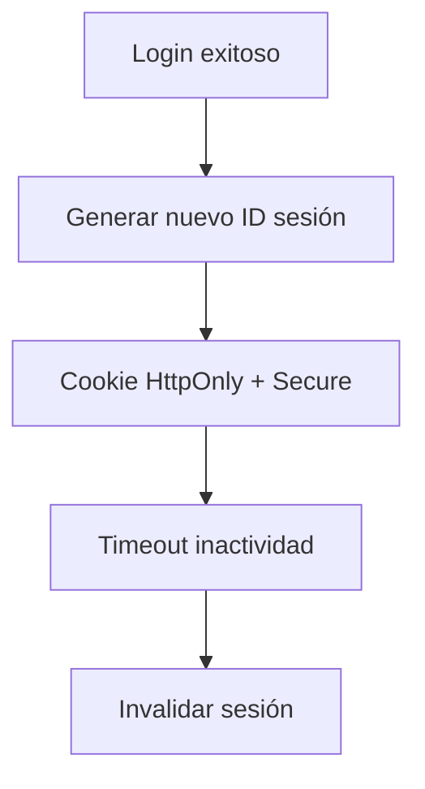

Buenas prácticas:

* No incluir ID en URL
* Invalidar sesiones en logout
* Regenerar sesión tras login
* Configurar tiempos de expiración

---

### 🌐 3.6 Comunicación Segura

* TLS obligatorio
* Protección contra MITM
* Validación correcta de certificados

---

### 🧪 3.7 Pruebas de Seguridad

* Pentesting periódico
* Revisión de código
* Simulación de ataques automatizados
* Escaneo de dependencias

---

### 📚 3.8 Educación y Concientización

* Capacitación contra phishing
* Uso de gestores de contraseñas
* Buenas prácticas de higiene digital

---

## 🚫 ¿Qué NO es un fallo de autenticación?

| Caso                              | Clasificación Correcta |
| --------------------------------- | ---------------------- |
| Usuario ve datos que no debería   | Fallo de autorización  |
| Phishing externo                  | Robo de credenciales   |
| Servidor caído                    | Fallo operativo        |
| Usuario escribe mal la contraseña | Error humano           |

---

## 🏁 Conclusión

Los **Fallos de Autenticación (A07)** siguen siendo una de las vulnerabilidades más críticas del Top 10 de OWASP.

En un mundo donde:

* Las aplicaciones usan APIs
* Existe SSO
* Se manejan tokens JWT
* Los servicios están en la nube

La complejidad aumenta y también el riesgo.

Una autenticación débil puede permitir:

* Secuestro de cuentas
* Ransomware
* Exfiltración de datos
* Daño reputacional severo

🔐 La autenticación no es solo un login.
Es la base de toda la seguridad del sistema.

---

#  A08 – Software or Data Integrity Failures (Fallos de integridad de software o datos)


### ¿Qué es?
Ocurre cuando el sistema **confía en software, actualizaciones, dependencias, datos o pipelines** sin verificar su integridad.  
Ejemplo: instalar paquetes sin verificación, actualizaciones no firmadas, CI/CD sin controles, o cargar datos/artefactos manipulados.

### ¿Cómo se ve en un proyecto real? (Ejemplos comunes)
- Dependencias descargadas sin control (sin lockfile, sin hash, sin firma).
- Actualizaciones automáticas desde fuentes no confiables.
- Artefactos de CI/CD sin validación o sin control de quién los publica.
- Scripts que descargan ejecutables “de internet” sin verificación.
- Modelos, archivos o data importada que puede ser alterada (supply chain).

### Impacto
- Supply chain attacks: una dependencia comprometida puede ejecutar código malicioso.
- Alteración de artefactos (builds) o datos críticos sin detección.
- Pérdida de confianza del sistema y posible control total por atacante.

### Buenas prácticas / mitigación
- Usar **lockfiles** (ej: `package-lock.json`, `poetry.lock`, `Pipfile.lock`).
- Verificar integridad (hashes / firmas) en dependencias o artefactos.
- Repositorios privados / proxies confiables para paquetes si aplica.
- CI/CD con permisos mínimos, revisiones obligatorias y firmas de artefactos.
- Auditoría de dependencias (SCA) y actualizaciones controladas.
- Controlar quién puede publicar releases y configurar “branch protection”.

### Evidencia en este trabajo
- Se mantuvieron dependencias fijadas con lockfile.
- Se revisaron vulnerabilidades de dependencias (SCA).
- Se propusieron controles en pipeline (revisión, permisos, validación).


