## Integrantes

| # | Nombre |
|---|--------|
| 1 | Roberto Carlos Muñoz |
| 2 | Carlos Alberto Gonzalez |
| 3 | Diego Armando Hernandez |
| 4 | Daniel Mauricio Daza Borja |


# Análisis de Vulnerabilidades en el OWASP Top 10: Métodos de Explotación y Prevención

## Introducción

El **OWASP Top 10** es un documento de referencia publicado por la organización internacional **OWASP (Open Web Application Security Project)**, que identifica las **10 vulnerabilidades más críticas en aplicaciones web** a nivel mundial.

La edición 2025 representa una actualización basada en:

* Datos reales recopilados de miles de aplicaciones
* Análisis de expertos en ciberseguridad
* Tendencias actuales de ataques
* Cambios en arquitecturas modernas (APIs, microservicios, cloud, DevSecOps)

---

## ¿Por qué es importante?

El OWASP Top 10:

* Sirve como estándar global de referencia en seguridad web
* Es utilizado en auditorías, pentesting y cumplimiento normativo
* Orienta a desarrolladores sobre los riesgos más críticos
* Ayuda a priorizar controles de seguridad

---

## Enfoque de la edición 2025

La versión 2025 enfatiza especialmente:

* Fallas en control de acceso
* Problemas en mecanismos de autenticación
* Seguridad en APIs
* Gestión de identidades y tokens
* Riesgos en entornos cloud y DevSecOps

---

## Objetivo principal

El propósito del OWASP Top 10 no es solo listar vulnerabilidades, sino **crear conciencia y promover mejores prácticas de seguridad desde el diseño hasta la implementación y operación de las aplicaciones.**

## Lista del TOP 10 - 2025

1. [A01 - Broken Access Control](https://github.com/jaiderospina/DevSecOps2026/blob/main/OWASP/GRUPO%20X/readme.md#a01-broken-access-control-control-de-acceso-roto)
2. [A02 - Security Misconfiguration](https://github.com/jaiderospina/DevSecOps2026/blob/main/OWASP/GRUPO%20X/readme.md#a02--security-misconfiguration-mala-configuraci%C3%B3n-de-seguridad)
3. [A03 - Software Supply Chain Failures](https://github.com/jaiderospina/DevSecOps2026/blob/main/OWASP/GRUPO%20X/readme.md#a03-software-supply-chain-failures)
4. [A04 - Cryptographic Failures](https://github.com/jaiderospina/DevSecOps2026/blob/main/OWASP/GRUPO%20X/readme.md#a04-cryptographic-failures)
5. [A05 - Injection](https://github.com/jaiderospina/DevSecOps2026/blob/main/OWASP/GRUPO%20X/readme.md#a05-injection-inyecci%C3%B3n)
6. [A06 - Insecure Design](https://github.com/jaiderospina/DevSecOps2026/blob/main/OWASP/GRUPO%20X/readme.md#a06-insecure-design-dise%C3%B1o-inseguro)
7. [A07 - Authentication Failures](https://github.com/jaiderospina/DevSecOps2026/blob/main/OWASP/GRUPO%20X/readme.md#a07-authentication-failures-fallos-de-autenticaci%C3%B3n)
8. [A08 - Software or Data Integrity Failures](https://github.com/jaiderospina/DevSecOps2026/blob/main/OWASP/GRUPO%20X/readme.md#a08--software-or-data-integrity-failures-fallos-de-integridad-de-software-o-datos)
9. [A09 - Security Logging and Alerting Failures](https://github.com/jaiderospina/DevSecOps2026/blob/main/OWASP/GRUPO%20X/readme.md#a09-security-logging--alerting-failures-fallos-en-el-registro-y-las-alertas-de-seguridad)
10. [A10 - Mishandling of Exceptional Conditions](https://github.com/jaiderospina/DevSecOps2026/blob/main/OWASP/GRUPO%20X/readme.md#a10-mishandling-of-exceptional-conditions)
    
---

# A01: Broken Access Control (Control de Acceso Roto)

## 1. Descripción de la Vulnerabilidad

El **A01: Broken Access Control** del OWASP Top 10 se refiere a las fallas en los mecanismos de autorización que permiten que un usuario realice acciones o acceda a recursos para los que no tiene permisos. 


El control de acceso define:

* Quién puede acceder
* A qué recursos puede acceder
* Qué acciones puede realizar

Cuando estas reglas no se aplican correctamente en el **lado del servidor**, se produce un **Broken Access Control**.

### Naturaleza del Problema

Ocurre cuando:

* No se aplica el principio de mínimo privilegio
* No existe “deny by default”
* Se confía en validaciones del frontend
* No se valida la propiedad del recurso
* Se exponen identificadores directos (IDOR)
* Hay mala configuración CORS
* Se manipulan tokens JWT
* No se protegen endpoints POST/PUT/DELETE
* Se permite navegación forzada

---

### Impacto Potencial

* Exposición de datos sensibles
* Modificación o eliminación de datos
* Escalada de privilegios (horizontal o vertical)
* Compromiso total del sistema
* Violaciones regulatorias (RGPD, etc.)
* Pérdida financiera
* Daño reputacional
* Interrupción operativa

OWASP indica que el 100% de las aplicaciones analizadas presentaban algún tipo de fallo de control de acceso.

---

### Diagrama de Flujo

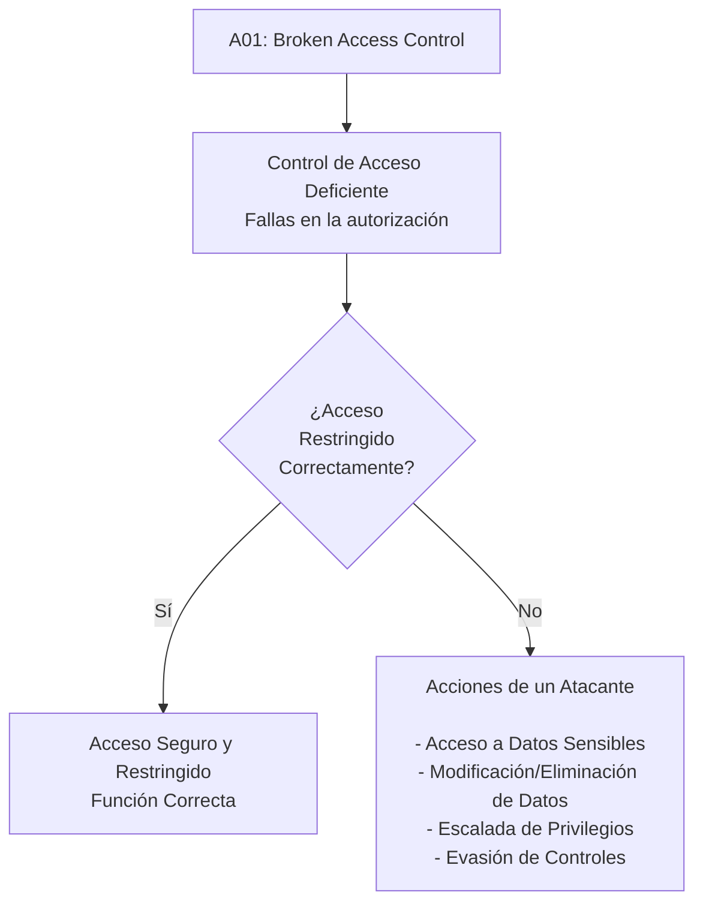
----------

## 2. Métodos de Explotación

Los atacantes aprovechan estas fallas mediante distintas técnicas:

### Manipulación de URL y Parámetros (IDOR)

Consiste en modificar identificadores en la URL o en los parámetros de una petición para acceder a recursos de otros usuarios.

**Ejemplo cambio ID en la URL:**

Solicitud legítima:

```
GET https://app.com/profile?userId=1001

```

El atacante modifica el ID:

```
GET https://app.com/profile?userId=1002

```

Si el backend no valida la propiedad del recurso, devolverá datos del usuario 1002.

----------

### Diagrama Vulnerable

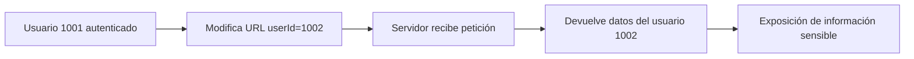

**Ejemplo descarga de archivos:**

Solicitud original:

```
GET /download?file=invoice_1001.pdf

```

Ataque:

```
GET /download?file=invoice_1002.pdf

```

Si no hay validación → descarga de factura de otro usuario.

----------

### Diagrama Secuencia

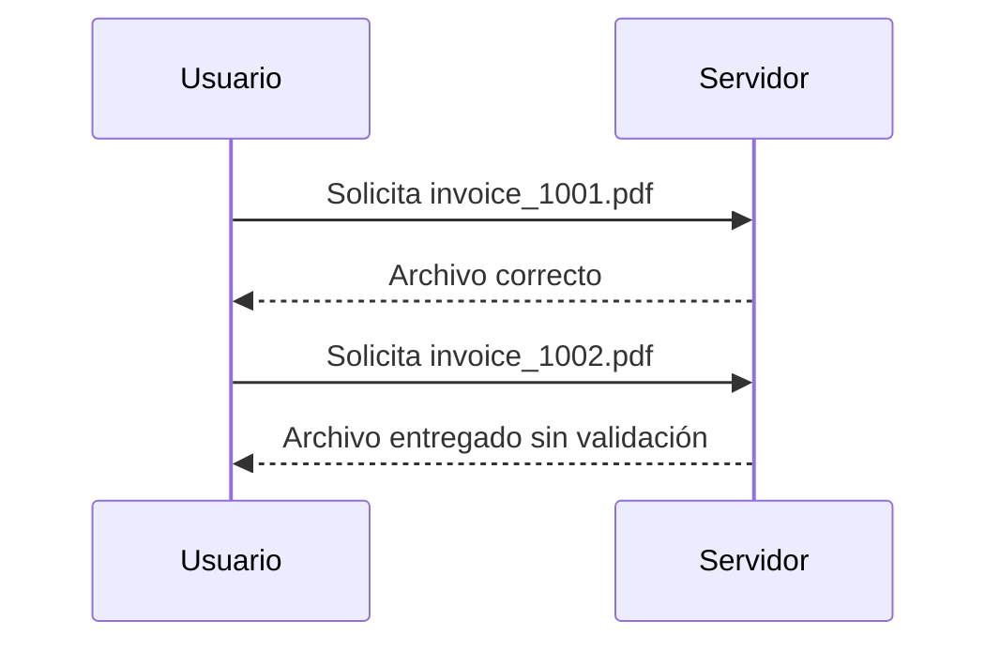

----------

### Force Browsing (Navegación Forzada)

### Escenario

Un atacante intenta acceder directamente a rutas administrativas:

```
/admin/listar_mails
/admin/dashboard
/app/admin_getappInfo
```

Aunque el frontend o la interfaz gráfica no muestre estos enlaces, el atacante puede acceder manualmente usando navegador, herramientas o línea de comandos:

```bash
curl https://example.com/app/admin_getappInfo
```

---

### Diagrama de Flujo – Escenario Vulnerable

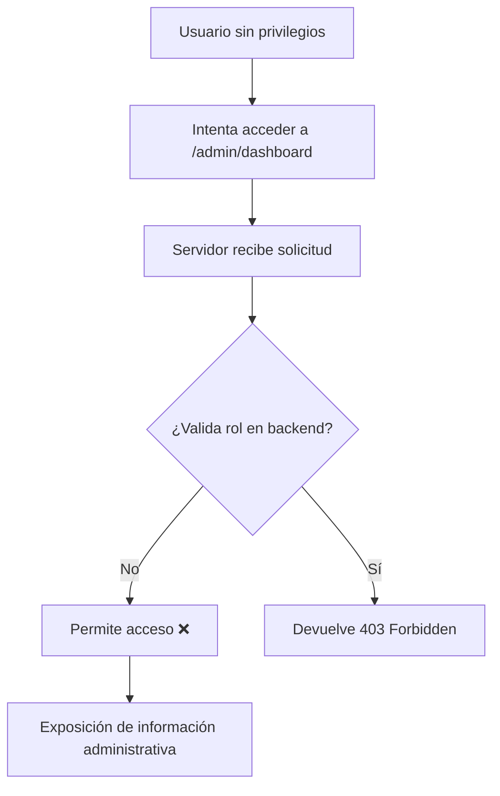

---

### Flujo Detallado del Ataque

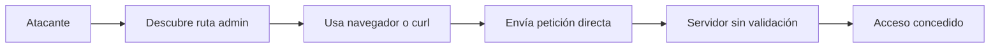

---

### Flujo Seguro (Control Correcto)

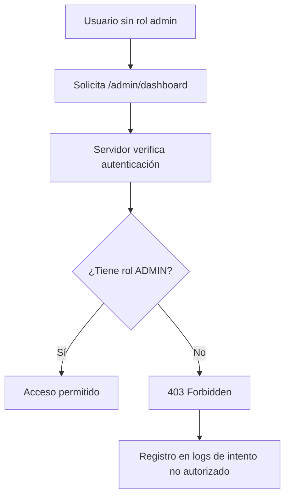

----------

### Manipulación de Tokens y Cookies

### Escenario

Un atacante intenta:

* Alterar un **JWT**
* Modificar cookies
* Cambiar valores ocultos (`isAdmin=false → true`)
* Reutilizar una sesión activa (Session Hijacking)

Si el servidor **no valida la firma del token ni los privilegios reales en backend**, se produce **escalación de privilegios**.

---

### Flujo Vulnerable – Escalación de Privilegios


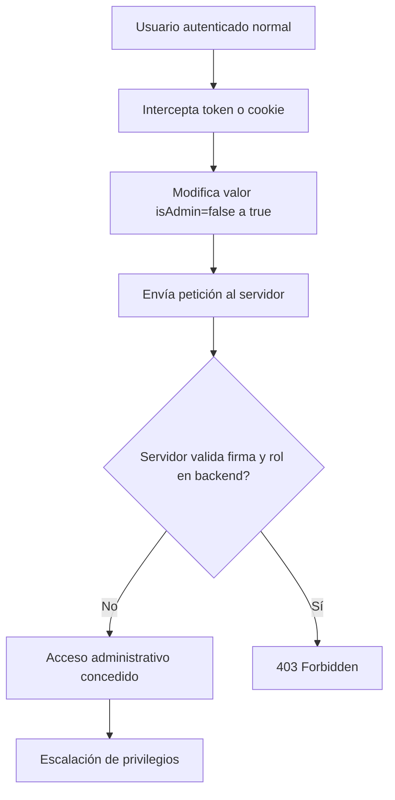

---

### Flujo Específico – Manipulación de JWT

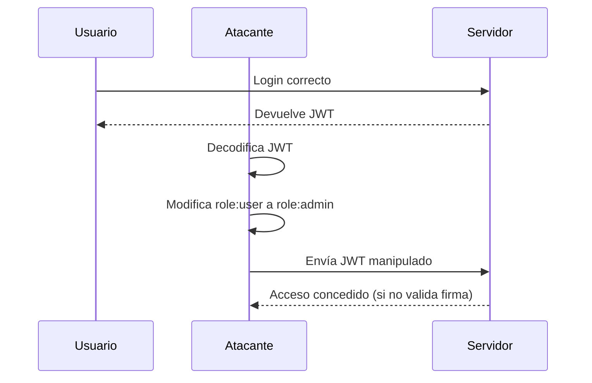

---

### Flujo Seguro – Validación Correcta

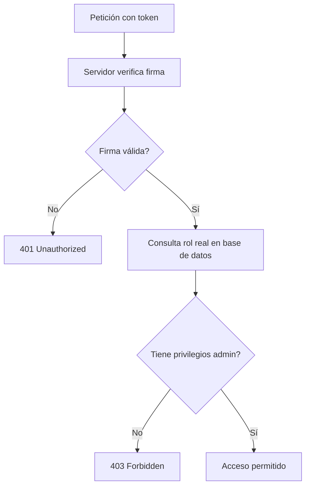

----------

## Herramientas Comunes Utilizadas

-   **[Burp Suite Professional](https://www.google.com/search?q=Burp+Suite+Professional&oq=Herramientas+Comunes+Utilizadas+para+A01%3A+Broken+Access+Control&gs_lcrp=EgZjaHJvbWUyBggAEEUYOdIBCTc2OTIxajBqN6gCALACAA&sourceid=chrome&ie=UTF-8&mstk=AUtExfATjnT5AHVjJJoehzKWOmL67AiPCf4MNQ3krtoVDaW07zGrlV03ZJhpdQVk4_TTTreg5Ln8P5gr51X6D5Af3AMt-4kTxbqgKXVIC6ksbQnXE60QOJdr-i1lMDdupnHFNZ8kfssE0t3u23M0vURgvYnsjIzeekLNRpAbj0O6kWTniws&csui=3&ved=2ahUKEwjP6v2XzoKTAxWUezABHWxbPQQQgK4QegQIAhAB)/Community**: La herramienta principal para interceptar, analizar y modificar peticiones HTTP/HTTPS (manipulación de parámetros, cookies, JWT) para probar IDOR (Insecure Direct Object Reference) y elevación de privilegios.
-   **[OWASP ZAP](https://www.google.com/search?q=OWASP+ZAP&oq=Herramientas+Comunes+Utilizadas+para+A01%3A+Broken+Access+Control&gs_lcrp=EgZjaHJvbWUyBggAEEUYOdIBCTc2OTIxajBqN6gCALACAA&sourceid=chrome&ie=UTF-8&mstk=AUtExfATjnT5AHVjJJoehzKWOmL67AiPCf4MNQ3krtoVDaW07zGrlV03ZJhpdQVk4_TTTreg5Ln8P5gr51X6D5Af3AMt-4kTxbqgKXVIC6ksbQnXE60QOJdr-i1lMDdupnHFNZ8kfssE0t3u23M0vURgvYnsjIzeekLNRpAbj0O6kWTniws&csui=3&ved=2ahUKEwjP6v2XzoKTAxWUezABHWxbPQQQgK4QegQIAhAD)  (Zed Attack Proxy)**: Escáner de seguridad web de código abierto, ideal para encontrar accesos no protegidos y fallos de autorización automatizados.
-   **[FFUF](https://www.google.com/search?q=FFUF&oq=Herramientas+Comunes+Utilizadas+para+A01%3A+Broken+Access+Control&gs_lcrp=EgZjaHJvbWUyBggAEEUYOdIBCTc2OTIxajBqN6gCALACAA&sourceid=chrome&ie=UTF-8&mstk=AUtExfATjnT5AHVjJJoehzKWOmL67AiPCf4MNQ3krtoVDaW07zGrlV03ZJhpdQVk4_TTTreg5Ln8P5gr51X6D5Af3AMt-4kTxbqgKXVIC6ksbQnXE60QOJdr-i1lMDdupnHFNZ8kfssE0t3u23M0vURgvYnsjIzeekLNRpAbj0O6kWTniws&csui=3&ved=2ahUKEwjP6v2XzoKTAxWUezABHWxbPQQQgK4QegQIAhAF)  (Fuzz Faster U Fool)**: Herramienta de  _fuzzing_  web de alto rendimiento utilizada para descubrir directorios ocultos, URLs no autorizadas y endpoints de API.
-   **[Gobuster](https://www.google.com/search?q=Gobuster&oq=Herramientas+Comunes+Utilizadas+para+A01%3A+Broken+Access+Control&gs_lcrp=EgZjaHJvbWUyBggAEEUYOdIBCTc2OTIxajBqN6gCALACAA&sourceid=chrome&ie=UTF-8&mstk=AUtExfATjnT5AHVjJJoehzKWOmL67AiPCf4MNQ3krtoVDaW07zGrlV03ZJhpdQVk4_TTTreg5Ln8P5gr51X6D5Af3AMt-4kTxbqgKXVIC6ksbQnXE60QOJdr-i1lMDdupnHFNZ8kfssE0t3u23M0vURgvYnsjIzeekLNRpAbj0O6kWTniws&csui=3&ved=2ahUKEwjP6v2XzoKTAxWUezABHWxbPQQQgK4QegQIAhAH)**: Utilizada para la fuerza bruta de URIs (directorios y archivos) y subdominios, lo que permite identificar páginas ocultas accesibles sin autenticación.
-   **[JWT Editor (Extensión de Burp)](https://www.google.com/search?q=JWT+Editor+%28Extensi%C3%B3n+de+Burp%29&oq=Herramientas+Comunes+Utilizadas+para+A01%3A+Broken+Access+Control&gs_lcrp=EgZjaHJvbWUyBggAEEUYOdIBCTc2OTIxajBqN6gCALACAA&sourceid=chrome&ie=UTF-8&mstk=AUtExfATjnT5AHVjJJoehzKWOmL67AiPCf4MNQ3krtoVDaW07zGrlV03ZJhpdQVk4_TTTreg5Ln8P5gr51X6D5Af3AMt-4kTxbqgKXVIC6ksbQnXE60QOJdr-i1lMDdupnHFNZ8kfssE0t3u23M0vURgvYnsjIzeekLNRpAbj0O6kWTniws&csui=3&ved=2ahUKEwjP6v2XzoKTAxWUezABHWxbPQQQgK4QegQIAhAJ)**: Fundamental para decodificar, modificar y firmar de nuevo los tokens JWT para probar la manipulación de metadatos.
-   **[Postman](https://www.google.com/search?q=Postman&oq=Herramientas+Comunes+Utilizadas+para+A01%3A+Broken+Access+Control&gs_lcrp=EgZjaHJvbWUyBggAEEUYOdIBCTc2OTIxajBqN6gCALACAA&sourceid=chrome&ie=UTF-8&mstk=AUtExfATjnT5AHVjJJoehzKWOmL67AiPCf4MNQ3krtoVDaW07zGrlV03ZJhpdQVk4_TTTreg5Ln8P5gr51X6D5Af3AMt-4kTxbqgKXVIC6ksbQnXE60QOJdr-i1lMDdupnHFNZ8kfssE0t3u23M0vURgvYnsjIzeekLNRpAbj0O6kWTniws&csui=3&ved=2ahUKEwjP6v2XzoKTAxWUezABHWxbPQQQgK4QegQIAhAL)**: Muy utilizada para probar API endpoints, permitiendo enviar peticiones con diferentes roles de usuario para verificar si un usuario sin privilegios puede ejecutar POST, PUT o DELETE.
-   **[SQLMap](https://www.google.com/search?q=SQLMap&oq=Herramientas+Comunes+Utilizadas+para+A01%3A+Broken+Access+Control&gs_lcrp=EgZjaHJvbWUyBggAEEUYOdIBCTc2OTIxajBqN6gCALACAA&sourceid=chrome&ie=UTF-8&mstk=AUtExfATjnT5AHVjJJoehzKWOmL67AiPCf4MNQ3krtoVDaW07zGrlV03ZJhpdQVk4_TTTreg5Ln8P5gr51X6D5Af3AMt-4kTxbqgKXVIC6ksbQnXE60QOJdr-i1lMDdupnHFNZ8kfssE0t3u23M0vURgvYnsjIzeekLNRpAbj0O6kWTniws&csui=3&ved=2ahUKEwjP6v2XzoKTAxWUezABHWxbPQQQgK4QegQIAhAN)**: Aunque es para SQL Injection, a menudo revela accesos de administrador o fugas de datos que ocurren por controles de acceso defectuosos.
----------
## Ejemplos Reales

**Facebook “View As”:** Un fallo permitió a atacantes acceder a tokens de acceso de otros usuarios por una falla de control de acceso. Esto expuso millones de cuentas.

**Snapchat (2014):**  Hackers explotaron una vulnerabilidad de control de acceso para recopilar una lista de 4.6 millones de nombres de usuario y números de teléfono.

---

## 3. Mejores Prácticas de Prevención y Mitigación

### 3.1 Denegar por Defecto (Deny by Default)

Todo recurso debe estar protegido a menos que sea explícitamente público.

---

### 3.2 Centralizar la Lógica de Autorización

* No dispersar validaciones
* Usar RBAC o ABAC
* Reutilizar módulos de autorización

---

### 3.3 Validar Propiedad del Recurso

No basta validar rol:

```pseudo
if user.id == recurso.owner_id
```

Siempre validar que el usuario sea dueño del objeto.

---

### 3.4 Aplicar Control en el Servidor

Nunca confiar en:

* HTML
* JavaScript
* Campos ocultos

---

### 3.5 Gestión Segura de Tokens y Sesiones

* Invalidar sesiones al logout
* JWT de corta duración
* Validar claims (aud, iss, role)
* Implementar refresh tokens seguros

---

### 3.6 Configuración Segura de CORS

* Definir orígenes específicos
* No usar wildcard en APIs sensibles

---

### 3.7 Implementar Rate Limiting

Reduce:

* Enumeración de IDs
* Automatización de ataques

---

### 3.8 Logging y Monitoreo

Registrar:

* Intentos fallidos
* Accesos denegados
* Escaladas sospechosas

---

### 3.9 Pruebas de Seguridad

* Pentesting
* Pruebas de navegación forzada
* Pruebas IDOR
* SAST y DAST
* Tests unitarios de autorización

---

### 3.10 Aplicar Principio de Mínimo Privilegio

Cada usuario debe tener:

> Solo los permisos estrictamente necesarios

---

## Ejemplo Seguro vs Vulnerable

### Código Vulnerable

```php
if(isset($_SESSION['loggedin'])) {
   cargar_emails();
}
```

No valida rol.

---

### Código Seguro

```php
if(isset($_SESSION['loggedin']) && $_SESSION['isadmin'] == true) {
   cargar_emails();
}
```

Valida autenticación y autorización.

---

## 🏁 Conclusión

**A01 – Broken Access Control** es la vulnerabilidad más crítica del Top 10 de OWASP.

No es un problema superficial.
Es un problema **arquitectónico**.

Requiere:

* Diseño seguro desde el inicio
* Mentalidad “deny by default”
* Validaciones del lado del servidor
* Centralización de la lógica
* Pruebas rigurosas
* Monitoreo continuo

Un control de acceso deficiente puede permitir:

* Robo de información
* Escalada de privilegios
* Manipulación del negocio
* Compromiso total del sistema

La autenticación abre la puerta.
El control de acceso decide hasta dónde puedes llegar.

---

# A02 – Security Misconfiguration (Mala configuración de seguridad)


### ¿Qué es?
Ocurre cuando una aplicación, servidor o servicio está configurado de forma insegura (por ejemplo: credenciales por defecto, permisos abiertos, errores mostrando demasiada información, CORS mal configurado, paneles/admin expuestos, etc.).  
El problema no es “el código” solamente, sino **cómo se desplegó o configuró** el sistema.

### ¿Cómo se ve en un proyecto real? (Ejemplos comunes)
- `DEBUG=True` o modo desarrollo activo en producción.
- Mensajes de error que muestran rutas, versiones o detalles internos (stack trace).
- CORS abierto: permitir `*` sin necesidad.
- Archivos sensibles públicos: `.env`, backups, logs, `/admin` sin controles.
- Permisos muy amplios en roles/usuarios, buckets o carpetas.
- Configuración TLS/HTTPS débil o inexistente.

### Impacto
- Filtración de información sensible (rutas, llaves, versiones, estructura interna).
- Acceso no autorizado a paneles o recursos internos.
- Aumento de superficie de ataque y explotación de fallas encadenadas.

### Buenas prácticas / mitigación
- Desactivar debug en producción (ej: `DEBUG=False`).
- Manejo de errores con páginas genéricas (sin detalles internos).
- Revisar CORS (permitir solo dominios necesarios).
- No exponer `.env` ni secretos; usar variables de entorno y secret managers.
- Aplicar “hardening” del servidor (headers, TLS, permisos, firewall).
- Revisiones por checklist antes de desplegar (pre-deploy).

### Evidencia en este trabajo
- Se revisó configuración de entorno (dev vs prod).
- Se verificó que no se expongan errores con detalles sensibles.
- Se limitó el acceso a recursos sensibles y se controlaron permisos.

---

# A03 Software Supply Chain Failures

## Introducción

La vulnerabilidad **A03:2025 – Software Supply Chain Failures** del **OWASP** describe los riesgos de seguridad que ocurren cuando una aplicación depende de **componentes externos inseguros o comprometidos** dentro de su cadena de suministro de software.

El software moderno rara vez se desarrolla completamente desde cero. En cambio, depende de:

* Bibliotecas de código abierto
* Frameworks de terceros
* Gestores de paquetes
* Servicios en la nube
* Pipelines de CI/CD
* Contenedores e imágenes base

Si **cualquiera de estos elementos es comprometido**, toda la aplicación puede verse afectada.

Este tipo de ataques se ha vuelto crítico debido a su **alto impacto**, ya que una única dependencia vulnerable puede afectar **miles de organizaciones simultáneamente**.

---

# 1. Descripción de la Vulnerabilidad

### ¿Qué es una falla en la cadena de suministro de software?

Una **falla en la cadena de suministro** ocurre cuando una vulnerabilidad o código malicioso entra al sistema **a través de componentes externos**, en lugar del código propio de la aplicación.

En términos simples:

```
Confías en un componente externo
        ↓
El componente es comprometido
        ↓
Tu aplicación también queda comprometida
```

---

### Causas comunes

Las fallas en la cadena de suministro suelen ocurrir cuando:

* No se controlan las versiones de dependencias
* Se usan bibliotecas obsoletas o sin mantenimiento
* No se monitorean vulnerabilidades en dependencias
* Se descargan componentes de fuentes no confiables
* La seguridad del pipeline CI/CD es débil
* No se implementa control de cambios
* No existe un inventario de dependencias

---

### Componentes de la cadena de suministro

```
Desarrollador
     │
     ▼
Repositorio de código
     │
     ▼
Dependencias externas
     │
     ▼
Pipeline CI/CD
     │
     ▼
Compilación y artefactos
     │
     ▼
Aplicación desplegada
```

Cualquier punto del proceso puede ser comprometido.

---

### Impacto potencial

Las consecuencias pueden ser críticas:

* Ejecución remota de código
* Robo de credenciales
* Instalación de malware
* Ransomware
* Puertas traseras persistentes
* Compromiso masivo de organizaciones

Un solo componente comprometido puede afectar **miles de aplicaciones simultáneamente**.

---

# 2. Métodos de Explotación

Los atacantes generalmente **no atacan directamente la aplicación**, sino los **componentes de los que depende**.

---

### Flujo general de un ataque de cadena de suministro

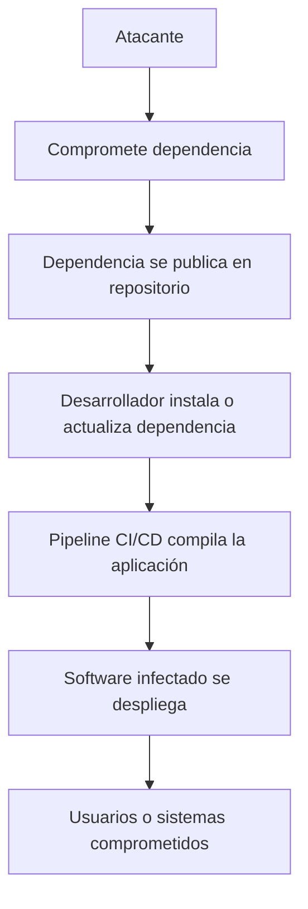

---

## Técnicas comunes de ataque

### 1. Dependencias comprometidas

Los atacantes insertan código malicioso en bibliotecas populares.

Ejemplo real:

* Vulnerabilidad **CVE-2021-44228** conocida como **Log4Shell**

Impacto:

* Ejecución remota de código
* Compromiso masivo de servidores

---

### 2. Dependency Confusion

El atacante publica un paquete con el mismo nombre que una biblioteca interna.

### Flujo de ataque

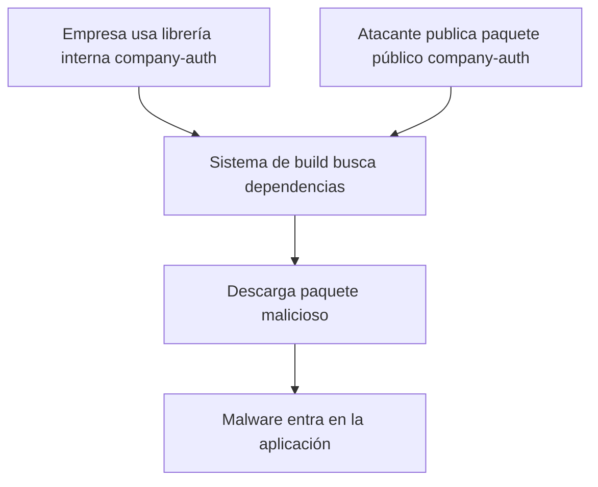

---

### 3. Typosquatting

El atacante crea paquetes con nombres similares.

Ejemplo:

```
requests  ← paquete legítimo
reqeusts  ← paquete malicioso
```

Cuando el desarrollador comete un error tipográfico, instala malware.

---

### 4. Pipeline CI/CD comprometido

Si el atacante obtiene acceso al servidor de compilación:

```
Atacante accede al CI/CD
        ↓
Modifica el proceso de build
        ↓
Inserta código malicioso
        ↓
El software final se distribuye infectado
```

---

### 5. Extensiones o herramientas maliciosas

Ejemplos:

* extensiones de IDE
* plugins
* imágenes de contenedor

Estas herramientas pueden robar:

* tokens
* claves API
* credenciales

---

## Ejemplos de ataques reales

### Ataque SolarWinds

Uno de los ataques más graves de la historia.

* los atacantes comprometieron el sistema de compilación
* insertaron malware en actualizaciones firmadas

Resultado:

* más de **18.000 organizaciones comprometidas**

---

### Vulnerabilidad Log4Shell

Una vulnerabilidad crítica en la biblioteca **Log4j**.

Impacto:

* ejecución remota de código
* ataques de ransomware
* criptominería

Muchas organizaciones **ni siquiera sabían que usaban Log4j** debido a dependencias transitivas.

---

### Gusano npm Shai-Hulud (2025)

Ataque autopropagable que:

* infectaba paquetes npm
* robaba tokens
* publicaba nuevas versiones maliciosas automáticamente

---

## 3. Mejores Prácticas de Prevención y Mitigación

La seguridad de la cadena de suministro requiere **múltiples capas de protección**.

---

### Flujo de seguridad recomendado

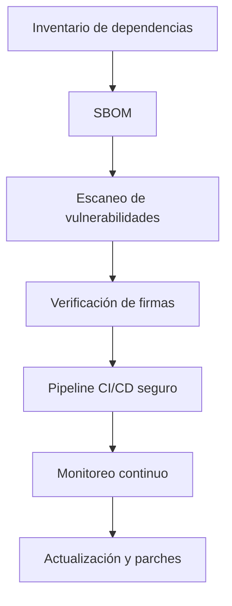

---

### 1. Mantener una SBOM (Software Bill of Materials)

Una **SBOM** es una lista completa de todos los componentes del software.

Debe incluir:

* dependencias directas
* dependencias transitivas
* versiones
* fuentes

Herramientas:

* CycloneDX
* SPDX

---

### 2. Escaneo continuo de dependencias

Automatizar la detección de vulnerabilidades.

Herramientas recomendadas:

* OWASP Dependency-Check
* Snyk
* Dependabot
* Trivy

---

### 3. Usar fuentes confiables

Buenas prácticas:

* descargar solo de repositorios oficiales
* verificar firmas digitales
* verificar hashes

---

### 4. Seguridad en CI/CD

Medidas importantes:

* habilitar MFA
* restringir accesos
* separar roles de desarrollo y despliegue
* firmar artefactos de compilación
* registrar logs inmutables

---

### 5. Aplicar principio de mínimo privilegio

Ningún sistema o usuario debe tener más permisos de los necesarios.

Esto aplica a:

* desarrolladores
* pipelines
* repositorios
* servidores

---

### 6. Gestión de parches

Las organizaciones deben:

* monitorear CVE
* actualizar dependencias regularmente
* eliminar bibliotecas sin mantenimiento

---

### 7. Implementaciones seguras

Evitar desplegar actualizaciones en todos los sistemas al mismo tiempo.

Utilizar:

* despliegues canarios
* despliegues por etapas

Esto limita el impacto si un componente está comprometido.

---

## Conclusión

Las **Software Supply Chain Failures** representan uno de los riesgos más críticos en la seguridad moderna.

El software actual depende fuertemente de:

* código abierto
* servicios externos
* automatización
* herramientas de desarrollo

Esto amplía significativamente la superficie de ataque.

Por ello, proteger la cadena de suministro requiere:

* inventario completo de dependencias
* verificación de integridad
* seguridad en CI/CD
* monitoreo continuo
* adopción de principios de **Zero Trust**

Las organizaciones que implementan estas prácticas reducen significativamente la probabilidad de sufrir **ataques a gran escala**.

---

# A04: Cryptographic Failures

## 1. Descripción

Las **Cryptographic Failures** ocurren cuando una aplicación **no protege correctamente la información sensible mediante criptografía**.

Esto puede exponer datos como:

- contraseñas
- datos personales
- tarjetas de crédito
- tokens de autenticación

### Causas comunes

- Uso de **HTTP en lugar de HTTPS**
- Contraseñas guardadas **en texto plano**
- Algoritmos débiles (**MD5, SHA1, DES**)
- Mala gestión de **claves criptográficas**
- Datos sensibles sin cifrar en bases de datos

---

## 2. Flujo de la vulnerabilidad

```mermaid
flowchart TD
A[Usuario envía datos] --> B{¿Datos cifrados?}
B -->|No| C[Datos en texto plano]
C --> D[Atacante intercepta]
D --> E[Exposición de datos]
B -->|Sí| F[Datos protegidos]
````
---

# 3. Métodos de explotación

### 1. Man-in-the-Middle (MITM)

El atacante intercepta la comunicación si se usa **HTTP**.

```mermaid
flowchart LR
U[Usuario] --> A[Atacante]
A --> S[Servidor]
A --> D[Roba credenciales]
```

Herramientas usadas:

* Wireshark
* Burp Suite
* MITMProxy

---

### 2. Cracking de hashes débiles

Si se usan hashes como **MD5**, pueden romperse fácilmente.

Herramientas:

* Hashcat
* John the Ripper

Ejemplo:

```
MD5("password") = 5f4dcc3b5aa765d61d8327deb882cf99
```
---

### 3. Robo de base de datos

Si la base de datos guarda datos sin cifrar, un atacante puede robar:

* contraseñas
* información personal
* tarjetas de crédito

---

# 4. Prevención y mitigación

### 1. Usar HTTPS

Implementar:

```
TLS 1.2 o TLS 1.3
HSTS
```
---

### 2. Usar criptografía fuerte

Recomendado:

```
AES-256
SHA-256
RSA-2048
```

Evitar:

```
MD5
SHA1
DES
```
---

### 3. Hash seguro de contraseñas

Usar:

```
bcrypt
Argon2
PBKDF2
```
Nunca guardar contraseñas en texto plano.

---

### 4. Gestión segura de claves

No guardar claves en:

* código fuente
* repositorios públicos

Usar gestores de secretos como:

* Vault
* AWS Secrets Manager

---

# 5. Conclusión

Las **Cryptographic Failures** permiten que atacantes accedan a información sensible.
El uso correcto de **HTTPS, cifrado fuerte y gestión segura de claves** reduce significativamente este riesgo.

---

# A05: Injection (Inyección)
Ejecución de comandos maliciosos por datos no validados → ⚠ CRÍTICO


## Descripción de la Vulnerabilidad

### ¿Qué es?

Ocurre cuando datos no confiables son enviados a un intérprete como parte de un comando o consulta. El atacante puede engañar al interprete para que ejecute comandos no intencionados o acceda a datos sin autorización.


### ¿Cómo funciona?

El input del usuario se concatena directamente en queries SQL, comandos OS, LDAP o expresiones XPath sin sanitización. El payload malicioso manipula la lógica del interprete para ejecutar acciones no autorizadas.

### Causas

- Falta de validación y sanitización de entradas de usuario

- Uso de consultas dinámicas concatenadas sin parametrización

- Dependencias desactualizadas con vulnerabilidades conocidas

- Ausencia del principio de mínimo privilegio en cuentas de BD

### Impacto

- Robo masivo y exfiltración de datos confidenciales

- Bypass de autenticación y autorización

- Remote Code Execution (RCE) → control total del servidor

- Escalamiento de privilegios y destrucción de información

### Tipos de Inyección

> *SQL Injection · NoSQL Injection (MongoDB \$where) · OS Command Injection · LDAP Injection · Server-Side Template Injection (SSTI) · Log4Shell (JNDI via strings de log)*

 

## Métodos de Explotación

### ¿Cómo la explotan los atacantes?

- Manipulación de parámetros HTTP, cabeceras y cookies

- Inputs en formularios de login, búsqueda o registro

- Inyección en APIs REST/GraphQL sin validación de entrada

- Variables de entorno en contenedores y scripts de IaC

### Ejemplos Reales

<table style="width:67%;">
<colgroup>
<col style="width: 29%" />
<col style="width: 56%" />
</colgroup>
<thead>
<tr>
<th><h3 id="caso-año">Caso / Año</h3></th>
<th><h3 id="impacto-1">Impacto</h3></th>
</tr>
</thead>
<tbody>
<tr>
<td><h4 id="equifax-2017">Equifax (2017)</h3></td>
<td><h4 id="sqli-147m-registros-robados">SQLi → 147M registros robados</h3></td>
</tr>
<tr>
<td><h4 id="log4shell-2021">Log4Shell (2021)</h3></td>
<td><h4 id="jndi-injection-rce-masivo-en-infraestructura-cloud-global">JNDI injection → RCE masivo en infraestructura Cloud global</h3></td>
</tr>
<tr>
<td><h4 id="capital-one-2019">Capital One (2019)</h3></td>
<td><h4 id="ssrf-os-command-injection-en-aws-100m-clientes-expuestos">SSRF + OS Command Injection en AWS → 100M+ clientes expuestos</h3></td>
</tr>
<tr>
<td><h4 id="heartland-2008">Heartland (2008)</h3></td>
<td><h4 id="sql-injection-en-producción-130-millones-de-tarjetas-robadas">SQL Injection en producción → 130 millones de tarjetas robadas</h3></td>
</tr>
</tbody>
</table>

### 

### Herramientas Comunes del Atacante

|  SQLMap   | Burp Suite | Metasploit | Havij  |
|:---------:|:----------:|:----------:|:------:|
| OWASP ZAP |  NoSQLMap  |   commix   | nuclei |

### Código Vulnerable vs. Seguro

> ' -- VULNERABLE: SQL Injection clásico query = "SELECT \* FROM users WHERE name='" + userInput + "'" -- Payload: ' OR '1'='1' -- -- Resultado: acceso a TODA la tabla //
>
>  VULNERABLE: OS Command Injection exec("git clone " + repoUrl) // repoUrl = "repo; rm -rf /"

## Prevención y Mitigación

- Usar consultas parametrizadas / prepared statements en TODAS las operaciones de BD

- Implementar ORMs seguros (Hibernate, SQLAlchemy) que abstraigan la construcción de queries

- Validar y sanitizar todo input con allowlists estrictas (NUNCA blacklists)

- Aplicar principio de mínimo privilegio en cuentas de base de datos

- Integrar SAST/DAST en pipelines CI/CD (Semgrep, Checkmarx, SonarQube)

- Usar WAF con reglas anti-inyección en Cloud (AWS WAF, Cloudflare, ModSecurity)

## Buenas Prácticas DevSecOps

- Shift-Left Security: integrar pruebas de seguridad desde el primer commit

- Separar datos de comandos: nunca concatenar input del usuario en consultas

- Revisiones de código automáticas (SAST): bloquear Código vulnerable antes del merge

- Análisis de composición de software (SCA): detectar librerías con CVEs conocidas

- Escaneo de IaC: validar Terraform/CloudFormation con Checkov/tfsec

  

## Configuraciones Recomendadas

<table style="width:67%;">
<colgroup>
<col style="width: 29%" />
<col style="width: 56%" />
</colgroup>
<thead>
<tr>
<th><h3 id="área">Área</h2></th>
<th><h3 id="configuración">Configuración</h2></th>
</tr>
</thead>
<tbody>
<tr>
<td><h4 id="cicd-pipeline">CI/CD Pipeline</h2></td>
<td><h4 id="semgrep-con-ruleset-powasp-top-ten.-bloqueo-automático-ante-hallazgos-críticos">Semgrep con ruleset p/owasp-top-ten. Bloqueo automático ante hallazgos críticos</h2></td>
</tr>
<tr>
<td><h4 id="waf-cloud">WAF Cloud</h2></td>
<td><h4 id="aws-waf-con-awsmanagedrulescommonruleset-en-modo-prevention-activo">AWS WAF con AWSManagedRulesCommonRuleSet en modo Prevention activo</h2></td>
</tr>
<tr>
<td><h4 id="base-de-datos">Base de Datos</h2></td>
<td><h4 id="usuarios-con-permisos-mínimos.-disable-xp_cmdshell-en-mssql.-timeouts-de-consulta">Usuarios con permisos mínimos. Disable xp_cmdshell en MSSQL. Timeouts de consulta</h2></td>
</tr>
<tr>
<td><h4 id="secrets-manager">Secrets Manager</h2></td>
<td><h4 id="variables-sensibles-en-aws-secrets-manager-hashicorp-vault-nunca-hardcodeadas">Variables sensibles en AWS Secrets Manager / HashiCorp Vault, nunca hardcodeadas</h2></td>
</tr>
</tbody>
</table>

## 

## Controles de Seguridad

<table style="width:67%;">
<colgroup>
<col style="width: 29%" />
<col style="width: 15%" />
<col style="width: 27%" />
<col style="width: 14%" />
</colgroup>
<thead>
<tr>
<th><h3 id="control">Control</h2></th>
<th><h3 id="tipo">Tipo</h2></th>
<th><h3 id="herramienta">Herramienta</h2></th>
<th><h3 id="prioridad">Prioridad</h2></th>
</tr>
</thead>
<tbody>
<tr>
<td><h4 id="prepared-statements-orm">Prepared Statements / ORM</h2></td>
<td><h4 id="preventivo">Preventivo</h2></td>
<td><h4 id="hibernate-sqlalchemy">Hibernate, SQLAlchemy</h2></td>
<td><h4 id="crítico">CRÍTICO</h2></td>
</tr>
<tr>
<td><h4 id="sast-en-pipeline-cicd">SAST en pipeline CI/CD</h2></td>
<td><h4 id="detectivo">Detectivo</h2></td>
<td><h4 id="semgrep-sonarqube">Semgrep, SonarQube</h2></td>
<td><h4 id="crítico-1">CRÍTICO</h2></td>
</tr>
<tr>
<td><h4 id="waf-con-reglas-owasp">WAF con reglas OWASP</h2></td>
<td><h4 id="preventivo-1">Preventivo</h2></td>
<td><h4 id="aws-waf-modsecurity">AWS WAF, ModSecurity</h2></td>
<td><h4 id="alto">ALTO</h2></td>
</tr>
<tr>
<td><h4 id="dast-en-staging">DAST en staging</h2></td>
<td><h4 id="detectivo-1">Detectivo</h2></td>
<td><h4 id="owasp-zap-burp-suite">OWASP ZAP, Burp Suite</h2></td>
<td><h4 id="alto-1">ALTO</h2></td>
</tr>
<tr>
<td><h4 id="input-validation-library">Input Validation Library</h2></td>
<td><h4 id="preventivo-2">Preventivo</h2></td>
<td><h4 id="esapi-validator.js">ESAPI, Validator.js</h2></td>
<td><h4 id="alto-2">ALTO</h2></td>
</tr>
<tr>
<td><h4 id="mínimo-privilegio-en-bd">Mínimo privilegio en BD</h2></td>
<td><h4 id="preventivo-3">Preventivo</h2></td>
<td><h4 id="iam-roles-db-users">IAM Roles, DB Users</h2></td>
<td><h4 id="medio">MEDIO</h2></td>
</tr>
</tbody>
</table>

## 

---

# A06 Insecure Design (Diseño Inseguro)
Fallas estructurales de arquitectura desde el origen → ⚠ ALTO


## Descripción de la Vulnerabilidad

### ¿Qué es?

Falla estructural: la arquitectura del sistema no contempla amenazas ni requisitos de seguridad desde el inicio. A diferencia de otras vulnerabilidades, NO puede corregirse con una buena implementación: si el diseño es defectuoso, el sistema es inseguro por naturaleza.


### ¿Cómo funciona?

El atacante aprovecha flujos lógicos incorrectos, ausencia de controles de negocio o arquitecturas sin defensa en profundidad para ejecutar acciones no autorizadas SIN vulnerar técnicamente el sistema.

### Causas

- Ausencia de Threat Modeling en la fase de diseño del producto

- Sin Security by Design ni Security by Default como principios base

- Requisitos de seguridad no definidos desde el inicio del proyecto

- Deuda técnica acumulada y falta de revisiones de arquitectura

### Impacto

- Vulnerabilidades sistémicas difíciles de corregir

- Bypass de lógica de negocio a gran escala

- Exposición masiva de datos

- Fraudes en plataformas Cloud con impacto financiero severo


## Métodos de Explotación

### Vectores de Ataque

- Business Logic Bypass: saltar pasos de un flujo de pago o aprobación

- Mass Assignment: modificar campos protegidos en APIs REST sin controles de atributo

- IDOR: acceder a recursos de otros usuarios manipulando IDs secuenciales

- Account Enumeration: fuerza bruta sin rate limiting ni bloqueo de cuenta

- Privilege Escalation: arquitectura sin separación efectiva de roles de usuario

### Ejemplos Reales

<table style="width:79%;">
<colgroup>
<col style="width: 15%" />
<col style="width: 63%" />
</colgroup>
<thead>
<tr>
<th><h3 id="caso-año-1">Caso / Año</h3></th>
<th><h3 id="falla-de-diseño-e-impacto">Falla de diseño e Impacto</h3></th>
</tr>
</thead>
<tbody>
<tr>
<td><h4 id="twitter-2020">Twitter (2020)</h3></td>
<td><h4 id="herramienta-interna-sin-controles-de-acceso-130-cuentas-vip-comprometidas">Herramienta interna sin controles de acceso → 130 cuentas VIP comprometidas</h3></td>
</tr>
<tr>
<td><h4 id="peloton-2021">Peloton (2021)</h3></td>
<td><h4 id="api-sin-autenticación-requerida-datos-de-millones-de-usuarios-expuestos">API sin autenticación requerida → datos de millones de usuarios expuestos</h3></td>
</tr>
<tr>
<td><h4 id="parler-2021">Parler (2021)</h3></td>
<td><h4 id="api-sin-rate-limit-ni-orden-de-recursos-scraping-de-70tb-de-datos">API sin rate limit ni orden de recursos → scraping de 70TB de datos</h3></td>
</tr>
<tr>
<td><h4 id="facebook-2018">Facebook (2018)</h3></td>
<td><h4 id="oauth-mal-diseñado-sin-validación-de-estado-50-millones-de-tokens-robados">OAuth mal diseñado sin validación de estado → 50 millones de tokens robados</h3></td>
</tr>
</tbody>
</table>

### 

## Prevención y Mitigación

- Integrar Threat Modeling (STRIDE, PASTA) en fases de diseño de cada sprint

- Definir Secure Design Patterns y arquitecturas de referencia documentadas

- Aplicar Defense in Depth: múltiples capas de controles independientes

- Implementar Zero Trust Architecture: nunca confiar, siempre verificar

- Realizar Design Review con checklist de seguridad antes de cada implementación

- Configurar rate limiting y cuotas en todas las APIs públicas e internas

## Buenas Prácticas DevSecOps


- Security by Design / Security by Default en todas las decisiones arquitectónicas

- Security Champions por equipo como responsables de revisiones de seguridad

- Threat Modeling obligatorio en cada sprint antes de comenzar la implementación

- ADRs (Architecture Decision Records) que incluyan consideraciones de seguridad

- Pruebas de abuso (misuse cases) definidas junto a los casos de uso funcionales

> ** Checklist Threat Modeling en Definition of Ready (DoR):**\
> · ¿Se identificaron activos y flujos de datos?
>
> · ¿Se aplicó STRIDE a cada componente?
>
> · ¿Existe autenticación inter-servicio (mTLS/JWT)?
>
> · ¿Rate limiting definido en APIs?
>
> · ¿Principio de mínimo privilegio en IAM roles?
>
> · ¿Segmentación de red (VPC/subnets) documentada?

## Configuraciones Recomendadas

<table style="width:96%;">
<colgroup>
<col style="width: 15%" />
<col style="width: 80%" />
</colgroup>
<thead>
<tr>
<th><h3 id="área-1">Área</h2></th>
<th><h3 id="configuración-1">Configuración</h2></th>
</tr>
</thead>
<tbody>
<tr>
<td><h4 id="api-gateway">API Gateway</h2></td>
<td><h4 id="rate-limiting-por-usuarioip.-cuotas-de-uso.-throttling-diferenciado.-aws-api-gw-kong">Rate limiting por usuario/IP. Cuotas de uso. Throttling diferenciado. AWS API GW / Kong</h2></td>
</tr>
<tr>
<td><h4 id="identity-access">Identity &amp; Access</h2></td>
<td><h4 id="mfa-obligatorio.-iam-granular-por-recurso.-roles-específicos-por-microservicio.-spiffespire">MFA obligatorio. IAM granular por recurso. Roles específicos por microservicio. SPIFFE/SPIRE</h2></td>
</tr>
<tr>
<td><h4 id="iac-seguro">IaC Seguro</h2></td>
<td><h4 id="checkovtfsec-en-cicd.-políticas-iam-con-acceso-mínimo.-feature-flags-con-controles-de-negocio">Checkov/tfsec en CI/CD. Políticas IAM con acceso mínimo. Feature flags con controles de negocio</h2></td>
</tr>
<tr>
<td><h4 id="zero-trust">Zero Trust</h2></td>
<td><h4 id="mtls-entre-microservicios.-jwt-con-expiración-corta.-verificación-continua-de-identidad-istio-envoy">mTLS entre microservicios. JWT con expiración corta. Verificación continua de identidad (Istio, Envoy)</h3></td>
</tr>
</tbody>
</table>


## Controles de Seguridad

<table style="width:68%;">
<colgroup>
<col style="width: 22%" />
<col style="width: 13%" />
<col style="width: 23%" />
<col style="width: 8%" />
</colgroup>
<thead>
<tr>
<th><h3 id="control-1">Control</h2></th>
<th><h3 id="tipo-1">Tipo</h2></th>
<th><h3 id="herramienta-1">Herramienta</h2></th>
<th><h3 id="prioridad-1">Prioridad</h2></th>
</tr>
</thead>
<tbody>
<tr>
<td><h4 id="threat-modeling-en-sprint">Threat Modeling en sprint</h2></td>
<td><h4 id="diseño">Diseño</h2></td>
<td><h4 id="owasp-threat-dragon-stride">OWASP Threat Dragon, STRIDE</h2></td>
<td><h4 id="crítico-2">CRÍTICO</h2></td>
</tr>
<tr>
<td><h4 id="security-architecture-review">Security Architecture Review</h2></td>
<td><h4 id="diseño-1">Diseño</h2></td>
<td><h4 id="checklist-interno-adrs">Checklist interno, ADRs</h2></td>
<td><h4 id="crítico-3">CRÍTICO</h2></td>
</tr>
<tr>
<td><h4 id="zero-trust-mtls">Zero Trust + mTLS</h2></td>
<td><h4 id="implementación">Implementación</h2></td>
<td><h4 id="istio-envoy-spiffe">Istio, Envoy, SPIFFE</h2></td>
<td><h4 id="alto-3">ALTO</h2></td>
</tr>
<tr>
<td><h4 id="iac-security-scan">IaC Security Scan</h2></td>
<td><h4 id="cicd">CI/CD</h2></td>
<td><h4 id="checkov-tfsec-terrascan">Checkov, tfsec, terrascan</h2></td>
<td><h4 id="alto-4">ALTO</h2></td>
</tr>
<tr>
<td><h4 id="api-rate-limiting">API Rate Limiting</h2></td>
<td><h4 id="runtime">Runtime</h2></td>
<td><h4 id="aws-api-gw-kong-nginx">AWS API GW, Kong, Nginx</h2></td>
<td><h4 id="alto-5">ALTO</h2></td>
</tr>
<tr>
<td><h4 id="penetration-testing">Penetration Testing</h2></td>
<td><h4 id="pre-producción">Pre-producción</h2></td>
<td><h4 id="manual-dast-automatizado">Manual + DAST automatizado</h2></td>
<td><h4 id="medio-1">MEDIO</h2></td>
</tr>
</tbody>
</table>

## 

---

# A07: Authentication Failures (Fallos de Autenticación)

##  1. Descripción de la Vulnerabilidad

Según OWASP, **A07 – Fallos de Autenticación** ocurre cuando un sistema no verifica correctamente la identidad de un usuario, dispositivo o aplicación


La autenticación es la **puerta de entrada** a cualquier sistema.
Si falla, todo el entorno queda expuesto.

### Naturaleza del Problema

Un fallo de autenticación ocurre cuando:

* Se permiten contraseñas débiles o predeterminadas
* No existe autenticación multifactor (MFA)
* Se permite fuerza bruta sin limitación
* Se reutilizan tokens de sesión
* Las sesiones no se invalidan correctamente
* Se almacenan contraseñas en texto plano o con hash débil
* Existen credenciales hardcodeadas (CWE-259 / CWE-798)
* Validación incorrecta de certificados (CWE-297)

---

### Causas Principales

* Políticas de contraseña inadecuadas
* Ausencia de rate limiting
* Gestión insegura de sesiones
* Procesos débiles de recuperación de contraseña
* Uso de autenticación basada solo en contraseña
* Implementación incorrecta de SSO
* Falta de validación de JWT (aud, iss, scope)

---

### Impacto Potencial

* Acceso no autorizado
* Secuestro de sesiones
* Escalada de privilegios
* Exfiltración de datos
* Ransomware
* Fraude financiero
* Incumplimiento normativo
* Pérdida de reputación

---

## 2. Métodos de Explotación

### 2.1 Fuerza Bruta

El atacante prueba múltiples combinaciones hasta acertar.

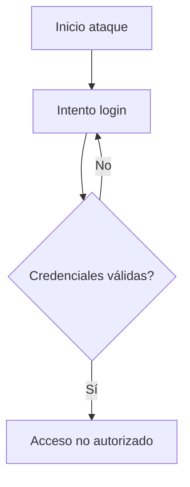

Herramientas comunes:

* Hydra
* Burp Suite Intruder
* Scripts automatizados

---

### 2.2 Credential Stuffing

Uso de listas filtradas de credenciales robadas.

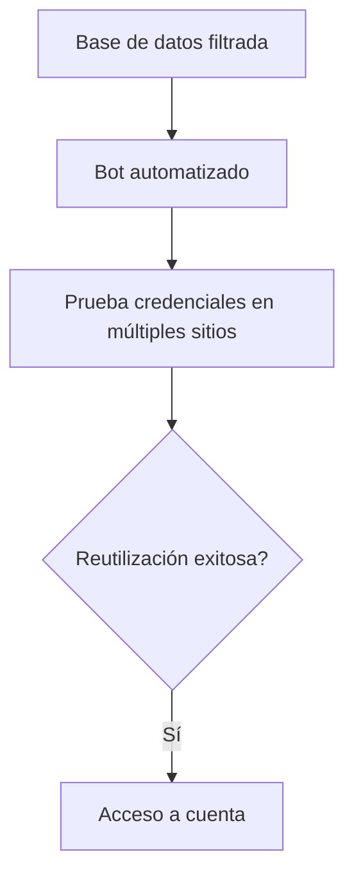

Ejemplo real:

* Exposición de contraseñas en Facebook (2019) – almacenamiento en texto plano.

---

### 2.3 Password Spraying

Probar una contraseña común contra muchos usuarios.

Ejemplo:

```
Usuario1 → Password1!
Usuario2 → Password1!
Usuario3 → Password1!
```

Muy efectivo cuando no hay bloqueo de cuentas.

---

### 2.4 Fijación de Sesión

El atacante fuerza un ID de sesión conocido antes del login.

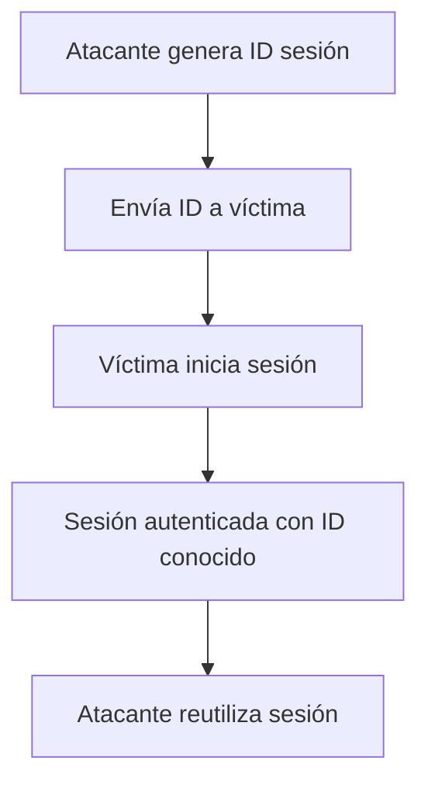

---

### 2.5 Omitir Autenticación

Errores lógicos que permiten:

* Saltar validaciones
* Manipular parámetros
* Modificar JWT sin validación adecuada

---

### 2.6 Caso Real – Colonial Pipeline (2021)

Ataque relacionado con credenciales comprometidas en:

Colonial Pipeline

Impacto:

* Ransomware
* Interrupción del suministro de combustible en EE.UU.
* Millonarias pérdidas económicas

---

## 3. Mejores Prácticas de Prevención y Mitigación

### 3.1 Implementar Autenticación Multifactor (MFA)

* OTP
* Aplicaciones autenticadoras
* Biométricos
* Hardware tokens

Reduce significativamente:

* Credential stuffing
* Fuerza bruta
* Reutilización de contraseñas

---

### 3.2 Políticas Modernas de Contraseñas

Alineadas con:

NIST SP 800-63B

Recomendaciones:

* Mínimo 8-12 caracteres
* No forzar rotación periódica innecesaria
* Validar contra listas de contraseñas comprometidas
* Permitir uso de password managers

---

### 3.3 Protección contra Ataques Automatizados

* Rate limiting
* Backoff progresivo
* Bloqueo temporal de cuenta
* CAPTCHA
* Monitoreo de IP sospechosas

---

### 3.4 Protección Segura de Contraseñas

* Hash con bcrypt o Argon2
* Salt único por usuario
* Nunca almacenar en texto plano

---

### 3.5 Gestión Segura de Sesiones

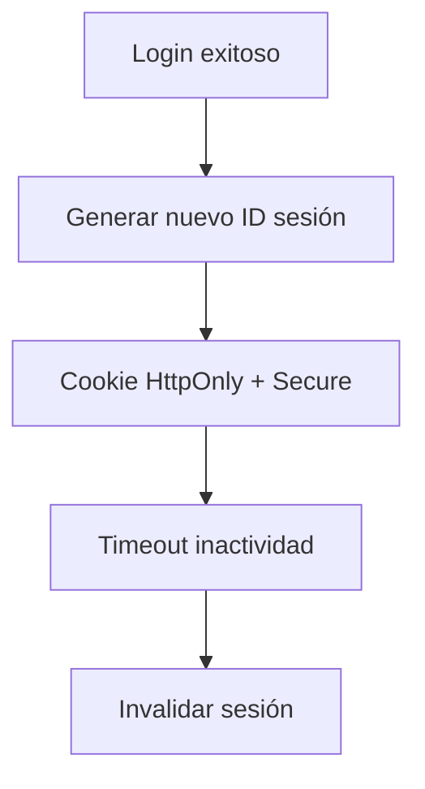

Buenas prácticas:

* No incluir ID en URL
* Invalidar sesiones en logout
* Regenerar sesión tras login
* Configurar tiempos de expiración

---

### 3.6 Comunicación Segura

* TLS obligatorio
* Protección contra MITM
* Validación correcta de certificados

---

### 3.7 Pruebas de Seguridad

* Pentesting periódico
* Revisión de código
* Simulación de ataques automatizados
* Escaneo de dependencias

---

### 3.8 Educación y Concientización

* Capacitación contra phishing
* Uso de gestores de contraseñas
* Buenas prácticas de higiene digital

---

## ¿Qué NO es un fallo de autenticación?

| Caso                              | Clasificación Correcta |
| --------------------------------- | ---------------------- |
| Usuario ve datos que no debería   | Fallo de autorización  |
| Phishing externo                  | Robo de credenciales   |
| Servidor caído                    | Fallo operativo        |
| Usuario escribe mal la contraseña | Error humano           |

---

## Conclusión

Los **Fallos de Autenticación (A07)** siguen siendo una de las vulnerabilidades más críticas del Top 10 de OWASP.

En un mundo donde:

* Las aplicaciones usan APIs
* Existe SSO
* Se manejan tokens JWT
* Los servicios están en la nube

La complejidad aumenta y también el riesgo.

Una autenticación débil puede permitir:

* Secuestro de cuentas
* Ransomware
* Exfiltración de datos
* Daño reputacional severo

 La autenticación no es solo un login.
Es la base de toda la seguridad del sistema.

---

#  A08 – Software or Data Integrity Failures (Fallos de integridad de software o datos)


### ¿Qué es?
Ocurre cuando el sistema **confía en software, actualizaciones, dependencias, datos o pipelines** sin verificar su integridad.  
Ejemplo: instalar paquetes sin verificación, actualizaciones no firmadas, CI/CD sin controles, o cargar datos/artefactos manipulados.

### ¿Cómo se ve en un proyecto real? (Ejemplos comunes)
- Dependencias descargadas sin control (sin lockfile, sin hash, sin firma).
- Actualizaciones automáticas desde fuentes no confiables.
- Artefactos de CI/CD sin validación o sin control de quién los publica.
- Scripts que descargan ejecutables “de internet” sin verificación.
- Modelos, archivos o data importada que puede ser alterada (supply chain).

### Impacto
- Supply chain attacks: una dependencia comprometida puede ejecutar código malicioso.
- Alteración de artefactos (builds) o datos críticos sin detección.
- Pérdida de confianza del sistema y posible control total por atacante.

### Buenas prácticas / mitigación
- Usar **lockfiles** (ej: `package-lock.json`, `poetry.lock`, `Pipfile.lock`).
- Verificar integridad (hashes / firmas) en dependencias o artefactos.
- Repositorios privados / proxies confiables para paquetes si aplica.
- CI/CD con permisos mínimos, revisiones obligatorias y firmas de artefactos.
- Auditoría de dependencias (SCA) y actualizaciones controladas.
- Controlar quién puede publicar releases y configurar “branch protection”.

### Evidencia en este trabajo
- Se mantuvieron dependencias fijadas con lockfile.
- Se revisaron vulnerabilidades de dependencias (SCA).
- Se propusieron controles en pipeline (revisión, permisos, validación).

---

# A09 Security Logging & Alerting Failures (Fallos en el registro y las alertas de seguridad)
El silencio es la peor respuesta ante un ataque → ⚠ MEDIO-ALTO


## Descripción de la Vulnerabilidad

### ¿Qué es?

Ausencia o insuficiencia de logs de seguridad, monitoreo de eventos críticos y alertas ante comportamientos anómalos. Sin visibilidad, los atacantes pueden operar durante meses sin ser detectados.


### ¿Cómo funciona?

El atacante explota el sistema sin que se generen registros auditables ni alertas. Logs incompletos, no centralizados o sin monitoreo crean zonas ciegas que permiten la persistencia extendida en el entorno comprometido.

### Causas

- Logs deshabilitados, incompletos o con granularidad insuficiente

- Sin integración con SIEM centralizado para correlación de eventos

- Alertas mal configuradas o ausentes ante eventos críticos

- Exceso de ruido vs señal: falsos positivos que enmascaran amenazas reales

- Ausencia de retención adecuada y protegida de logs (sin WORM)

### Impacto

> DATO CRÍTICO: El tiempo de permanencia promedio de un atacante no detectado es de 207 días (IBM Security Report). En SolarWinds fueron 9 meses de actividad invisible comprometiendo 18,000 organizaciones.

- MTTR (Mean Time To Respond) extremadamente elevado

- Brechas activas no detectadas durante semanas o meses

- Incumplimiento normativo: GDPR, PCI-DSS, ISO 27001, SOC 2

- Mayor daño financiero y reputacional acumulado por detección tardía

  

## Métodos de Explotación

### Técnicas de Evasión

- Log Tampering: eliminar o modificar logs post-intrusión para borrar rastros

- Log Flooding: generar ruido masivo para ocultar eventos reales entre miles de entradas falsas

- Slow & Low Attack: ataques lentos bajo el umbral de alertas configuradas

- Living off the Land: usar herramientas legítimas del sistema que no generan alertas

- Time-based Evasion: atacar en horarios de baja vigilancia (noches, feriados)

### Ejemplos Reales

<table style="width:79%;">
<colgroup>
<col style="width: 16%" />
<col style="width: 61%" />
</colgroup>
<thead>
<tr>
<th><h4 id="caso-año-2">Caso / Año</h3></th>
<th><h4 id="tiempo-sin-detección-e-impacto">Tiempo sin Detección e Impacto</h3></th>
</tr>
</thead>
<tbody>
<tr>
<td><h4 id="solarwinds-2020">SolarWinds (2020)</h3></td>
<td><h4 id="meses-sin-detección-18000-organizaciones-comprometidas-globalmente">9 meses sin detección → 18,000 organizaciones comprometidas globalmente</h3></td>
</tr>
<tr>
<td><h4 id="marriott-2018">Marriott (2018)</h3></td>
<td><h4 id="brecha-activa-4-años-500-millones-de-registros-de-huéspedes-expuestos">Brecha activa 4 años → 500 millones de registros de huéspedes expuestos</h3></td>
</tr>
<tr>
<td><h4 id="yahoo-2013-2016">Yahoo (2013-2016)</h3></td>
<td><h4 id="detectado-3-años-después-3000-millones-de-cuentas-afectadas">Detectado 3 años después → 3,000 millones de cuentas afectadas</h3></td>
</tr>
<tr>
<td><h4 id="uber-2016">Uber (2016)</h3></td>
<td><h4 id="brecha-oculta-1-año-sin-alertas-activas-datos-de-57m-usuarios">Brecha oculta 1 año sin alertas activas → datos de 57M usuarios</h3></td>
</tr>
</tbody>
</table>

### 

### Herramientas de Análisis Forense

| Splunk | ELK Stack | AWS CloudTrail |  Datadog  |
|:------:|:---------:|:--------------:|:---------:|
| Wazuh  |  Graylog  |    Grafana     | PagerDuty |

## Prevención y Mitigación

- Implementar logging centralizado con ELK Stack, Splunk o SIEM cloud-native

- Usar structured logging en JSON con niveles de severidad estándar

- Activar AWS CloudTrail, CloudWatch, GuardDuty en TODOS los entornos sin excepciones

- Definir alertas automáticas para: auth failures, privilege escalation, accesos anómalos

- Implementar retención de logs inmutable (S3 Object Lock WORM)

- Integrar SIEM con SOAR para respuesta automatizada a incidentes de seguridad

### CÓdigo — Structured Logging (Python)

> \# Structured Logging (Python) – Buena práctica import structlog log = structlog.get_logger() log.info("auth.login_attempt", user_id=user.id, ip_address=request.remote_addr, success=False, reason="invalid_password", timestamp=datetime.utcnow().isoformat() ) \# NUNCA loguear: passwords, tokens, PII en claro log.info("login", password=user_password) \# NUNCA hacer esto

## Buenas Prácticas DevSecOps

- Registrar eventos críticos: autenticaciones, errores de autorización, cambios de configuración

- Logs en formato JSON estructurado con campos estandarizados (timestamp, user_id, ip, action)

- Pruebas periódicas de alertas: simular incidentes para validar el pipeline de detección

- Integración con SOAR para playbooks de respuesta automatizada ante incidentes

- Sincronización NTP en todos los sistemas para correlación correcta de eventos

  

## Configuraciones Recomendadas

<table style="width:72%;">
<colgroup>
<col style="width: 18%" />
<col style="width: 73%" />
</colgroup>
<thead>
<tr>
<th><h3 id="servicio">Servicio</h2></th>
<th><h3 id="configuración-2">Configuración</h2></th>
</tr>
</thead>
<tbody>
<tr>
<td><h4 id="aws-cloudtrail">AWS CloudTrail</h2></td>
<td><h4 id="activar-en-todas-las-regiones.-logs-a-s3-con-object-lock-worm.-integrar-con-cloudwatch">Activar en todas las regiones. Logs a S3 con Object Lock (WORM). Integrar con CloudWatch</h2></td>
</tr>
<tr>
<td><h4 id="aws-guardduty">AWS GuardDuty</h2></td>
<td><h4 id="habilitar-threat-detection.-integrar-con-security-hub-para-correlación-centralizada">Habilitar threat detection. Integrar con Security Hub para correlación centralizada</h2></td>
</tr>
<tr>
<td><h4 id="alarmas-cloudwatch">Alarmas CloudWatch</h2></td>
<td><h4 id="alerta-inmediata-ante-uso-de-cuenta-root-threshold1-period300s-vía-sns">Alerta inmediata ante uso de cuenta root (threshold=1, period=300s) vÍa SNS</h2></td>
</tr>
<tr>
<td><h4 id="siem-soar">SIEM / SOAR</h2></td>
<td><h4 id="splunkelk-con-connectors-cloud.-playbooks-automáticos-ante-incidentes-críticos-detectados">Splunk/ELK con connectors cloud. Playbooks automáticos ante incidentes críticos detectados</h2></td>
</tr>
</tbody>
</table>

## 

## Controles de Seguridad

<table style="width:62%;">
<colgroup>
<col style="width: 20%" />
<col style="width: 9%" />
<col style="width: 23%" />
<col style="width: 8%" />
</colgroup>
<thead>
<tr>
<th><h3 id="control-2">Control</h2></th>
<th><h3 id="tipo-2">Tipo</h2></th>
<th><h3 id="herramienta-2">Herramienta</h2></th>
<th><h3 id="prioridad-2">Prioridad</h2></th>
</tr>
</thead>
<tbody>
<tr>
<td><h4 id="siem-centralizado">SIEM centralizado</h2></td>
<td><h4 id="detectivo-2">Detectivo</h2></td>
<td><h4 id="splunk-elk-azure-sentinel">Splunk, ELK, Azure Sentinel</h2></td>
<td><h4 id="crítico-4">CRÍTICO</h2></td>
</tr>
<tr>
<td><h4 id="cloudtrail-guardduty">CloudTrail + GuardDuty</h2></td>
<td><h4 id="detectivo-3">Detectivo</h2></td>
<td><h4 id="aws-nativo-azure-defender">AWS nativo, Azure Defender</h2></td>
<td><h4 id="crítico-5">CRÍTICO</h2></td>
</tr>
<tr>
<td><h4 id="alertas-en-tiempo-real">Alertas en tiempo real</h2></td>
<td><h4 id="reactivo">Reactivo</h2></td>
<td><h4 id="pagerduty-opsgenie-sns">PagerDuty, OpsGenie, SNS</h2></td>
<td><h4 id="crítico-6">CRÍTICO</h2></td>
</tr>
<tr>
<td><h4 id="logs-inmutables-worm">Logs inmutables (WORM)</h2></td>
<td><h4 id="preventivo-4">Preventivo</h2></td>
<td><h4 id="s3-object-lock-azure-blob">S3 Object Lock, Azure Blob</h2></td>
<td><h4 id="alto-6">ALTO</h2></td>
</tr>
<tr>
<td><h4 id="soar-automatizado">SOAR automatizado</h2></td>
<td><h4 id="reactivo-1">Reactivo</h2></td>
<td><h4 id="splunk-soar-demistoxsoar">Splunk SOAR, Demisto/XSOAR</h2></td>
<td><h4 id="alto-7">ALTO</h2></td>
</tr>
<tr>
<td><h4 id="structured-logging">Structured Logging</h2></td>
<td><h4 id="preventivo-5">Preventivo</h2></td>
<td><h4 id="structlog-loguru-serilog">structlog, Loguru, Serilog</h2></td>
<td><h4 id="alto-8">ALTO</h2></td>
</tr>
<tr>
<td><h4 id="log-retention-policy">Log Retention Policy</h2></td>
<td><h4 id="preventivo-6">Preventivo</h2></td>
<td><h4 id="aws-config-rules-azure-policy">AWS Config Rules, Azure Policy</h2></td>
<td><h4 id="medio-2">MEDIO</h2></td>
</tr>
</tbody>
</table>

##

---

# A10: Mishandling of Exceptional Conditions
---

## 1. Descripción Breve de la Vulnerabilidad

### ¿Qué es?

**A10:2025 - Mishandling of Exceptional Conditions** (Manejo Inadecuado de Condiciones Excepcionales) ocurre cuando una aplicación **no gestiona correctamente condiciones excepcionales**, como errores del sistema, fallos de red, entradas inesperadas o estados no previstos.

Es una vulnerabilidad que surge cuando los desarrolladores implementan manejo de excepciones deficiente o inexistente, permitiendo que:

- Errores críticos expongan información sensible del sistema
- Flujos de control se desvíen de forma impredecible
- Validaciones se salten silenciosamente
- Fallos de seguridad pasen desapercibidos en logs

En entornos **DevSecOps**, esta vulnerabilidad suele aparecer en:
- Microservicios
- APIs RESTful
- Pipelines CI/CD automatizados
- Infraestructura contenedorizada
- Sistemas distribuidos en cloud

---

### ¿Cómo funciona?

Cuando una aplicación no maneja correctamente una excepción, el sistema experimenta un flujo de eventos que puede ser explotado:

```
┌───────────────────────────────────────────────────────────────┐
│                   FLUJO DE LA VULNERABILIDAD                  │
├───────────────────────────────────────────────────────────────┤
│                                                                │
│  1. ENTRADA INESPERADA                                         │
│     └─> Usuario o atacante envía datos malformados           │
│                                                                │
│  2. CONDICIÓN EXCEPCIONAL                                      │
│     └─> Aplicación encuentra error no previsto               │
│                                                                │
│  3. FALTA DE MANEJO                                            │
│     └─> No hay lógica de captura adecuada                    │
│                                                                │
│  4. EXPOSICIÓN DE INFORMACIÓN                                  │
│     └─> Stack trace, rutas internas, versiones expuestas     │
│                                                                │
│  5. EXPLOTACIÓN                                                │
│     └─> Atacante obtiene información para siguiente ataque   │
│                                                                │
└───────────────────────────────────────────────────────────────┘
```

### Causas principales

```
┌───────────────────────────────────────────────────────────────┐
│              CAUSAS DE LA VULNERABILIDAD                       │
├───────────────────────────────────────────────────────────────┤
│                                                                │
│ • Falta de bloques try-catch adecuados en código             │
│ • Manejo genérico de excepciones (catch Exception)           │
│ • Logging insuficiente de errores críticos                   │
│ • Exposición de stack traces en respuestas HTTP              │
│ • Ausencia de validación post-excepción                      │
│ • Gestión inadecuada de fallos en servicios remotos          │
│ • Timeouts no configurados en operaciones críticas           │
│ • Recuperación de errores sin verificación de estado         │
│ • Falta de centralización del manejo de errores              │
│ • Mensajes de error detallados en producción                 │
│                                                                │
└───────────────────────────────────────────────────────────────┘
```

### Impacto en DevSecOps

En pipelines CI/CD y arquitecturas cloud-native, esta vulnerabilidad se amplifica debido a:

| Aspecto | Impacto |
|--------|--------|
| **Divulgación de Información** | Exposición de rutas internas, versiones, tecnologías, estructura del sistema |
| **Compromiso de Lógica** | Elusión de controles de seguridad mediante manipulación de flujos de error |
| **Indisponibilidad** | Fallos en cascada que afectan a múltiples servicios en la arquitectura distribuida |
| **Exfiltración de Datos** | Acceso a información sensible mediante análisis de mensajes de error |
| **Escalamiento** | Punto de apoyo para ataques posteriores más sofisticados |
| **Complejidad Distribuida** | Múltiples capas de servicios sin manejo centralizado |
| **Logs Distribuidos** | Imposibilidad de correlacionar errores sin infraestructura apropiada |
| **Fallos Silenciosos** | Excepciones no capturadas en contenedores |

### Naturaleza de la vulnerabilidad

```
CATEGORÍA:         Error de Diseño + Error de Implementación + Error de Configuración
TIPO:              Manejo de Errores
SEVERIDAD:         Alta (CVSS 7.5+)
FRECUENCIA:        Muy Común (aparece en 40-60% de aplicaciones)
DETECTABLE:        Sí (mediante SAST, DAST, análisis manual)
```

---

## 2. Métodos de Explotación

### Descripción de ataques

Los atacantes provoca condiciones inesperadas para observar cómo reacciona el sistema, permitiendo extraer información valiosa:

```
┌──────────────────────────────────────────────────────────────┐
│              FLUJO TÍPICO DE EXPLOTACIÓN                      │
├──────────────────────────────────────────────────────────────┤
│                                                                │
│  FASE 1: RECONOCIMIENTO                                        │
│  ┌──────────────────────┐                                     │
│  │ Envío de Inputs      │                                     │
│  │ Malformados          │                                     │
│  └────────┬─────────────┘                                     │
│           │                                                    │
│           v                                                    │
│  FASE 2: GENERACIÓN DE ERROR                                  │
│  ┌──────────────────────────────┐                             │
│  │ Generación de Excepción      │                             │
│  │ No Controlada                │                             │
│  └────────┬─────────────────────┘                             │
│           │                                                    │
│           v                                                    │
│  FASE 3: EXTRACCIÓN DE INFORMACIÓN                            │
│  ┌──────────────────────────────┐                             │
│  │ Exposición de Stack Trace    │                             │
│  │ o Información Sensible       │                             │
│  └────────┬─────────────────────┘                             │
│           │                                                    │
│           v                                                    │
│  FASE 4: ENUMERACIÓN                                           │
│  ┌──────────────────────────────┐                             │
│  │ Análisis de Respuesta        │                             │
│  │ para Enumeración de Sistema  │                             │
│  └────────┬─────────────────────┘                             │
│           │                                                    │
│           v                                                    │
│  FASE 5: EXPLOTACIÓN                                           │
│  ┌──────────────────────────────┐                             │
│  │ Construcción de Exploit      │                             │
│  │ Dirigido y Específico        │                             │
│  └──────────────────────────────┘                             │
│                                                                │
└──────────────────────────────────────────────────────────────┘
```

### Cómo la explotan los atacantes

1. **Inyección de Excepciones**: Enviar payloads malformados deliberadamente
   - Caracteres especiales: `'`, `"`, `\`, `/`, `%`
   - Valores nulos o vacíos
   - Tipos de datos incorrectos
   - Valores numéricos extremos

2. **Análisis de Errores**: Examinar mensajes de error para reconocimiento
   - Identificar versiones de tecnologías
   - Mapear estructura de carpetas
   - Descubrir bases de datos
   - Encontrar endpoints internos

3. **Fuzzing Automático**: Pruebas automáticas para generar condiciones excepcionales
   - Envío masivo de inputs variados
   - Búsqueda de puntos débiles
   - Análisis de respuestas diferenciadas

4. **Timing Attacks**: Medir tiempos de respuesta en manejo de errores
   - Diferencias en tiempos revelan lógica interna
   - Validar información mediante tiempo de respuesta

5. **Log Injection**: Manipular logs mediante caracteres especiales
   - Inyectar líneas en logs
   - Falsificar eventos de auditoría
   - Ocultar actividad maliciosa

---

### Ejemplos reales de explotación

**Ejemplo 1: Exposición de Stack Trace - SQL Injection**

```
SOLICITUD:
POST /api/users/search HTTP/1.1
Content-Type: application/json

{"email": "test@example.com", "id": "' OR '1'='1"}

RESPUESTA:
HTTP/500 Internal Server Error
Content-Type: application/json

{
  "error": "java.sql.SQLException: Syntax error in SQL statement",
  "stackTrace": [
    "at com.application.db.UserRepository.findById(UserRepository.java:45)",
    "at com.application.services.UserService.getUser(UserService.java:120)",
    "at com.application.api.UserController.searchUser(UserController.java:78)"
  ],
  "details": {
    "javaVersion": "11.0.12",
    "appPath": "/opt/app/src/main/java/com/application/",
    "database": "PostgreSQL 12.4",
    "timestamp": "2025-03-05T10:30:45Z"
  }
}

INFORMACIÓN EXPUESTA:
✓ Versión Java exacta
✓ Estructura de carpetas
✓ Tipo de base de datos y versión
✓ Ruta exacta del error
✓ Clase y método afectado
```

**Ejemplo 2: Condición de Carrera en Microservicios**

```
ESCENARIO:
1. Atacante realiza solicitud concurrente a endpoint crítico
2. Timeout en servicio remoto causa excepción no manejada
3. Estado de transacción queda inconsistente
4. Validación de seguridad se salta en manejo de error
5. Acceso no autorizado se concede

CÓDIGO VULNERABLE:
try {
    chargeCard(userId, amount);  // Timeout sin manejo
    // Validación saltada si hay error
    confirmTransaction(userId);
} catch (Exception e) {
    // Genérico - puede dejar estado inconsistente
    logger.error("Payment failed");
}

EXPLOTACIÓN:
- Atacante envía 10 solicitudes simultáneamente
- Algunos servicios fallan por timeout
- La lógica compensatoria no se ejecuta
- Fondos no se cobran pero transacción marca como completada
```

**Ejemplo 3: Cascada de Fallos en Arquitectura Distribuida**

```
ARQUITECTURA:
API Gateway -> Servicio A -> Servicio B -> Base de datos

ESCENARIO DE FALLO:
1. Servicio B experimenta timeout (DB no responde)
2. Excepción de timeout no es capturada
3. No se implementa Circuit Breaker
4. Servicio A reintenta indefinidamente
5. Recursos se agotan en Servicio A
6. API Gateway comienza a rechazar solicitudes
7. CASCADA DE FALLOS en toda la plataforma

SÍNTOMAS:
- High latency en API Gateway
- Memory leaks en Servicio A
- Cascada de errores en logs
- Usuarios afectados globalmente
- Recovery manual necesario
```

**Ejemplo 4: Log Injection - Falsificación de Auditoría**

```
ENTRADA MALICIOSA:
username=admin\nADMIN|2025-03-05|LOGIN_SUCCESS|127.0.0.1

LOGS RESULTANTES:
INFO|2025-03-05T10:30:45Z|user:attacker|LOGIN_FAILED|192.168.1.100
ADMIN|2025-03-05|LOGIN_SUCCESS|127.0.0.1
INFO|2025-03-05T10:30:46Z|...

RESULTADO:
- Log de auditoría comprometido
- Ataque enmascarado como inicio de sesión legítimo
- Imposible auditar actividad maliciosa
```

---

### Herramientas comunes utilizadas por atacantes

| Herramienta | Tipo | Propósito | Uso en A10:2025 |
|-------------|------|----------|-----------------|
| **Burp Suite** | Scanner Web | Fuzzing interactivo de errores | Identificar endpoints que exponen información |
| **OWASP ZAP** | Scanner Web | Escaneo automático de seguridad | Automatizar búsqueda de stack traces |
| **Postman** | Cliente HTTP | Generación manual de requests | Crear payloads anómalos personalizados |
| **Insomnia** | Cliente HTTP | Generación de requests | Fuzzing interactivo |
| **Apache JMeter** | Herramienta de Carga | Pruebas de estrés | Generar excepciones concurrentes |
| **AFL Fuzzer** | Fuzzer | Fuzzing dirigido | Generar inputs que causen excepciones |
| **LibFuzzer** | Fuzzer | Fuzzing de cobertura | Automatizar búsqueda de excepciones |
| **Chaos Monkey** | Inyección de Fallos | Inyectar fallos en cloud | Explorar manejo de fallos en producción |
| **wfuzz** | Fuzzer Web | Fuzzing de parámetros | Probar combinaciones de entrada |
| **ffuf** | Fuzzer Rápido | Fuzzing de fuerza bruta | Descubrir endpoints y parámetros |

---

## 3. Prevención y Mitigación

### Estrategia integrada en 4 capas

```
┌─────────────────────────────────────────────────────────────┐
│                   CAPA 1: PREVENCIÓN                         │
│            (Fase de Desarrollo)                              │
├─────────────────────────────────────────────────────────────┤
│ • Code Review enfocado en manejo de excepciones              │
│ • SAST: Análisis estático (SonarQube, Checkmarx, Fortify)  │
│ • Entrenamiento de desarrolladores en patrones seguros      │
│ • Pair programming en funciones críticas                    │
└─────────────────────────────────┬───────────────────────────┘
                                  │
                                  ↓
┌─────────────────────────────────────────────────────────────┐
│                 CAPA 2: MITIGACIÓN COMPILACIÓN               │
│            (Fase de Build & Integration)                     │
├─────────────────────────────────────────────────────────────┤
│ • Linting automático: eslint, pylint, checkstyle            │
│ • DAST: Pruebas dinámicas en CI/CD (OWASP ZAP)             │
│ • Validación de dependencias vulnerables                    │
│ • Análisis de cobertura de excepciones                      │
└─────────────────────────────────┬───────────────────────────┘
                                  │
                                  ↓
┌─────────────────────────────────────────────────────────────┐
│                 CAPA 3: CONTROL EN TIEMPO DE EJECUCIÓN       │
│            (Fase de Deploy & Runtime)                        │
├─────────────────────────────────────────────────────────────┤
│ • WAF (Web Application Firewall) con reglas de error        │
│ • Monitoreo de excepciones en tiempo real                   │
│ • Circuit Breakers implementados                            │
│ • Timeouts configurados en todas las operaciones            │
│ • Rate limiting en endpoints                                │
└─────────────────────────────────┬───────────────────────────┘
                                  │
                                  ↓
┌─────────────────────────────────────────────────────────────┐
│               CAPA 4: DETECCIÓN Y RESPUESTA                  │
│            (Fase de Monitoreo & Incident Response)           │
├─────────────────────────────────────────────────────────────┤
│ • SIEM: Análisis centralizado de logs (ELK, Splunk)        │
│ • Alertas automáticas de patrones anómalos                 │
│ • Incident response automatizado                            │
│ • Correlación de eventos distribuidos                       │
└─────────────────────────────────────────────────────────────┘
```

### Medidas técnicas específicas

#### 1. Gestión Centralizada de Excepciones

**Java/Spring:**
```java
// Global Exception Handler
@ControllerAdvice
@RestController
public class GlobalExceptionHandler {
    
    private static final Logger logger = LoggerFactory.getLogger(GlobalExceptionHandler.class);
    
    @ExceptionHandler(Exception.class)
    public ResponseEntity<ErrorResponse> handleException(Exception e, HttpServletRequest request) {
        // Generar ID único para correlación
        String errorId = UUID.randomUUID().toString();
        
        // Logging DETALLADO internamente (sin exponer)
        logger.error("Uncaught exception - Error ID: {} | User: {} | Endpoint: {}", 
            errorId, 
            request.getUserPrincipal(), 
            request.getRequestURI(), 
            e);
        
        // Respuesta GENÉRICA al cliente
        return ResponseEntity
            .status(HttpStatus.INTERNAL_SERVER_ERROR)
            .body(new ErrorResponse(
                "An error occurred processing your request",
                errorId,  // Solo ID para seguimiento
                System.currentTimeMillis()
            ));
    }
    
    @ExceptionHandler(ValidationException.class)
    public ResponseEntity<ErrorResponse> handleValidation(ValidationException e) {
        // Excepciones conocidas = respuesta específica (pero sin detalles internos)
        return ResponseEntity
            .status(HttpStatus.BAD_REQUEST)
            .body(new ErrorResponse("Invalid request data"));
    }
}
```

#### 2. Validación Post-Excepción en Operaciones Críticas

**Python:**
```python
import logging
import uuid
from functools import wraps
from datetime import datetime
from enum import Enum

# Configurar logging centralizado
class LogLevel(Enum):
    DEBUG = "DEBUG"
    INFO = "INFO"
    WARNING = "WARNING"
    ERROR = "ERROR"
    CRITICAL = "CRITICAL"

logger = logging.getLogger(__name__)

class SecurityException(Exception):
    """Excepción específica de seguridad"""
    pass

class TransactionError(Exception):
    """Error de transacción"""
    pass

def secure_operation(max_retries=3, timeout_seconds=5):
    """
    Decorador para operaciones críticas con manejo seguro
    """
    def decorator(func):
        @wraps(func)
        def wrapper(*args, **kwargs):
            request_id = str(uuid.uuid4())
            retry_count = 0
            
            while retry_count < max_retries:
                try:
                    # VALIDACIÓN PRELIMINAR
                    if not validate_preconditions(*args, **kwargs):
                        raise ValueError("Precondition check failed")
                    
                    # EJECUCIÓN CON TIMEOUT
                    result = func(*args, request_id=request_id, **kwargs)
                    
                    # VALIDACIÓN POST-OPERACIÓN CRÍTICA
                    if not verify_operation_result(result):
                        logger.error(
                            "Post-operation verification failed",
                            extra={
                                'request_id': request_id,
                                'operation': func.__name__,
                                'timestamp': datetime.utcnow().isoformat()
                            }
                        )
                        raise SecurityException("Operation verification failed")
                    
                    logger.info(
                        f"{func.__name__} completed successfully",
                        extra={'request_id': request_id}
                    )
                    return result
                
                except ValueError as e:
                    # Error de validación - no reintentar
                    logger.warning(
                        "Validation failed",
                        extra={
                            'request_id': request_id,
                            'error': str(e),
                            'operation': func.__name__
                        }
                    )
                    raise
                
                except TransactionError as e:
                    # Error de transacción - reintentar
                    retry_count += 1
                    if retry_count >= max_retries:
                        logger.error(
                            f"Operation failed after {max_retries} retries",
                            extra={
                                'request_id': request_id,
                                'operation': func.__name__,
                                'retries': retry_count
                            }
                        )
                        raise
                    
                    logger.info(
                        f"Retrying operation {retry_count}/{max_retries}",
                        extra={'request_id': request_id, 'operation': func.__name__}
                    )
                
                except SecurityException as e:
                    # Error de seguridad - escalar inmediatamente
                    logger.critical(
                        "Security exception detected",
                        extra={
                            'request_id': request_id,
                            'operation': func.__name__,
                            'error': str(e)
                        },
                        exc_info=True
                    )
                    raise
                
                except Exception as e:
                    # Error inesperado
                    logger.critical(
                        "Unexpected error in operation",
                        extra={
                            'request_id': request_id,
                            'operation': func.__name__
                        },
                        exc_info=True
                    )
                    # Genérico sin exponer detalles
                    raise RuntimeError("An unexpected error occurred")
        
        return wrapper
    return decorator

# Implementación en operación crítica
@secure_operation(max_retries=2, timeout_seconds=5)
def process_payment(user_id, amount, currency="USD", request_id=None):
    """Procesa pago de usuario de forma segura"""
    
    try:
        # 1. VALIDACIÓN EXPLÍCITA DE ENTRADA
        if not user_id or not isinstance(user_id, int) or user_id < 1:
            raise ValueError("Invalid user_id")
        
        if not amount or amount <= 0:
            raise ValueError("Invalid amount")
        
        if currency not in ["USD", "EUR", "COP"]:
            raise ValueError(f"Unsupported currency: {currency}")
        
        # 2. OPERACIÓN CRÍTICA
        transaction_id = generate_transaction_id()
        logger.debug(
            f"Charging card for user {user_id}",
            extra={'request_id': request_id, 'transaction_id': transaction_id}
        )
        
        result = charge_card(user_id, amount, currency)
        
        # 3. VALIDACIÓN POST-OPERACIÓN
        if not result or not result.get('success'):
            raise TransactionError("Charge failed")
        
        # 4. VERIFICACIÓN ADICIONAL
        if not verify_transaction_in_database(result['transaction_id']):
            logger.error(
                "Transaction recorded in payment system but not in database",
                extra={'request_id': request_id, 'transaction_id': result['transaction_id']}
            )
            # Compensación: revertir cargo
            refund_transaction(result['transaction_id'])
            raise SecurityException("Database transaction mismatch")
        
        # 5. CONFIRMACIÓN
        confirm_transaction(result['transaction_id'])
        
        logger.info(
            "Payment processed successfully",
            extra={
                'request_id': request_id,
                'user_id': user_id,
                'transaction_id': result['transaction_id']
            }
        )
        
        return {
            'success': True,
            'transaction_id': result['transaction_id'],
            'reference_id': request_id
        }
    
    except ValueError as e:
        logger.warning(f"Payment validation failed: {str(e)}", 
                      extra={'request_id': request_id})
        raise
    
    except TransactionError as e:
        logger.error(f"Payment transaction failed: {str(e)}", 
                    extra={'request_id': request_id})
        raise
    
    except SecurityException as e:
        logger.critical(f"Security check failed: {str(e)}", 
                       extra={'request_id': request_id}, exc_info=True)
        raise
    
    except Exception as e:
        logger.critical("Unexpected payment error", 
                       extra={'request_id': request_id}, exc_info=True)
        raise RuntimeError("Payment processing failed")
```

#### 3. Timeout y Circuit Breaker en Llamadas Remotas

**JavaScript/Node.js:**
```javascript
const express = require('express');
const CircuitBreaker = require('opossum');
const axios = require('axios');
const pino = require('pino');

const logger = pino({
    level: process.env.LOG_LEVEL || 'error',
    transport: {
        target: 'pino-pretty',
        options: {
            colorize: true,
            singleLine: true
        }
    }
});

// Configuración de Circuit Breaker
const circuitBreakerOptions = {
    timeout: 5000,              // 5 segundos
    errorThresholdPercentage: 50, // Abrir después de 50% fallos
    resetTimeout: 30000,        // Reintentar después de 30s
    name: 'external_service_call'
};

// Función base con timeout
const callExternalService = async (url, config = {}) => {
    const timeoutMs = config.timeout || 5000;
    
    return new Promise((resolve, reject) => {
        // Timeout promise
        const timeoutPromise = new Promise((_, rejectTimeout) =>
            setTimeout(() => rejectTimeout(new Error('Operation timeout')), timeoutMs)
        );
        
        // Actual request promise
        const requestPromise = axios.get(url, {
            timeout: timeoutMs,
            ...config
        });
        
        // Race between request and timeout
        Promise.race([requestPromise, timeoutPromise])
            .then(resolve)
            .catch(reject);
    });
};

// Circuit Breaker wrapper
const breaker = new CircuitBreaker(callExternalService, circuitBreakerOptions);

// Event listeners para monitoreo
breaker.fallback(() => {
    logger.error('Circuit breaker activated - using fallback');
    return { cached: true, data: getCachedData() };
});

breaker.on('open', () => {
    logger.error('Circuit breaker OPEN - service unavailable');
    alertOpsTeam('Circuit breaker opened for external service');
});

breaker.on('halfOpen', () => {
    logger.info('Circuit breaker HALF_OPEN - testing recovery');
});

breaker.on('close', () => {
    logger.info('Circuit breaker CLOSED - service recovered');
});

// Middleware para manejo centralizado
const asyncHandler = (fn) => (req, res, next) => {
    Promise.resolve(fn(req, res, next)).catch(next);
};

// Rutas con manejo seguro
const app = express();

app.get('/api/data/:id', asyncHandler(async (req, res) => {
    const requestId = req.headers['x-request-id'] || generateUUID();
    
    try {
        // Validación de entrada
        const id = parseInt(req.params.id);
        if (isNaN(id) || id < 1) {
            logger.warn('Invalid ID parameter', { requestId, id: req.params.id });
            return res.status(400).json({
                error: 'Invalid request parameters',
                reference_id: requestId
            });
        }
        
        // Llamada a servicio remoto con Circuit Breaker
        const data = await breaker.fire(`https://api.example.com/data/${id}`, {
            timeout: 5000,
            headers: { 'X-Request-ID': requestId }
        });
        
        // Validación de respuesta
        if (!data || !data.data) {
            logger.error('Invalid response from external service', { requestId });
            return res.status(502).json({
                error: 'Bad gateway response',
                reference_id: requestId
            });
        }
        
        logger.info('Data retrieved successfully', { requestId, dataId: id });
        res.json({ data: data.data, reference_id: requestId });
        
    } catch (error) {
        const errorId = generateUUID();
        
        if (error.message === 'Operation timeout') {
            logger.error('Request timeout', { requestId, errorId });
            return res.status(504).json({
                error: 'Service timeout',
                reference_id: requestId,
                error_id: errorId
            });
        }
        
        if (error.code === 'ECONNREFUSED') {
            logger.error('Connection refused', { requestId, errorId });
            return res.status(503).json({
                error: 'Service unavailable',
                reference_id: requestId,
                error_id: errorId
            });
        }
        
        logger.error('Unhandled error in request', { requestId, errorId }, error);
        return res.status(500).json({
            error: 'An error occurred processing your request',
            reference_id: requestId,
            error_id: errorId
        });
    }
}));

// Global error handler (debe ir al final)
app.use((err, req, res, next) => {
    const errorId = generateUUID();
    const requestId = req.headers['x-request-id'] || errorId;
    
    logger.error('Uncaught error in request handler', {
        requestId,
        errorId,
        path: req.path,
        method: req.method
    }, err);
    
    // NUNCA exponer detalles del error al cliente
    res.status(500).json({
        error: 'An unexpected error occurred',
        reference_id: requestId,
        error_id: errorId,
        // Nota: NO incluir stack trace, archivo, línea, etc.
    });
});

// Función helper
function generateUUID() {
    return 'xxxxxxxx-xxxx-4xxx-yxxx-xxxxxxxxxxxx'.replace(/[xy]/g, function(c) {
        const r = Math.random() * 16 | 0;
        const v = c === 'x' ? r : (r & 0x3 | 0x8);
        return v.toString(16);
    });
}

function getCachedData() {
    // Implementar lógica de caché
    return {};
}

function alertOpsTeam(message) {
    // Enviar alerta a sistema de monitoreo
    logger.warn('ALERT', { message });
}

module.exports = app;
```

---

## 4. Buenas Prácticas

### Diagrama de flujo seguro de manejo de excepciones

```
┌─────────────────────────────────┐
│   ENTRADA DEL USUARIO           │
│   (Solicitud HTTP)              │
└────────────────┬────────────────┘
                 │
                 v
        ┌────────────────────┐
        │ VALIDACIÓN         │
        │ PRELIMINAR         │
        │ (Entrada)          │
        └────────┬───────────┘
                 │
          ┌──────┴──────┐
          │             │
         NO            SÍ
          │             │
          v             v
      ┌────────┐   ┌──────────────────┐
      │RECHAZO │   │PROCESAMIENTO      │
      │+ LOG   │   │DE LÓGICA          │
      └────────┘   └────┬─────────────┘
                         │
                    ┌────┴─────┐
                    │           │
                  ERROR       SUCCESS
                    │           │
                    v           v
            ┌────────────────┐ ┌──────────────┐
            │CAPTURA         │ │VALIDACIÓN    │
            │ESPECÍFICA      │ │POST-OPERACIÓN│
            │DE EXCEPCIÓN    │ └────────┬─────┘
            └────────┬───────┘          │
                     │                  │
            ┌────────┴─────┐            │
            │              │            │
        ESPERADA      INESPERADA        │
            │              │            │
            v              v            │
        ┌────────┐   ┌──────────┐      │
        │RECUPER │   │ESCALADA  │      │
        │AR      │   │SEGURA    │      │
        │RETRY   │   │LOG CRÍTICO│      │
        └────┬───┘   └────┬─────┘      │
             │            │             │
             └────────┬───┴────────────┘
                      │
                      v
          ┌───────────────────────┐
          │LOGGING DETALLADO      │
          │(sin exponer sensible) │
          │- Request ID           │
          │- Usuario              │
          │- Timestamp            │
          │- Error Type           │
          │- Resultado            │
          └────────────┬──────────┘
                       │
                       v
          ┌───────────────────────┐
          │RESPUESTA AL USUARIO   │
          │(GENÉRICA Y SEGURA)    │
          │- Código HTTP          │
          │- Mensaje genérico     │
          │- Reference ID         │
          │- SIN detalles técnicos│
          └───────────────────────┘
```

### Checklist de implementación

```
VALIDACIÓN Y ENTRADA
─────────────────────────────────────────
[ ] Todas las entradas son validadas antes del procesamiento
[ ] Validación ocurre tanto en cliente como servidor
[ ] Mensajes de rechazo son genéricos (no revelan estructura)
[ ] Validaciones ocurren de nuevo después de recuperarse de error

MANEJO DE EXCEPCIONES
─────────────────────────────────────────
[ ] No hay bloques catch(Exception) genéricos
[ ] Cada excepción esperada tiene un handler específico
[ ] Excepciones inesperadas se loguean con contexto completo
[ ] Se implementa recuperación (retry/fallback) cuando es apropiado

LOGGING Y MONITOREO
─────────────────────────────────────────
[ ] Todos los errores críticos están logeados
[ ] Logs no contienen información sensible (contraseñas, tokens)
[ ] Logs están correlacionados por request_id
[ ] Logs centralizados en ELK/Splunk/Datadog
[ ] Patrones anómalos se detectan automáticamente

RESPUESTAS AL CLIENTE
─────────────────────────────────────────
[ ] Nunca se exponen stack traces
[ ] Nunca se revelan detalles internos del sistema
[ ] Se proporciona reference_id para seguimiento
[ ] Mensajes de error son genéricos pero útiles
[ ] Errores de autenticación no revelan si usuario existe

CONFIGURACIÓN Y DEPLOYMENT
─────────────────────────────────────────
[ ] LOG_LEVEL=ERROR en producción (nunca DEBUG)
[ ] EXPOSE_DETAILS=false en configuración
[ ] Timeouts configurados explícitamente
[ ] Circuit Breakers implementados en servicios remotos
[ ] Health checks miden estado de excepciones

TESTING
─────────────────────────────────────────
[ ] Existen tests para cada tipo de excepción esperada
[ ] Tests verifican que respuesta es genérica
[ ] Tests verifican que logging es correcto
[ ] DAST automatizado en CI/CD busca stack traces
[ ] Chaos testing inyecta fallos y valida recuperación
```

### Código de ejemplo: Patrones seguros multi-lenguaje

**Patrón 1: Try-Catch específico (CORRECTO)**
```java
// ✓ CORRECTO - Excepciones específicas
try {
    user = database.findUserById(userId);
} catch (UserNotFoundException e) {
    // Manejo específico
    return notFound("User not found");
} catch (DatabaseConnectionException e) {
    // Manejo específico
    return serviceUnavailable();
}

// ✗ INCORRECTO - Excepción genérica
try {
    user = database.findUserById(userId);
} catch (Exception e) {  // NO HACER ESTO
    return serverError();
}
```

**Patrón 2: Validación Post-Operación**
```python
# ✓ CORRECTO
try:
    transaction = process_payment(user_id, amount)
    
    # VALIDACIÓN POST-OPERACIÓN
    if not verify_transaction(transaction.id):
        raise SecurityException("Transaction verification failed")
    
    return transaction
except Exception as e:
    logger.error(f"Payment error: {e}")
    raise

# ✗ INCORRECTO - Sin validación
transaction = process_payment(user_id, amount)
return transaction  # ¿Qué pasa si falló internamente?
```

**Patrón 3: Circuit Breaker**
```javascript
// ✓ CORRECTO - Con Circuit Breaker
const data = await circuitBreaker.fire(async () => {
    return fetch(url, { timeout: 5000 });
});

// ✗ INCORRECTO - Sin manejo de fallos en cascada
const data = await fetch(url);  // Si falla, qué pasa?
```

---

## 5. Configuraciones Recomendadas

### Arquitectura segura en DevSecOps

```
┌────────────────────────────────────────────────────────────────┐
│                   USUARIO / CLIENTE                            │
└──────────────────────────────┬─────────────────────────────────┘
                               │
                               v
        ┌──────────────────────────────────────────┐
        │         API GATEWAY / WAF                 │
        │ ├─ Validación de entrada                 │
        │ ├─ Rate limiting por IP                  │
        │ ├─ Detección de patrones de ataque       │
        │ ├─ Error masking inicial                 │
        │ └─ Compresión de respuesta               │
        └──────────────┬───────────────────────────┘
                       │
        ┌──────────────┴────────────────────────┐
        │                                        │
        v                                        v
  ┌──────────────┐                      ┌──────────────┐
  │SERVICIO A    │                      │SERVICIO B    │
  │              │                      │              │
  │┌──────────┐  │                      │┌──────────┐  │
  ││Try-Catch │  │                      ││Try-Catch │  │
  ││Específico│  │                      ││Específico│  │
  │└──────────┘  │                      │└──────────┘  │
  │              │                      │              │
  │┌──────────┐  │                      │┌──────────┐  │
  ││Circuit   │  │                      ││Circuit   │  │
  ││Breaker   │  │                      ││Breaker   │  │
  │└──────────┘  │                      │└──────────┘  │
  │              │                      │              │
  │┌──────────┐  │                      │┌──────────┐  │
  ││Timeout   │  │                      ││Timeout   │  │
  ││5s Config │  │                      ││5s Config │  │
  │└──────────┘  │                      │└──────────┘  │
  └──────────────┘                      └──────────────┘
        │                                        │
        └──────────────┬─────────────────────────┘
                       │
                       v
        ┌──────────────────────────────────────┐
        │   LOGGER CENTRALIZADO (ELK STACK)    │
        │ ┌──────────────────────────────────┐ │
        │ │ Elasticsearch                     │ │
        │ │ - Indexación de logs             │ │
        │ │ - Búsqueda full-text             │ │
        │ │ - Correlación de eventos         │ │
        │ └──────────────────────────────────┘ │
        │ ┌──────────────────────────────────┐ │
        │ │ Logstash                          │ │
        │ │ - Parseo de logs                 │ │
        │ │ - Enriquecimiento                │ │
        │ │ - Normalización                  │ │
        │ └──────────────────────────────────┘ │
        │ ┌──────────────────────────────────┐ │
        │ │ Kibana                            │ │
        │ │ - Visualización                  │ │
        │ │ - Dashboards                     │ │
        │ │ - Análisis                       │ │
        │ └──────────────────────────────────┘ │
        └────────────┬─────────────────────────┘
                     │
        ┌────────────┴──────────────┐
        │                           │
        v                           v
  ┌──────────────┐          ┌──────────────────┐
  │   ALERTAS    │          │  AUDIT LOGS      │
  │              │          │                  │
  │┌────────────┐│          │┌────────────────┐│
  ││ Patrones   ││          ││ Seguridad      ││
  ││ anómalos   ││          ││ Compliance     ││
  ││ en tasa de ││          ││ Trazabilidad   ││
  ││ excepciones││          ││ Detección de   ││
  │└────────────┘│          ││ anomalías      ││
  │┌────────────┐│          │└────────────────┘│
  ││ Circuit    ││          │┌────────────────┐│
  ││ breakers   ││          ││ Eventos de     ││
  ││ abiertos   ││          ││ seguridad      ││
  │└────────────┘│          │└────────────────┘│
  │┌────────────┐│          │┌────────────────┐│
  ││ Tasa de    ││          ││ Cambios en     ││
  ││ timeout    ││          ││ configuración  ││
  ││ elevada    ││          │└────────────────┘│
  │└────────────┘│          │                  │
  └──────────────┘          └──────────────────┘
```

### Configuración Docker Compose para DevSecOps

```yaml
version: '3.8'

services:
  # APLICACIÓN PRINCIPAL
  app:
    image: myapp:${APP_VERSION:-latest}
    container_name: secure-app
    restart: unless-stopped
    environment:
      LOG_LEVEL: "${LOG_LEVEL:-ERROR}"
      ENVIRONMENT: "production"
      ERROR_RESPONSE_DETAIL: "minimal"
      EXPOSE_STACK_TRACE: "false"
      ENABLE_LOGGING: "true"
      MAX_RETRIES: "3"
      TIMEOUT_SECONDS: "5"
    ports:
      - "8080:8080"
    depends_on:
      - elasticsearch
      - redis
    volumes:
      - ./config/exception-handlers.yml:/app/config/handlers.yml:ro
      - ./config/application.properties:/app/config/app.properties:ro
    networks:
      - secure-network
    healthcheck:
      test: ["CMD", "curl", "-f", "http://localhost:8080/health"]
      interval: 30s
      timeout: 10s
      retries: 3
      start_period: 40s
    security_opt:
      - no-new-privileges:true
    cap_drop:
      - ALL
    cap_add:
      - NET_BIND_SERVICE

  # ELASTICSEARCH para centralizar logs
  elasticsearch:
    image: docker.elastic.co/elasticsearch/elasticsearch:8.5.0
    container_name: elk-elasticsearch
    restart: unless-stopped
    environment:
      - discovery.type=single-node
      - xpack.security.enabled=true
      - xpack.security.enrollment.enabled=true
      - ELASTIC_PASSWORD=${ELASTIC_PASSWORD:-changeme}
      - ES_JAVA_OPTS=-Xms512m -Xmx512m
    ports:
      - "9200:9200"
    volumes:
      - elasticsearch_data:/usr/share/elasticsearch/data
      - ./config/elasticsearch.yml:/usr/share/elasticsearch/config/elasticsearch.yml:ro
    networks:
      - secure-network
    healthcheck:
      test: ["CMD-SHELL", "curl -s http://localhost:9200/_cluster/health | grep -q '\\\"status\\\":\\\"green\\\"'"]
      interval: 30s
      timeout: 10s
      retries: 3

  # LOGSTASH para procesamiento de logs
  logstash:
    image: docker.elastic.co/logstash/logstash:8.5.0
    container_name: elk-logstash
    restart: unless-stopped
    volumes:
      - ./config/logstash.conf:/usr/share/logstash/pipeline/logstash.conf:ro
      - ./config/logstash-patterns:/usr/share/logstash/patterns:ro
    environment:
      - LS_JAVA_OPTS=-Xmx256m -Xms256m
      - ELASTICSEARCH_HOSTS=https://elasticsearch:9200
      - ELASTICSEARCH_USERNAME=elastic
      - ELASTICSEARCH_PASSWORD=${ELASTIC_PASSWORD:-changeme}
    ports:
      - "5000:5000"
    depends_on:
      - elasticsearch
    networks:
      - secure-network
    healthcheck:
      test: ["CMD", "curl", "-f", "http://localhost:9600/"]
      interval: 30s
      timeout: 10s
      retries: 3

  # KIBANA para visualización
  kibana:
    image: docker.elastic.co/kibana/kibana:8.5.0
    container_name: elk-kibana
    restart: unless-stopped
    ports:
      - "5601:5601"
    environment:
      - ELASTICSEARCH_HOSTS=https://elasticsearch:9200
      - ELASTICSEARCH_USERNAME=elastic
      - ELASTICSEARCH_PASSWORD=${ELASTIC_PASSWORD:-changeme}
      - XPACK_SECURITY_ENABLED=true
    depends_on:
      - elasticsearch
    networks:
      - secure-network
    healthcheck:
      test: ["CMD-SHELL", "curl -s http://localhost:5601/api/status | grep -q '\"state\":\"green\"'"]
      interval: 30s
      timeout: 10s
      retries: 3

  # REDIS para caché y circuit breaker
  redis:
    image: redis:7-alpine
    container_name: secure-cache
    restart: unless-stopped
    ports:
      - "6379:6379"
    volumes:
      - redis_data:/data
      - ./config/redis.conf:/usr/local/etc/redis/redis.conf:ro
    networks:
      - secure-network
    command: redis-server /usr/local/etc/redis/redis.conf
    healthcheck:
      test: ["CMD", "redis-cli", "ping"]
      interval: 30s
      timeout: 10s
      retries: 3

  # PROMETHEUS para métricas
  prometheus:
    image: prom/prometheus:latest
    container_name: prometheus-monitoring
    restart: unless-stopped
    ports:
      - "9090:9090"
    volumes:
      - ./config/prometheus.yml:/etc/prometheus/prometheus.yml:ro
      - ./config/alert.rules.yml:/etc/prometheus/alert.rules.yml:ro
      - prometheus_data:/prometheus
    networks:
      - secure-network
    command:
      - '--config.file=/etc/prometheus/prometheus.yml'
      - '--storage.tsdb.path=/prometheus'
    healthcheck:
      test: ["CMD", "wget", "--quiet", "--tries=1", "--spider", "http://localhost:9090/-/healthy"]
      interval: 30s
      timeout: 10s
      retries: 3

  # GRAFANA para visualizar métricas
  grafana:
    image: grafana/grafana:latest
    container_name: grafana-dashboards
    restart: unless-stopped
    ports:
      - "3000:3000"
    environment:
      - GF_SECURITY_ADMIN_PASSWORD=${GRAFANA_PASSWORD:-admin}
      - GF_INSTALL_PLUGINS=grafana-piechart-panel
    volumes:
      - grafana_data:/var/lib/grafana
      - ./config/grafana/provisioning:/etc/grafana/provisioning:ro
    depends_on:
      - prometheus
    networks:
      - secure-network
    healthcheck:
      test: ["CMD", "curl", "-f", "http://localhost:3000/api/health"]
      interval: 30s
      timeout: 10s
      retries: 3

volumes:
  elasticsearch_data:
    driver: local
  redis_data:
    driver: local
  prometheus_data:
    driver: local
  grafana_data:
    driver: local

networks:
  secure-network:
    driver: bridge
    ipam:
      config:
        - subnet: 172.20.0.0/16
```

### Configuración en Kubernetes

```yaml
---
# ConfigMap para políticas de manejo de excepciones
apiVersion: v1
kind: ConfigMap
metadata:
  name: exception-handling-policy
  namespace: production
data:
  policy.yml: |
    defaults:
      timeout_ms: 5000
      max_retries: 3
      log_level: ERROR
      expose_details: false
      circuit_breaker:
        enabled: true
        threshold: 5
        reset_timeout_ms: 30000
    
    services:
      database:
        timeout_ms: 3000
        circuit_breaker:
          threshold: 3
          reset_timeout_ms: 30000
      
      external_api:
        timeout_ms: 10000
        circuit_breaker:
          threshold: 10
          reset_timeout_ms: 60000
      
      auth_service:
        timeout_ms: 2000
        circuit_breaker:
          threshold: 2
          reset_timeout_ms: 15000

---
# Deployment seguro
apiVersion: apps/v1
kind: Deployment
metadata:
  name: secure-app
  namespace: production
  labels:
    app: secure-app
    version: v1
spec:
  replicas: 3
  strategy:
    type: RollingUpdate
    rollingUpdate:
      maxSurge: 1
      maxUnavailable: 0
  selector:
    matchLabels:
      app: secure-app
  template:
    metadata:
      labels:
        app: secure-app
        version: v1
      annotations:
        prometheus.io/scrape: "true"
        prometheus.io/port: "8080"
        prometheus.io/path: "/metrics"
    spec:
      serviceAccountName: secure-app
      securityContext:
        runAsNonRoot: true
        runAsUser: 1000
        fsGroup: 1000
        seccompProfile:
          type: RuntimeDefault
      
      containers:
      - name: app
        image: myrepo/secure-app:v1.0.0
        imagePullPolicy: IfNotPresent
        
        ports:
        - name: http
          containerPort: 8080
          protocol: TCP
        - name: metrics
          containerPort: 9090
          protocol: TCP
        
        env:
        - name: LOG_LEVEL
          value: "ERROR"
        - name: ENVIRONMENT
          value: "production"
        - name: EXPOSE_DETAILS
          value: "false"
        - name: ELASTICSEARCH_HOST
          value: "elasticsearch.logging:9200"
        - name: REDIS_HOST
          value: "redis-cache:6379"
        
        resources:
          requests:
            memory: "256Mi"
            cpu: "250m"
          limits:
            memory: "512Mi"
            cpu: "500m"
        
        # Liveness probe - ¿está vivo el contenedor?
        livenessProbe:
          httpGet:
            path: /health/live
            port: http
          initialDelaySeconds: 30
          periodSeconds: 10
          timeoutSeconds: 5
          failureThreshold: 3
        
        # Readiness probe - ¿está listo para recibir tráfico?
        readinessProbe:
          httpGet:
            path: /health/ready
            port: http
          initialDelaySeconds: 10
          periodSeconds: 5
          timeoutSeconds: 3
          failureThreshold: 3
        
        # Startup probe - ¿completó startup?
        startupProbe:
          httpGet:
            path: /health/startup
            port: http
          initialDelaySeconds: 0
          periodSeconds: 10
          timeoutSeconds: 3
          failureThreshold: 30
        
        securityContext:
          allowPrivilegeEscalation: false
          readOnlyRootFilesystem: true
          capabilities:
            drop:
              - ALL
        
        volumeMounts:
        - name: config
          mountPath: /app/config
          readOnly: true
        - name: tmp
          mountPath: /tmp
        - name: cache
          mountPath: /app/cache
      
      volumes:
      - name: config
        configMap:
          name: exception-handling-policy
      - name: tmp
        emptyDir: {}
      - name: cache
        emptyDir: {}
      
      affinity:
        podAntiAffinity:
          preferredDuringSchedulingIgnoredDuringExecution:
          - weight: 100
            podAffinityTerm:
              labelSelector:
                matchExpressions:
                - key: app
                  operator: In
                  values:
                  - secure-app
              topologyKey: kubernetes.io/hostname

---
# Service
apiVersion: v1
kind: Service
metadata:
  name: secure-app-svc
  namespace: production
spec:
  type: ClusterIP
  selector:
    app: secure-app
  ports:
  - name: http
    port: 8080
    targetPort: http
  - name: metrics
    port: 9090
    targetPort: metrics

---
# HorizontalPodAutoscaler basado en excepciones
apiVersion: autoscaling/v2
kind: HorizontalPodAutoscaler
metadata:
  name: secure-app-hpa
  namespace: production
spec:
  scaleTargetRef:
    apiVersion: apps/v1
    kind: Deployment
    name: secure-app
  minReplicas: 3
  maxReplicas: 10
  metrics:
  - type: Resource
    resource:
      name: cpu
      target:
        type: Utilization
        averageUtilization: 70
  - type: Pods
    pods:
      metric:
        name: exception_rate_per_second
      target:
        type: AverageValue
        averageValue: "10"
```

### Pipeline CI/CD con validación de excepciones

```yaml
# .gitlab-ci.yml
stages:
  - analyze
  - test
  - build
  - deploy
  - monitor

variables:
  DOCKER_DRIVER: overlay2
  DOCKER_TLS_CERTDIR: "/certs"

# Análisis de excepciones y SAST
exception_security_analysis:
  stage: analyze
  image: python:3.10
  script:
    - echo "Installing analysis tools..."
    - pip install pylint bandit safety
    - apt-get update && apt-get install -y shellcheck
    
    # 1. Buscar manejo deficiente de excepciones
    - echo "[*] Analyzing exception handling..."
    - |
      if grep -r "except Exception\|except:" src/ --include="*.py" | grep -v "#"; then
        echo "ERROR: Found generic exception handlers!"
        grep -r "except Exception\|except:" src/ --include="*.py" | grep -v "#" > exception_report.txt
        exit 1
      fi
    
    # 2. Buscar stack traces expuestos
    - echo "[*] Checking for exposed stack traces..."
    - |
      if grep -r "traceback\|printStackTrace\|print(e)" src/ --include="*.py"; then
        echo "ERROR: Found exposed stack traces!"
        exit 1
      fi
    
    # 3. Buscar logging inseguro
    - echo "[*] Checking logging practices..."
    - |
      pylint --disable=all --enable=logging-not-lazy src/ > pylint-report.txt 2>&1 || true
      if grep -q "logging-not-lazy" pylint-report.txt; then
        echo "WARNING: Logging vulnerabilities found"
        cat pylint-report.txt
      fi
    
    # 4. Escaneo de seguridad con Bandit
    - echo "[*] Running Bandit security scan..."
    - bandit -r src/ -f json -o bandit-report.json
    
    # 5. Verificar dependencias vulnerables
    - echo "[*] Checking for vulnerable dependencies..."
    - safety check --json > safety-report.json || true
    
    # 6. Shellcheck para scripts bash
    - echo "[*] Checking shell scripts..."
    - find . -name "*.sh" -exec shellcheck {} \; || true
  
  artifacts:
    reports:
      sast: bandit-report.json
    paths:
      - exception_report.txt
      - pylint-report.txt
      - bandit-report.json
      - safety-report.json
    expire_in: 30 days
  
  allow_failure: false

# Testing de manejo de excepciones
exception_handling_tests:
  stage: test
  image: python:3.10
  script:
    - echo "Installing test dependencies..."
    - pip install pytest pytest-cov pytest-timeout
    
    # Ejecutar tests específicos de excepciones
    - echo "[*] Running exception handling tests..."
    - pytest src/tests/test_exception_handling.py -v --tb=short
    
    # Tests de timeout
    - echo "[*] Running timeout tests..."
    - pytest src/tests/test_timeouts.py -v --timeout=10
    
    # Tests de circuit breaker
    - echo "[*] Running circuit breaker tests..."
    - pytest src/tests/test_circuit_breaker.py -v
    
    # Coverage report
    - echo "[*] Generating coverage report..."
    - pytest src/tests/ --cov=src --cov-report=term --cov-report=xml
  
  coverage: '/TOTAL.*\s+(\d+%)$/'
  
  artifacts:
    reports:
      coverage_report:
        coverage_format: cobertura
        path: coverage.xml
    paths:
      - htmlcov/
    expire_in: 30 days

# Dynamic Application Security Testing (DAST)
dast_exception_scanning:
  stage: test
  image: owasp/zap2docker-stable
  script:
    - echo "[*] Starting DAST with OWASP ZAP..."
    - |
      zaproxy -cmd \
        -quickurl http://staging-app:8080 \
        -quickout zap-report.html
  
  artifacts:
    paths:
      - zap-report.html
    expire_in: 30 days
  
  allow_failure: true

# Construcción de imagen segura
build_secure_image:
  stage: build
  image: docker:latest
  services:
    - docker:dind
  script:
    - echo "[*] Building Docker image..."
    - docker build -t myrepo/secure-app:${CI_COMMIT_SHA:0:8} .
    
    - echo "[*] Scanning image with Trivy..."
    - docker run --rm -v /var/run/docker.sock:/var/run/docker.sock aquasec/trivy image myrepo/secure-app:${CI_COMMIT_SHA:0:8}
    
    - echo "[*] Pushing image..."
    - docker push myrepo/secure-app:${CI_COMMIT_SHA:0:8}
  
  only:
    - main
    - develop

# Deploy en staging
deploy_staging:
  stage: deploy
  image: bitnami/kubectl:latest
  script:
    - echo "[*] Deploying to staging..."
    - kubectl set image deployment/secure-app app=myrepo/secure-app:${CI_COMMIT_SHA:0:8} --namespace=staging
    - kubectl rollout status deployment/secure-app --namespace=staging --timeout=5m
  
  environment:
    name: staging
    url: https://staging.example.com
  
  only:
    - develop

# Deploy en producción (manual)
deploy_production:
  stage: deploy
  image: bitnami/kubectl:latest
  script:
    - echo "[*] Deploying to production..."
    - kubectl set image deployment/secure-app app=myrepo/secure-app:${CI_COMMIT_SHA:0:8} --namespace=production
    - kubectl rollout status deployment/secure-app --namespace=production --timeout=10m
  
  environment:
    name: production
    url: https://api.example.com
  
  when: manual
  only:
    - main

# Monitoreo post-deployment
post_deployment_monitoring:
  stage: monitor
  image: curlimages/curl:latest
  script:
    - echo "[*] Running post-deployment checks..."
    
    # Verificar endpoint de salud
    - |
      for i in {1..5}; do
        if curl -f https://api.example.com/health; then
          echo "Health check passed"
          break
        fi
        sleep 10
      done
    
    # Verificar tasa de excepciones
    - echo "[*] Checking exception rates..."
    - curl -s https://monitoring.example.com/api/metrics/exception_rate | grep -q "value.*<100"
  
  only:
    - main
```

---

## 6. Controles de Seguridad

### Matriz integral de controles

```
┌──────────┬─────────────────────┬──────────────────┬────────────────┐
│  FASE    │    CONTROL          │   HERRAMIENTA    │    MÉTRICA     │
├──────────┼─────────────────────┼──────────────────┼────────────────┤
│DESARROLLO│ Code Review Manual  │ GitHub/GitLab    │ Issues/Review  │
│          │ SAST                │ SonarQube        │ Vulnerabilities│
│          │ Análisis Estático   │ Checkmarx        │ Findings       │
│          │ Linting             │ ESLint/Pylint    │ Violations     │
├──────────┼─────────────────────┼──────────────────┼────────────────┤
│COMPILACIÓN│ DAST Temprano       │ OWASP ZAP        │ Issues         │
│          │ Dependency Check    │ Snyk/Trivy       │ Vulns          │
│          │ Container Scan      │ Grype            │ Image issues   │
│          │ Tests Unitarios     │ pytest/JUnit     │ Coverage %     │
├──────────┼─────────────────────┼──────────────────┼────────────────┤
│RUNTIME   │ WAF Rules           │ ModSecurity      │ Blocked        │
│          │ Circuit Breaker     │ Resilience4j     │ Cascades       │
│          │ Timeout Enforcement │ Spring           │ Aborted ops    │
│          │ Monitoreo Runtime   │ Datadog/New Relic│ Exception rate │
├──────────┼─────────────────────┼──────────────────┼────────────────┤
│OPERACIÓN │ Log Aggregation     │ ELK/Splunk       │ Logs ingested  │
│          │ Alerting            │ Prometheus       │ Alerts fired   │
│          │ Análisis Patrones   │ ML-based tools   │ TTD (mins)     │
│          │ Chaos Engineering   │ Chaos Toolkit    │ Resiliencia    │
└──────────┴─────────────────────┴──────────────────┴────────────────┘
```

### Implementación de controles técnicos

**1. Reglas WAF para detectar excepciones expuestas**

```modsecurity
# ModSecurity OWASP CRS v4.0 - Reglas personalizadas
SecRule RESPONSE_STATUS "@eq 500" "id:1001,phase:4,block,msg:'500 Error Detected'"
SecRule RESPONSE_BODY "@rx (?i)(Exception|Error|Traceback|Stack|at\s+\w+\()" \
    "id:1002,\
     phase:4,\
     block,\
     msg:'Exception or Stack trace exposed in response',\
     tag:'owasp-a10-2025',\
     tag:'cwe-209'"
SecRule RESPONSE_BODY "@rx (?i)(SQLException|PreparedStatement|Database connection)" \
    "id:1003,\
     phase:4,\
     block,\
     msg:'Database internals exposed',\
     tag:'owasp-a10-2025'"
SecRule RESPONSE_BODY "@rx (?i)(\.java|\.py|\.js|C:\\\\|/usr/bin)" \
    "id:1004,\
     phase:4,\
     block,\
     msg:'File paths exposed',\
     tag:'owasp-a10-2025'"
```

**2. Alertas en Prometheus para monitoreo de excepciones**

```prometheus
# prometheus.yml
global:
  scrape_interval: 15s
  evaluation_interval: 15s

scrape_configs:
  - job_name: 'app'
    static_configs:
      - targets: ['localhost:8080']

rule_files:
  - '/etc/prometheus/alert.rules.yml'

alerting:
  alertmanagers:
    - static_configs:
        - targets: ['localhost:9093']

---
# alert.rules.yml
groups:
  - name: exception_monitoring
    interval: 30s
    rules:
      # Alta tasa de excepciones
      - alert: HighExceptionRate
        expr: rate(app_exceptions_total[5m]) > 10
        for: 2m
        annotations:
          summary: "Aplicación reportando alta tasa de excepciones"
          description: "{{ $value }} excepciones/segundo en {{ $labels.instance }}"
          severity: "critical"
      
      # Excepciones no manejadas
      - alert: UnhandledExceptions
        expr: app_unhandled_exceptions_total > 0
        for: 1m
        annotations:
          summary: "Excepciones no manejadas detectadas"
          description: "{{ $value }} excepciones no manejadas en {{ $labels.instance }}"
          severity: "critical"
      
      # Circuit breaker abierto
      - alert: CircuitBreakerOpen
        expr: app_circuit_breaker_state{state="open"} == 1
        for: 30s
        annotations:
          summary: "Circuit breaker abierto"
          description: "Servicio {{ $labels.service }} en estado abierto"
          severity: "warning"
      
      # Timeout elevado
      - alert: HighTimeoutRate
        expr: rate(app_timeouts_total[5m]) > 5
        for: 2m
        annotations:
          summary: "Tasa de timeout elevada"
          description: "{{ $value }} timeouts/segundo"
          severity: "warning"
      
      # Stack traces detectados
      - alert: StackTraceDetected
        expr: rate(waf_stack_trace_blocked_total[1m]) > 0
        for: 1m
        annotations:
          summary: "WAF detectó stack trace en respuesta"
          description: "{{ $value }} intentos de exposición bloqueados"
          severity: "high"
```

**3. Script de auditoría automática de seguridad**

```bash
#!/bin/bash
# check-exception-security.sh
# Ejecutar en CI/CD para validar controles

set -e

RED='\033[0;31m'
GREEN='\033[0;32m'
YELLOW='\033[1;33m'
NC='\033[0m' # No Color

FAILURES=0
WARNINGS=0

echo "═══════════════════════════════════════════════════════════"
echo "   Exception Handling Security Audit"
echo "═══════════════════════════════════════════════════════════"
echo ""

# 1. Verificar excepciones genéricas
echo -e "${YELLOW}[1/8] Checking for generic exception handlers...${NC}"
if find . -name "*.java" -exec grep -l "catch (Exception)" {} \; | head -5; then
    echo -e "${RED}[FAIL]${NC} Found generic exception handlers"
    ((FAILURES++))
else
    echo -e "${GREEN}[PASS]${NC} No generic exception handlers found"
fi
echo ""

# 2. Verificar stack traces expuestos
echo -e "${YELLOW}[2/8] Checking for exposed stack traces...${NC}"
TRACE_COUNT=$(grep -r "printStackTrace\|print(traceback)" . --include="*.java" --include="*.py" 2>/dev/null | wc -l)
if [ $TRACE_COUNT -gt 0 ]; then
    echo -e "${RED}[FAIL]${NC} Found exposed stack traces ($TRACE_COUNT occurrences)"
    ((FAILURES++))
else
    echo -e "${GREEN}[PASS]${NC} No exposed stack traces"
fi
echo ""

# 3. Verificar logging de excepciones
echo -e "${YELLOW}[3/8] Checking exception logging...${NC}"
LOG_COUNT=$(find . -name "*.java" -exec grep -l "logger.error\|logger.exception" {} \; | wc -l)
if [ $LOG_COUNT -eq 0 ]; then
    echo -e "${YELLOW}[WARN]${NC} No logging found in code"
    ((WARNINGS++))
else
    echo -e "${GREEN}[PASS]${NC} Found logging ($LOG_COUNT files)"
fi
echo ""

# 4. Verificar timeouts configurados
echo -e "${YELLOW}[4/8] Checking timeout configuration...${NC}"
TIMEOUT_COUNT=$(grep -r "timeout\|Timeout\|TIMEOUT" . --include="*.properties" --include="*.yml" --include="*.yaml" 2>/dev/null | wc -l)
if [ $TIMEOUT_COUNT -eq 0 ]; then
    echo -e "${RED}[FAIL]${NC} No timeouts configured"
    ((FAILURES++))
else
    echo -e "${GREEN}[PASS]${NC} Timeouts found ($TIMEOUT_COUNT)"
fi
echo ""

# 5. Verificar Circuit Breakers
echo -e "${YELLOW}[5/8] Checking Circuit Breaker implementation...${NC}"
BREAKER_COUNT=$(grep -r "CircuitBreaker\|circuit.breaker\|circuit-breaker" . --include="*.java" --include="*.py" --include="*.js" 2>/dev/null | wc -l)
if [ $BREAKER_COUNT -eq 0 ]; then
    echo -e "${YELLOW}[WARN]${NC} No circuit breakers found"
    ((WARNINGS++))
else
    echo -e "${GREEN}[PASS]${NC} Circuit breakers found ($BREAKER_COUNT)"
fi
echo ""

# 6. Verificar validación post-operación
echo -e "${YELLOW}[6/8] Checking post-operation validation...${NC}"
VALID_COUNT=$(grep -r "verify\|validate" . --include="*.java" --include="*.py" --include="*.js" 2>/dev/null | wc -l)
if [ $VALID_COUNT -lt 5 ]; then
    echo -e "${YELLOW}[WARN]${NC} Limited post-operation validation found"
    ((WARNINGS++))
else
    echo -e "${GREEN}[PASS]${NC} Post-operation validation found ($VALID_COUNT)"
fi
echo ""

# 7. Verificar mensajes de error genéricos
echo -e "${YELLOW}[7/8] Checking error messages...${NC}"
GENERIC_MSG=$(grep -r '"error":\|"message":' . --include="*.java" --include="*.py" 2>/dev/null | grep -v "An error\|Something went\|unexpected" | wc -l)
if [ $GENERIC_MSG -gt 0 ]; then
    echo -e "${GREEN}[PASS]${NC} Generic error messages found"
else
    echo -e "${YELLOW}[WARN]${NC} No generic error message patterns found"
fi
echo ""

# 8. Verificar documentación de excepciones
echo -e "${YELLOW}[8/8] Checking exception documentation...${NC}"
if grep -r "ExceptionHandler\|@Throws\|raise " . --include="*.java" --include="*.py" 2>/dev/null | head -3; then
    echo -e "${GREEN}[PASS]${NC} Exception documentation found"
else
    echo -e "${YELLOW}[WARN]${NC} Limited exception documentation"
    ((WARNINGS++))
fi
echo ""

# Resumen
echo "═══════════════════════════════════════════════════════════"
echo "AUDIT SUMMARY"
echo "═══════════════════════════════════════════════════════════"
echo -e "Failures:  ${RED}$FAILURES${NC}"
echo -e "Warnings:  ${YELLOW}$WARNINGS${NC}"
echo ""

if [ $FAILURES -gt 0 ]; then
    echo -e "${RED}[CRITICAL]${NC} Audit failed - security issues detected"
    exit 1
elif [ $WARNINGS -gt 0 ]; then
    echo -e "${YELLOW}[WARNING]${NC} Audit passed with warnings - review recommended"
    exit 0
else
    echo -e "${GREEN}[SUCCESS]${NC} All checks passed"
    exit 0
fi
```

---

## 7. Conclusiones

### Puntos clave para recordar

A10:2025 - Mishandling of Exceptional Conditions es una vulnerabilidad crítica en entornos modernos de **Cloud y DevSecOps** porque:

1. **Complejidad Distribuida**: Múltiples servicios sin manejo centralizado amplían exponencialmente el riesgo
2. **Automatización CI/CD**: Los pipelines pueden propagar vulnerabilidades rápidamente a producción
3. **Escalabilidad en Cloud**: Fallos sin captura causan cascadas catastróficas en arquitecturas distribuidas
4. **Observabilidad Distribuida**: Logs distribuidos sin correlación hacen difícil detectar patrones maliciosos
5. **Información Sensible**: Stack traces pueden exponer información valiosa para ataques posteriores

### Modelo de evolución continua

```
┌─────────────────────────────────────────────────────────┐
│         CICLO CONTINUO DE MEJORA (PDCA)                │
├─────────────────────────────────────────────────────────┤
│                                                          │
│  PLAN (Planificación)                                   │
│  └─ Identificar vulnerabilidades de excepciones         │
│  └─ Establecer objetivos de seguridad                  │
│  └─ Diseñar controles                                  │
│                    ↓                                    │
│  DO (Ejecución)                                         │
│  └─ Implementar controles                              │
│  └─ Desplegar en staging                              │
│  └─ Ejecutar tests                                     │
│                    ↓                                    │
│  CHECK (Verificación)                                   │
│  └─ Monitorear métricas                               │
│  └─ Analizar patrones de excepciones                  │
│  └─ Recolectar feedback                               │
│                    ↓                                    │
│  ACT (Actuar)                                           │
│  └─ Ajustar basado en aprendizajes                    │
│  └─ Actualizar playbooks                              │
│  └─ Entrenar al equipo                                │
│                    │                                    │
│                    └──────────────────────────────────→ │
│                     (Siguiente iteración)               │
│                                                          │
└─────────────────────────────────────────────────────────┘
```

