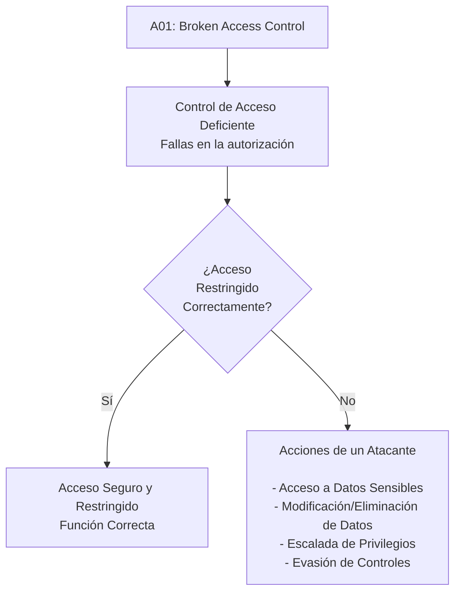
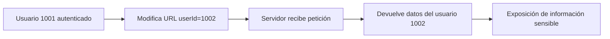
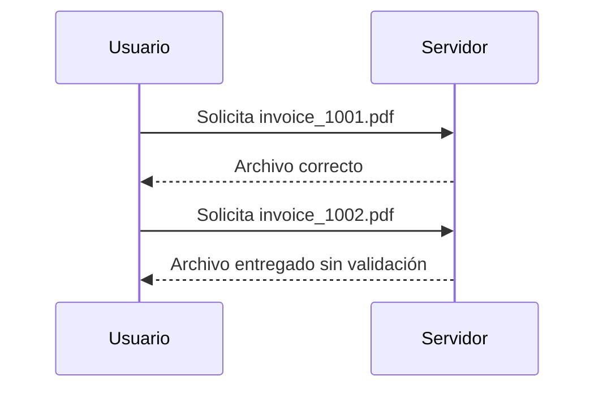
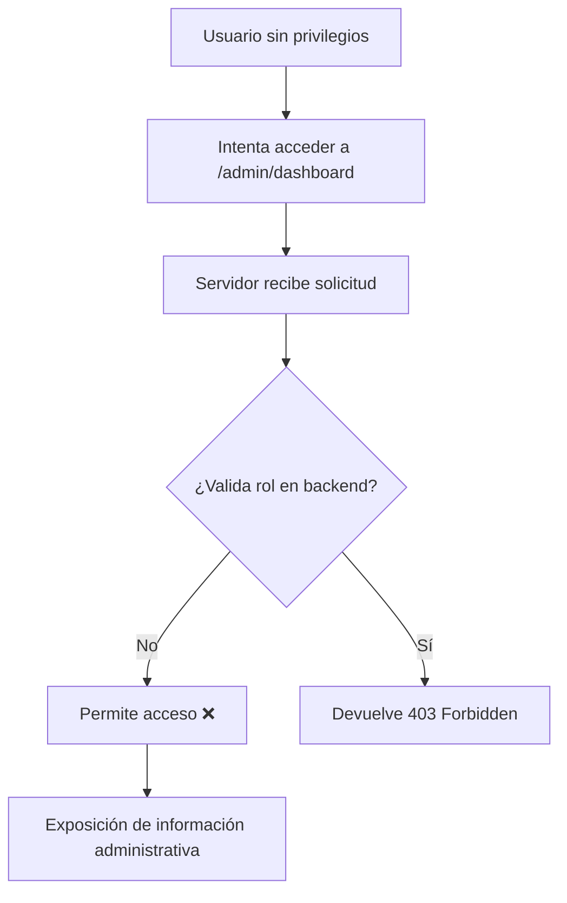
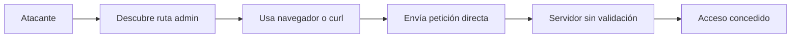
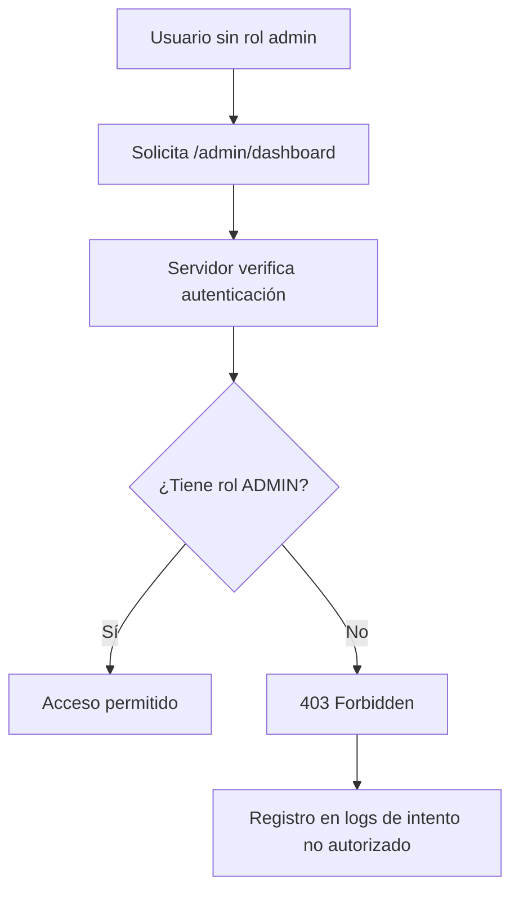
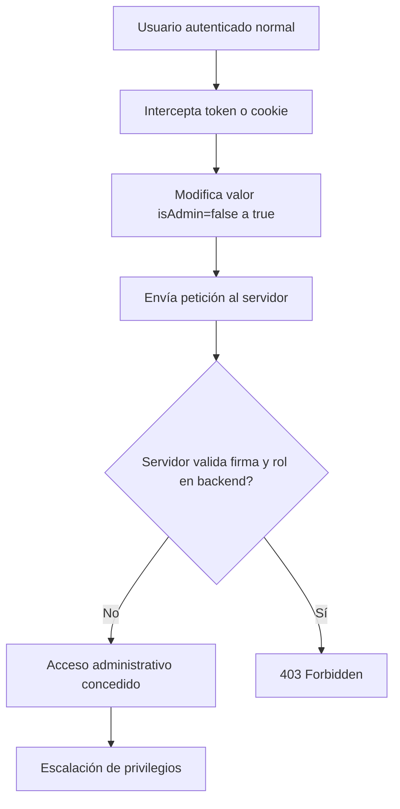
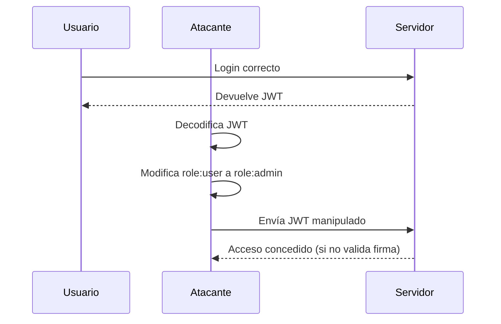
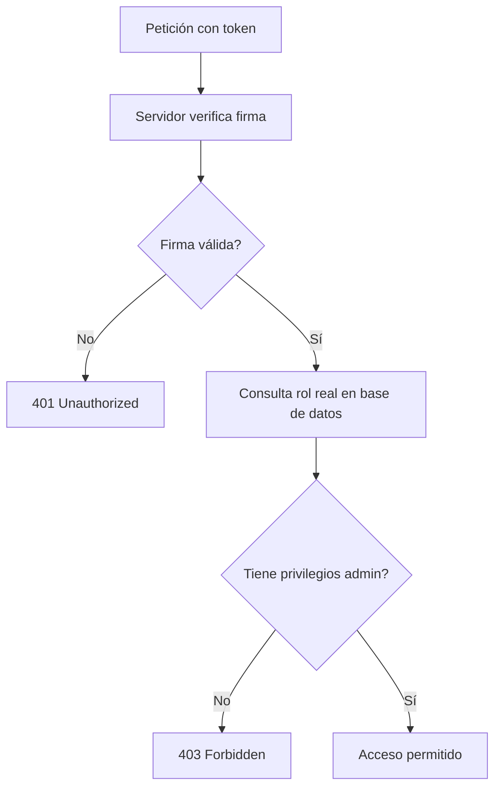

**INTEGRANTES**

**ROBERTO CARLOS MUÑOZ

CARLOS ALBERTO GONZALEZ

DIEGO ARMANDO HERNANDEZ

DANIEL MAURICIO DAZA BORJA**

# Análisis de Vulnerabilidades en el OWASP Top 10: Métodos de Explotación y Prevención

# Introducción

El **OWASP Top 10** es un documento de referencia publicado por la organización internacional **OWASP (Open Web Application Security Project)**, que identifica las **10 vulnerabilidades más críticas en aplicaciones web** a nivel mundial.

La edición 2025 representa una actualización basada en:

* Datos reales recopilados de miles de aplicaciones
* Análisis de expertos en ciberseguridad
* Tendencias actuales de ataques
* Cambios en arquitecturas modernas (APIs, microservicios, cloud, DevSecOps)

---

## 🎯 ¿Por qué es importante?

El OWASP Top 10:

* Sirve como estándar global de referencia en seguridad web
* Es utilizado en auditorías, pentesting y cumplimiento normativo
* Orienta a desarrolladores sobre los riesgos más críticos
* Ayuda a priorizar controles de seguridad

---

## 🌍 Enfoque de la edición 2025

La versión 2025 enfatiza especialmente:

* Fallas en control de acceso
* Problemas en mecanismos de autenticación
* Seguridad en APIs
* Gestión de identidades y tokens
* Riesgos en entornos cloud y DevSecOps

---

## 🚀 Objetivo principal

El propósito del OWASP Top 10 no es solo listar vulnerabilidades, sino **crear conciencia y promover mejores prácticas de seguridad desde el diseño hasta la implementación y operación de las aplicaciones.**

---

# 1. A01: Broken Access Control

El **A01: Broken Access Control** del OWASP Top 10 se refiere a las fallas en los mecanismos de autorización que permiten que un usuario realice acciones o acceda a recursos para los que no tiene permisos.

El control de acceso es el sistema que define qué puede hacer cada usuario dentro de una aplicación, según su rol y privilegios, aplicando principios como el **mínimo privilegio** (solo permitir lo estrictamente necesario). Cuando este mecanismo está mal diseñado, mal configurado o no se valida correctamente en el servidor, se produce una vulnerabilidad de autorización rota. 


En la práctica, esto puede permitir que un atacante:

-   Acceda a información confidencial de otros usuarios.
    
-   Modifique o elimine datos sin autorización.
    
-   Ejecute funciones administrativas sin tener privilegios.
    
-   Manipule identificadores, parámetros, tokens (como JWT) o URLs para evadir controles.
    
-   Aproveche configuraciones incorrectas como CORS mal configurado o APIs sin validación adecuada.
    

Este tipo de vulnerabilidad incluye problemas como IDOR, escalación de privilegios y configuraciones inseguras relacionadas con autorización. Está clasificada en la CWE como CWE-284 (Improper Access Control).

En resumen, **Broken Access Control ocurre cuando una aplicación no restringe correctamente lo que cada usuario puede hacer o ver**, lo que puede comprometer la confidencialidad, integridad y disponibilidad del sistema, siendo una de las vulnerabilidades más críticas y frecuentes en aplicaciones modernas, provocando filtraciones de datos, escalada de privilegios y severos daños reputacionales.

# Diagrama de Flujo


----------

## ⚔️ Métodos de Explotación

Los atacantes aprovechan estas fallas mediante distintas técnicas:

### 1️⃣ Manipulación de URL y Parámetros (IDOR)

Consiste en modificar identificadores en la URL o en los parámetros de una petición para acceder a recursos de otros usuarios.

**Ejemplo cambio ID en la URL:**

Solicitud legítima:

```
GET https://app.com/profile?userId=1001

```

El atacante modifica el ID:

```
GET https://app.com/profile?userId=1002

```

Si el backend no valida la propiedad del recurso, devolverá datos del usuario 1002.

----------

## 📊 Diagrama Vulnerable



**Ejemplo descarga de archivos:**

Solicitud original:

```
GET /download?file=invoice_1001.pdf

```

Ataque:

```
GET /download?file=invoice_1002.pdf

```

Si no hay validación → descarga de factura de otro usuario.

----------

## 📊 Diagrama Secuencia



----------

### 2️⃣ Force Browsing (Navegación Forzada)

## 📌 Escenario

Un atacante intenta acceder directamente a rutas administrativas:

```
/admin/listar_mails
/admin/dashboard
/app/admin_getappInfo
```

Aunque el frontend o la interfaz gráfica no muestre estos enlaces, el atacante puede acceder manualmente usando navegador, herramientas o línea de comandos:

```bash
curl https://example.com/app/admin_getappInfo
```

---

# 🔴 Diagrama de Flujo – Escenario Vulnerable



---

# 🟠 Flujo Detallado del Ataque



---

# 🟢 Flujo Seguro (Control Correcto)



----------

### 3️⃣ Manipulación de Tokens y Cookies

## 📌 Escenario

Un atacante intenta:

* Alterar un **JWT**
* Modificar cookies
* Cambiar valores ocultos (`isAdmin=false → true`)
* Reutilizar una sesión activa (Session Hijacking)

Si el servidor **no valida la firma del token ni los privilegios reales en backend**, se produce **escalación de privilegios**.

---

# 🔴 Flujo Vulnerable – Escalación de Privilegios




---

# 🟠 Flujo Específico – Manipulación de JWT



---

# 🟢 Flujo Seguro – Validación Correcta



----------

## 🛠️ Herramientas Comunes Utilizadas

-   **[Burp Suite Professional](https://www.google.com/search?q=Burp+Suite+Professional&oq=Herramientas+Comunes+Utilizadas+para+A01%3A+Broken+Access+Control&gs_lcrp=EgZjaHJvbWUyBggAEEUYOdIBCTc2OTIxajBqN6gCALACAA&sourceid=chrome&ie=UTF-8&mstk=AUtExfATjnT5AHVjJJoehzKWOmL67AiPCf4MNQ3krtoVDaW07zGrlV03ZJhpdQVk4_TTTreg5Ln8P5gr51X6D5Af3AMt-4kTxbqgKXVIC6ksbQnXE60QOJdr-i1lMDdupnHFNZ8kfssE0t3u23M0vURgvYnsjIzeekLNRpAbj0O6kWTniws&csui=3&ved=2ahUKEwjP6v2XzoKTAxWUezABHWxbPQQQgK4QegQIAhAB)/Community**: La herramienta principal para interceptar, analizar y modificar peticiones HTTP/HTTPS (manipulación de parámetros, cookies, JWT) para probar IDOR (Insecure Direct Object Reference) y elevación de privilegios.
-   **[OWASP ZAP](https://www.google.com/search?q=OWASP+ZAP&oq=Herramientas+Comunes+Utilizadas+para+A01%3A+Broken+Access+Control&gs_lcrp=EgZjaHJvbWUyBggAEEUYOdIBCTc2OTIxajBqN6gCALACAA&sourceid=chrome&ie=UTF-8&mstk=AUtExfATjnT5AHVjJJoehzKWOmL67AiPCf4MNQ3krtoVDaW07zGrlV03ZJhpdQVk4_TTTreg5Ln8P5gr51X6D5Af3AMt-4kTxbqgKXVIC6ksbQnXE60QOJdr-i1lMDdupnHFNZ8kfssE0t3u23M0vURgvYnsjIzeekLNRpAbj0O6kWTniws&csui=3&ved=2ahUKEwjP6v2XzoKTAxWUezABHWxbPQQQgK4QegQIAhAD)  (Zed Attack Proxy)**: Escáner de seguridad web de código abierto, ideal para encontrar accesos no protegidos y fallos de autorización automatizados.
-   **[FFUF](https://www.google.com/search?q=FFUF&oq=Herramientas+Comunes+Utilizadas+para+A01%3A+Broken+Access+Control&gs_lcrp=EgZjaHJvbWUyBggAEEUYOdIBCTc2OTIxajBqN6gCALACAA&sourceid=chrome&ie=UTF-8&mstk=AUtExfATjnT5AHVjJJoehzKWOmL67AiPCf4MNQ3krtoVDaW07zGrlV03ZJhpdQVk4_TTTreg5Ln8P5gr51X6D5Af3AMt-4kTxbqgKXVIC6ksbQnXE60QOJdr-i1lMDdupnHFNZ8kfssE0t3u23M0vURgvYnsjIzeekLNRpAbj0O6kWTniws&csui=3&ved=2ahUKEwjP6v2XzoKTAxWUezABHWxbPQQQgK4QegQIAhAF)  (Fuzz Faster U Fool)**: Herramienta de  _fuzzing_  web de alto rendimiento utilizada para descubrir directorios ocultos, URLs no autorizadas y endpoints de API.
-   **[Gobuster](https://www.google.com/search?q=Gobuster&oq=Herramientas+Comunes+Utilizadas+para+A01%3A+Broken+Access+Control&gs_lcrp=EgZjaHJvbWUyBggAEEUYOdIBCTc2OTIxajBqN6gCALACAA&sourceid=chrome&ie=UTF-8&mstk=AUtExfATjnT5AHVjJJoehzKWOmL67AiPCf4MNQ3krtoVDaW07zGrlV03ZJhpdQVk4_TTTreg5Ln8P5gr51X6D5Af3AMt-4kTxbqgKXVIC6ksbQnXE60QOJdr-i1lMDdupnHFNZ8kfssE0t3u23M0vURgvYnsjIzeekLNRpAbj0O6kWTniws&csui=3&ved=2ahUKEwjP6v2XzoKTAxWUezABHWxbPQQQgK4QegQIAhAH)**: Utilizada para la fuerza bruta de URIs (directorios y archivos) y subdominios, lo que permite identificar páginas ocultas accesibles sin autenticación.
-   **[JWT Editor (Extensión de Burp)](https://www.google.com/search?q=JWT+Editor+%28Extensi%C3%B3n+de+Burp%29&oq=Herramientas+Comunes+Utilizadas+para+A01%3A+Broken+Access+Control&gs_lcrp=EgZjaHJvbWUyBggAEEUYOdIBCTc2OTIxajBqN6gCALACAA&sourceid=chrome&ie=UTF-8&mstk=AUtExfATjnT5AHVjJJoehzKWOmL67AiPCf4MNQ3krtoVDaW07zGrlV03ZJhpdQVk4_TTTreg5Ln8P5gr51X6D5Af3AMt-4kTxbqgKXVIC6ksbQnXE60QOJdr-i1lMDdupnHFNZ8kfssE0t3u23M0vURgvYnsjIzeekLNRpAbj0O6kWTniws&csui=3&ved=2ahUKEwjP6v2XzoKTAxWUezABHWxbPQQQgK4QegQIAhAJ)**: Fundamental para decodificar, modificar y firmar de nuevo los tokens JWT para probar la manipulación de metadatos.
-   **[Postman](https://www.google.com/search?q=Postman&oq=Herramientas+Comunes+Utilizadas+para+A01%3A+Broken+Access+Control&gs_lcrp=EgZjaHJvbWUyBggAEEUYOdIBCTc2OTIxajBqN6gCALACAA&sourceid=chrome&ie=UTF-8&mstk=AUtExfATjnT5AHVjJJoehzKWOmL67AiPCf4MNQ3krtoVDaW07zGrlV03ZJhpdQVk4_TTTreg5Ln8P5gr51X6D5Af3AMt-4kTxbqgKXVIC6ksbQnXE60QOJdr-i1lMDdupnHFNZ8kfssE0t3u23M0vURgvYnsjIzeekLNRpAbj0O6kWTniws&csui=3&ved=2ahUKEwjP6v2XzoKTAxWUezABHWxbPQQQgK4QegQIAhAL)**: Muy utilizada para probar API endpoints, permitiendo enviar peticiones con diferentes roles de usuario para verificar si un usuario sin privilegios puede ejecutar POST, PUT o DELETE.
-   **[SQLMap](https://www.google.com/search?q=SQLMap&oq=Herramientas+Comunes+Utilizadas+para+A01%3A+Broken+Access+Control&gs_lcrp=EgZjaHJvbWUyBggAEEUYOdIBCTc2OTIxajBqN6gCALACAA&sourceid=chrome&ie=UTF-8&mstk=AUtExfATjnT5AHVjJJoehzKWOmL67AiPCf4MNQ3krtoVDaW07zGrlV03ZJhpdQVk4_TTTreg5Ln8P5gr51X6D5Af3AMt-4kTxbqgKXVIC6ksbQnXE60QOJdr-i1lMDdupnHFNZ8kfssE0t3u23M0vURgvYnsjIzeekLNRpAbj0O6kWTniws&csui=3&ved=2ahUKEwjP6v2XzoKTAxWUezABHWxbPQQQgK4QegQIAhAN)**: Aunque es para SQL Injection, a menudo revela accesos de administrador o fugas de datos que ocurren por controles de acceso defectuosos.
----------
## 🚨 Ejemplos Reales

⚡ **Facebook “View As”:** Un fallo permitió a atacantes acceder a tokens de acceso de otros usuarios por una falla de control de acceso. Esto expuso millones de cuentas.

⚡ **Snapchat (2014):**  Hackers explotaron una vulnerabilidad de control de acceso para recopilar una lista de 4.6 millones de nombres de usuario y números de teléfono.

---

# 📉 3. Mejores Prácticas de Prevención y Mitigación

---

## 🔐 3.1 Denegar por Defecto (Deny by Default)

Todo recurso debe estar protegido a menos que sea explícitamente público.

---

## 🏗 3.2 Centralizar la Lógica de Autorización

* No dispersar validaciones
* Usar RBAC o ABAC
* Reutilizar módulos de autorización

---

## 👤 3.3 Validar Propiedad del Recurso

No basta validar rol:

```pseudo
if user.id == recurso.owner_id
```

Siempre validar que el usuario sea dueño del objeto.

---

## 🔒 3.4 Aplicar Control en el Servidor

Nunca confiar en:

* HTML
* JavaScript
* Campos ocultos

---

## 🔄 3.5 Gestión Segura de Tokens y Sesiones

* Invalidar sesiones al logout
* JWT de corta duración
* Validar claims (aud, iss, role)
* Implementar refresh tokens seguros

---

## 🌐 3.6 Configuración Segura de CORS

* Definir orígenes específicos
* No usar wildcard en APIs sensibles

---

## 🚦 3.7 Implementar Rate Limiting

Reduce:

* Enumeración de IDs
* Automatización de ataques

---

## 📊 3.8 Logging y Monitoreo

Registrar:

* Intentos fallidos
* Accesos denegados
* Escaladas sospechosas

---

## 🧪 3.9 Pruebas de Seguridad

* Pentesting
* Pruebas de navegación forzada
* Pruebas IDOR
* SAST y DAST
* Tests unitarios de autorización

---

## 📋 3.10 Aplicar Principio de Mínimo Privilegio

Cada usuario debe tener:

> Solo los permisos estrictamente necesarios

---

# 🔎 Ejemplo Seguro vs Vulnerable

### ❌ Código Vulnerable

```php
if(isset($_SESSION['loggedin'])) {
   cargar_emails();
}
```

No valida rol.

---

### ✅ Código Seguro

```php
if(isset($_SESSION['loggedin']) && $_SESSION['isadmin'] == true) {
   cargar_emails();
}
```

Valida autenticación y autorización.

---

## 🚫 ¿Qué NO es un fallo de autenticación?

| Caso                              | Clasificación Correcta |
| --------------------------------- | ---------------------- |
| Usuario ve datos que no debería   | Fallo de autorización  |
| Phishing externo                  | Robo de credenciales   |
| Servidor caído                    | Fallo operativo        |
| Usuario escribe mal la contraseña | Error humano           |

---

# 🏁 Conclusión

Los **Fallos de Autenticación (A07)** siguen siendo una de las vulnerabilidades más críticas del Top 10 de OWASP.

En un mundo donde:

* Las aplicaciones usan APIs
* Existe SSO
* Se manejan tokens JWT
* Los servicios están en la nube

La complejidad aumenta y también el riesgo.

Una autenticación débil puede permitir:

* Secuestro de cuentas
* Ransomware
* Exfiltración de datos
* Daño reputacional severo

🔐 La autenticación no es solo un login.
Es la base de toda la seguridad del sistema.

---


