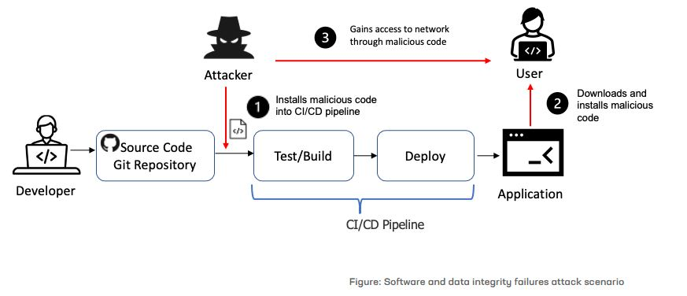

# Integrantes

Leidy Dayana Avendaño Moreno

Jeisson Andres Hernandez Martinez

Michael Giovanny Sierra Leon

  

# A01:2025 Broken Access Control.

  

Fallas que permiten a usuarios acceder a datos o funciones fuera de sus permisos. Permitiendo a los atacantes o usuarios saltarse la autorización y realizar tareas con privilegiados como los de un administrador. 

### Métodos de explotación: 
     - IDOR (Insecure Direct Object Reference): Cambiar un ID en la URL o parámetro 
       (ej. ?user_id=100 a ?user_id=101) para ver los datos de otro usuario. 
       
     - Manipulación de URL/Endpoint: Acceder directamente a páginas administrativas 
       (ej. /admin.php) sin autenticarse como administrador. 
     
     - Escalada de Privilegios Vertical: Un usuario con bajo nivel de acceso logra realizar acciones de administrador. 
     
     - Escalada de Privilegios Horizontal: Un usuario accede a datos de otro usuario con el mismo nivel de permisos.
     
     - Manipulación de Parámetros/CORS: Modificar solicitudes para eludir controles de seguridad basados 
       en el cliente o mal configurados. 
       
     - Falta de Validación en el Servidor: Modificar datos enviados al servidor (API) esperando que este 
       no verifique si el usuario tiene permiso para modificar dicho recurso. 

## Prevención y mitigación: 
     - Los controles de acceso pueden asegurar que una aplicación web utilice tokens de autorización y establezca controles 
       estrictos sobre los mismos. Esta es una forma de garantizar que el usuario es quien dice ser, sin tener que introducir 
       constantemente sus credenciales de acceso.
       
     - Implementar el concepto de acceso menos privilegiado, auditando regularmente servidores y sitios web, aplicando MFA 
       y eliminando usuarios inactivos y servicios innecesarios de los servidores. 

---

# A02:2025 Security Misconfiguration. 

  

Ajustes por defecto inseguros, servicios innecesarios abiertos o falta de endurecimiento (hardening), las configuraciones usadas como predeterminadas 
en algunos sitios sitio web o del sistema de administración de contenido (CMS), pueden revelar inadvertidamente vulnerabilidades de aplicaciones. 

### Métodos de explotación: 
     - Escaneo de directorios y archivos: Uso de herramientas como Gobuster o Dirb para encontrar archivos sensibles expuestos 
       (archivos de configuración, copias de seguridad) que no deberían ser públicos. 

     - Credenciales predeterminadas: Intento de acceso a paneles de administración utilizando nombres de usuario y contraseñas 
       estándar (ej. admin/admin) que no fueron cambiados tras la instalación. 

     - Enumeración de servicios (Banner Grabbing): Identificar versiones de software obsoletas o servicios innecesarios 
       habilitados (ej. SSH, FTP, SMB) mediante escaneo de puertos. 

     - Explotación de permisos en la nube: Acceder a buckets de almacenamiento (como AWS S3) mal configurados que permiten 
       la lectura o escritura pública de datos. 

     - Análisis de mensajes de error: Provocar errores para obtener información detallada del servidor (Stack Traces), lo que 
       revela rutas de archivos, versiones de framework o estructura de base de datos. 

     - Explotación de configuraciones HTTP: Aprovechar la falta de cabeceras de seguridad (como HSTS, CSP) o 
       versiones de TLS obsoletas. 

### Prevención y mitigación: 

     - Cambiar la configuración predeterminada del webmaster o CMS, elimina las características de código no utilizadas y controlar
       los comentarios del usuario y la visibilidad de la   información de este. Los desarrolladores también deben eliminar la 
       documentación, las características, los marcos y las muestras innecesarias, segmentar la arquitectura de la aplicación 
       y automatizar la efectividad de las configuraciones y los ajustes del entorno web. 

---

# A03:2025  Software Supply Chain Failures. 

  

Riesgos en bibliotecas de terceros, herramientas de compilación y pipelines CI/CD.  

### Métodos de explotación:  
     - Inyección de Código en Componentes de Código Abierto: Los atacantes comprometen bibliotecas populares 
       (ej. repositorios NPM, PyPI) para incluir código malicioso que luego se descarga automáticamente. 

     - Compromiso de Herramientas de Construcción/Distribución (CI/CD): Hackeo de los sistemas utilizados 
       por los desarrolladores para crear o distribuir el software, insertando puertas traseras en la 
       fase de compilación. 

     - Actualizaciones de Software "Troyanizadas": Compromiso del servidor de actualizaciones de un proveedor
       distribuyendo malware a través de parches legítimos, como ocurrió con SolarWinds Orion. 

     - Ataques de Tipo "Typosquatting": Publicación de paquetes maliciosos con nombres muy similares a bibliotecas
       populares, esperando que los desarrolladores cometan errores de escritura al instalarlos. 

     - Robo de Credenciales de Desarrolladores: Obtención de acceso a cuentas de desarrolladores con 
       privilegios para modificar código fuente o lanzar nuevas versiones de productos. 

     - Manipulación de Hardware/Firmware: Inserción de vulnerabilidades en el código 
       base o componentes físicos durante la fabricación. 

### Prevención y mitigación: 

     - Para garantizar que la integridad de los datos y que las actualizaciones no están en riesgo, los desarrolladores
       de aplicaciones deben utilizar firmas digitales para verificar las actualizaciones, comprobar sus cadenas de 
       suministro de software y asegurarse que los canales de integración e implementación continuas (CI/CD) tengan 
       un control de acceso eficaz y que estén correctamente configurados. 

---

# A04:2025 Cryptographic Failures

  

Protección inadecuada de datos sensibles en tránsito o en reposo (antes Exposición de Datos Sensibles), los atacantes pueden acceder a esos datos y venderlos o utilizarlos con fines maliciosos. También pueden robar información confidencial mediante un ataque en ruta. 

### Métodos de explotación:  
     - Ataques Man-in-the-Middle (MitM): Interceptación de tráfico al no utilizar TLS, usar protocolos 
       obsoletos (SSL, TLS 1.0/1.1) o aceptar certificados inválidos, permitiendo el robo de sesiones. 

     - Ataques de Fuerza Bruta y Rainbow Tables: Dirigidos a contraseñas cifradas con algoritmos 
       débiles (MD5, SHA1) o sin el uso de salt (valor aleatorio). 

     - Explotación de Cifrado Débil o Nulo: Uso de algoritmos de cifrado obsoletos o ineficaces 
       que permiten descifrar datos almacenados. 

     - Mal Manejo de Claves: Robo de claves criptográficas debido a almacenamiento inseguro 
       (claves hardcoded en el código, expuestas en repositorios) o uso de claves predecibles. 

     - Modos de Operación Inseguros: Uso de modos como ECB (Electronic Codebook) que 
       revelan patrones en los datos cifrados. 

     - Inyección SQL para Descifrado: Explotación de inyecciones SQL para extraer datos que 
       se descifran automáticamente al recuperarse de la base de datos. 

### Prevención y mitigación: 
     - La exposición de los datos se puede minimizar encriptando todos los datos confidenciales
       autenticando todas las transmisiones y desactivando el almacenamiento en caché de cualquier
       información confidencial. 

---

# A05:2025 - Injection

 ### Métodos de explotación: 
   
 ### Prevención y mitigación:  

---
# A06:2025 - Insecure Design

 ### Métodos de explotación: 
   
 ### Prevención y mitigación:  
---

# A07:2025 - Authentication Failures

 ### Métodos de explotación: 
   
 ### Prevención y mitigación:  
---

# A08:2025 - Software or Data Integrity Failures 
  CWE-829
    - Actualizaciones de software 
    - Datos críticos y de CI/CD (Continuos Integration and Continuos Delivery) sin verificación.
    - Fallas en la cadena de suministro de software

  

   ### Métodos de explotación: 
     - Denial of Service -> 
     - Cache Poisoning ->
     - Code injection ->
     - Command execution ->
     
     
   ### Prevención y mitigación:   
     - Utilizar firmas digitales para verifificar que el software no ha sido alterado
     - 
  
---

# A09:2025 - Security Logging and Alerting Failures

 ### Métodos de explotación: 
   
 ### Prevención y mitigación:  

---

# A10:2025 - Mishandling of Exceptional Conditions

 ### Métodos de explotación: 
   
 ### Prevención y mitigación:  

---

# Referencias:  

- https://www.cloudflare.com/es-es/learning/security/threats/owasp-top-10/  
- https://www.fortinet.com/lat/resources/cyberglossary/owasp 
- https://sucuri.net/guides/what-is-broken-access-control/
- https://www.geeksforgeeks.org/ethical-hacking/owasp-top-10-vulnerabilities-and-preventions/

