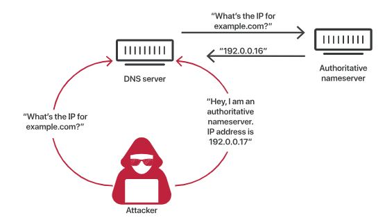
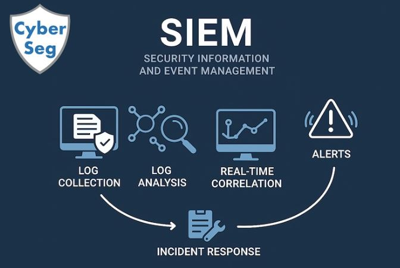
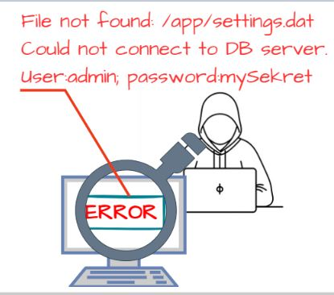

# Integrantes

Leidy Dayana Avendaño Moreno

Jeisson Andres Hernandez Martinez

Michael Giovanny Sierra Leon

  

# A01:2025 Broken Access Control.

  

Fallas que permiten a usuarios acceder a datos o funciones fuera de sus permisos. Permitiendo a los atacantes o usuarios saltarse la autorización y realizar tareas con privilegiados como los de un administrador. 

### Métodos de explotación: 
     - IDOR (Insecure Direct Object Reference): Cambiar un ID en la URL o parámetro 
       (ej. ?user_id=100 a ?user_id=101) para ver los datos de otro usuario. 
       
     - Manipulación de URL/Endpoint: Acceder directamente a páginas administrativas 
       (ej. /admin.php) sin autenticarse como administrador. 
     
     - Escalada de Privilegios Vertical: Un usuario con bajo nivel de acceso logra realizar acciones de administrador. 
     
     - Escalada de Privilegios Horizontal: Un usuario accede a datos de otro usuario con el mismo nivel de permisos.
     
     - Manipulación de Parámetros/CORS: Modificar solicitudes para eludir controles de seguridad basados 
       en el cliente o mal configurados. 
       
     - Falta de Validación en el Servidor: Modificar datos enviados al servidor (API) esperando que este 
       no verifique si el usuario tiene permiso para modificar dicho recurso. 

## Prevención y mitigación: 
     - Los controles de acceso pueden asegurar que una aplicación web utilice tokens de autorización y establezca controles 
       estrictos sobre los mismos. Esta es una forma de garantizar que el usuario es quien dice ser, sin tener que introducir 
       constantemente sus credenciales de acceso.
       
     - Implementar el concepto de acceso menos privilegiado, auditando regularmente servidores y sitios web, aplicando MFA 
       y eliminando usuarios inactivos y servicios innecesarios de los servidores. 

### Ejemplo ataque real:  

Snapchat en 2014, donde atacantes explotaron fallos de autorización para compilar una lista de 4.6 millones de usuarios, incluyendo números de teléfono y ubicaciones. Este ataque tipo IDOR (Insecure Direct Object Reference) permitió enumerar usuarios mediante la manipulación de parámetros de la API. 

---

# A02:2025 Security Misconfiguration. 

  

Ajustes por defecto inseguros, servicios innecesarios abiertos o falta de endurecimiento (hardening), las configuraciones usadas como predeterminadas 
en algunos sitios sitio web o del sistema de administración de contenido (CMS), pueden revelar inadvertidamente vulnerabilidades de aplicaciones. 

### Métodos de explotación: 
     - Escaneo de directorios y archivos: Uso de herramientas como Gobuster o Dirb para encontrar archivos sensibles expuestos 
       (archivos de configuración, copias de seguridad) que no deberían ser públicos. 

     - Credenciales predeterminadas: Intento de acceso a paneles de administración utilizando nombres de usuario y contraseñas 
       estándar (ej. admin/admin) que no fueron cambiados tras la instalación. 

     - Enumeración de servicios (Banner Grabbing): Identificar versiones de software obsoletas o servicios innecesarios 
       habilitados (ej. SSH, FTP, SMB) mediante escaneo de puertos. 

     - Explotación de permisos en la nube: Acceder a buckets de almacenamiento (como AWS S3) mal configurados que permiten 
       la lectura o escritura pública de datos. 

     - Análisis de mensajes de error: Provocar errores para obtener información detallada del servidor (Stack Traces), lo que 
       revela rutas de archivos, versiones de framework o estructura de base de datos. 

     - Explotación de configuraciones HTTP: Aprovechar la falta de cabeceras de seguridad (como HSTS, CSP) o 
       versiones de TLS obsoletas. 

### Prevención y mitigación: 

     - Cambiar la configuración predeterminada del webmaster o CMS, elimina las características de código no utilizadas y controlar
       los comentarios del usuario y la visibilidad de la   información de este. Los desarrolladores también deben eliminar la 
       documentación, las características, los marcos y las muestras innecesarias, segmentar la arquitectura de la aplicación 
       y automatizar la efectividad de las configuraciones y los ajustes del entorno web. 

### Ejemplo ataque real: 

Filtración de datos de Capital One en 2019, donde un atacante explotó un firewall de aplicaciones web (WAF) mal configurado en la nube. Esto permitió el acceso a un bucket de Amazon S3, exponiendo datos de 106 millones de clientes. 

---

# A03:2025  Software Supply Chain Failures. 

  

Riesgos en bibliotecas de terceros, herramientas de compilación y pipelines CI/CD.  

### Métodos de explotación:  
     - Inyección de Código en Componentes de Código Abierto: Los atacantes comprometen bibliotecas populares 
       (ej. repositorios NPM, PyPI) para incluir código malicioso que luego se descarga automáticamente. 

     - Compromiso de Herramientas de Construcción/Distribución (CI/CD): Hackeo de los sistemas utilizados 
       por los desarrolladores para crear o distribuir el software, insertando puertas traseras en la 
       fase de compilación. 

     - Actualizaciones de Software "Troyanizadas": Compromiso del servidor de actualizaciones de un proveedor
       distribuyendo malware a través de parches legítimos, como ocurrió con SolarWinds Orion. 

     - Ataques de Tipo "Typosquatting": Publicación de paquetes maliciosos con nombres muy similares a bibliotecas
       populares, esperando que los desarrolladores cometan errores de escritura al instalarlos. 

     - Robo de Credenciales de Desarrolladores: Obtención de acceso a cuentas de desarrolladores con 
       privilegios para modificar código fuente o lanzar nuevas versiones de productos. 

     - Manipulación de Hardware/Firmware: Inserción de vulnerabilidades en el código 
       base o componentes físicos durante la fabricación. 

### Prevención y mitigación: 

     - Para garantizar que la integridad de los datos y que las actualizaciones no están en riesgo, los desarrolladores
       de aplicaciones deben utilizar firmas digitales para verificar las actualizaciones, comprobar sus cadenas de 
       suministro de software y asegurarse que los canales de integración e implementación continuas (CI/CD) tengan 
       un control de acceso eficaz y que estén correctamente configurados. 

### Ejemplo ataque real:  

El ataque a ASUS en 2018, según los investigadores de Symantec, aprovechó una función de actualización y afectó hasta 500,000 sistemas. En el ataque, se utilizó una actualización automática para introducir malware en los sistemas de los usuarios. 

---

# A04:2025 Cryptographic Failures

  

Protección inadecuada de datos sensibles en tránsito o en reposo (antes Exposición de Datos Sensibles), los atacantes pueden acceder a esos datos y venderlos o utilizarlos con fines maliciosos. También pueden robar información confidencial mediante un ataque en ruta. 

### Métodos de explotación:  
     - Ataques Man-in-the-Middle (MitM): Interceptación de tráfico al no utilizar TLS, usar protocolos 
       obsoletos (SSL, TLS 1.0/1.1) o aceptar certificados inválidos, permitiendo el robo de sesiones. 

     - Ataques de Fuerza Bruta y Rainbow Tables: Dirigidos a contraseñas cifradas con algoritmos 
       débiles (MD5, SHA1) o sin el uso de salt (valor aleatorio). 

     - Explotación de Cifrado Débil o Nulo: Uso de algoritmos de cifrado obsoletos o ineficaces 
       que permiten descifrar datos almacenados. 

     - Mal Manejo de Claves: Robo de claves criptográficas debido a almacenamiento inseguro 
       (claves hardcoded en el código, expuestas en repositorios) o uso de claves predecibles. 

     - Modos de Operación Inseguros: Uso de modos como ECB (Electronic Codebook) que 
       revelan patrones en los datos cifrados. 

     - Inyección SQL para Descifrado: Explotación de inyecciones SQL para extraer datos que 
       se descifran automáticamente al recuperarse de la base de datos. 

### Prevención y mitigación: 
     - La exposición de los datos se puede minimizar encriptando todos los datos confidenciales
       autenticando todas las transmisiones y desactivando el almacenamiento en caché de cualquier
       información confidencial. 

### Ejemplo ataque real:  

Facebook en 2018 donde se almacenaron millones de contraseñas de usuarios en formato de texto plano (sin cifrar) en sus servidores internos. Esto permitió que empleados y atacantes potenciales accedieran a credenciales sensibles, violando la seguridad y la confidencialidad de la información. 

---

# A05:2025 - Injection

Esta categoría abarca vulnerabilidades que se presentan cuando una aplicación permite que datos no confiables lleguen a un intérprete (como una base de datos, navegador, sistema operativo o motor de búsqueda) y estos se procesen como instrucciones en lugar de simples datos.

 ### Métodos de explotación: 
 
    - SQL Injection: alterar consultas a bases de datos.
    - Cross-Site Scripting (XSS): inyectar código malicioso en páginas web.
    - Command Injection: ejecutar comandos en el sistema operativo.
    
    Paso 1 – Contexto del sistema Un módulo de búsqueda arma consultas dinámicas para filtrar registros.
    Paso 2 – Acción general del atacante El atacante introduce un valor diseñado para cambiar el significado de la consulta en vez de solo “buscar”.
    Paso 3 – Resultado o impacto La aplicación devuelve información que no debería o ejecuta operaciones no previstas, afectando datos y confidencialidad. 

    
 ### Ejemplo ataque real: 

   **Vulnerabilidad de inyección SQL en MOVEit Transfer**
   
    En mayo de 2023, Progress reveló una vulnerabilidad crítica de inyección SQL en MOVEit Transfer, identificada como  . Esta falla permitía el acceso no autorizado a bases de datos, lo que hacía vulnerables los datos confidenciales. Atacantes asociados con el grupo de ransomware Clop la explotaron como un ataque de día cero antes de que se corrigiera la vulnerabilidad.
    
    Impacto : Se comprometieron bases de datos y se robó información confidencial. La disponibilidad de código de prueba de concepto (PoC) aumentó la probabilidad de mayor explotación por parte de otros actores maliciosos que atacaban sistemas sin parches.

 ### Prevención y mitigación:  

    - Validación estricta de entradas (listas blancas, sanitización).
    - Uso de consultas parametrizadas (prepared statements).
    - Escapado adecuado de datos antes de enviarlos a intérpretes.
    - Principio de menor privilegio en bases de datos y sistemas.
    - Frameworks seguros que separen datos de comandos.
    
---
# A06:2025 - Insecure Design

El diseño inseguro comprende vulnerabilidades que surgen debido a controles de seguridad mal planteados o inexistentes desde la etapa de diseño. Aunque un diseño adecuado puede verse afectado por errores durante la implementación, un diseño deficiente no puede corregirse únicamente con una ejecución técnica impecable, ya que los controles necesarios nunca fueron considerados. Una causa común es la falta de un análisis de riesgos que permita establecer el nivel de protección requerido para el sistema o software.

 ### Métodos de explotación: 

    Paso 1 – Contexto del sistema
    Un sistema ofrece un beneficio comercial bajo ciertas condiciones (por ejemplo, reservas o descuentos).
    
    Paso 2 – Acción general del atacante
    El atacante explota un vacío en el diseño del flujo para forzar un comportamiento no previsto (sin romper técnicamente nada).
    
    Paso 3 – Resultado o impacto
    El negocio pierde dinero o sufre abuso operativo porque el sistema nunca diseñó defensas para ese escenario.

 ### Ejemplo ataque real: 

    El sitio web de comercio electrónico de una cadena minorista no cuenta con protección contra bots administrados por revendedores que compran tarjetas de video de alta gama para revenderlas en sitios web de subastas. Esto genera una mala publicidad para los fabricantes de tarjetas de video y los propietarios de las cadenas minoristas, además de generar una mala relación con los aficionados que no pueden obtener estas tarjetas a ningún precio. Un diseño antibots cuidadoso y reglas de lógica de dominio, como las compras realizadas a los pocos segundos de estar disponibles, podrían identificar compras no auténticas y rechazar dichas transacciones.

 ### Prevención y mitigación:  

     - Adoptar un SDLC seguro con apoyo de especialistas en AppSec e incorporación de controles de seguridad y privacidad desde el diseño.
    
    - Aplicar diseño seguro y modelado de amenazas, especialmente en componentes críticos, fomentando una mentalidad de seguridad en el equipo.
    
    - Integrar seguridad en todo el desarrollo, incluyendo requisitos en historias de usuario, validaciones en frontend/backend y pruebas basadas en casos de uso y abuso.
    
    - Implementar arquitectura segmentada y aislada, separando capas del sistema y asegurando un aislamiento sólido entre inquilinos.
  
---

# A07:2025 - Authentication Failures

Estas fallas ocurren cuando las aplicaciones permiten a los atacantes comprometer contraseñas, claves, tokens de sesión o explotar fallas de implementación para suplantar la identidad de los usuarios. Desde el robo de credenciales y los ataques de fuerza bruta hasta el secuestro de sesiones y mecanismos de recuperación de contraseñas débiles, estas vulnerabilidades permiten el acceso no autorizado que evade todos los demás controles de seguridad.

 ### Métodos de explotación: 

    Paso 1 – Contexto del sistema
    Una aplicación usa solo contraseña y permite intentos repetidos de login.
    
    Paso 2 – Acción general del atacante
    El atacante prueba credenciales reutilizadas filtradas en incidentes anteriores, de forma automatizada.
    
    Paso 3 – Resultado o impacto
    Consigue acceso a cuentas reales, toma control de perfiles y opera como el usuario legítimo.

 ### Ejemplo ataque real: 

   **El desastre de la API del USPS (2018)**

    En noviembre de 2018, el Servicio Postal de Estados Unidos expuso información sobre aproximadamente 60 millones de usuarios debido a una lógica empresarial defectuosa y una autorización deficiente. La API se diseñó para permitir que los usuarios autenticados solicitaran sus propios datos, pero carecía de controles para verificar que solo pudieran acceder a su propia información. Esto no se debió a un error de codificación, sino a una falla de diseño fundamental en la gestión de la autorización por parte de la API.

 ### Prevención y mitigación:  

     - Fortalecer la autenticación mediante MFA, claves de acceso (passkeys) y autenticación adaptativa basada en riesgos para prevenir robo de credenciales y phishing.
    
    - Proteger contra ataques automatizados implementando detección avanzada de bots, limitación de intentos, bloqueo de cuentas y monitoreo continuo de anomalías.
    
    - Aplicar buenas prácticas en contraseñas y sesiones, incluyendo políticas alineadas a estándares (NIST), uso de gestores de contraseñas y gestión segura de sesiones.
    
    - Asegurar recuperación y monitoreo de credenciales, reforzando flujos de restablecimiento, verificando filtraciones y utilizando soluciones de autenticación confiables y probadas.
  
---

# A08:2025 - Software or Data Integrity Failures 
  CWE-829
  ### Objetivo del Ataque: 
    - Actualizaciones de software 
    - Datos críticos y de CI/CD (Continuos Integration and Continuos Delivery) sin verificación.
    - Fallas en la cadena de suministro de software

  

### Métodos de explotación: 
     - Denial of Service -> Atacar a un objetivo hasta dejarlos sin recursos (CPU, Memoria)
     - Cache Poisoning -> Ingresar una IP Falsa a las entradas de DNS para resolver cache, se utiliza para usar una pagina legitima y redirigir a una fraudulenta. 
     - Code injection -> Envio de datos inesperados a un interprete, ocurre generalmente en consultas tipo SQL, NoSQL, Ldap, Xpath. 

  

          
### Ejemplo ataque real:  
     - Ataque a la cadena de suministro de Solarwinds, el ataque termino atacando 18000 clientes que habian realizado actualizaciones de software.
     - Se inyecto codigo malicioso llamado Sunburst en Orion, el cual es un sistema de monitoreo de Solarwinds.
          
### Prevención y mitigación:   
     - Utilizar firmas digitales para verifificar que el software no ha sido alterado
     - Controles de acceso y configuración en las tuberias CI/CD
     - Utilizar repositorios seguros y si es necesario alojar un repositorio interno de confianza verificado. 
  
---

# A09:2025 - Security Logging and Alerting Failures
CWE-117 - CWE-532 - CWE-778

    - Falta de monitoreo y registro permite a los atacantes alcanzar su proposito sin ser detectados. 

  

    

 ### Métodos de explotación: 
    - Eventos como login, failed login, y un numero alto de transacciones  que no son logueados.
    - logs no son almacenados apropiadamente a travez del tiempo (PCI DSS requiere que se mantenga al menos por un año).
    - logs de aplicaciones y APIs que no son monitoreados.
    - pruebas de penetración con herramientas como DAST o BURP, no muestran alertas.
### Ejemplo ataque real:  
    - Air Indian fue atacado, exponiendo información confidencial de tarjetas de credito de los pasajeros 
        
### Prevención y mitigación:  
    - Registros de ataques completos y mejorados.
    - Correlación y agregación de eventos.
    - Alertas y correos electrónicos basados ​​en infracciones.
    - Integración con SIEM (Security Information and Event Managament)
    
---

# A10:2025 - Mishandling of Exceptional Conditions
CWE-209 Generation of Error Message Containing Sensitive Information

CWE-234 Failure to Handle Missing Parameter

  

Ocurre cuando hay fallos a nivel de software, estos fallos ocurren cuando el software no logra manejar eventos inesperados. 
 ### Métodos de explotación: 
       - Injection, al mostrar errores o revelar información confidencial, el atacante puede utilizar inyección de SQL. 
       - DoS, si el softwware no cuenta con las excepciones requeridas, puede quedar en un consumo infinito de recursos hasta dejarlos indisponible.
       - Uso de Fuzzing, el cual es una tecnica para generar datos aleatorios erroneos y asi provocar fallos del software.
 ### Ejemplo ataque real:
       - Fornite 2019, un ataque de SQL Injection mostro datos confidenciales de los jugadores
 
 ### Prevención y mitigación:  
       - Detección y gestion de condicionales anomalas, permite validar que hace el software sobre escenarios desconocidos.
       - Pruebas de calidad de Software, donde se someta a prueba el software y se busca encontrar vulnerabilidades a nivel de flujo y excepciones
       
---

# Referencias:  

- https://www.cloudflare.com/es-es/learning/security/threats/owasp-top-10/  
- https://www.fortinet.com/lat/resources/cyberglossary/owasp 
- https://sucuri.net/guides/what-is-broken-access-control/
- https://www.geeksforgeeks.org/ethical-hacking/owasp-top-10-vulnerabilities-and-preventions/
- https://my.f5.com/
