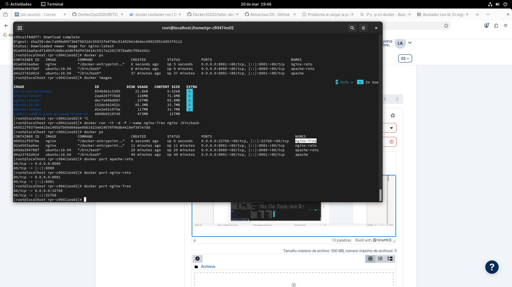
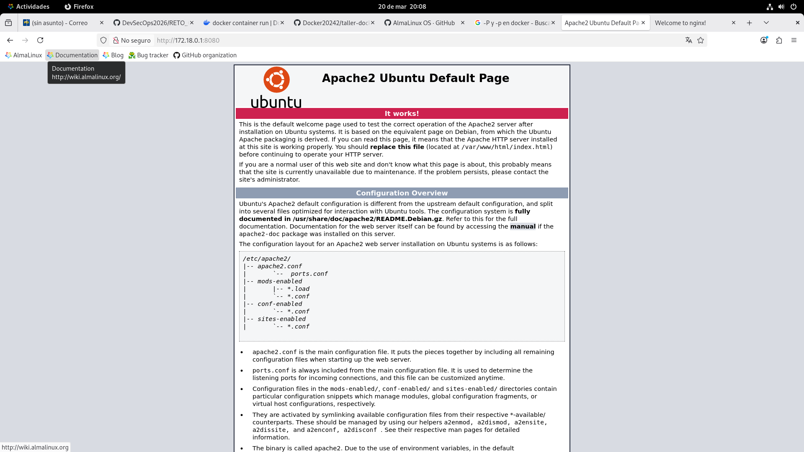
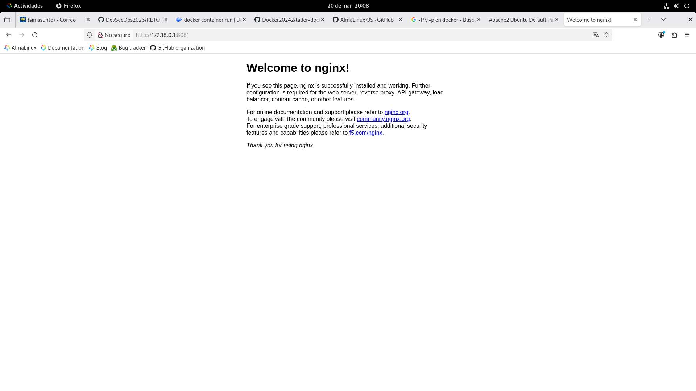
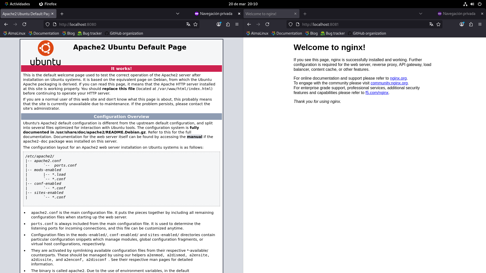
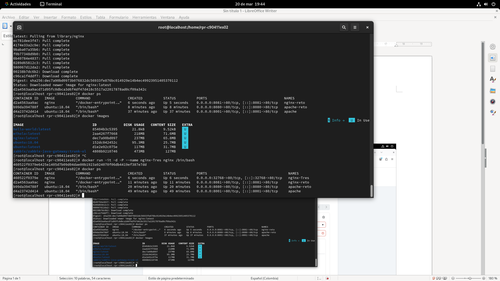

# GRUPO 3

**Ultima actualización:** 20 de marzo 2026

|#|Integrantes|
|---|--------|
|  1  |Leidy Dayana Avendaño Moreno|
|  2 |Jeisson Andres Hernandez Martinez|
|  3  |Michael Giovanny Sierra Leon|
| 4 |John Edilvar Gutierrez Rojas|


# Objetivo del reto.
Configurar y acceder a dos contenedores web diferentes al mismo tiempo usando distintas estrategias de mapeo de puertos


# Tabla comparativa: -p vs -P (con lo que investigaron).


## Investigacion de mediana complejidad: publicacion de puertos en Docker


## Objetivo
Analizar como funciona la publicacion de puertos en Docker y comparar el uso de `-p` y `-P`, interpretar la salida de `docker ps`, revisar el comando `docker port` y verificar imagenes oficiales que exponen puertos.

## 1) Diferencia entre `-p 8080:80` y `-P`

| Criterio | `-p 8080:80` | `-P` |
|---|---|---|
| Tipo de mapeo | Manual y explicito | Automatico |
| Control del puerto del host | Total (elige el usuario) | Bajo (Docker asigna puertos aleatorios del rango efimero) |
| Requiere puertos `EXPOSE` | No necesariamente | Si, publica solo puertos expuestos (`EXPOSE` o `--expose`) |
| Caso de uso recomendado | Produccion, pruebas con puerto fijo, documentacion reproducible | Pruebas rapidas, CI/CD, escenarios temporales |
| Ejemplo | `docker run -d -p 8080:80 nginx` | `docker run -d -P nginx` |

### Conclusiones del punto
- `-p` permite definir exactamente como se publica un puerto.
- `-P` publica todos los puertos expuestos a puertos dinamicos del host.
- Para acceso estable desde navegador, normalmente conviene `-p`.

## 2) Que significa `0.0.0.0:8080->80/tcp` en `docker ps`

| Fragmento | Significado |
|---|---|
| `0.0.0.0` | El host escucha en todas sus interfaces IPv4 |
| `8080` | Puerto publico en el host |
| `80/tcp` | Puerto privado/protocolo dentro del contenedor |
| `->` | Regla de reenvio (host hacia contenedor) |

Interpretacion completa:
Todo trafico TCP que llegue al host por el puerto 8080 se redirige al puerto 80 del contenedor.

Nota de seguridad:
Si se publica en `0.0.0.0`, el puerto puede quedar accesible desde otras maquinas de la red (segun firewall y reglas de red).

## 3) Investigacion del comando `docker port <nombre>`

### Definicion
El comando `docker port` lista los mapeos de puertos publicados de un contenedor.

### Sintaxis
```bash
docker port CONTAINER [PRIVATE_PORT[/PROTO]]
```

### Ejemplos e interpretacion

| Comando | Salida ejemplo | Interpretacion |
|---|---|---|
| `docker port test` | `7890/tcp -> 0.0.0.0:4321` | El puerto interno `7890/tcp` esta publicado en `4321` del host |
| `docker port test 7890/tcp` | `0.0.0.0:4321` | Consulta especifica del puerto/protocolo |
| `docker port test 7890` | `0.0.0.0:4321` | Docker resuelve el protocolo publicado por defecto |
| `docker port test 7890/udp` | `Error: No public port...` | Ese protocolo no fue publicado |

Uso practico:
- Muy util cuando se usa `-P`, porque el puerto host se asigna dinamicamente.
- Permite auditar rapidamente como quedo el enlace entre host y contenedor.

## 4) Imagenes oficiales que exponen puertos (nginx, httpd, tomcat)

| Imagen oficial | Puerto de servicio habitual | Ejemplo documentado de publicacion |
|---|---|---|
| `nginx` | `80/tcp` | `docker run --name some-nginx -d -p 8080:80 some-content-nginx` |
| `httpd` | `80/tcp` | `docker run -dit --name my-running-app -p 8080:80 my-apache2` |
| `tomcat` | `8080/tcp` | `docker run -it --rm -p 8888:8080 tomcat:9.0` |

Observacion:
En las imagenes oficiales, los puertos del servicio suelen venir definidos por `EXPOSE` en sus Dockerfiles o practicas de uso del proyecto.

## 5) Resumen final

1. `-p 8080:80` crea una publicacion controlada y predecible.
2. `-P` publica todos los puertos expuestos usando puertos aleatorios del host.
3. `0.0.0.0:8080->80/tcp` indica escucha en todas las interfaces del host y reenvio al contenedor.
4. `docker port` permite consultar y verificar mapeos publicados, especialmente util con `-P`.
5. Imagenes oficiales como `nginx`, `httpd` y `tomcat` muestran patrones tipicos de exposicion/publicacion de puertos para servicios web.

## Fuentes de investigacion (oficiales)

1. Docker Docs - docker container run (Publish y Publish all exposed ports)
   https://docs.docker.com/reference/cli/docker/container/run/#publish

2. Docker Docs - docker container port
   https://docs.docker.com/reference/cli/docker/container/port/

3. Docker Hub Official Image - nginx
   https://hub.docker.com/_/nginx

4. Docker Hub Official Image - httpd
   https://hub.docker.com/_/httpd

5. Docker Hub Official Image - tomcat
   https://hub.docker.com/_/tomcat


# Al menos 8-10 capturas de pantalla numeradas y con pie de foto:


<p align="center">
  
</p>

##Se realiza despliegue de dos servidores (ngnix y apache), se valida los puertos que fueron configurados para poder ser accesibles.

<p align="center">
  
</p>

Se valida via web que el servicio apache se encuentre en funcionamiento por el puerto configurado en el paso anterior. 

<p align="center">
  
</p>

Se valida via web que el servicio ngnix se encuentre en funcionamiento por el puerto configurado en el paso anterior. 

<p align="center">
  
</p>

Se valida via web que el servicio ngnix se encuentre en funcionamiento por el puerto configurado en el paso anterior. 

<p align="center">
  
</p>


# docker ps completo
Salida de docker port de cada contenedor
Navegador mostrando Apache
Navegador mostrando Nginx
Salida de docker ps después de detener uno
Explicación detallada de cada paso que hicieron (¿por qué eligieron -p o -P en cada caso?).
Dificultades encontradas y cómo las resolvieron.
Conclusión: ¿Qué aprendieron que no estaba en el Taller 2?
