# 🐳 Reto en Clase: Acceso Público Avanzado con Múltiples Puertos y Servicios

## 👥 Grupo
Grupo E 

## 📅 Fecha
20 de Marzo 2026

## 👥 Integrantes

- Ing. Argel Ochoa Ronald David  
- Ing. Baquero Soto Mauricio  
- Ing. Buitrago Guiot Oscar Javier  
- Ing. Estefania Naranjo Novoa  

## 🏫 Curso
DevOps / Contenedores Docker
---

## 📌 Descripción
En este reto se implementa la ejecución simultánea de dos contenedores web en una misma máquina, utilizando diferentes estrategias de mapeo de puertos (`-p` y `-P`), evitando conflictos y validando su acceso desde el navegador.

---

## 🎯 Objetivo
Configurar y acceder a dos servicios web en contenedores Docker de forma concurrente, validando su funcionamiento mediante inspección de puertos y pruebas en navegador.

---

## ⚙️ Tecnologías utilizadas
- Docker
- Imagen `nginx`
- Navegador web

---
## 📊 Comparación entre -p y -P

| Característica | -p (Manual) | -P (Automático) |
|--------------|------------|----------------|
| Asignación de puerto | Manual | Automática |
| Control del puerto | Total | Limitado |
| Uso típico | Producción | Pruebas / desarrollo |
| Ejemplo | -p 8080:80 | -P |
| Riesgo de conflicto | Alto (si el puerto está ocupado) | Bajo |
| Facilidad de uso | Media | Alta |

### 🔎 Explicación
- **-p 8080:80**: Mapea el puerto 8080 del host al 80 del contenedor.
- **-P**: Publica todos los puertos expuestos del contenedor en puertos aleatorios del host.
- 
---
## 📚 Investigación

### ❓ ¿Qué diferencia hay entre -p 8080:80 y -P?

- **-p 8080:80**: Permite definir manualmente qué puerto del host se conecta con el contenedor.
- **-P**: Docker asigna automáticamente un puerto disponible para cada puerto expuesto.

---

### ❓ ¿Qué significa 0.0.0.0:8080->80/tcp en docker ps?

Significa que:
- El contenedor expone el puerto **80**
- Está mapeado al puerto **8080 del host**
- **0.0.0.0** indica que es accesible desde cualquier IP (acceso público)

---

### ❓ ¿Qué hace docker port?

El comando:

```bash
docker port <nombre_contenedor>

Permite ver cómo están mapeados los puertos entre el host y el contenedor.

Ejemplo de salida:

80/tcp -> 0.0.0.0:8080

Indica que el puerto 80 del contenedor está expuesto en el puerto 8080 del host.


---

## 🚀 Paso 1: Levantar primer contenedor con puerto fijo (`-p`)
### Paso 1: Creación del contenedor web1
Se utilizó la imagen oficial de nginx porque es ligera y rápida

Se usó
```bash
docker run -d --name web1 -p 8080:80 nginx
```
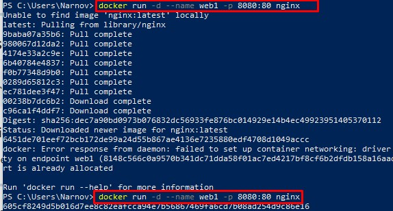


### 🔎 Explicación
Se mapea el puerto 8080 del host al puerto 80 del contenedor.

---

### 📸 Evidencia 1: Contenedor web1 en ejecución
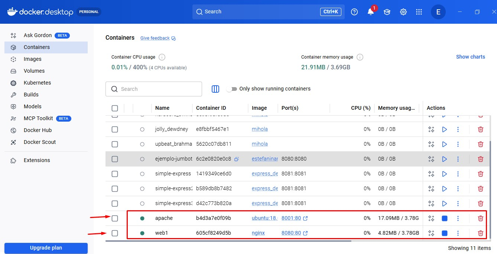
---

### 🌐 Acceso
http://localhost:8080

---

### 📸 Evidencia 2: Acceso a web1 desde navegador
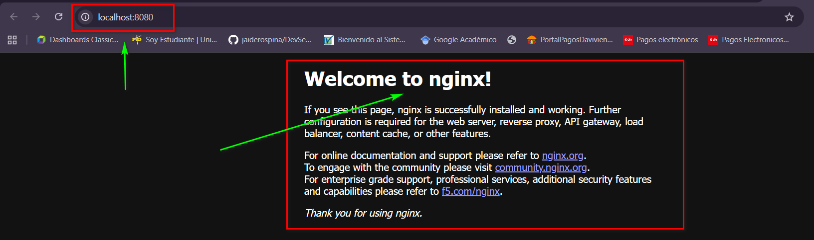
Se eligió -p para tener control total del puerto y acceder fácilmente desde el navegador.
---

## 🚀 Paso 2: Levantar segundo contenedor con puerto dinámico (`-P`)

```bash
docker run -d --name web2 -P nginx
```


### 🔎 Explicación
Docker asigna automáticamente un puerto disponible en el host.

Se utilizó -P para observar cómo Docker asigna puertos automáticamente.
---

### 📸 Evidencia 3: Contenedor web2 en ejecución
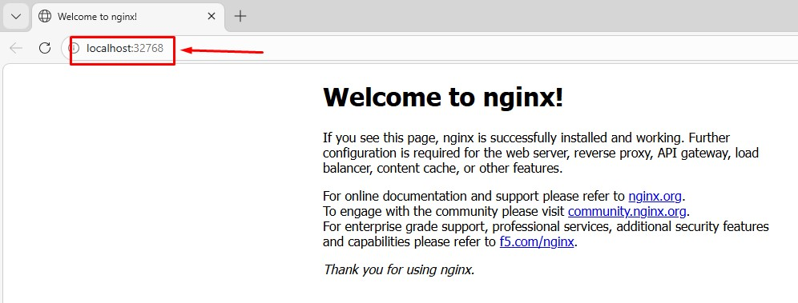

---

## 🔍 Paso 3: Identificación del puerto asignado

```bash
docker ps
```

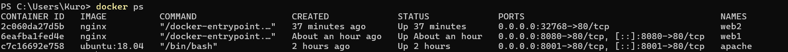

---

### 📸 Evidencia 4: Puerto asignado automáticamente
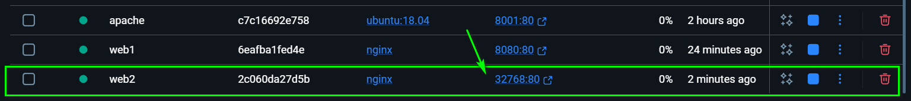

---

## 🌐 Acceso al segundo contenedor

[http://localhost:32768]

---


## 🕵️ Inspección de puertos

```bash
docker port web2
```

---

### 📸 Evidencia 6: Inspección con docker port
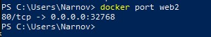
---

## ⚔️ Resultado final

| Contenedor | Puerto interno | Puerto host | Estado |
|-----------|--------------|------------|--------|
| web1      | 80           | 8080       | Activo |
| web2      | 80           | Dinámico   | Activo |

Ambos servicios funcionan simultáneamente sin conflictos de puertos.

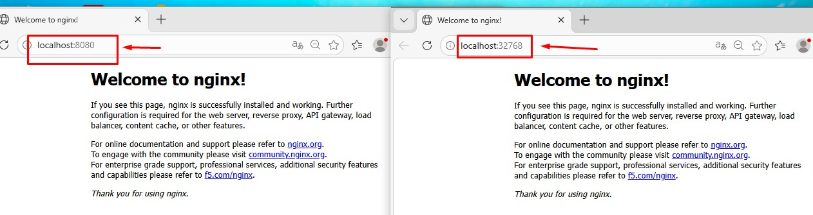

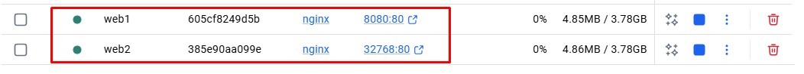

Esto permitió validar los puertos asignados.

Se accedió a:

http://localhost:8080

Confirmando que ambos servicios funcionan correctamente.
---

---
## 🧩 TERCER CONTENEDOR (-P)

## 🧪 Prueba con tercer contenedor (-P)

```bash
docker run -d --name web3 -P nginx
```
---
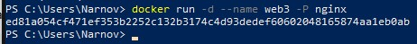
---
Luego 

```bash
docker ps
docker port web3
```

Esto permitió observar el puerto dinámico asignado automáticamente.

📸 Evidencia 8: Contenedor web3 con puerto dinámico

### Descripción:
Se muestra la ejecución del contenedor web3 con asignación automática de puertos usando la opción -P.

📸 Evidencia 9: Inspección con docker port

Descripción:
Se verifica el puerto asignado dinámicamente mediante el comando docker port web3.

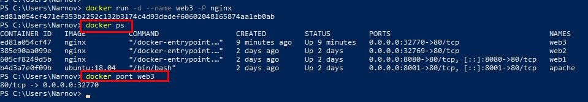
📸 Evidencia 10: Verificación en ejecución

Descripción:
Se observa el estado de los contenedores en ejecución utilizando docker ps.

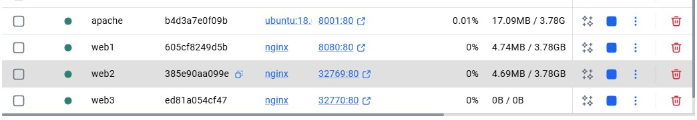

📸 Evidencia 11: Acceso al servicio

Descripción:
Se accede desde el navegador al puerto asignado dinámicamente validando el servicio.

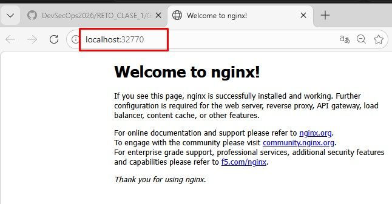

## 🧩 Prueba adicional 

```bash
docker exec -it web1 bash
echo "Servidor 1" > /usr/share/nginx/html/index.html
```

```bash
docker exec -it web2 bash
echo "Servidor 2" > /usr/share/nginx/html/index.html

```
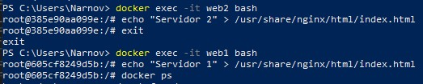
---

### 📸 Evidencia 7: Diferenciación de servicios

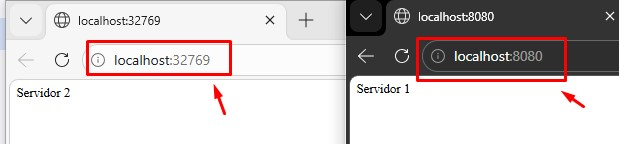


---

## 🧠 Dificultades y Soluciones

## ⚠️ Dificultades encontradas

- Confusión inicial entre -p y -P.
- No identificar rápidamente el puerto asignado dinámicamente.
- Problemas al acceder desde navegador por no usar el puerto correcto.

### ✅ Soluciones

- Uso del comando `docker ps` para ver puertos.
- Uso de `docker port` para inspección detallada.
- Validación constante en navegador.

---
---

## 🧠 Conclusiones

En este reto se aprendió a gestionar el acceso público de contenedores utilizando diferentes estrategias de mapeo de puertos.

A diferencia del Taller 2, se profundizó en:
- Uso simultáneo de múltiples contenedores
- Evitar conflictos de puertos
- Interpretación de salidas de Docker
- Uso de asignación automática de puertos

Se comprendió que Docker permite desplegar múltiples servicios web en una misma máquina de forma eficiente, controlando su acceso mediante puertos específicos.

Este conocimiento es fundamental en entornos DevOps para despliegue. Además

- El uso de `-p` permite asignación manual de puertos.
- El uso de `-P` permite asignación automática.
- Docker permite múltiples servicios sin conflictos.
- `docker ps` y `docker port` son claves para inspección.

---

## ✅ Competencias alcanzadas

- Uso correcto de `-p` y `-P`
- Inspección de puertos
- Validación de servicios concurrentes
- Documentación técnica

## ✅ Bibliografía:

- Repositorio del curso:
  Documentación GitHub Repo https://github.com/jaiderospina/DevSecOps2026/
- Documentación oficial Docker: 
  https://docs.docker.com/reference/cli/docker/container/run/#publish
- Docker Hub (nginx): https://hub.docker.com/_/nginx