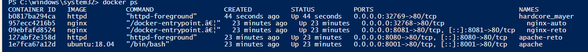

## Integrantes

1. Milton Beltrán
2. Juan Mesa
3. Daniel Bermúdez
4. Jhon Alexander Ariza Ariza

## Objetivos del Trabajo:

## Acceso Público Avanzado con Múltiples Puertos y Servicios

## ¿Qué diferencia hay entre -p 8080:80 y -P?

La diferencia entre usar -p 8080:80 y -P en Docker es que con -p 8080:80 defines de manera explícita que el puerto 8080 del host se conecte al puerto 80 del contenedor, lo que te permite acceder al servicio en http://localhost:8080, mientras que con -P Docker publica automáticamente todos los puertos expuestos en el Dockerfile asignándoles un puerto aleatorio disponible en el host, de modo que si el contenedor expone el puerto 80 este podría quedar mapeado, por ejemplo, al 32768 del host, y para saber cuál se asignó debes consultar con docker ps; en resumen, -p te da control manual y preciso sobre el mapeo, mientras que -P lo hace de forma automática y aleatoria.

## ¿Qué significa cuando ves 0.0.0.0:8080->80/tcp en docker ps?

Cuando en la salida de `docker ps` ves algo como `0.0.0.0:8080->80/tcp`, significa que el contenedor tiene su puerto interno **80/tcp** publicado hacia el host en el puerto **8080**, y que está accesible desde todas las interfaces de red del host (`0.0.0.0` indica “todas las direcciones disponibles”); en otras palabras, cualquier conexión que llegue al puerto 8080 de tu máquina (por ejemplo, `http://localhost:8080` o desde otra máquina apuntando a la IP de tu host en el puerto 8080) será redirigida al puerto 80 dentro del contenedor, donde está corriendo el servicio.

## ¿Investigar el comando docker port <nombre> y cómo se interpreta su salida?

El comando docker port <nombre> sirve para mostrar los puertos publicados de un contenedor y su correspondencia con los puertos del host; su salida indica qué puerto interno del contenedor está enlazado a qué puerto externo en la máquina anfitriona.

📌 Uso del comando
Sintaxis básica:

bash

docker port <nombre_del_contenedor>

<nombre_del_contenedor> puede ser el nombre o el ID del contenedor.

Opcionalmente puedes especificar un puerto interno para ver solo ese mapeo:

bash

docker port <nombre_del_contenedor> 80

📌 Interpretación de la salida

Ejemplo:

bash

80/tcp -> 0.0.0.0:8080 80/tcp → el puerto expuesto dentro del contenedor.

0.0.0.0:8080 → el puerto del host al que está mapeado, accesible desde cualquier interfaz de red.

Esto significa que si accedes a http://localhost:8080, realmente estás llegando al servicio que corre en el puerto 80 dentro del contenedor.

Si el contenedor tiene varios puertos publicados, verás varias líneas, por ejemplo:

bash
9876/tcp -> 0.0.0.0:1234
7890/tcp -> 0.0.0.0:4321
Aquí el puerto interno 9876 está disponible en el host en el 1234, y el 7890 en el 4321.

📌 Para qué sirve

Verificación rápida: comprobar qué puertos están publicados sin necesidad de revisar toda la salida de docker ps.

Depuración: útil cuando tienes varios contenedores y no recuerdas qué puerto del host corresponde a cada servicio.

Automatización: puede integrarse en scripts para obtener dinámicamente los puertos asignados, especialmente cuando usas -P y Docker asigna puertos aleatorios.

En resumen, docker port <nombre> es una herramienta práctica para inspeccionar y confirmar los mapeos de red de un contenedor, asegurando que sabes exactamente cómo acceder a sus servicios desde el host o desde fuera.

## Buscar imágenes oficiales que expongan puertos

  

