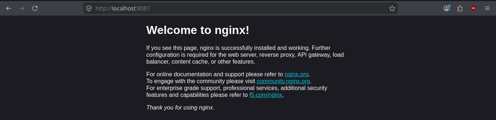
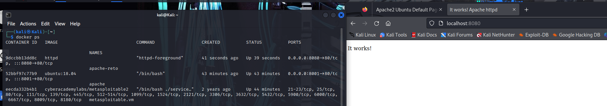

[Regresar al inicio](../../../GRUPO%20W/README.md)

# Docker Port?
Docker Port o puertos docker es un comando que cumple la función de obtener un listado de los puertos expuestos de un contenedor de Docker determinado, es decir, se encarga de enlistar las llamadas asignaciones de puerto o una asignación de tipo específica para un container.

Docker Port puede utilizarse también con el objetivo de contribuir al proceso donde se muestra la totalidad de los puertos mapeados o se realiza un mapeo específico, sin necesidad de especificar un PRIVATE_PORT o puerto privado.

# ¿Qué significa 0.0.0.0:8080->80/tcp en docker ps?

**Significa:**

-   **0.0.0.0** → El servicio está disponible en todas las interfaces de red del host, permitiendo el acceso desde cualquier red.
-   **8080** → Es el puerto del **host** donde se recibe la conexión.
-   **80** → Es el puerto interno del **contenedor** donde está escuchando la aplicación.
-   **tcp** → Es el protocolo de comunicación utilizado.
-   **→** → Indica la redirección del tráfico desde el host hacia el contenedor.

# Donde se evidenció:

0.0.0.0:8080->80/tcp

Indica que el servicio se encuentra disponible a través del puerto 8080 del host, ya que el tráfico entrante es redirigido hacia el puerto 80 del contenedor mediante el protocolo TCP.

# Se verifica que el contenedor se encuentre en ejecución.:

 *Imagen del Contenedor Ngnix*

  
*Imagen del Contenedor URL ngnix*

  
  
*Imagen del Contenedor Apache*
</p

