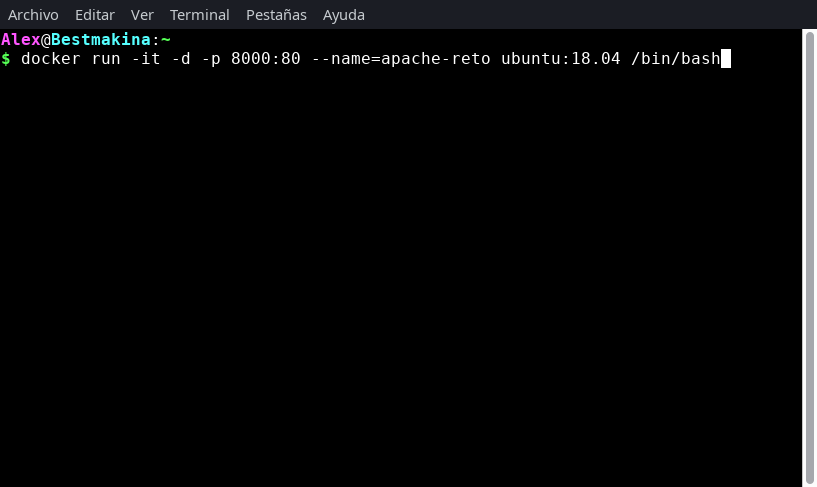
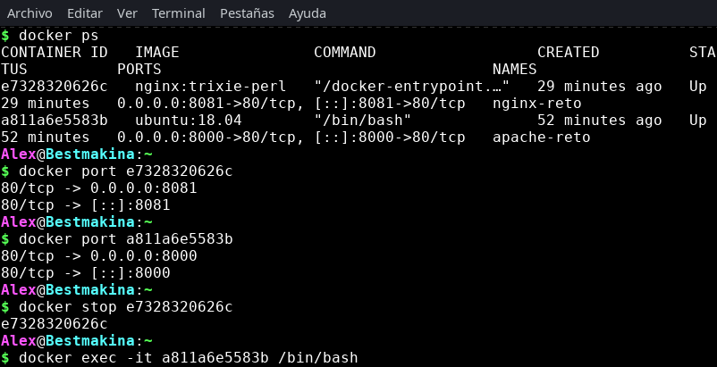
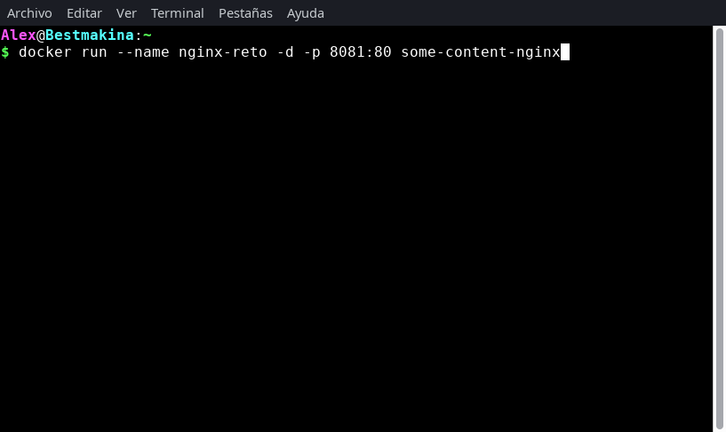

# Reto: Contenedores Apache y Nginx

## 1. Contenedor Apache

Inicia un contenedor con **Apache**. Puedes utilizar la misma estrategia del Taller 2 o la imagen oficial `httpd`. La elección debe estar justificada en el README.

- Mapea el puerto **8080** del host al puerto **80** del contenedor.
- Asigna el nombre: `apache-reto`.

### Ejecución con Docker

### Justificación

Se utiliza una imagen basada en **Ubuntu**, ya que por practicidad del ejercicio esta imagen ya se encuentra descargada en el host. A partir de ella, se realiza la instalación manual de Apache dentro del contenedor.

Este enfoque permite:
- Reutilizar recursos disponibles.
- Comprender el proceso de instalación de Apache en un entorno Linux.
- Tener mayor control sobre la configuración del servidor.

### Ejecución del contenedor Apache

---

## 2. Contenedor Nginx

Inicia un segundo contenedor con **Nginx**, usando preferiblemente la imagen oficial.

- Mapea el puerto **8081** del host al puerto **80** del contenedor.
- Asigna el nombre: `nginx-reto`.

### Ejecución con Docker

### Justificación

Se realiza un `docker pull` para descargar la imagen oficial de **Nginx**. A diferencia del caso de Apache, esta imagen ya viene preconfigurada con todos los componentes necesarios para su ejecución.

Por esta razón:
- No es necesario realizar instalaciones adicionales.
- Se reduce el tiempo de configuración.
- Se facilita una puesta en marcha rápida del servicio.