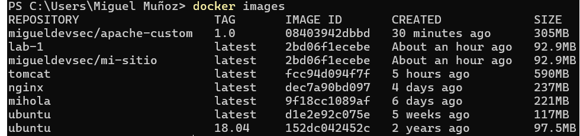
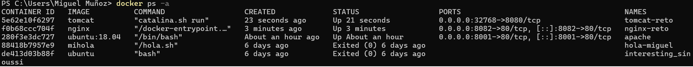
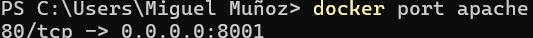
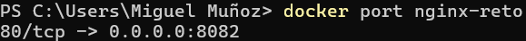
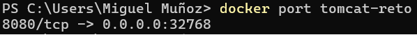
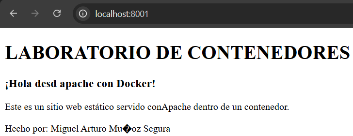
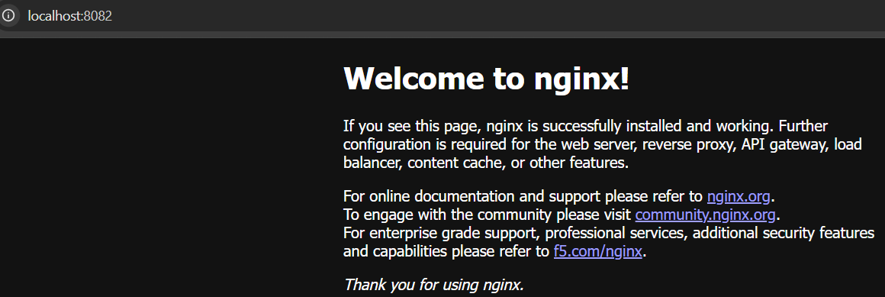
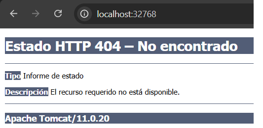
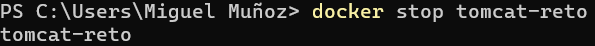
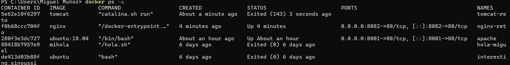

# Reto Docker – Mapeo de puertos y contenedores web

## Portada

<<<<<<< HEAD:RETO_CLASE_1/MiguelMuñoz/README.md
- **Nombre del grupo:** MV  
- **Integrante:** Miguel Muñoz, Vicente Rueda 
=======
- **Nombre del grupo:** MV
- **Integrantes:** Miguel Muñoz, Vicente Rueda
>>>>>>> 59d6d08 (Cambiando el archivo Readme):RETO_CLASE_1/GRUPO_MV/README.md
- **Fecha:** 20/03/2026  

---

## Objetivo del reto

Configurar y acceder a **dos contenedores web diferentes al mismo tiempo** usando distintas estrategias de mapeo de puertos, investigar las opciones `-p` y `-P`, y dominar los comandos de inspección de puertos. Todo esto **sin conflictos de puertos** y con evidencia clara de que ambos servicios están accesibles desde el navegador.

---

## Diferencias entre `-p 8080:80` y `-P`

### Opción `-p 8080:80`

- **Sintaxis:**  
  `-p <puerto_host>:<puerto_contenedor>`
- **Ejemplo:**  
  `-p 8080:80`
- **Significado:**  
  - Expone el puerto **80** del contenedor en el puerto **8080** del host.  
  - Acceso desde el navegador: `http://localhost:8080`
- **Control:**  
  - El usuario elige explícitamente **qué puerto del host** usar.
  - Útil para evitar conflictos y documentar claramente el mapeo.

### Opción `-P` (mayúscula)

- **Sintaxis:**  
  `-P`
- **Significado:**  
  - Publica **todos los puertos expuestos** en la imagen (`EXPOSE`) en **puertos aleatorios** del host.
  - Docker asigna puertos disponibles automáticamente.
- **Acceso:**  
  - Hay que consultar qué puerto asignó Docker con:
    - `docker ps`
    - o `docker port <contenedor>`
- **Control:**  
  - Menos control sobre el puerto del host, pero rápido para pruebas.

---

## ¿Qué significa `0.0.0.0:8080->80/tcp` en `docker ps`?

Cuando se ejecuta `docker ps`, la salida de la terminal es algo como:

```text
0.0.0.0:8080->80/tcp

```

Esto significa:

- 0.0.0.0:
Escucha en todas las interfaces de red del host (localhost, IP privada, IP pública si aplica).

- 8080:
Puerto del host.

- ->80/tcp:
Está redirigiendo al puerto 80 del contenedor, usando protocolo TCP.


<!-- -->
<p align="center"><br><em>docker-images.png</em></p>

<!-- -->
<p align="center"><br><em>docker-ps.png</em></p>

<!-- -->
<p align="center"><br><em>docker-port-apache.png</em></p>

<!-- -->
<p align="center"><br><em>docker-port-nginx.png</em></p>

<!-- -->
<p align="center"><br><em>docker-port-tomcat.png</em></p>

<!-- -->
<p align="center"><br><em>navegador-apache.png</em></p>

<!-- -->
<p align="center"><br><em>navegador-nginx.png</em></p>

<!-- -->
<p align="center"><br><em>navegador-tomcat.png</em></p>

<!-- -->
<p align="center"><br><em>docker-stop-tomcat.png</em></p>

<!-- -->
<p align="center"><br><em>docker-ps-contenedor-detenido.png</em></p>
