#  Reto Clase 1 - Acceso Público Avanzado con Docker

---

##  Grupo T
**Grupo X**

### ‍ Integrantes

- Reynel Cely
  
- Laura Bernal
  
- Johanna Ortiz
  
- Bayardo Medina

  

###  Fecha
26 de marzo de 2026  

---

##  Objetivo del reto

El objetivo de este reto es configurar y acceder a múltiples contenedores web de manera simultánea, utilizando diferentes estrategias de mapeo de puertos en Docker.  

Se busca comprender el funcionamiento de los parámetros `-p` y `-P`, así como validar la exposición de servicios web (Apache y Nginx) desde el navegador, asegurando que no existan conflictos de puertos y que los servicios sean accesibles correctamente.

---

##  Tabla comparativa: `-p` vs `-P`

| Característica | `-p` (publish) | `-P` (publish all) |
|--------------|----------------|--------------------|
| Tipo de asignación | Manual | Automática |
| Control del puerto | Total (defines el puerto) | Ninguno (Docker asigna uno aleatorio) |
| Ejemplo | `-p 8080:80` | `-P` |
| Uso recomendado | Producción o cuando necesitas un puerto específico | Pruebas rápidas o entornos de laboratorio |
| Visibilidad | Fácil de recordar | Requiere usar `docker port` para saber el puerto |
| Riesgo de conflictos | Bajo (si eliges bien) | Bajo (Docker gestiona automáticamente) |

---

##  Conclusión

En este reto aprendimos a exponer múltiples servicios web usando Docker, diferenciando claramente entre la asignación manual y automática de puertos.  

El uso de `-p` es ideal cuando se necesita control total, mientras que `-P` facilita pruebas rápidas sin preocuparse por conflictos. Además, herramientas como `docker ps` y `docker port` son esenciales para validar la conectividad de los servicios.

## 1. Leer la sección oficial: https://docs.docker.com/reference/cli/docker/container/run/#publish

¿Qué diferencia hay entre -p 8080:80 y -P?

La diferencia principal radica en el control que tienes sobre la asignación:

-p 8080:80 (Mapeo explícito): Tú defines exactamente qué puerto de tu computadora (host) se conecta al puerto del contenedor.
Uso: Ideal cuando quieres que tu servicio esté siempre en una dirección fija, como localhost:8080.

-P (Mapeo automático/aleatorio): Docker publica todos los puertos expuestos en la imagen a puertos aleatorios disponibles en tu computadora.

Uso: Útil cuando corres muchos contenedores del mismo tipo y no quieres que choquen entre sí, o cuando no te importa qué puerto use el host mientras funcione.

¿Qué significa cuando ves 0.0.0.0:8080->80/tcp en docker ps?
Esta cadena se lee de izquierda a derecha como un "túnel":
0.0.0.0: Significa que el puerto está escuchando en todas las interfaces de red de tu máquina (Wi-Fi, Ethernet, localhost).
:8080 Es el puerto en tu computadora por el cual vas a entrar.
->80/tcp: Indica que todo el tráfico que entre por el 8080 será redirigido al puerto 80 interno del contenedor usando el protocolo TCP.

## 2. Investigar el comando docker port <nombre> y cómo se interpreta su salida.

El comando docker port <nombre_contenedor> se utiliza para mostrar los puertos que un contenedor tiene publicados hacia el host. Permite identificar la relación entre el puerto interno del contenedor (donde escucha la aplicación) y el puerto externo del host (por donde los usuarios pueden acceder al servicio).
La salida del comando indica:
El puerto y protocolo dentro del contenedor (por ejemplo, 80/tcp).
La dirección IP y el puerto del host al que está mapeado (por ejemplo, 0.0.0.0:8080).
Este comando es útil para verificar configuraciones de red, solucionar problemas de conectividad y confirmar qué puerto se debe utilizar para acceder a un servicio ejecutándose en un contenedor Docker.

## 3. Buscar imágenes oficiales que expongan puertos (nginx, httpd, tomcat, etc.).

las imágenes oficiales más comunes en Docker Hub que ya vienen configuradas para "escuchar" en puertos específicos por defecto.

magen	Puerto por Defecto	Tipo de Servicio

| Imagen | Puerto por Defecto | Tipo de Servicio |
| :--- | :--- | :--- |
| **nginx** | 80 | Servidor web y proxy inverso (muy ligero). |
| **tomcat** | 8080 | Servidor de aplicaciones para Java Servlets. |
| **mysql/mariadb** | 3306 | Bases de datos SQL relacionales. |
| **postgres** | 5432 | Base de datos relacional avanzada. |
| **mongodb** | 27017 | Base de datos NoSQL orientada a documentos. |

## 1. Inicia un contenedor Apache (puedes usar la misma forma del Taller 2 o la imagen oficial httpd – tú decides y lo justificas en el README).

Mapear el puerto 8080 del host al 80 del contenedor. Usa nombre --name apache-reto.
Se procede a realizar la instalación de apache por medio de una imagen de Ubuntu ejecutando los siguientes comandos:

docker run -it -d -p 8080:80 --name=apache-reto ubuntu:18.04 /bin/bash
docker exec -it apache-reto /bin/bash
apt update
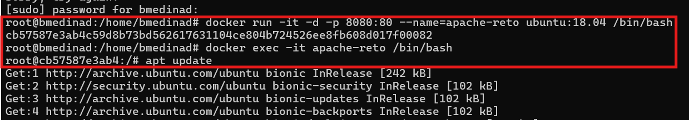

apt install apache2
/etc/init.d/apache2 start
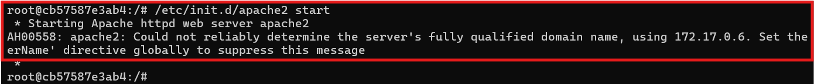
exit

Iniciar un segundo contenedor Nginx (imagen oficial recomendada).
Mapea el puerto 8081 del host al 80 del contenedor. Usa nombre --name nginx-reto.

Realizamos la instalación de nginx con el comando:
docker run -d -p 8081:80 --name nginx-reto nginx

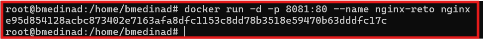

Después de la instalación vemos dos contenedores activos:

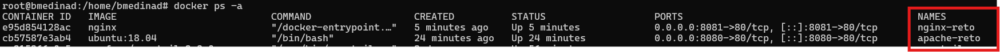

Probar la opción automática -P (publicar todos los puertos expuestos) con un tercer contenedor (puedes usar la misma imagen nginx o httpd). Observa qué puerto aleatorio te asigna Docker.

ejecutamos el siguiente comando donde asignamos el nombre nginx-auto por el puerto automatico 

docker run -d -P --name nginx-auto nginx

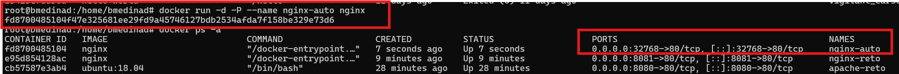

Verifica todo con:

docker ps

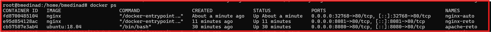

docker port apache-reto
docker port nginx-reto
docker port <tercer-contenedor>  ---  docker port nginx-auto

Evidenciamos que los puertos asignados estan configurados de manera correcta para el apache con 80/tcp -> 0.0.0.0:8080 para IPv4 y 80/tcp -> [::]:8080 y para IPv6. 
Para nginx 80/tcp -> 0.0.0.0:8081 para IPv4 y 80/tcp -> [::]:8081 para IPv6. 
Para el contenedor nginx con puerto automatico asignado 80/tcp -> 0.0.0.0:32768 Para IPv4 y 80/tcp -> [::]:32768 para IPv6.

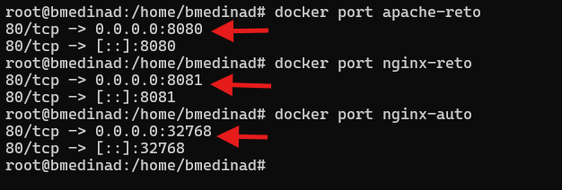

Accede desde el navegador a:

La IP asignada por mi MV fue la siguiente

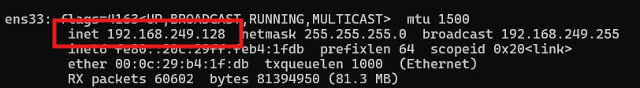

Luego con esta misma 192.168.249.128 procedemos a cargar la pagina web por defecto.

http://localhost:8080 → debe mostrar Apache → http://192.168.249.128:8080

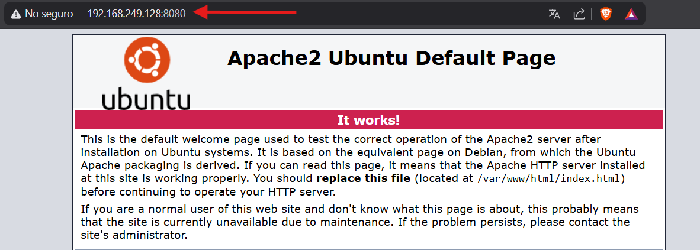

http://localhost:8081 → debe mostrar Nginx →  http://192.168.249.128:8081

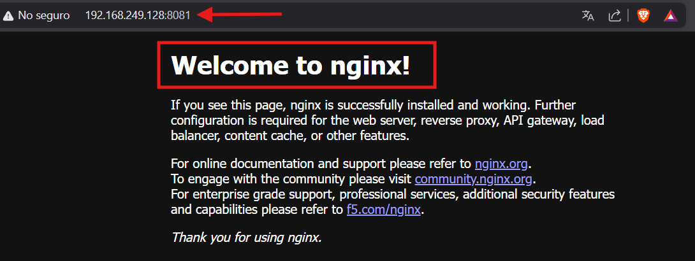

debe mostrar Nginx con el puerto que fue automatico →  http://192.168.249.128:32768

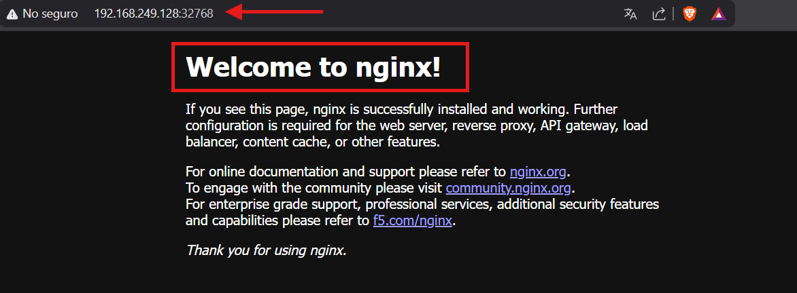

Detener solo uno de los contenedores y verificar que el otro sigue funcionando.

Ejecutamos el comando 

docker stop nginx-auto

vemos con docker ps -a que nginx-auto se encuentra en estado Exited y las demas maquinas en estado update

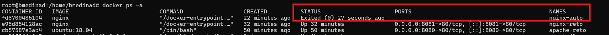

Estado de nginx-auto desde la pagina web http://192.168.249.128:32768 con error ERR_CONNECTION_REFUSED

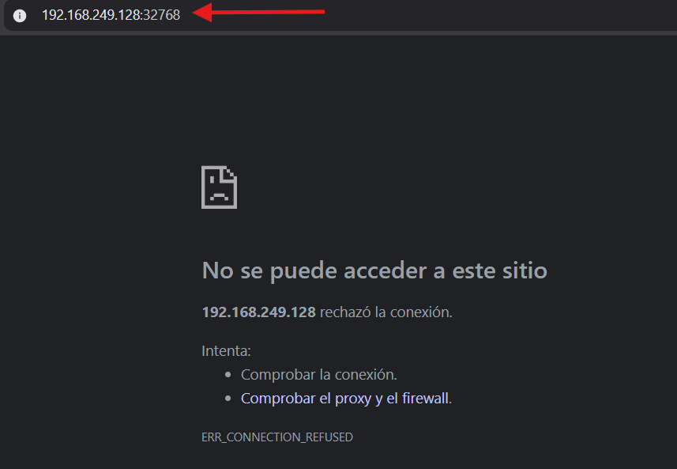
