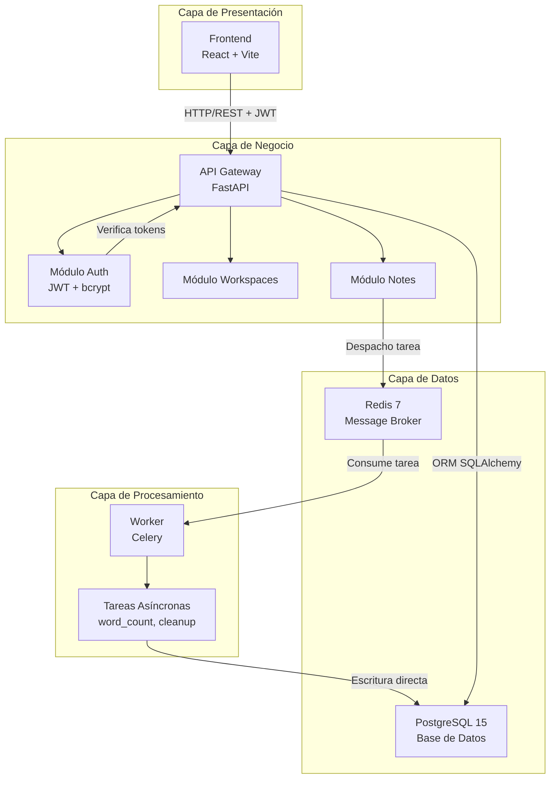
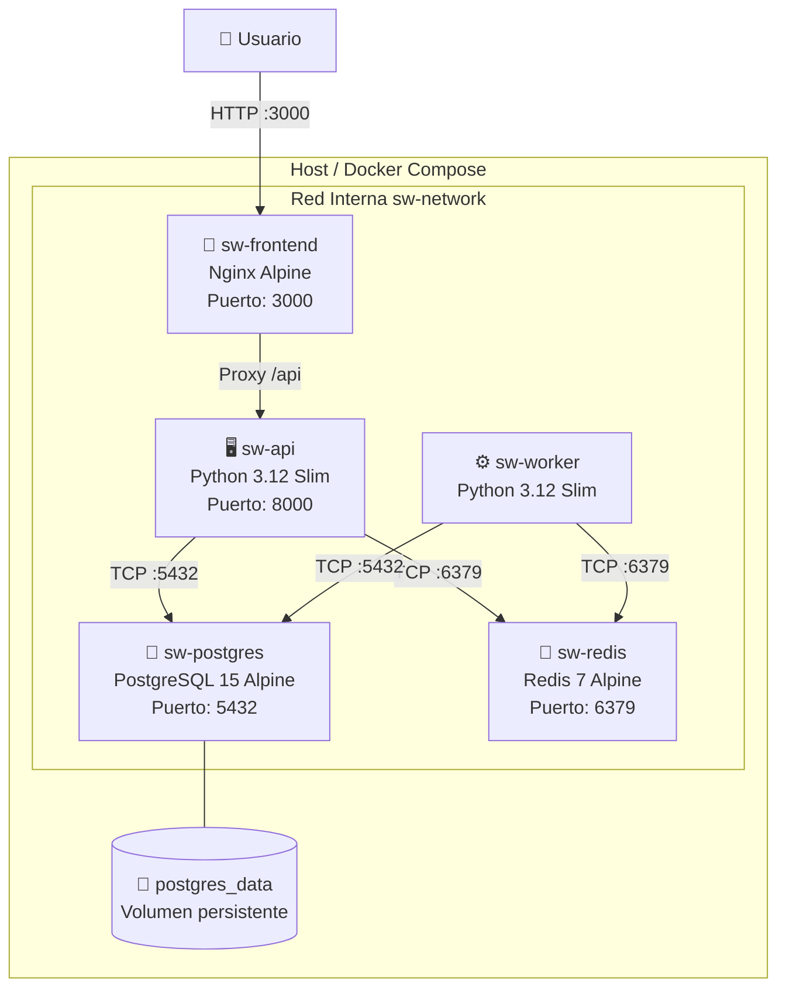
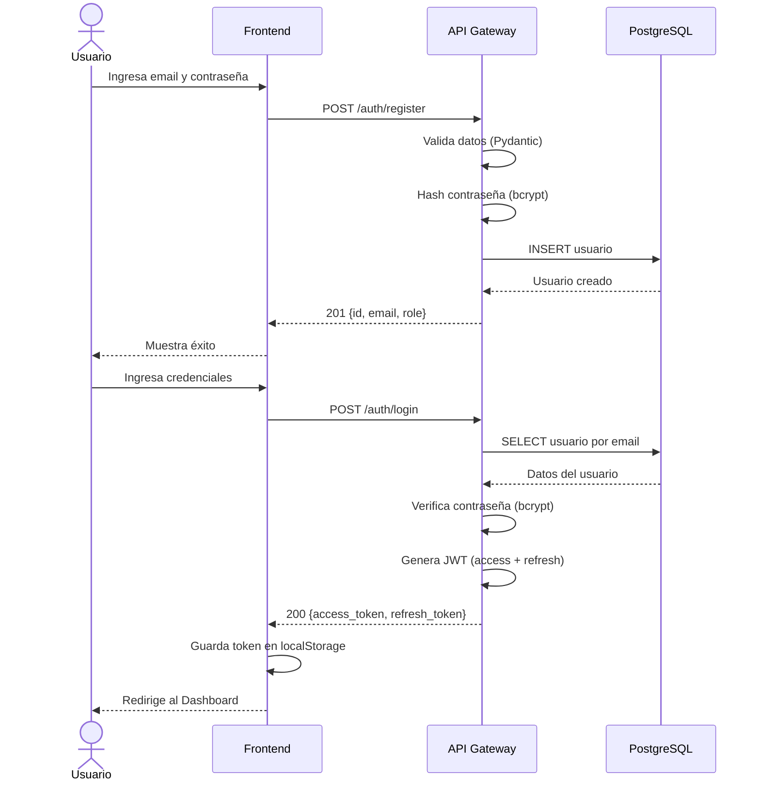
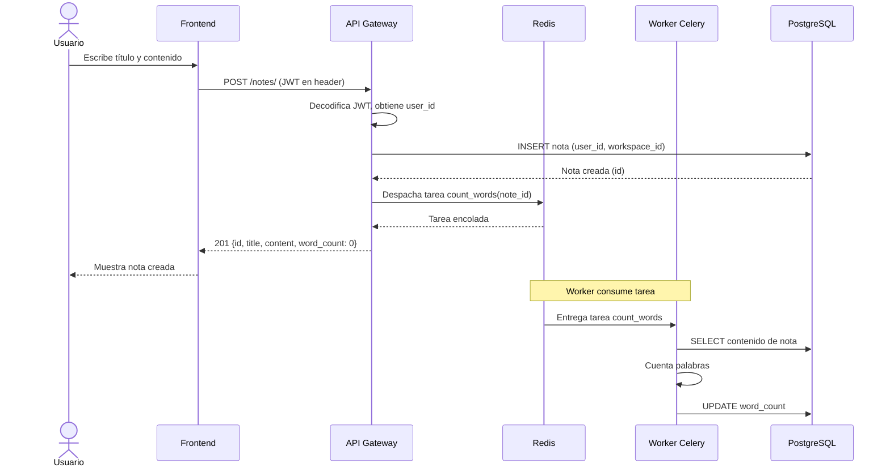
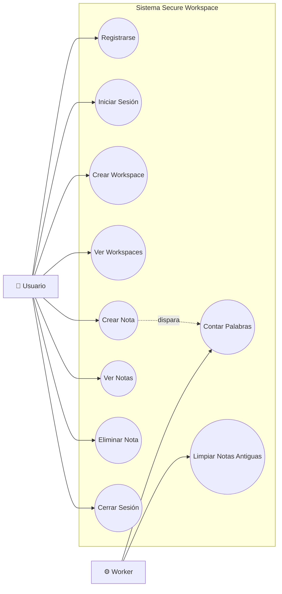

# Arquitectura — Secure Workspace

## Descripción General

Secure Workspace es una aplicación simplificada tipo Notion construida con **arquitectura de microservicios** y un pipeline **DevSecOps** completo. El énfasis del proyecto está en la seguridad, la automatización y las buenas prácticas de desarrollo seguro.

## Diagrama de Componentes

## Diagrama de Despliegue

## Diagrama de Secuencia — Flujo de Autenticación

## Diagrama de Secuencia — Creación de Nota

## Diagrama de Casos de Uso

## Descripción de Servicios

| Servicio | Tecnología | Puerto | Propósito |
|----------|------------|--------|-----------|
| Frontend | React + Vite + Nginx | 3000 | Interfaz de usuario (login, dashboard, notas) |
| API Gateway | Python FastAPI | 8000 | API REST, autenticación, lógica de negocio |
| Worker | Python Celery | — | Tareas asíncronas (conteo de palabras, limpieza) |
| PostgreSQL | PostgreSQL 15 Alpine | 5432 | Almacenamiento persistente de datos |
| Redis | Redis 7 Alpine | 6379 | Broker de mensajes para Celery |

## Comunicación entre Servicios

- **Frontend → API Gateway**: HTTP/REST con tokens JWT Bearer.
- **API Gateway → Worker**: Despacho de tareas Celery vía broker Redis.
- **Worker → Base de Datos**: Conexión directa SQLAlchemy para escritura de metadatos.

## Capas de Seguridad

1. **Autenticación**: Tokens JWT de acceso (30 min) + refresco (7 días) con hash bcrypt.
2. **Autorización**: Control de acceso basado en roles (user / admin).
3. **Validación de Entradas**: Esquemas Pydantic en cada endpoint.
4. **Protección IDOR**: Todas las consultas limitadas al `current_user.id`.
5. **Gestión de Secretos**: Variables de entorno, nunca hardcodeados.
6. **Seguridad de Contenedores**: Usuarios no-root, imágenes base ligeras, Trivy.
7. **Escaneo IaC**: Checkov valida Dockerfiles y docker-compose.yml.
