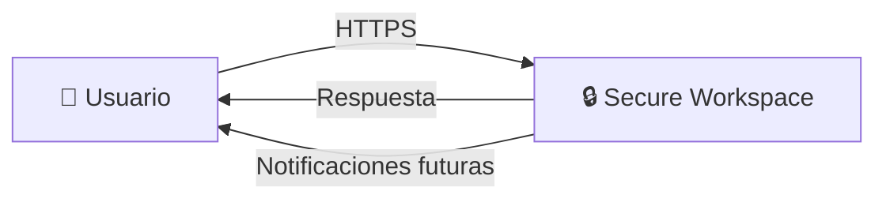
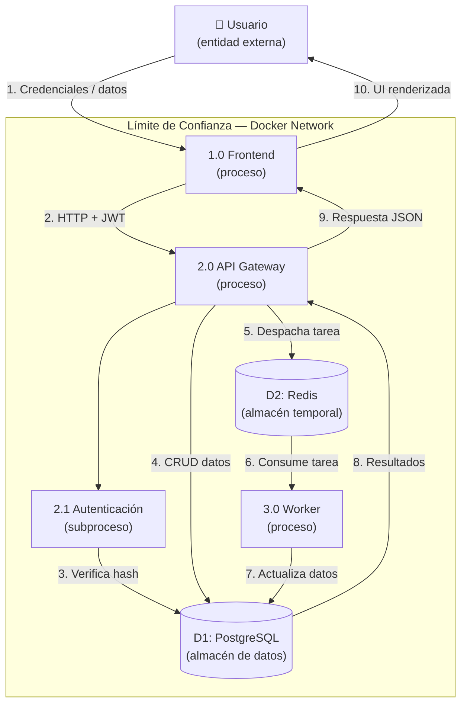

# Modelo de Amenazas — Secure Workspace

## Metodología

Este modelo de amenazas sigue la metodología **STRIDE** de Microsoft y utiliza diagramas de flujo de datos (DFD) para identificar puntos de entrada y activos en riesgo.

## DFD Nivel 0 — Contexto del Sistema



> El DFD nivel 0 muestra el sistema como una caja negra que recibe peticiones HTTP del usuario y devuelve respuestas con datos del workspace/notas.

## DFD Nivel 1 — Flujo Interno de Datos



## Activos Críticos

| Activo | Sensibilidad | Ubicación | Protección |
|--------|-------------|-----------|------------|
| Credenciales de usuario | 🔴 ALTA | PostgreSQL (hash bcrypt) | bcrypt + salt, nunca en texto plano |
| Tokens JWT | 🔴 ALTA | Cliente (localStorage) | Expiración 30 min, firmados con HS256 |
| Contenido de notas | 🟡 MEDIA | PostgreSQL | IDOR protegido, solo dueño accede |
| Secretos del entorno | 🔴 ALTA | .env, GitHub Secrets | .gitignore, Gitleaks en CI |
| Imágenes Docker | 🟡 MEDIA | Docker Hub | Trivy escanea CVEs, usuario no-root |

## Análisis STRIDE Detallado

### Suplantación (Spoofing)

| Amenaza | Probabilidad | Impacto | Mitigación |
|---------|-------------|---------|------------|
| Atacante falsifica JWT | Media | Alto | JWT firmado con HS256, expiración 30 min |
| Reutilización de token robado | Media | Alto | Expiración corta, refresh token separado |
| Registro con email falso | Alta | Bajo | Validación de formato de email (Pydantic) |

### Manipulación (Tampering)

| Amenaza | Probabilidad | Impacto | Mitigación |
|---------|-------------|---------|------------|
| Inyección SQL | Baja | Crítico | ORM SQLAlchemy (consultas parametrizadas) |
| XSS en contenido de notas | Media | Medio | React escapa HTML por defecto |
| Modificar JWT en tránsito | Baja | Alto | Firma HS256, HTTPS en producción |

### Repudio (Repudiation)

| Amenaza | Probabilidad | Impacto | Mitigación |
|---------|-------------|---------|------------|
| Usuario niega acciones | Media | Medio | Timestamps en BD, logs con user_id |
| Borrado sin rastro | Baja | Medio | Campo `created_at/updated_at` en modelos |

### Divulgación de Información (Information Disclosure)

| Amenaza | Probabilidad | Impacto | Mitigación |
|---------|-------------|---------|------------|
| Secretos en código fuente | Media | Crítico | Gitleaks en CI, .gitignore para .env |
| IDOR — acceder notas de otro | Media | Alto | Filtro `user_id` en todas las queries |
| Información sensible en logs | Baja | Medio | No se loguean contraseñas ni tokens |
| CVEs en dependencias | Alta | Alto | Trivy SCA con exit-code: 1 |

### Denegación de Servicio (Denial of Service)

| Amenaza | Probabilidad | Impacto | Mitigación |
|---------|-------------|---------|------------|
| Spam de registros | Alta | Medio | Rate limiting recomendado (futuro) |
| Agotamiento de conexiones BD | Baja | Alto | Connection pooling (SQLAlchemy) |
| Request flood | Media | Alto | Nginx como reverse proxy, healthchecks |

### Elevación de Privilegios (Elevation of Privilege)

| Amenaza | Probabilidad | Impacto | Mitigación |
|---------|-------------|---------|------------|
| Usuario accede endpoints admin | Media | Crítico | Decorador `require_role` en FastAPI |
| Escape de contenedor | Baja | Crítico | Usuario no-root, imágenes slim, red aislada |
| Modificar variables de entorno | Baja | Alto | Secretos en GitHub, no en código |

## Superficie de Ataque

| Punto de Entrada | Protocolo | Auth Requerida | Riesgo | Mitigación |
|-----------------|----------|----------------|--------|------------|
| `POST /auth/register` | HTTP | No | Spam de cuentas | Validación de email, rate limiting |
| `POST /auth/login` | HTTP | No | Fuerza bruta | Expiración de tokens, bcrypt lento |
| `GET/POST /workspaces` | HTTP | JWT | IDOR | Filtro por user_id |
| `GET/POST/DELETE /notes` | HTTP | JWT | IDOR, DoS | Filtro por user_id, validación |
| Redis | TCP | No (red interna) | Acceso no autorizado | Red Docker aislada |
| PostgreSQL | TCP | Contraseña | Data breach | Red Docker aislada, credenciales en .env |

## Matriz de Riesgo

```
         │  Bajo   │  Medio  │  Alto   │ Crítico │
─────────┼─────────┼─────────┼─────────┼─────────┤
Alta     │         │ DoS reg │         │         │
Media    │ Email   │ XSS     │ IDOR    │ Iny.SQL │
Baja     │         │ Logs    │ BD pool │ Escape  │
         │         │         │         │ contdor │
```
