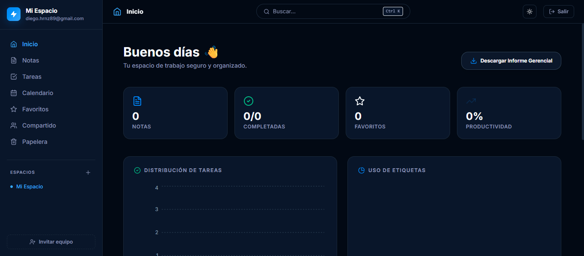

# 🚀 Manual de Usuario — Secure Workspace

¡Bienvenido a **Secure Workspace**! Esta guía está diseñada para que aprendas a usar la aplicación desde cero, de forma fácil y sin complicaciones. No importa si no eres un experto en tecnología, aquí te explicamos todo paso a paso.

---

## 🏁 1. ¿Cómo entrar a la aplicación?

Para usar Secure Workspace, solo necesitas abrir tu navegador de internet (como Chrome, Edge o Firefox) y escribir esta dirección en la barra de arriba:

```
http://localhost:3000
```

---

## 📝 2. Crear tu cuenta por primera vez


Antes de guardar tus secretos y tareas, necesitas una cuenta personal. Así nadie más podrá ver tu información.

1.  **Regístrate**: En la pantalla de inicio, busca el texto que dice **"¿No tienes cuenta? Regístrate"** y haz clic ahí.
2.  **Tus datos**:
    *   **Correo electrónico**: Escribe tu email de siempre.
    *   **Contraseña**: Elige una palabra secreta que tenga al menos 8 letras o números. ¡No se la digas a nadie!
3.  **Listo**: Haz clic en el botón **"Crear cuenta"**. ¡Ya estás dentro!

> 💡 **Tip**: Si ya tienes cuenta, solo pon tu correo y contraseña en la pantalla principal y dale a **"Iniciar sesión"**.

---

## 📊 3. Tu Dashboard (Tu Centro de Control)



Nada más entrar, verás una pantalla con gráficos y números. Es tu resumen personal para que sepas cómo vas con tus cosas:

*   **Notas**: Es el total de hojas de información que has escrito.
*   **Tareas Completadas**: Te dice cuántas cosas has terminado de tu lista de pendientes.
*   **Favoritos**: Aquí aparecen las cosas que marcaste con una estrella porque son muy importantes.


*   **Productividad**: Es una barra de progreso. ¡Intenta que llegue al 100%!
*   **🔥 Racha (Streak)**: Si completas tareas varios días seguidos, aparecerá un fueguito. ¡Es un reto para que no dejes de avanzar!

---

## 📂 4. Organízate con "Espacios de Trabajo"

Imagina que los **Espacios de Trabajo** son cajones o carpetas. Puedes tener uno para "Trabajo", otro para "Casa" y otro para "Universidad".

*   **¿Dónde están?**: En la columna de la izquierda.
*   **Crear uno**: El sistema te crea uno llamado "Mi Espacio" para empezar, pero puedes crear más.
*   **Cambiar nombre**: Si quieres que "Mi Espacio" se llame "Proyecto X", dale al icono del **lápiz** junto al nombre.
*   **Borrar**: Si ya no necesitas un proyecto, usa el icono de la **papelera**. *¡Cuidado! Esto borra todo lo que haya dentro de ese cajón.*

---

## ✍️ 5. Cómo usar las Notas


Las **Notas** son como hojas de papel infinitas donde puedes escribir lo que quieras: ideas, borradores, listas de compras, etc.

1.  **Crear**: Haz clic en el botón **"Nueva Nota"**.
2.  **Título y Etiquetas**: Ponle un nombre (ejemplo: "Recetas de cocina") y elige una etiqueta de color para encontrarla rápido después.
3.  **Contenido**: Escribe todo lo que necesites.
4.  **Guardar**: Al terminar, confirma y tu nota aparecerá en la lista.
5.  **⭐ Favoritos**: Si haces clic en la estrella de una nota, se quedará guardada en tu sección especial de favoritos para que no se te pierda.

> 🧐 **¿Sabías qué?**: El sistema cuenta las palabras de tu nota automáticamente por ti. Verás el número abajo de cada nota.

---

## ✅ 6. Cómo usar las Tareas (To-Do List)


A diferencia de las notas, las **Tareas** son cosas que tienes que "hacer" y "terminar".

*   **🔴 Prioridad**: Puedes marcar si algo es muy urgente (rojo), normal (amarillo) o poco importante (verde).
*   **📅 Fecha**: Ponle una fecha límite para que no se te olvide.
*   **📓 Bitácora (Comentarios)**: Es un espacio para que anotes por qué te retrasaste o qué pasos diste. ¡Es muy útil para llevar un registro de tu progreso!
*   **Marcar como lista**: Cuando termines una tarea, haz clic en el círculo de la izquierda. Se tachará y se pondrá de color verde. ¡Qué satisfacción!

---

## 📅 7. El Calendario (Tu Agenda Visual)


Si te gusta ver tus tareas organizadas por días, el **Calendario** es tu mejor amigo.

*   Puedes verlo por **Mes**, por **Semana** o por **Día**.
*   Las tareas aparecen como puntitos de colores según su importancia.
*   **Creación rápida**: Si haces clic en un día (por ejemplo, el próximo lunes), se abrirá un panel a la derecha para que escribas una tarea para ese día sin dar muchas vueltas.

---

## 🗑️ 8. La Papelera: ¡No entres en pánico!


¿Borraste algo por error? ¡No pasa nada!

1.  Ve a la sección de **Papelera**.
2.  Allí verás todo lo que has borrado recientemente.
3.  **Restaurar**: Dale al botón de la flecha circular para devolverlo a su sitio.
4.  **Borrar para siempre**: Si estás seguro de que ya no lo quieres, dale al botón de la "X" para borrarlo de la base de datos definitivamente.

---

## 📄 9. Informe Gerencial (Para impresionar a tu jefe)


Si necesitas presentar un resumen de lo que has hecho en la semana:
1.  Busca el botón **"Descargar Informe Gerencial"** en el Dashboard.
2.  Se descargará un archivo PDF muy bonito y profesional con gráficos de tus tareas y notas. ¡Listo para enviar por correo o imprimir!

---

## ❓ Preguntas Frecuentes

*   **¿Qué hago si se me olvida la contraseña?** Por ahora no hay un botón de "olvidé mi contraseña", así que habla con el administrador del sistema para que te ayude.
*   **¿Se borran mis cosas si apago la computadora?** No, todo se queda guardado de forma segura en el servidor de la aplicación (usando algo llamado Docker).
*   **¿Puedo usarlo en el celular?** Sí, la aplicación se adapta a pantallas pequeñas. ¡Pruébalo!

---

## 🛡️ Seguridad para tu tranquilidad

*   **Tus datos son solo tuyos**: Nadie más puede ver tus notas a menos que tenga tu contraseña.
*   **Contraseñas blindadas**: No guardamos tu contraseña tal cual la escribes, la convertimos en un código secreto ilegible para mayor seguridad.
*   **Cierre automático**: Si dejas la aplicación abierta y te vas por mucho tiempo, la sesión se cerrará sola para que nadie use tu cuenta si dejas la PC encendida.

