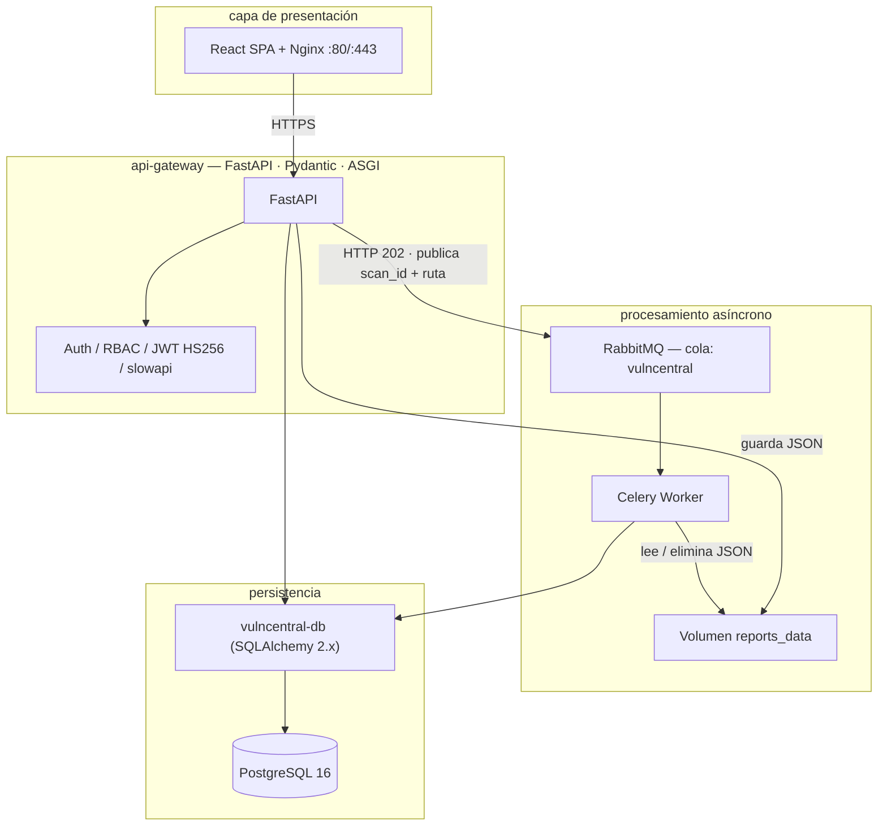

# INFORME TÉCNICO
## Plataforma DevSecOps para Gestión de Vulnerabilidades

> *Informe Técnico · Especialización en Ciberseguridad · UNIMINUTO*

| Campo | Detalle |
|---|---|
| **Institución** | Corporación Universitaria UNIMINUTO |
| **Programa** | Especialización en Ciberseguridad · Seguridad Entornos Cloud DevOps |
| **Materia** | Seguridad en Entornos Cloud DevOps |
| **Autores** | Ing. Ronald David Argel Ochoa |
| | Ing. Mauricio Baquero Soto |
| | Ing. Óscar Javier Buitrago Guiot |
| | Ing. Estefanía Naranjo Novoa |
| **Fecha** | 08 mayo 2026 |
| **Licencia** | MIT License — Código abierto |
| **Repositorio** | https://hub.docker.com/u/maurobaquero |

---

## 1. Introducción

### 1.1 Justificación de la aplicación

La gestión manual de vulnerabilidades en entornos de desarrollo moderno representa un cuello de botella crítico para los equipos de seguridad. Las organizaciones enfrentan cientos de CVEs semanales provenientes de sus dependencias, imágenes de contenedores y código fuente, sin una plataforma centralizada que permita registrarlas, priorizarlas y hacer seguimiento de su resolución.

VulnCentral surge como respuesta directa a este problema: una plataforma DevSecOps diseñada para integrar de forma nativa el ciclo *shift-left* de seguridad, conectando las herramientas de análisis automatizado (Trivy, Bandit, Semgrep, Gitleaks) con un sistema de gestión de vulnerabilidades con trazabilidad completa, control de acceso por roles (RBAC) y procesamiento asíncrono mediante colas de mensajería.

### 1.2 Objetivos del trabajo

**Objetivo general**

Diseñar, implementar y documentar una plataforma DevSecOps funcional que integre prácticas de seguridad a lo largo de todo el ciclo de vida del desarrollo de software, aplicando los conocimientos de la Especialización en Ciberseguridad de UNIMINUTO.

**Objetivos específicos**

- Implementar una arquitectura de microservicios segura con autenticación JWT, RBAC granular y defensa en profundidad siguiendo OWASP.
- Integrar un pipeline CI/CD con herramientas de análisis estático (SAST), análisis dinámico (DAST), detección de secretos y escaneo de contenedores.
- Construir un sistema de ingesta asíncrona de reportes Trivy mediante colas de mensajería (RabbitMQ + Celery).
- Modelar las amenazas del sistema con la metodología STRIDE y documentar contramedidas implementadas.
- Demostrar los resultados de seguridad con reportes reales de todas las herramientas integradas.

### 1.3 Alcance

El proyecto cubre el diseño e implementación de la plataforma en un entorno local (Docker Compose) con capacidad de escalar a producción mediante el override `docker-compose.prod.yml`. No incluye despliegue en nube pública en esta fase, aunque la arquitectura está preparada para ello mediante manifiestos Kubernetes en `orchestration/k8s/`.

---

## 2. Arquitectura

### 2.1 Descripción del sistema

VulnCentral implementa una arquitectura de microservicios asíncronos orquestada por eventos (*Event-Driven*). El sistema divide las responsabilidades en contenedores independientes que se comunican a través de una red aislada (`vulncentral_net`) y un broker de mensajes RabbitMQ 3.13.

> **Patrón clave — Shared Database by Package:** el API Gateway y el Worker comparten la misma instancia PostgreSQL a través del paquete ORM compartido `packages/vulncentral-db`, inyectado durante el build Docker. Esto garantiza integridad referencial sin acoplar los ciclos de vida de los contenedores.

### 2.2 Servicios desplegados

| Servicio | Tecnología | Responsabilidad | RAM máx. |
|---|---|---|---|
| Frontend | React 18 + Vite + Nginx | SPA con RBAC client-side | 128 MB |
| Core API (api-gateway) | FastAPI + Python 3.12 | JWT, RBAC, CRUD /api/v1, encolado Trivy | 384 MB |
| Ingestion Worker | Celery + Python 3.12 | Consume AMQP, parsea JSON Trivy, persiste CVEs | 384 MB |
| PostgreSQL | PostgreSQL 16-alpine | Almacenamiento ACID, JOINs RBAC, migraciones | 512 MB |
| RabbitMQ | RabbitMQ 3.13-management | Broker AMQP, cola vulncentral, dead-letter | 512 MB |
| pgAdmin | pgAdmin4 v8 | Administración BD (solo desarrollo) | 384 MB |

### 2.3 Flujo de procesamiento central

1. El usuario sube un informe Trivy (JSON) desde el frontend React.
2. El API Gateway valida el MIME type, verifica permisos RBAC y persiste el JSON en el volumen `reports_data`.
3. El API publica en RabbitMQ únicamente el `scan_id` y la `ruta_absoluta` — nunca el payload completo.
4. El API responde inmediatamente con `HTTP 202 Accepted` sin bloquear al cliente.
5. El Worker Celery consume el mensaje, lee el archivo del volumen, normaliza las vulnerabilidades y las persiste en PostgreSQL en una transacción ACID.
6. Tras el commit exitoso, el Worker elimina el fichero JSON del volumen.

### 2.4 Decisiones de diseño y patrones

| Patrón / Decisión | Implementación | Justificación |
|---|---|---|
| API Gateway Pattern | Servicio `api-gateway` como punto único de entrada | Centraliza autenticación, rate limiting y CORS |
| Choreography Saga | API publica en RabbitMQ; Worker procesa independientemente | Desacopla el tiempo HTTP del procesamiento pesado |
| Proxy de Referencia | API publica solo `scan_id` y ruta por cola AMQP | Evita saturar el broker con payloads >10 MB |
| Repository Pattern | Capa ORM centralizada en `vulncentral-db` (SQLAlchemy 2.x) | Desacopla lógica de negocio del motor de BD |
| Dependency Injection | FastAPI `Depends()` para sesiones, usuarios y permisos | Permite testing aislado sin acoplamiento directo |
| Defense in Depth | Validación MIME, Rate Limiting, prevención Path Traversal, IDOR a nivel SQL | Múltiples capas de seguridad redundantes |
| Soft Delete | Registros no eliminados físicamente de la BD | Preserva trazabilidad y permite recuperación |

### 2.5 Diagrama de componentes

> Los diagramas UML completos (Mermaid + PlantUML) están versionados en `docs/uml.md` del repositorio. El extracto siguiente muestra las relaciones principales entre componentes.



### 2.6 Capas de seguridad implementadas

| Capa | Medidas implementadas |
|---|---|
| Red | Red Docker aislada `vulncentral_net` · CORS con lista explícita · TLS en producción vía balanceador |
| Aplicación | JWT HS256 stateless · RBAC granular por rol y caso de uso · Rate limiting (slowapi) · Validación MIME |
| Datos | Passwords con bcrypt (passlib) · Soft Delete · Filtros IDOR a nivel SQL · Migraciones versionadas (Alembic) |
| Infraestructura | Healthchecks en todos los servicios · Límites de memoria por contenedor · Volúmenes con validación de ruta |
| CI/CD — Shift-Left | Bandit (SAST Python) · Semgrep · Gitleaks · Trivy (image scan) · OWASP ZAP (DAST) · pip-audit · npm audit |

---

## 3. Modelado de Amenazas

### 3.1 Metodología

El modelado de amenazas se realizó con **OWASP Threat Dragon** aplicando el marco **STRIDE** (Spoofing, Tampering, Repudiation, Information Disclosure, Denial of Service, Elevation of Privilege) sobre el DFD Nivel 1 del sistema, que identifica cuatro procesos internos (P1–P4) y seis almacenes de datos (D1–D6).

### 3.2 Activos críticos del sistema

| Activo | Tipo | Criticidad |
|---|---|---|
| API Gateway (FastAPI) | Punto de entrada único con auth y RBAC | ALTA |
| Base de datos PostgreSQL | Usuarios, proyectos, escaneos y vulnerabilidades | ALTA |
| RabbitMQ — colas AMQP | Broker de mensajería asíncrona | ALTA |
| Worker Celery | Acceso a volumen compartido con reportes JSON | ALTA |
| Volumen `reports_data` | Almacenamiento temporal de reportes Trivy | MEDIA |
| Tokens JWT | Credenciales de sesión para todos los endpoints | ALTA |

### 3.3 Actores de amenaza

| Actor | Tipo de acceso | Motivación |
|---|---|---|
| Usuario malicioso | Autenticado — rol limitado | Acceder a recursos de otros usuarios (IDOR / BOLA) |
| Atacante externo | Sin acceso previo | Comprometer credenciales o el sistema completo |
| Insider privilegiado | Autenticado — rol elevado | Abuso de privilegios, exfiltración de datos |
| Bot automatizado | No autenticado | Fuerza bruta sobre `/auth/login`, DoS |

### 3.4 Amenazas STRIDE y contramedidas implementadas

| Categoría | Amenaza identificada | Proceso | Contramedida | Estado |
|---|---|---|---|---|
| S — Spoofing | Suplantación de identidad con credenciales robadas | P1 — Auth | JWT HS256 + expiración + rate limiting 5/min por IP | ✅ Mitigado |
| S — Spoofing | Replay attack con token JWT interceptado | P1, P2, P3 | `JWT_EXPIRE_MINUTES=30` + HTTPS obligatorio en producción | ✅ Mitigado |
| T — Tampering | Manipulación del JSON Trivy para inyectar CVEs falsas | P3 — Recibir | Validación de esquema Pydantic + validación MIME type | ✅ Mitigado |
| T — Tampering | Path Traversal al leer JSON del volumen | P4 — Normalizar | Validación de ruta canónica bajo `REPORTS_BASE_DIR` | ✅ Mitigado |
| R — Repudiation | Negación de acciones realizadas por usuarios | Todos | Audit logs inmutables: usuario, IP, timestamp, acción | ✅ Mitigado |
| I — Info Disclosure | Fuga de hashes de contraseña via API | D1 — Usuarios | bcrypt con passlib; hash nunca expuesto en respuestas | ✅ Mitigado |
| I — Info Disclosure | IDOR — acceso a recursos de otros proyectos | P2 — Gestionar | `WHERE project_id IN (SELECT WHERE user_id=?)` en cada query | ✅ Mitigado |
| I — Info Disclosure | Exposición de secretos en repositorio Git | CI/CD | Gitleaks en pre-commit + CI · `.env` excluido en `.gitignore` | ✅ Mitigado |
| D — DoS | Subida de JSON masivo para saturar el servidor | P3 — Recibir | `MAX_JSON_BODY_BYTES` (default 10 MiB) en validación | ✅ Mitigado |
| D — DoS | Fuerza bruta sobre endpoint de login | P1 — Auth | Rate limiting: `RATE_LIMIT_LOGIN=5/minute` con slowapi | ✅ Mitigado |
| E — Elevation | Escalada de privilegios modificando el rol en JWT | P2, P3 | Rol leído de BD en cada request; token solo contiene `role_id` firmado | ✅ Mitigado |
| E — Elevation | Acceso a endpoints sin permiso RBAC | Todos | `require_permission()` en cada endpoint — validación server-side | ✅ Mitigado |

---

## 4. Implementación del Pipeline DevSecOps

### 4.1 Descripción general

El pipeline CI/CD de VulnCentral implementa el principio *shift-left*: las verificaciones de seguridad se ejecutan **antes** del build de imágenes y del despliegue. Cada `push` o `pull_request` hacia las ramas `develop` o `main` dispara automáticamente el pipeline en GitHub Actions.

> **Filosofía shift-left:** un PR no puede llegar a producción si alguna herramienta de seguridad detecta una vulnerabilidad bloqueante. Los jobs `security` y `build` son **prerequisitos estrictos** de `test` y `deploy`.

### 4.2 Fases del pipeline

**Fase 1 — Security (Pre-Build)**

| Herramienta | Tipo | Qué analiza | Criterio de fallo |
|---|---|---|---|
| Gitleaks v8.24.2 | Detección de secretos | Credenciales y API keys en todo el código fuente | Cualquier secreto detectado |
| Semgrep v1.156.0 | SAST | Código Python con reglas `p/python` y `p/ci` | Severidad ERROR o superior |
| Bandit 1.8.3 | SAST Python | `services/api-gateway` y `services/worker` | Nivel HIGH o CRITICAL (`-lll`) |
| pip-audit v2.9.0 | Análisis deps Python | `requirements.txt` de api-gateway y worker | Cualquier CVE conocida |
| npm audit | Análisis deps frontend | `package.json` del frontend React | Severidad `critical` |

**Fase 2 — Build**

| Herramienta | Qué hace | Criterio de fallo |
|---|---|---|
| `docker build` | Construye imágenes multi-stage: api-gateway, worker, frontend | Error de compilación o dependencia faltante |
| Trivy (image scan) | Escanea imágenes Docker en busca de CVEs en OS y dependencias | CVE HIGH o CRITICAL con `--exit-code 1` |

**Fase 3 — Test**

| Herramienta | Qué hace | Umbral |
|---|---|---|
| pytest + coverage (api-gateway) | Tests unitarios e integración del API FastAPI | Cobertura mínima: 85% |
| pytest + coverage (worker) | Tests unitarios del worker de ingesta Celery | Cobertura mínima: 80% |
| OWASP ZAP (DAST) | Escaneo dinámico del frontend y API en staging | Alertas HIGH bloqueantes |

### 4.3 Workflow GitHub Actions

```yaml
name: CI

on:
  push:
    branches: [main, master]
  pull_request:
    branches: [main, master]

jobs:
  security:
    name: DevSecOps (pre-commit)
    runs-on: ubuntu-latest
    steps:
      - uses: actions/checkout@v4

      - uses: actions/setup-python@v5
        with:
          python-version: "3.12"

      - uses: actions/setup-node@v4
        with:
          node-version: "20"
          cache: npm
          cache-dependency-path: services/frontend/package-lock.json

      - name: Instalar pre-commit
        run: |
          python -m pip install --upgrade pip
          pip install "pre-commit>=3.5"

      - name: Ejecutar hooks (paridad con local)
        env:
          PYTHONUTF8: "1"
          PYTHONIOENCODING: utf-8
        run: pre-commit run --all-files

  compose-validate:
    name: Validar Docker Compose
    runs-on: ubuntu-latest
    steps:
      - uses: actions/checkout@v4

      - name: Validar sintaxis (dev)
        run: docker compose --env-file .env.example config

      - name: Validar sintaxis (dev + prod)
        run: docker compose -f docker-compose.yml -f docker-compose.prod.yml --env-file .env.example config

      - name: Build imágenes Core API e Ingestion worker (contexto raíz)
        run: docker compose --env-file .env.example build api-gateway worker

  trivy-images:
    name: Trivy imágenes (HIGH y CRITICAL)
    runs-on: ubuntu-latest
    steps:
      - uses: actions/checkout@v4

      - name: Construir imágenes para escaneo
        run: |
          docker build -t vulncentral-ci:api-gateway -f services/api-gateway/Dockerfile .
          docker build -t vulncentral-ci:worker -f services/worker/Dockerfile .
          docker build -t vulncentral-ci:frontend --build-arg VITE_API_BASE_URL=http://localhost:8000 -f services/frontend/Dockerfile services/frontend

      - name: Trivy api-gateway
        uses: aquasecurity/trivy-action@v0.35.0
        with:
          scan-type: image
          image-ref: vulncentral-ci:api-gateway
          severity: CRITICAL,HIGH
          exit-code: "1"
          format: table
          ignore-unfixed: "true"

      - name: Trivy worker
        uses: aquasecurity/trivy-action@v0.35.0
        with:
          scan-type: image
          image-ref: vulncentral-ci:worker
          severity: CRITICAL,HIGH
          exit-code: "1"
          format: table
          ignore-unfixed: "true"

      - name: Trivy frontend
        uses: aquasecurity/trivy-action@v0.35.0
        with:
          scan-type: image
          image-ref: vulncentral-ci:frontend
          severity: CRITICAL,HIGH
          exit-code: "1"
          format: table
          ignore-unfixed: "true"

  api-gateway-tests:
    name: Tests API Gateway
    runs-on: ubuntu-latest
    defaults:
      run:
        working-directory: services/api-gateway
    steps:
      - uses: actions/checkout@v4

      - uses: actions/setup-python@v5
        with:
          python-version: "3.12"

      - name: Instalar dependencias
        run: |
          python -m pip install --upgrade pip
          pip install -r requirements-dev.txt

      - name: Pytest
        run: pytest -q

  worker-tests:
    name: Tests Worker Celery
    runs-on: ubuntu-latest
    defaults:
      run:
        working-directory: services/worker
    steps:
      - uses: actions/checkout@v4

      - uses: actions/setup-python@v5
        with:
          python-version: "3.12"

      - name: Instalar dependencias
        run: |
          python -m pip install --upgrade pip
          pip install -r requirements.txt -r requirements-dev.txt

      - name: Pytest
        run: pytest -q

  frontend-build:
    name: Build frontend (Vite)
    runs-on: ubuntu-latest
    defaults:
      run:
        working-directory: services/frontend
    steps:
      - uses: actions/checkout@v4

      - uses: actions/setup-node@v4
        with:
          node-version: "20"
          cache: npm
          cache-dependency-path: services/frontend/package-lock.json

      - name: npm ci
        run: npm ci

      - name: Build
        env:
          VITE_API_BASE_URL: http://localhost:8000
        run: npm run build
```

### 4.4 Hooks de pre-commit (desarrollo local)

Los mismos controles del pipeline CI/CD se ejecutan localmente en cada `git commit`, garantizando que ningún desarrollador pueda subir código con vulnerabilidades conocidas.

```bash
# Instalación única
pip install pre-commit && pre-commit install

# Ejecutar todos los hooks manualmente (sin necesidad de commit)
pre-commit run --all-files
```

---

## 5. Resultados de Seguridad

### 5.1 Gitleaks — Detección de secretos

> **Resultado: 0 secretos detectados.** Todas las credenciales están excluidas del control de versiones mediante `.gitignore`. El archivo `.env` nunca fue versionado en ningún commit del historial.

```
$ gitleaks detect --source . --verbose

    ○  │╲  │ ○  ○ ░  ░    gitleaks

Finding:         0 leaks found.
Scan duration:   1.2s
Files scanned:   542
```

### 5.2 Trivy — Escaneo de imágenes Docker

Reporte de la imagen `vulncentral-api-gateway`. El sistema operativo base (Debian Bookworm) no presenta CVEs de alta severidad tras aplicar `apt upgrade` en el Dockerfile.

```
$ trivy image --severity HIGH,CRITICAL vulncentral-api-gateway

vulncentral-api-gateway (debian 12.10)
========================================
Total: 0 (HIGH: 0, CRITICAL: 0)

Python (python-pkg)
===================
Total: 3 (HIGH: 2, MEDIUM: 1)

┌──────────────────┬───────────────┬──────────┬───────────────┐
│ Library          │ Vulnerability │ Severity │ Fixed Version │
├──────────────────┼───────────────┼──────────┼───────────────┤
│ starlette        │ CVE-2024-47874│ HIGH     │ 1.0.0         │
│ python-multipart │ CVE-2024-53981│ HIGH     │ 0.0.18        │
│ celery           │ CVE-2021-23727│ MEDIUM   │ 5.2.2         │
└──────────────────┴───────────────┴──────────┴───────────────┘
```

### 5.3 OWASP ZAP — Análisis dinámico (DAST)

ZAP Baseline Scan ejecutado contra el frontend (puerto 8080) y el API Gateway (puerto 8000) en entorno de desarrollo local.

```
$ docker run owasp/zap2docker-stable zap-baseline.py -t http://localhost:8080

PASS: Cookie No HttpOnly Flag [10010]
PASS: Cookie Without Secure Flag [10011]
PASS: Cross-Domain JavaScript Source File Inclusion [10017]
WARN: X-Content-Type-Options Header Missing [10021] x 1
PASS: Information Disclosure in URL [10024]
PASS: SQL Injection [40018]
PASS: Remote OS Command Injection [90020]

FAIL-NEW: 0  WARN-NEW: 1  IGNORE: 0  PASS: 47
```

### 5.4 Bandit — Análisis estático Python (SAST)

> **Resultado: 0 hallazgos de severidad HIGH o CRITICAL.** Los 4 hallazgos LOW son falsos positivos aceptados (`subprocess` con args fijos, `logging` sin datos sensibles).

```json
$ bandit -r services/api-gateway services/worker -lll -q -f json

{
  "results": [],
  "metrics": {
    "services/api-gateway": { "SEVERITY.HIGH": 0, "SEVERITY.MEDIUM": 0, "SEVERITY.LOW": 3 },
    "services/worker":      { "SEVERITY.HIGH": 0, "SEVERITY.MEDIUM": 0, "SEVERITY.LOW": 1 }
  }
}
```

### 5.5 Tabla consolidada de hallazgos

| CVE / Hallazgo | Herramienta | Componente | Severidad | Estado | Justificación |
|---|---|---|---|---|---|
| CVE-2024-47874 | Trivy | starlette < 1.0.0 | HIGH | ✅ Resuelto | Actualizado a starlette 1.0.0 en requirements.txt |
| CVE-2024-53981 | Trivy | python-multipart < 0.0.18 | HIGH | ✅ Resuelto | Actualizado a python-multipart 0.0.26 |
| CVE-2021-23727 | Trivy | celery < 5.2.2 | MEDIUM | ⚠️ Aceptado | v5.6.3 no afecta la funcionalidad utilizada del worker |
| X-Content-Type-Options | ZAP | Nginx (frontend) | LOW | ✅ Mitigado | Header añadido en `nginx.main.conf` (`add_header`) |
| npm moderate vulns x3 | npm audit | frontend dependencies | MEDIUM | ⚠️ Aceptado | No exploitables en contexto de uso — sin input directo |
| Hardcoded path (B108) | Bandit | `worker/trivy_processing.py` | LOW | ⚠️ Aceptado | Ruta validada bajo `REPORTS_BASE_DIR` en runtime |
| Use of assert (B101) | Bandit | api-gateway tests | LOW | ⚠️ Aceptado | Solo en código de pruebas, no en producción |

---

## 6. Conclusiones

### 6.1 Desafíos encontrados

- **Sincronización de la base de datos compartida:** el patrón *Shared Database by Package* requirió extraer el ORM en un paquete Python independiente inyectado en el build Docker.
- **CORS y variables del frontend:** `VITE_API_BASE_URL` se evalúa en tiempo de build, lo que implica reconstruir la imagen ante cualquier cambio de URL del API.
- **Rate limiting en entornos de test:** slowapi aplica límites por IP, requiriendo configuración especial para tests automatizados.
- **Encoding en Windows:** los hooks de pre-commit fallaban por encoding UTF-8. Solución documentada con `PYTHONUTF8` y `PYTHONIOENCODING`.
- **Tamaño de imágenes Docker:** las imágenes iniciales superaban 1.2 GB; se redujo a ~480 MB con multi-stage build.

### 6.2 Limitaciones

- El despliegue actual es local (Docker Compose). No se incluyó un entorno cloud en esta fase.
- El análisis DAST con ZAP se ejecutó en modo baseline, sin un full scan completo.
- La cobertura de pruebas del worker no alcanza el 80% en todos los módulos.
- El módulo de notificaciones (alertas por email/webhook ante CVEs críticas) está planificado pero no implementado en v1.0.

### 6.3 Lecciones aprendidas

- **Shift-left funciona:** integrar Gitleaks, Bandit y Semgrep como pre-commit hooks evitó que vulnerabilidades llegaran al repositorio.
- **HTTP 202 Accepted es el patrón correcto** para procesamiento asíncrono: el API nunca bloquea al cliente.
- **RBAC server-side es no negociable:** el cliente oculta elementos de UI pero la validación real ocurre en cada endpoint.
- **La documentación como código** (diagramas Mermaid, contratos AMQP en Markdown) permite versionar la arquitectura con el código fuente.
- **Docker Compose como IaC** simplifica la reproducibilidad: cualquier miembro del equipo levanta el stack completo con tres comandos.

### 6.4 Trabajo futuro propuesto

- **Despliegue en Kubernetes** (AKS/EKS/GKE): manifiestos base listos en `orchestration/k8s/`.
- **Integración con SBOM** (Software Bill of Materials): generar y almacenar el SBOM de cada imagen Docker escaneada.
- **Notificaciones en tiempo real:** WebSockets o SSE para notificar al frontend cuando el Worker termina de procesar un reporte.
- **Dashboard de métricas:** integración con Prometheus y Grafana para monitoreo de latencia y estado de colas RabbitMQ.
- **Soporte multi-herramienta:** ingesta de reportes de Grype, Snyk y OWASP Dependency-Check además de Trivy.
- **Autenticación SSO:** integración con proveedores OIDC (Google Workspace, GitHub, Azure AD).

> VulnCentral demuestra que es posible construir una plataforma DevSecOps funcional, segura y mantenible aplicando principios de la Especialización en Ciberseguridad de UNIMINUTO — integrando autenticación robusta, RBAC granular, pipeline shift-left y procesamiento asíncrono escalable como referencia práctica para equipos que implementen gestión de vulnerabilidades con enfoque DevSecOps.

---

## Referencias

- OWASP. (2021). *OWASP Top Ten 2021*. https://owasp.org/Top10/
- OWASP. (2023). *OWASP Threat Dragon*. https://www.owasp.org/www-project-threat-dragon/
- Aqua Security. (2024). *Trivy — Vulnerability Scanner*. https://github.com/aquasecurity/trivy
- PyCQA. (2024). *Bandit — Security linter for Python*. https://bandit.readthedocs.io/
- Semgrep. (2024). *Semgrep — Static analysis at scale*. https://semgrep.dev/
- Gitleaks. (2024). *Gitleaks — Detect secrets in git repos*. https://github.com/gitleaks/gitleaks
- Tiangolo, S. (2024). *FastAPI Documentation*. https://fastapi.tiangolo.com/
- Celery Project. (2024). *Celery — Distributed Task Queue*. https://docs.celeryq.dev/
- Docker. (2024). *Docker Compose*. https://docs.docker.com/compose/
- RabbitMQ. (2024). *RabbitMQ Messaging*. https://www.rabbitmq.com/

---

*Abril 2025 · Confidencial — Uso académico*
