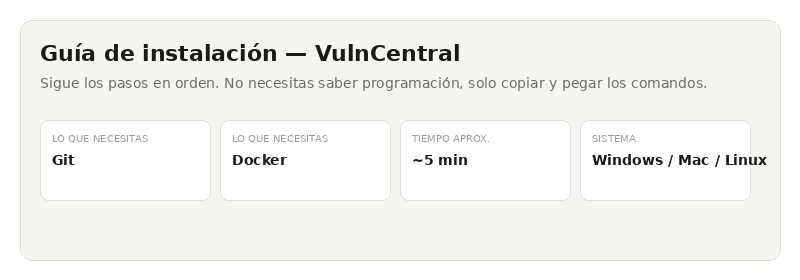
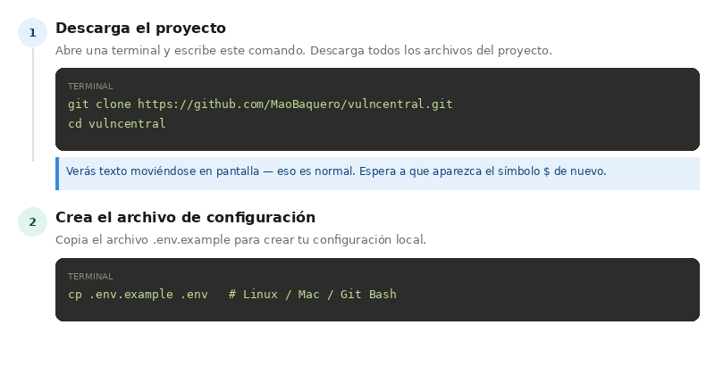
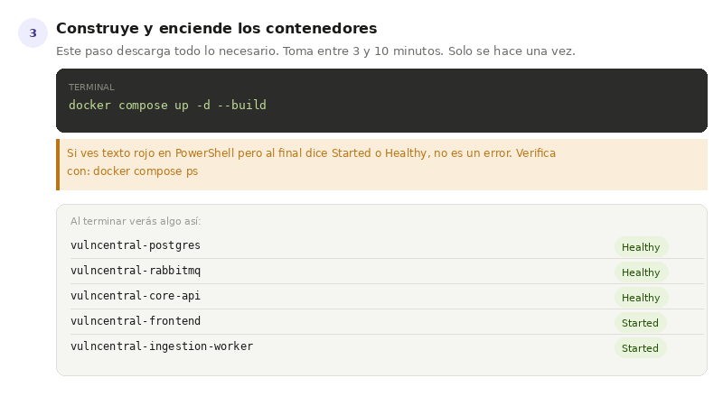
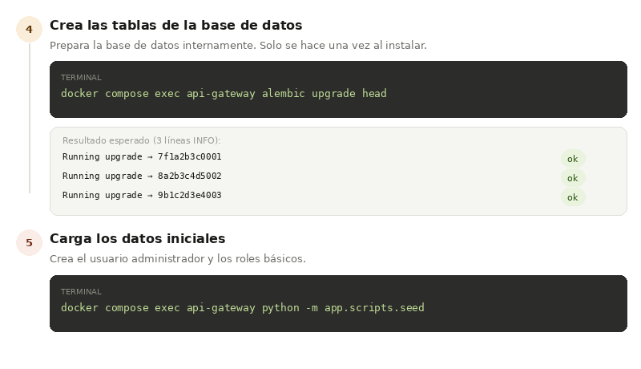
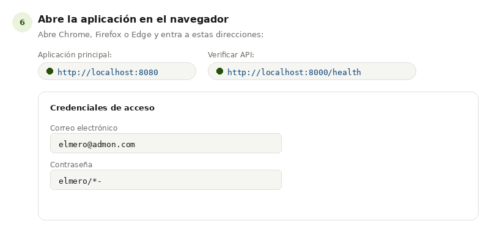
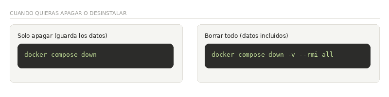

# Inicio Rápido — VulnCentral

> Guía visual paso a paso para instalar y ejecutar VulnCentral desde cero.
> No necesitas saber programación — solo sigue los pasos en orden y copia los comandos exactamente como aparecen.



---

## ¿Qué necesitas antes de empezar?

| Requisito | ¿Para qué sirve? | Cómo verificarlo |
|-----------|-----------------|-----------------|
| **Git** | Descargar el código fuente | `git --version` |
| **Docker Desktop** | Ejecutar todos los servicios de la app | `docker --version` |
| Conexión a internet | Descargar imágenes la primera vez | — |
| ~2 GB de espacio libre | Para las imágenes Docker | — |

> **¿Dónde descargo Git y Docker?**
> - Git: https://git-scm.com/downloads
> - Docker Desktop: https://www.docker.com/products/docker-desktop/
>
> Instálalos y asegúrate de que Docker Desktop esté **abierto y corriendo** antes de continuar.

---

## 🎯 **Ultra Fast Review**
Simplemente sigue en orden los siguientes pasos y podrás realizar la instalación del sistema tipo **NO Verbose**, si requieres información detallada **continua al siguiente literal**.

1. Crear una nueva carpeta (Cualquier nombre), ubíquese dentro de ella a través de una terminal.
2. **Corra paso a paso los siguiente comandos:**

```bash
git clone https://github.com/MaoBaquero/vulncentral.git
```
```bash
cp .env.example .env
```
```bash
docker compose up -d --build
```
```bash
docker compose exec api-gateway alembic upgrade head
```
```bash
docker compose exec api-gateway python -m app.scripts.seed
```

🔥 **¡Listo, tienes instalado VulnCentral!**
 
3. **Entra a** `http://localhost:8080/login`
    - **Atención**, si no te deja ingresar, ejecuta aplicativo desde el contenedor imagen "frontend"

4. ### 🚀 Para conectarse al aplicativo por primera vez use:
```
elmero@admon.com 
elmero/*-
```

## PASOS DE INSTALACIÓN DETALLADOS



### Paso 1 — Descarga el proyecto

Abre una terminal:
- **Windows:** busca "Git Bash" en el menú inicio
- **Mac:** abre "Terminal" desde Aplicaciones → Utilidades
- **Linux:** abre tu terminal favorita

Luego escribe estos comandos (uno por uno, presiona **Enter** después de cada uno):

```bash
git clone https://github.com/MaoBaquero/vulncentral.git
cd vulncentral
```

**¿Qué hace esto?**
Descarga todos los archivos del proyecto a una carpeta llamada `vulncentral` en tu computador y luego entra a esa carpeta.

> 💡 Verás texto moviéndose en pantalla mientras descarga. Eso es completamente normal. Espera a que vuelva a aparecer el símbolo `$` — eso significa que terminó.

---

### Paso 2 — Crea el archivo de configuración

El proyecto necesita un archivo llamado `.env` con contraseñas y configuraciones. Lo creamos copiando el archivo de ejemplo que ya viene incluido:

**En Windows (Git Bash), Mac o Linux:**
```bash
cp .env.example .env
```

**En Windows (PowerShell):**
```powershell
Copy-Item .env.example .env
```

> 💡 Para este inicio rápido **no necesitas editar el archivo**. Los valores por defecto funcionan perfectamente para probar la aplicación en tu computador.

---



### Paso 3 — Construye y enciende los contenedores

Este es el paso más largo. Docker descargará todo lo necesario y construirá la aplicación. Puede tomar entre **3 y 10 minutos** dependiendo de tu conexión a internet. **Solo necesitas hacerlo una vez.**

```bash
docker compose up -d --build
```

> ⚠️ **Si usas PowerShell y ves líneas en rojo:** Muchas veces es solo información de Docker imprimiéndose en stderr (no un error real). Si al final ves `Started` o `Healthy`, todo está bien. Verifica con `docker compose ps`.

Cuando termine, deberías ver algo así:

| Servicio | Estado |
|---------|--------|
| vulncentral-postgres | ✅ Healthy |
| vulncentral-rabbitmq | ✅ Healthy |
| vulncentral-core-api | ✅ Healthy |
| vulncentral-frontend | ✅ Started |
| vulncentral-ingestion-worker | ✅ Started |

Si algún servicio no aparece como `Healthy` o `Started`, revisa los logs con:
```bash
docker compose logs [nombre-del-servicio]
# Ejemplo:
docker compose logs api-gateway
```

---



### Paso 4 — Prepara la base de datos

Este comando crea las tablas necesarias dentro de la base de datos. **Solo se hace una vez al instalar.**

```bash
docker compose exec api-gateway alembic upgrade head
```

Deberías ver exactamente estas 3 líneas (con los códigos pueden variar levemente):

```
INFO Running upgrade  -> 7f1a2b3c0001, Esquema inicial
INFO Running upgrade 7f1a2b3c0001 -> 8a2b3c4d5002, users.role_id FK a roles
INFO Running upgrade 8a2b3c4d5002 -> 9b1c2d3e4003, audit_logs.user_id nullable
```

Si ves esas líneas, ¡perfecto! La base de datos está lista.

---

### Paso 5 — Carga los datos iniciales

Este comando crea el usuario administrador, los roles y los permisos básicos para que puedas entrar a la aplicación.

```bash
docker compose exec api-gateway python -m app.scripts.seed
```

Resultado esperado:

```
INFO Seed completado: {'use_cases': 5, 'roles': 3, 'permissions': 15, 'user': 'created'}
```

---



### Paso 6 — ¡Abre la aplicación!

Abre tu navegador (Chrome, Firefox o Edge) y entra a:

| ¿Qué abrir? | Dirección |
|------------|-----------|
| 🌐 **Aplicación principal** | http://localhost:8080 |
| 🔍 Verificar que la API funciona | http://localhost:8000/health |
| 🐰 Panel de RabbitMQ (avanzado) | http://localhost:15672 |
| 🐘 pgAdmin — base de datos (avanzado) | http://localhost:5050 |

#### Credenciales de acceso

```
Correo:     elmero@admon.com
Contraseña: elmero/*-
```

> ✅ Si ves la pantalla de login, ¡la instalación fue exitosa!

---

## Solución de problemas comunes

| Síntoma | Causa probable | Solución |
|---------|---------------|----------|
| `bind: address already in use` | Otro programa usa el mismo puerto | Cierra el programa que usa ese puerto, o cambia `FRONTEND_PORT` en el archivo `.env` |
| La aplicación no carga (pantalla en blanco) | Problema de CORS o URL de la API | Verifica que `CORS_ORIGINS` en `.env` incluya `http://localhost:8080` |
| No aparecen vulnerabilidades al cargar | El worker no está corriendo | Revisa `docker compose logs worker` |
| Error de conexión a la base de datos | El contenedor de postgres no está listo | Espera 30 segundos y vuelve a intentar. Revisa con `docker compose ps` |
| `Failed to fetch` al enviar datos | `VITE_API_BASE_URL` incorrecto | Verifica en `.env` que apunte a `http://localhost:8000` y reconstruye: `docker compose build frontend` |

---

## Apagar y desinstalar



### Solo apagar (los datos se guardan)

```bash
docker compose down
```

Para volver a encender más tarde:
```bash
docker compose up -d
```

### Borrar todo completamente (datos incluidos)

```bash
# Apaga y borra volúmenes de datos
docker compose down -v

# Apaga, borra volúmenes E imágenes Docker
docker compose down -v --rmi all
```

> ⚠️ `--rmi all` borra las imágenes Docker. La próxima instalación tardará igual que la primera vez (descarga completa).

---

## Próximos pasos

Una vez instalado puedes explorar:

- **Cargar resultados de Trivy:** Desde la interfaz web, sección "Cargar" — sube un JSON exportado por Trivy
- **Gestionar proyectos y escaneos:** Crea proyectos y asocia escaneos de vulnerabilidades
- **pgAdmin:** Accede a http://localhost:5050 para explorar la base de datos directamente
- **Documentación técnica completa:** Consulta el [README principal](../README.md) del repositorio

---

*Documento generado con base en la instalación verificada del repositorio. Si los puertos o servicios cambian en `docker-compose.yml`, actualiza este archivo en consecuencia.*
