# Manual de Usuario — VulnCentral
**Plataforma de Gestión de Vulnerabilidades con DevSecOps**

---

## Tabla de contenido

1. [Introducción](#1-introducción)
2. [Acceso al sistema — Login](#2-acceso-al-sistema--login)
3. [Panel principal — Dashboard](#3-panel-principal--dashboard)
4. [Gestión de Usuarios](#4-gestión-de-usuarios)
5. [Gestión de Proyectos](#5-gestión-de-proyectos)
6. [Gestión de Escaneos](#6-gestión-de-escaneos)
7. [Subida de reportes Trivy](#7-subida-de-reportes-trivy)
8. [Gestión de Vulnerabilidades](#8-gestión-de-vulnerabilidades)
9. [Logs de Auditoría](#9-logs-de-auditoría)
10. [Control de Acceso por Roles — RBAC](#10-control-de-acceso-por-roles--rbac)
11. [Cierre de sesión](#11-cierre-de-sesión)
12. [Errores comunes](#12-errores-comunes)
13. [Buenas prácticas](#13-buenas-prácticas)

---

## 1. Introducción

**VulnCentral** es una plataforma web diseñada para la gestión centralizada de vulnerabilidades de seguridad en aplicaciones y sistemas. Permite a los equipos registrar proyectos, ejecutar escaneos y analizar vulnerabilidades detectadas mediante herramientas automatizadas como **Trivy**.

El sistema implementa principios modernos de seguridad:

- **Autenticación JWT** — Tokens con expiración automática que protegen cada sesión
- **Control de acceso por roles (RBAC)** — Cada usuario accede únicamente a las funciones que su rol permite
- **Procesamiento asíncrono** — Los reportes se procesan en segundo plano con Celery + RabbitMQ sin bloquear la interfaz
- **Trazabilidad completa** — Cada acción queda registrada en los logs de auditoría con usuario, timestamp e IP

### Flujo recomendado de uso

```
Iniciar sesión  →  Crear proyecto  →  Crear escaneo  →  Subir reporte Trivy
                                                                ↓
                    Logs de auditoría  ←  Revisar vulnerabilidades detectadas
```

---

## 2. Acceso al sistema — Login

### URL de acceso

```
http://localhost:8080
```

### Credenciales del usuario administrador (instalación inicial)

| Campo | Valor |
|-------|-------|
| Correo electrónico | `elmero@admon.com` |
| Contraseña | `elmero/*-` |

> ⚠️ Estas credenciales son las del usuario creado durante la instalación. En un entorno real deben cambiarse inmediatamente tras el primer acceso.


### Pasos para iniciar sesión

1. Abre el navegador (Chrome, Firefox o Edge) y entra a `http://localhost:8080`
2. Escribe tu **correo electrónico** en el primer campo
3. Escribe tu **contraseña** en el segundo campo
4. Haz clic en el botón **Entrar**

---

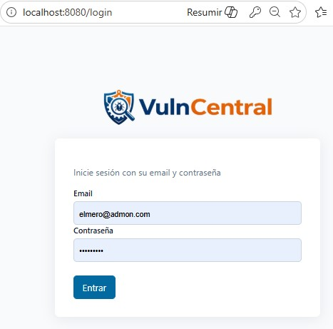


---

### ¿Qué sucede internamente?

Cuando haces clic en "Iniciar sesión" el sistema realiza los siguientes pasos de forma automática:

1. Envía tus credenciales de forma cifrada al servidor (HTTPS)
2. Valida el correo y la contraseña contra la base de datos
3. Si son correctas, genera un **token JWT** con tiempo de expiración configurado (por defecto 30 minutos)
4. Redirige automáticamente al Dashboard con tu sesión activa

### Posibles errores al iniciar sesión

| Error que aparece en pantalla | Causa probable | Qué hacer |
|-------------------------------|---------------|-----------|
| Credenciales inválidas | Correo o contraseña incorrectos | Verifica que no haya espacios o mayúsculas inesperadas |
| Sesión expirada | El token JWT venció | Vuelve a la pantalla de login e inicia sesión de nuevo |
| La página no carga | Docker no está corriendo | Ejecuta `docker compose up -d` y espera ~30 segundos |

---

## 3. Panel principal — Dashboard

El Dashboard es la primera pantalla que ves al iniciar sesión. Muestra un **resumen en tiempo real** del estado de seguridad de todos tus proyectos.

---

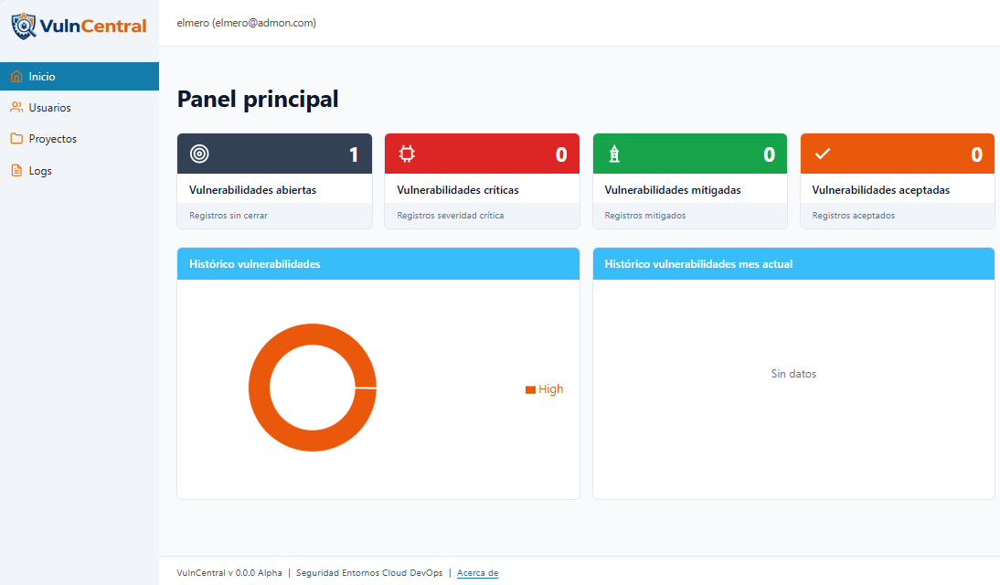


---

### Tarjetas de resumen (KPIs)

En la fila superior encontrarás 4 métricas clave del sistema:

| Tarjeta | ¿Qué muestra? | Por qué importa |
|---------|--------------|-----------------|
| **Proyectos activos** | Total de proyectos registrados | Visión general del alcance |
| **Escaneos totales** | Número acumulado de escaneos realizados | Seguimiento de la cobertura |
| **Vulnerabilidades** | Total de CVEs detectadas en todos los proyectos | Carga de trabajo pendiente |
| **Críticas sin resolver** | CVEs de nivel CRITICAL todavía abiertas | Riesgo inmediato — requieren atención urgente |

### Gráfico de distribución por severidad

La barra de colores muestra cómo se distribuyen las vulnerabilidades según su nivel de peligro:

| Color | Nivel | Qué significa | Urgencia recomendada |
|-------|-------|--------------|---------------------|
| 🔴 Rojo | **CRITICAL** | Explotable remotamente sin autenticación | Parchar hoy mismo |
| 🟠 Naranja | **HIGH** | Riesgo significativo, fácilmente explotable | Esta semana |
| 🟡 Amarillo | **MEDIUM** | Requiere condiciones específicas | Este sprint |
| 🟢 Verde | **LOW** | Impacto limitado o difícil de explotar | Próxima versión |

### Tabla de escaneos recientes

La tabla inferior lista los últimos escaneos de todos los proyectos con su estado y el conteo de vulnerabilidades por nivel (C / H / M / L).

---

## 4. Gestión de Usuarios

> ⚠️ Esta sección solo es visible para usuarios con rol **Administrador**.

### Listado de usuarios

---

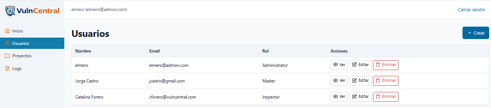

---

La pantalla muestra todos los usuarios registrados en el sistema.

**Columnas de la tabla:**

| Columna | Descripción |
|---------|-------------|
| Nombre | Nombre completo con avatar de iniciales |
| Email | Correo electrónico usado para iniciar sesión |
| Rol | Administrador / Master / Inspector |
| Acciones | Botones para ver, editar o eliminar el usuario |

### Crear un nuevo usuario

---

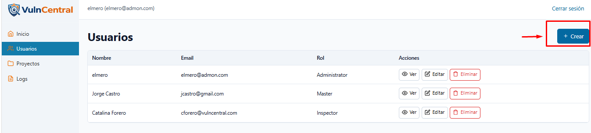

---

1. Haz clic en el botón **+ Crear** (esquina superior izquierda)
2. Se abre un formulario con los siguientes campos obligatorios (marcados con `*`):

   | Campo | Qué escribir | Ejemplo |
   |-------|-------------|---------|
   | Nombre completo | Nombre real de la persona | `Ana Gómez` |
   | Correo electrónico | El correo que usará para entrar | `ana@empresa.com` |
   | Contraseña | Mínimo 8 caracteres | `SecureP@ss123` |
   | Rol del usuario | Selecciona del desplegable | `Master` |

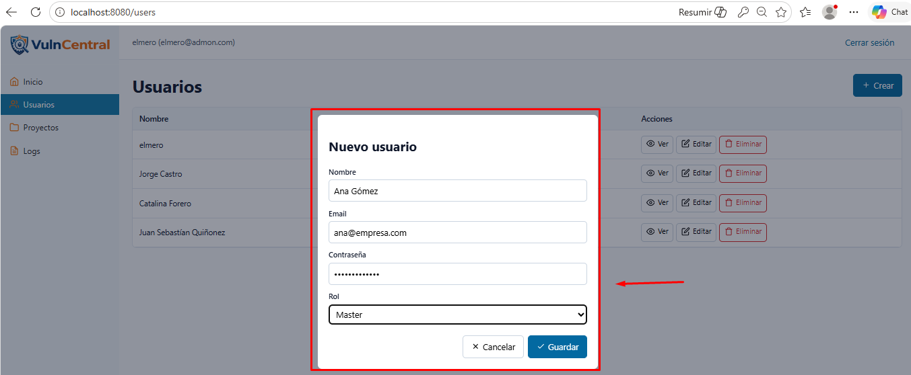

3. Haz clic en **Guardar usuario**
4. El usuario tendrá acceso inmediato con las credenciales creadas

### Editar un usuario

1. En la tabla, localiza el usuario que deseas modificar
2. Haz clic en **Editar** en la columna de acciones
3. Cambia los campos necesarios (nombre, correo, rol o estado)
4. Haz clic en **Guardar cambios**

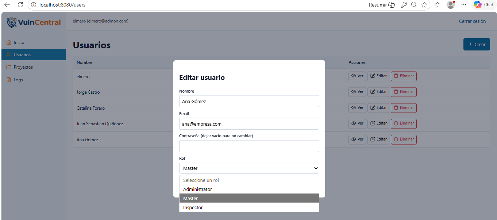

### Eliminar un usuario

1. Haz clic en **Eliminar** junto al usuario que deseas eliminar
2. El sistema mostrará una confirmación antes de proceder
3. La acción queda registrada permanentemente en los logs de auditoría

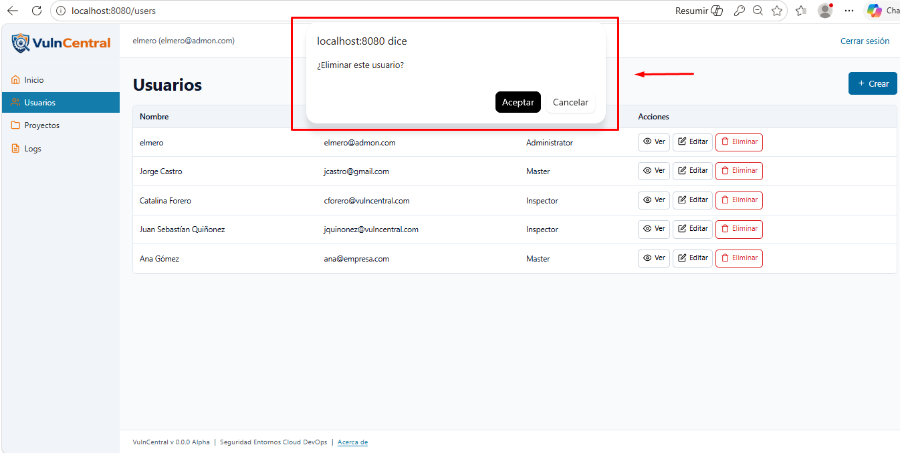

> ⚠️ No puedes eliminar tu propio usuario mientras tienes sesión activa.

---

## 5. Gestión de Proyectos

Los proyectos son el contenedor principal del sistema. Cada proyecto agrupa escaneos y, a través de ellos, las vulnerabilidades detectadas.

---

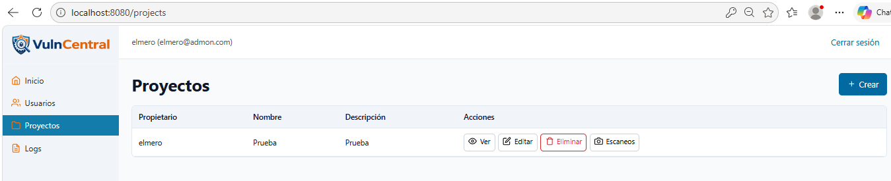

---

Los proyectos se muestran como tarjetas con información visual rápida:


- **Nombre y descripción** del proyecto
- **Contador de escaneos** realizados
- **Indicador de vulnerabilidades** — Muestra el número en rojo si hay vulns pendientes, o "Limpio ✓" en verde si no tiene ninguna

### Crear un nuevo proyecto

1. Haz clic en **+ Nuevo proyecto**
2. Completa los campos del formulario:


   | Campo | Descripción | Ejemplo |
   |-------|-------------|---------|
   | Usuario propietario | Identificador o consecutivo | `3` |   
   | Nombre | Identificador corto y descriptivo | `api-gateway` |
   | Descripción | Qué hace o qué es este proyecto | `Servicio de autenticación y routing principal` |

3. Haz clic en **Guardar**

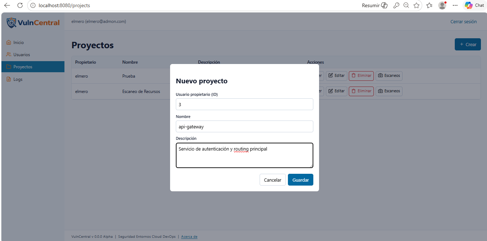

El proyecto aparecerá de inmediato en la lista y estará listo para recibir escaneos.

---

## 6. Gestión de Escaneos

Un escaneo representa una ejecución puntual de análisis de seguridad sobre un proyecto. Cada vez que ejecutas Trivy sobre un servicio y subes el resultado, se crea un escaneo.

Se debe buscar el proyecto anteriormente creado y se selecciona la opción de "Escaneos"


---

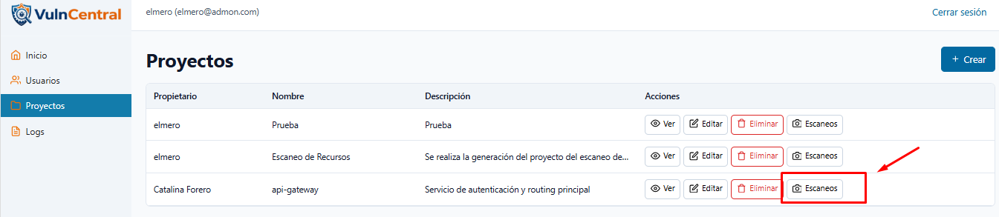

---


### Columnas de la tabla

| Columna | Descripción |
|---------|-------------|
| ID | Identificador único del escaneo |
| Proyecto | A qué proyecto pertenece |
| Fecha | Cuándo se registró |
| Tool | Herramienta utilizada (actualmente: Trivy) |
| Estado | Completado / Procesando / Fallido |
| CRITICAL / HIGH / MEDIUM / LOW | Conteo de vulnerabilidades por nivel |

### Estados posibles de un escaneo

| Indicador | Estado | Qué significa |
|-----------|--------|--------------|
| 🟡 Amarillo | **Procesando** | El worker Celery está extrayendo las vulnerabilidades del JSON |
| ✅ Verde | **Completado** | El reporte fue procesado correctamente y las vulns están disponibles |
| ❌ Rojo | **Fallido** | Hubo un error al procesar el archivo. Verifica el formato del JSON |

### Crear un nuevo escaneo

1. Haz clic en **+ Crear**
2. En el formulario, selecciona el **proyecto** al que pertenece este escaneo
3. Haz clic en **Guardar**
4. El escaneo queda registrado en estado pendiente — a continuación debes subir el reporte Trivy

---

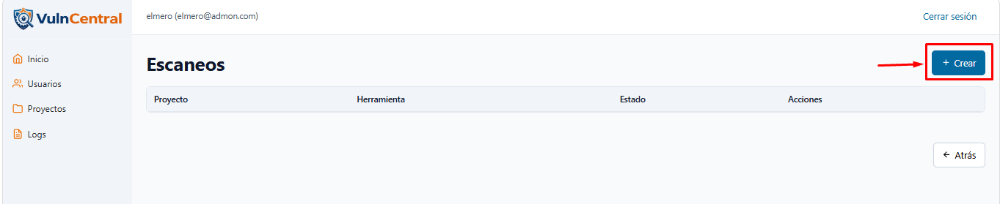

---

---

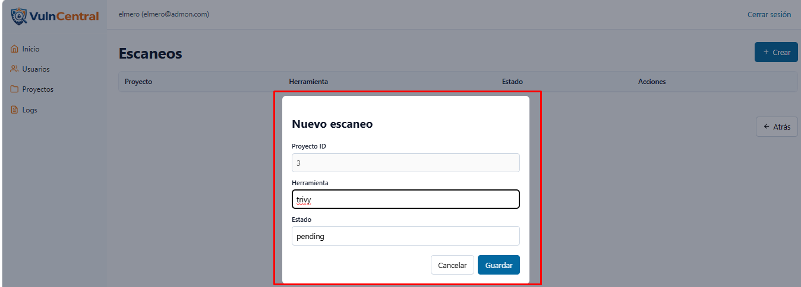

---

---

## 7. Subida de reportes Trivy

Esta es la función central del sistema: cargar el archivo JSON generado por Trivy para que VulnCentral lo procese y registre todas las vulnerabilidades encontradas.


### ¿Cómo generar el archivo JSON con Trivy?

Antes de subir el reporte, necesitas ejecutar Trivy en tu entorno. 

> El flag `--format json` es obligatorio para que VulnCentral pueda leer el reporte.

##  Escaneo de vulnerabilidades con Trivy usando Docker

Para llevar a cabo este ejercicio, es importante seguir una serie de pasos organizados que permitan obtener y analizar el reporte de vulnerabilidades de una imagen Docker.

### Paso 1: Identificación de la imagen

En primer lugar, se debe identificar la imagen que se desea analizar desde Docker Hub o desde el entorno local.  
Para este ejemplo, se utilizará la imagen:

vulncentral-api-gateway:latest


---

### Paso 2: Ejecución del escaneo

A continuación, se ejecuta el siguiente comando en la terminal (PowerShell), el cual permite realizar el escaneo de vulnerabilidades utilizando Trivy a través de Docker:

```bash
docker run --rm -v /var/run/docker.sock:/var/run/docker.sock -v ${PWD}:/app aquasec/trivy image --format json --output /app/reporte.json vulncentral-api-gateway:latest

```
Este comando realiza lo siguiente:

- Ejecuta Trivy dentro de un contenedor Docker
- Analiza la imagen especificada
- Genera un reporte en formato JSON
- Guarda el archivo en la carpeta actual del proyecto

---

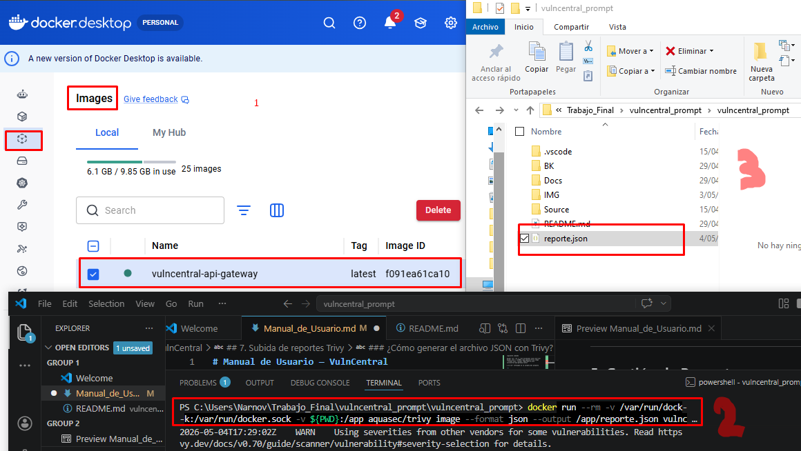

---


### Pasos para subir el reporte

1. Desde la lista de Proyectos, haz clic en **Escaneos**  al que quieres cargar el reporte
2. Haz clic en el botón **Vulnerabilidades**
3. Haz clic en el botón **Cargar**
4. Carga el archivo:
   - ** Abrir** el archivo `.json` en un bloc de notas, búscalo en tu computador
   - Haz clic en **Seleccionar y copiar ** 
5. Luego pégalo en el cuadro de diálogo de " Cargar informe Trivy - escaneo "xx "" "Haz clic en **Enviar** y generará un aviso en la parte superior "Encolado task_id:xxxx"

---

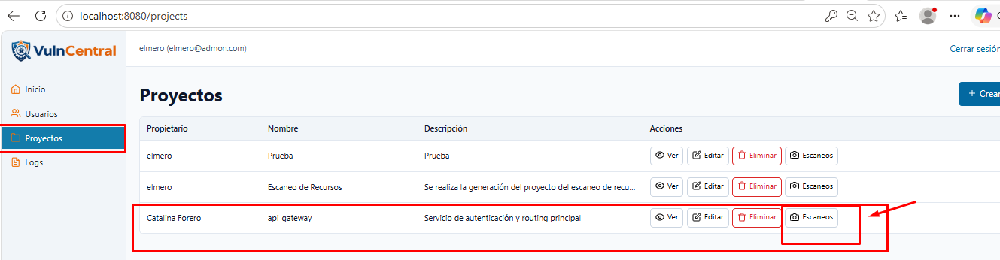
---

---

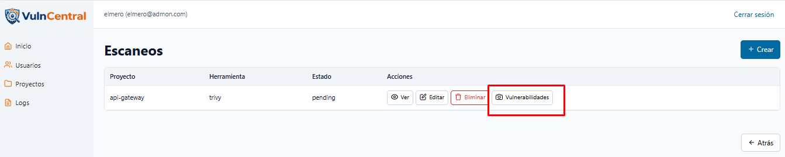

---

---

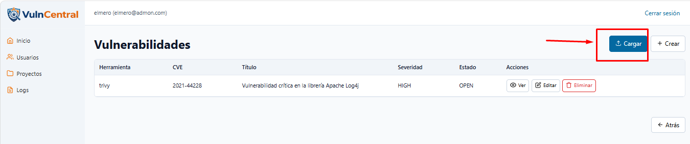

---

---

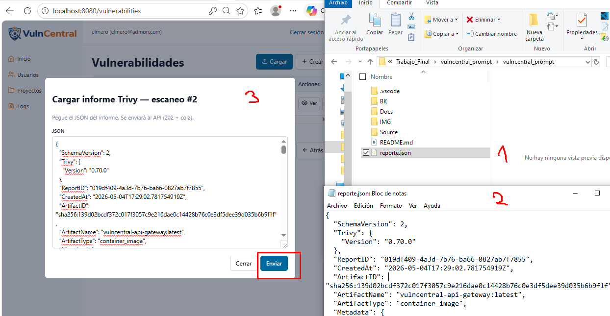

---

---

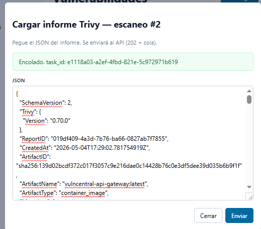

---

### ¿Qué pasa después de subir el reporte?

| Paso | ¿Qué ocurre? | ¿Cuánto tarda? |
|------|-------------|---------------|
| **1 — Subida** | El JSON se almacena en el servidor | Inmediato |
| **2 — Cola** | Se envía un mensaje a la cola RabbitMQ | Inmediato |
| **3 — Worker** | Celery procesa el JSON y extrae las CVEs | 5-30 segundos |
| **4 — Resultado** | Las vulnerabilidades aparecen en el listado | Al recargar la página |

> ⏱ Si después de 1 minuto no aparecen vulnerabilidades, revisa los logs del worker:
> ```bash
> docker compose logs worker
> ```

---

## 8. Gestión de Vulnerabilidades

### Vulnerabilidades por proyecto

Se busca el proyecto, luego se selecciona la opción de escaneos y luego vulnerabilidades


---

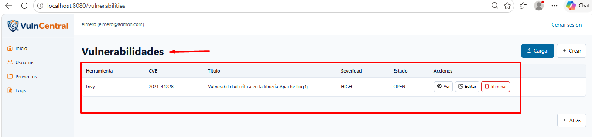

---

Esta pantalla evidencia **todas** las vulnerabilidades detectadas en el proyecto y escaneo del sistema.

### Columnas de la tabla

| Columna | Descripción |
|---------|-------------|
| Herramienta | Por defecto "Trivy" |
| Escaneo ID | Consecutivo |
| Título | Titulo de la vulnerabilidad |
| Descripción | Descripción de la vulnerabilidad |
| Severidad | CRITICAL / HIGH / MEDIUM / LOW |
| Estado | OPEN / IN_PROGRESS / MITIGATED / ACCEPT |
| CVE | Identificador estándar de la vulnerabilidad (ej: `CVE-2024-45337`) |
| Ruta Fichero| Opcional |
| Línea | 0 (Opcional) |

#### Para crear vulnerabilidades

---

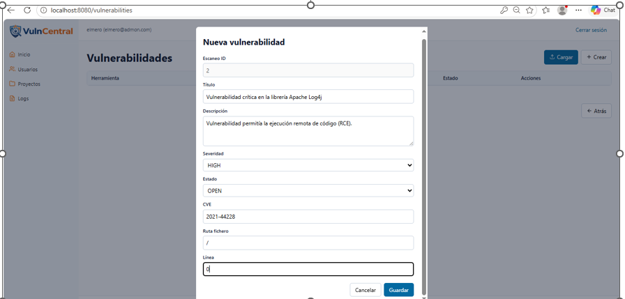

---


### Escala de severidad CVSS

| Puntuación | Nivel | Urgencia |
|-----------|-------|---------|
| 9.0 — 10.0 | **CRITICAL** | Atención inmediata — riesgo de explotación activa |
| 7.0 — 8.9  | **HIGH** | Atender esta semana |
| 4.0 — 6.9  | **MEDIUM** | Planificar en el próximo sprint |
| 0.1 — 3.9  | **LOW** | Baja prioridad, atender cuando sea posible |

### Filtros disponibles

Puedes combinar cualquiera de estos filtros para encontrar lo que necesitas:

- **Severidad** — Ver solo las CRITICAL o HIGH que requieren atención urgente
- **Estado** — Ver solo las abiertas o las que están en revisión
- **Proyecto** — Ver solo las vulnerabilidades de un proyecto específico
- **Buscar CVE** — Buscar por el identificador exacto de una CVE

### Detalle de una vulnerabilidad

---

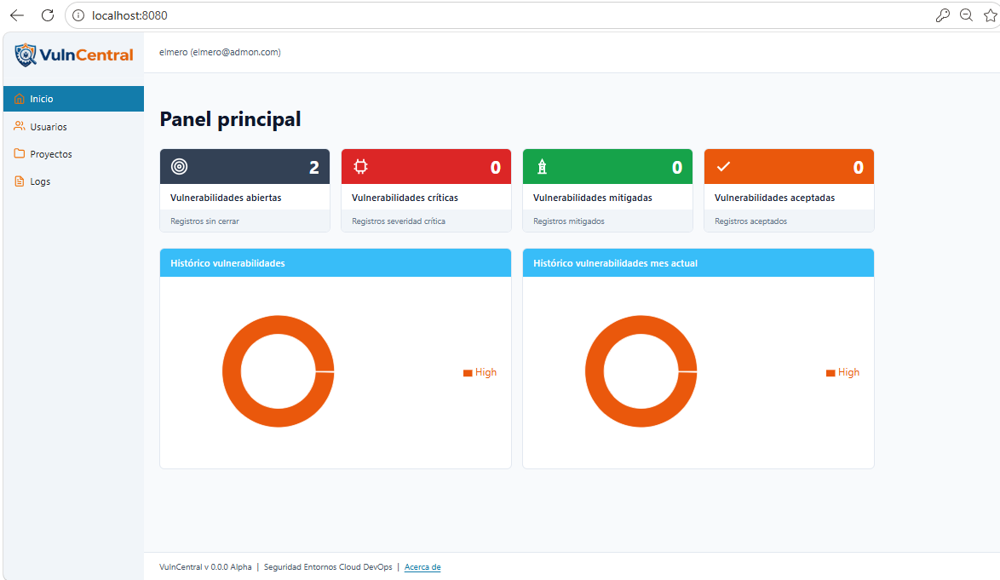

---

Al hacer clic en **Detalle** de cualquier fila verás la información completa:

- **Descripción técnica** del problema y cómo puede ser explotado
- **Vector de ataque** (Red, Local, Físico) y complejidad de explotación
- **Impacto** en confidencialidad, integridad y disponibilidad del sistema
- **Versión con el fix** disponible para actualizar el paquete afectado
- **Referencias** a NVD, GitHub Security Advisories y otros recursos oficiales
- **Metadata** del escaneo donde fue detectada y usuario asignado para resolverla

### Cambiar el estado de una vulnerabilidad

1. Entra al detalle de la vulnerabilidad
2. Usa los botones de estado para avanzar en el flujo:

```
Abierta  →  En revisión  →  Resuelta
```

3. El cambio queda registrado automáticamente en los logs de auditoría con tu usuario y la hora exacta

---

## 9. Logs de Auditoría

El módulo de logs registra **cada acción** realizada en el sistema por cualquier usuario, proporcionando trazabilidad completa.

---

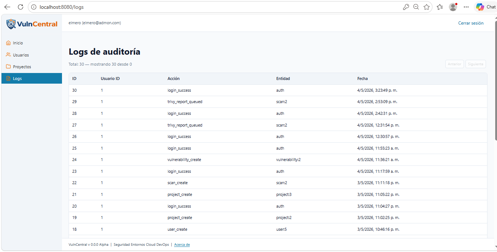

---

> ⚠️ Solo los usuarios con rol **Administrador** tienen acceso completo a los logs.

### Columnas del log


| Columna | Descripción |
|---------|-------------|
| ID| Identificador automático del log  |
| Usuario ID | Quién realizó la acción |
| Acción | Tipo de evento estandarizado |
| Entidad | Qué objeto del sistema fue modificado |
| Fecha| Fecha y hora exacta del evento |


### Tipos de eventos registrados

| Código de acción | Significado |
|-----------------|-------------|
| `LOGIN` | Inicio de sesión exitoso |
| `LOGIN_FAILED` | Intento fallido — posible ataque de fuerza bruta si hay varios seguidos |
| `LOGOUT` | Cierre de sesión voluntario |
| `CREATE_SCAN` | Creación de un nuevo escaneo |
| `UPLOAD_REPORT` | Subida de un reporte Trivy |
| `PROCESS_REPORT` | El worker procesó automáticamente un reporte |
| `UPDATE_VULN` | Cambio de estado en una vulnerabilidad |
| `CREATE_USER` | Registro de un nuevo usuario en el sistema |

### Cómo interpretar los códigos de resultado

| Código | Significado |
|--------|-------------|
| `200 OK` | Acción completada con éxito |
| `201 Created` | Recurso creado correctamente |
| `202 Accepted` | Solicitud aceptada y en cola de procesamiento |
| `401 Unauthorized` | Acceso denegado — credenciales incorrectas o sesión expirada |
| `403 Forbidden` | El usuario no tiene permisos para esta acción (RBAC) |

---

## 10. Control de Acceso por Roles — RBAC

El sistema implementa tres roles con diferentes niveles de acceso. El rol se asigna al crear o editar un usuario.

---

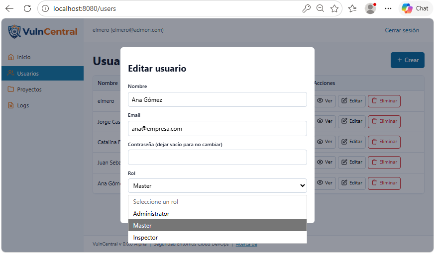

---

### Descripción de cada rol

#### Administrador
Acceso completo a todas las funciones del sistema. Es el único rol que puede gestionar usuarios y ver los logs de auditoría completos.

#### Master
Puede trabajar con proyectos, escaneos y vulnerabilidades, pero **no puede gestionar otros usuarios** ni ver los logs de auditoría.

#### Inspector
Acceso de solo lectura. Puede visualizar la información pero **no puede crear, editar ni eliminar** ningún recurso.

### Tabla comparativa de permisos

| Función | Administrador | Master | Inspector |
|---------|:---:|:---:|:---:|
| Ver dashboard | ✅ | ✅ | ✅ |
| Crear nuevos usuarios | ✅ | ❌ | ❌ |
| Editar / eliminar usuarios | ✅ | ❌ | ❌ |
| Ver lista de usuarios | ✅ | ❌ | ❌ |
| Crear proyectos | ✅ | ✅ | ❌ |
| Ver proyectos | ✅ | ✅ | ✅ |
| Crear escaneos | ✅ | ✅ | ❌ |
| Subir reportes Trivy | ✅ | ✅ | ❌ |
| Ver vulnerabilidades | ✅ | ✅ | ✅ |
| Cambiar estado de una vuln | ✅ | ✅ | ❌ |
| Ver logs de auditoría | ✅ | ❌ | ❌ |

> Si una sección no aparece en el menú lateral, significa que tu rol actual no tiene permiso para acceder a ella. Contacta al administrador del sistema para solicitar un cambio de rol.

---

## 11. Cierre de sesión

Para cerrar tu sesión de forma segura:

1. Localiza tu nombre de usuario en la parte **inferior del menú lateral** izquierdo
2. Haz clic sobre él
3. Selecciona **Cerrar sesión**

El sistema invalidará tu token JWT y te redirigirá automáticamente a la pantalla de login.

> 💡 Si cierras la pestaña del navegador sin cerrar sesión, el token expirará automáticamente después del tiempo configurado (por defecto 30 minutos). Sin embargo, siempre es mejor cerrar sesión explícitamente para proteger tu cuenta.

---

## 12. Errores comunes

| Síntoma que ves | Causa más probable | Qué hacer |
|----------------|-------------------|-----------|
| La página no carga en absoluto | Docker no está corriendo | Ejecuta `docker compose up -d` y espera 30 segundos |
| "Credenciales inválidas" en el login | Correo o contraseña incorrectos | Verifica que no haya espacios extras o mayúsculas inesperadas |
| No aparecen vulnerabilidades después de subir el reporte | El worker no está procesando | Revisa: `docker compose logs worker` |
| "Failed to fetch" al enviar datos | Problema de CORS o URL de API incorrecta | Verifica `VITE_API_BASE_URL` en el archivo `.env` y reconstruye el frontend |
| "Token inválido" o "No autorizado" en cualquier pantalla | El token JWT expiró | Cierra sesión y vuelve a iniciar sesión |
| Una sección del menú no aparece | Tu rol no tiene acceso a esa función | Solicita al administrador un cambio de rol |
| El escaneo queda en estado "Fallido" | El archivo JSON tiene formato incorrecto | Asegúrate de ejecutar Trivy con el flag `--format json` |
| Pantalla en blanco después del login | Problema de CORS o variable de entorno | Verifica `CORS_ORIGINS` y `VITE_API_BASE_URL` en el `.env` |

---

## 13. Buenas prácticas

### Seguridad de cuenta
- Nunca compartas tus credenciales con otros usuarios — cada persona debe tener su propia cuenta
- Usa contraseñas de al menos 12 caracteres combinando letras, números y símbolos
- Cierra sesión al terminar tu trabajo, especialmente en equipos compartidos o públicos
- Si sospechas que tu cuenta fue comprometida, notifica al administrador de inmediato

### Gestión de vulnerabilidades
- Revisa las vulnerabilidades de nivel **CRITICAL** al menos una vez por día
- Actualiza el estado de las vulnerabilidades conforme se avanza en su resolución para mantener el dashboard actualizado
- Antes de marcar una vulnerabilidad como "Resuelta", verifica que el paquete actualizado esté efectivamente desplegado
- Documenta el ticket o pull request relacionado en los campos disponibles para mantener trazabilidad

### Uso de Trivy
- Ejecuta escaneos regularmente — lo ideal es integrarlos en el pipeline de CI/CD para cada despliegue
- Siempre usa `--format json` para que el reporte sea compatible con VulnCentral
- Mantén Trivy actualizado para contar con la base de datos de CVEs más reciente: `trivy image --download-db-only`

### Administración del sistema
- Crea una cuenta individual para cada miembro del equipo — nunca compartas el usuario administrador
- Asigna el rol **mínimo necesario** para cada persona (principio de mínimo privilegio)
- Revisa los logs de auditoría periódicamente para detectar patrones de acceso sospechosos, especialmente eventos `LOGIN_FAILED` repetidos
- Realiza escaneos de los propios contenedores de VulnCentral periódicamente

---

*Manual de Usuario · VulnCentral v1.0 · Para soporte técnico revisa los logs con `docker compose logs` o contacta al administrador del sistema.*
