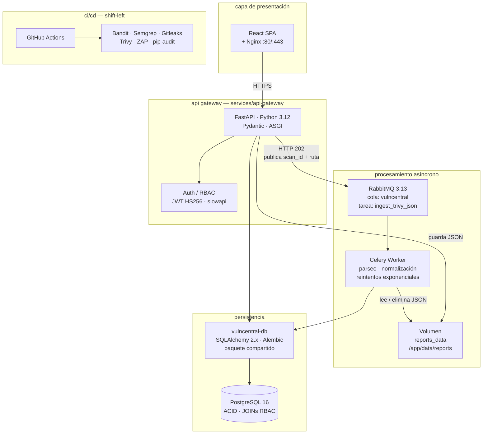
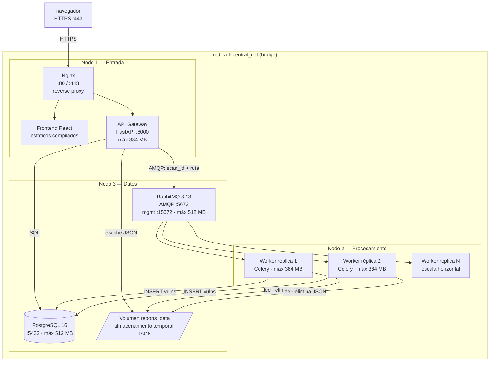
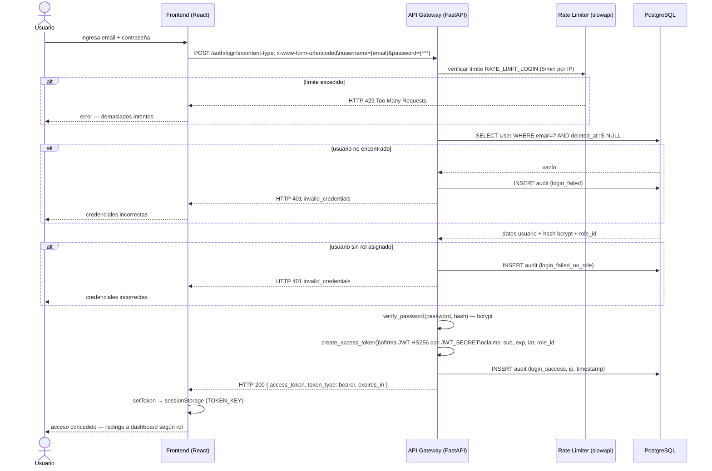
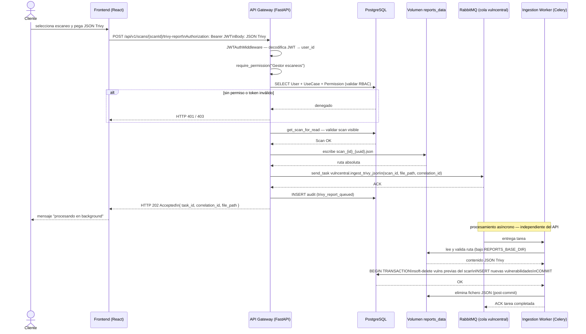
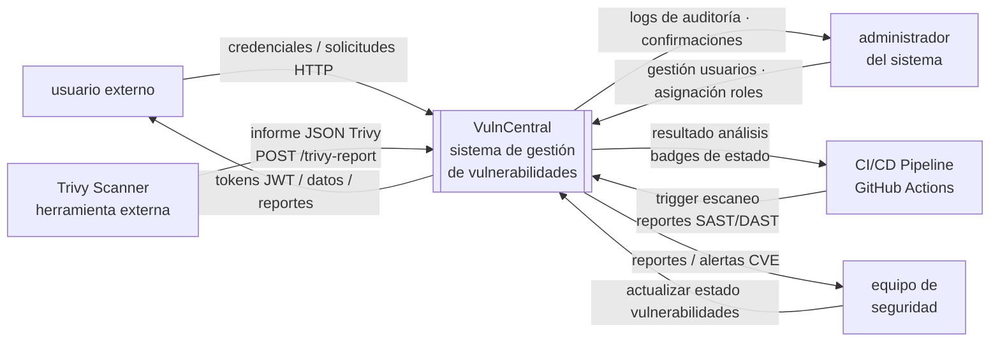
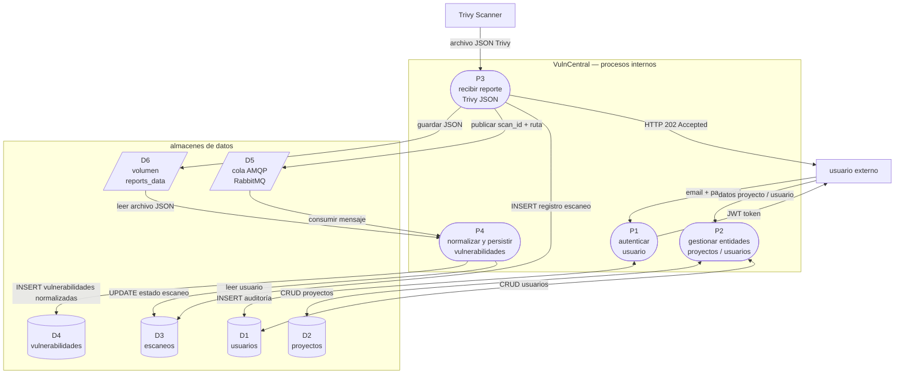
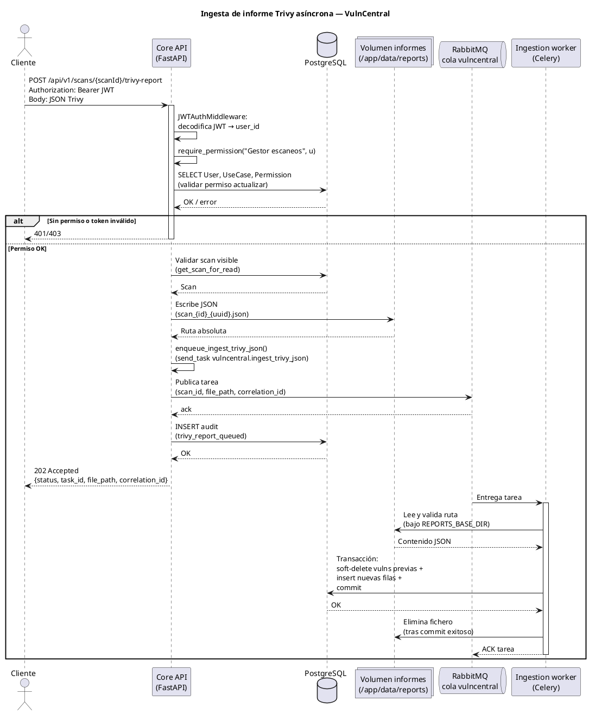
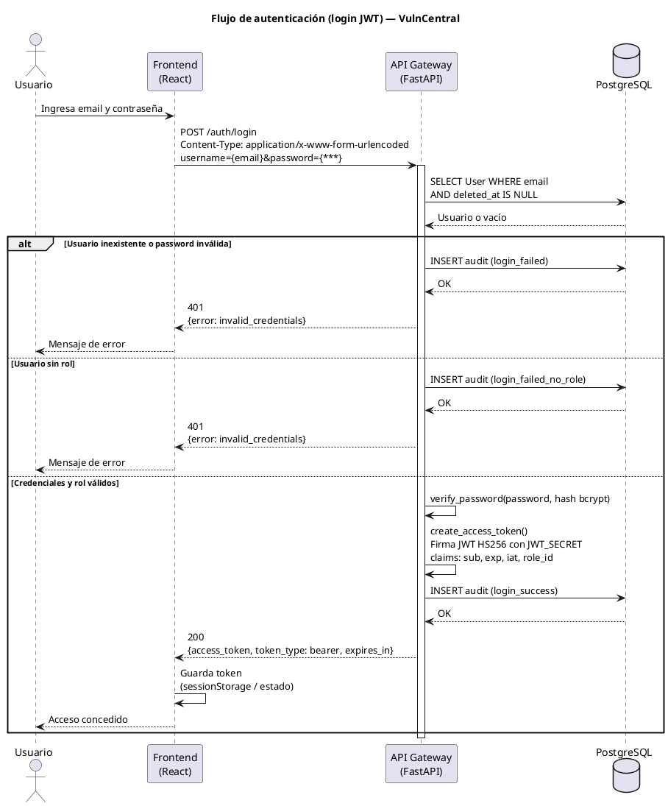

# Manual de Arquitectura — VulnCentral

**Versión:** 1.0
**Proyecto:** VulnCentral — Plataforma DevSecOps
**Institución:** Fundación Universitaria UNIMINUTO
**Programa:** Especialización en Ciberseguridad · Seguridad Entornos Cloud DevOps
**Autores:** Ing. Argel Ochoa Ronald David · Ing. Baquero Soto Mauricio · Ing. Buitrago Guiot Óscar Javier · Ing. Estefanía Naranjo Novoa

---

## 1. Descripción de la Arquitectura de Microservicios

VulnCentral implementa una **arquitectura de microservicios asíncronos orquestada por eventos (Event-Driven)**. El sistema divide las responsabilidades en contenedores independientes que se comunican a través de una red aislada (`vulncentral_net`) y un broker de mensajes (RabbitMQ).

Una particularidad fundamental es el **"Patrón de Base de Datos Compartida por Paquete"**: aunque son microservicios independientes, tanto el API como el Worker se conectan a la misma instancia PostgreSQL. Para evitar duplicar código ORM, se extrajo un paquete Python compartido (`packages/vulncentral-db`) que se inyecta durante el build de Docker. Esto garantiza integridad referencial sin acoplar los ciclos de vida de los contenedores.

### Flujo de procesamiento central

1. El usuario sube un informe Trivy (JSON) desde el frontend.
2. El API Gateway valida, persiste el archivo en el volumen `reports_data` y publica en RabbitMQ únicamente el `scan_id` y la `ruta_absoluta` — nunca el payload completo.
3. El API responde inmediatamente con **HTTP 202 Accepted**, sin bloquear al cliente.
4. El Worker Celery consume el mensaje, lee el archivo del volumen, normaliza las vulnerabilidades y las persiste en PostgreSQL mediante una transacción ACID.
5. Tras el commit exitoso, el Worker elimina el fichero JSON del volumen.

### Servicios desplegables

| Servicio | Artefacto | Responsabilidad principal |
|----------|-----------|--------------------------|
| **Frontend** | `services/frontend` (React + Nginx) | SPA; solo habla con la API pública por HTTP. RBAC oculta elementos según rol. |
| **Core API** | `services/api-gateway` (FastAPI) | JWT, RBAC, CRUD en `/api/v1`, encolado de ingesta Trivy, escritura/lectura BD. |
| **Ingestion Worker** | `services/worker` (Celery) | Consume tareas AMQP, lee JSON Trivy del volumen compartido, normaliza y persiste vulnerabilidades. |

Infraestructura compartida: **PostgreSQL 16**, **RabbitMQ 3.13**, volumen **`reports_data`**.

---

## 2. Decisiones de Diseño y Patrones Utilizados

| Patrón / Decisión | Implementación en VulnCentral | Justificación |
| :--- | :--- | :--- |
| **API Gateway Pattern** | Servicio `api-gateway` como punto único de entrada | Centraliza autenticación, rate limiting y enrutamiento |
| **Choreography Saga** | API publica en RabbitMQ; Worker procesa de forma independiente | Desacopla el tiempo de respuesta HTTP del procesamiento pesado. Responde HTTP 202 inmediato |
| **Proxy de Referencia** | El API publica solo `scan_id` y `ruta_absoluta` por la cola AMQP | Evita saturar la red y la memoria del broker con payloads masivos (>10 MB) |
| **Shared-Nothing (Lógica)** | Worker y API no comparten estado en memoria; solo conexión a PostgreSQL | Simplifica transacciones ACID sin requerir eventos de sincronización complejos |
| **Repository Pattern** | Capa de datos centralizada en `vulncentral-db` (SQLAlchemy 2.x) | Desacopla la lógica de negocio del motor de BD; facilita testing y migración futura |
| **Dependency Injection** | `FastAPI Depends()` para sesiones, usuarios autenticados y permisos | Permite probar componentes de forma aislada sin acoplamiento directo |
| **Defense in Depth (OWASP)** | Validación MIME, Rate Limiting, prevención Path Traversal, IDOR a nivel SQL | Múltiples capas de seguridad redundantes; ninguna capa es el único control |
| **Soft Delete** | Los registros no se eliminan físicamente de la base de datos | Preserva trazabilidad de auditoría y permite recuperación ante errores operativos |

---

## 3. Justificación de Cada Componente

### 3.1 Frontend — React 18 + Vite + Nginx

Nginx sirve los archivos estáticos compilados y actúa como proxy inverso hacia el API Gateway, evitando exponer el servidor Vite en producción. El RBAC del lado del cliente oculta elementos de la interfaz según el rol del usuario autenticado, complementando (sin reemplazar) los controles del backend.

### 3.2 API Gateway — FastAPI + Pydantic (Python 3.12)

FastAPI fue seleccionado por su modelo de I/O asíncrono basado en ASGI, que permite manejar múltiples conexiones concurrentes sin bloquear el event loop. Pydantic valida el esquema del informe Trivy en tiempo de ejecución al milisegundo, rechazando payloads malformados antes de que lleguen a la lógica de negocio.

### 3.3 Worker — Celery + RabbitMQ 3.13

Celery aísla el procesamiento CPU/IO intensivo (parseo de JSON, normalización, inserción masiva) del ciclo de vida del API. Si el parseo falla, el API no se ve afectado; Celery gestiona reintentos automáticos ante errores **transitorios** (DB, red), pero no reintenta errores de validación (`ValueError`, `ValidationError`, `JSONDecodeError`). RabbitMQ garantiza entrega confiable con persistencia en disco y soporte de dead-letter queues.

### 3.4 Volumen Compartido — `reports_data`

Actúa como almacenamiento temporal entre el API y el Worker, evitando transferir el payload JSON completo por la cola AMQP. El Worker valida que la ruta esté bajo `REPORTS_BASE_DIR` para prevenir Path Traversal. Justificado para on-premise sin requerir S3/MinIO en esta fase.

### 3.5 Persistencia — PostgreSQL 16 + SQLAlchemy 2.x + Alembic

PostgreSQL fue seleccionado sobre soluciones NoSQL porque el modelo de datos requiere JOINs complejos para calcular permisos RBAC y aplicar condiciones IDOR a nivel de consulta (`WHERE project_id IN (SELECT ... WHERE user_id = current_user)`). Alembic gestiona un único hilo de migraciones versionadas y reversibles desde `services/api-gateway/alembic`.

### 3.6 Autenticación — JWT (HS256) + passlib + slowapi

JWT permite autenticación stateless habilitando escalabilidad horizontal sin sesiones en servidor. `passlib` con bcrypt gestiona el hashing seguro de contraseñas. `slowapi` implementa rate limiting configurable vía `RATE_LIMIT_LOGIN` (por defecto `5/minute`) para mitigar fuerza bruta y credential stuffing.

### 3.7 Matriz de propiedad de tablas

| Tabla | Core API | Ingestion Worker | Notas |
|-------|----------|-----------------|-------|
| `users` | W / R | — | Seed y CRUD según RBAC |
| `roles` | R (seed) | — | Solo lectura en tiempo de ejecución |
| `use_cases` | R (seed) | — | |
| `permissions` | R (seed) | — | |
| `projects` | W / R | — | |
| `scans` | W / R | R | Worker comprueba existencia; no crea scans |
| `vulnerabilities` | W / R | W / R | Worker: soft-delete previas + insert masivo |
| `audit_logs` | W / R | — | Registro inmutable de acciones |

---

## 4. Diagramas UML

> Todos los diagramas están definidos como código en sintaxis **Mermaid** y **PlantUML**, directamente versionables en el repositorio. Se pueden renderizar en GitHub, GitLab, VS Code (extensión Mermaid), Obsidian o cualquier visor compatible.

---

### 4.1 Diagrama de Componentes

> Visión general de la arquitectura: capas, paquete ORM compartido y separación de responsabilidades entre el API Gateway y el Worker.



---

### 4.2 Diagrama de Despliegue

> Contenedores Docker, red aislada `vulncentral_net`, volúmenes y límites de memoria por servicio.



> **Escalado horizontal de workers:**
> ```bash
> # Docker Compose
> docker compose up --scale worker=4 -d
>
> # Docker Swarm (producción)
> docker service scale vulncentral_worker=5
> ```

---

### 4.3 Diagrama de Secuencia — Flujo Crítico: Autenticación JWT

> Flujo completo con OAuth2 password flow, verificación bcrypt, rate limiting, generación JWT y registro de auditoría. Incluye los tres caminos de error.



---

### 4.4 Diagrama de Secuencia — Flujo Crítico: Ingesta de Informe Trivy

> Flujo asíncrono completo: validación RBAC, escritura en volumen, publicación AMQP, HTTP 202 inmediato y procesamiento en background por el Worker.



---

### 4.5 Diagrama de Casos de Uso — Actores e Interacciones RBAC

> Los cuatro actores del sistema RBAC. El frontend oculta opciones no permitidas; el backend valida en cada endpoint de forma independiente.

```mermaid
graph TB
    subgraph Actores
        U((usuario\nautenticado))
        ADM((administrador))
        MAE((maestro))
        INS((inspector))
    end

    subgraph Auth["autenticación"]
        Login["iniciar sesión\nPOST /auth/login"]
        Logout["cerrar sesión"]
        Pwd["cambiar contraseña"]
    end

    subgraph GestionUsuarios["gestión de usuarios"]
        CU["crear / editar / desactivar usuarios\nPOST·PUT /api/v1/users"]
        RO["asignar roles"]
        AU["ver registro de auditoría\nGET /api/v1/audit-logs"]
    end

    subgraph GestionProyectos["gestión de proyectos y escaneos"]
        CP["crear / editar proyectos\nPOST·PUT /api/v1/projects"]
        CS["crear escaneos\nPOST /api/v1/scans"]
        UP["subir informe Trivy\nPOST /api/v1/scans/{id}/trivy-report"]
        VS["ver escaneos del proyecto\nGET /api/v1/scans"]
    end

    subgraph GestionVulns["gestión de vulnerabilidades"]
        VV["ver vulnerabilidades\nGET /api/v1/vulnerabilities"]
        AE["actualizar estado\nPATCH /api/v1/vulnerabilities/{id}"]
        FI["filtrar por severidad / CVE"]
    end

    U --> Login & Logout & Pwd
    ADM --> CU & RO & AU
    MAE --> CP & CS & UP & VS
    INS --> VV & AE & FI
```



---

### 4.6 DFD Nivel 0 — Modelo de Contexto

> Compatible con OWASP Threat Dragon. El sistema como caja negra con sus cinco entidades externas y flujos de datos principales.



---

### 4.7 DFD Nivel 1 — Desglose Interno

> Cuatro procesos internos (P1–P4) y seis almacenes de datos (D1–D6). Incluye mapeo de amenazas OWASP Threat Dragon.



> **Mapeo de amenazas por proceso — OWASP Threat Dragon:**
>
> | Proceso | Amenaza | Control implementado |
> |---------|---------|---------------------|
> | P1 — Autenticar | Fuerza bruta / Credential Stuffing | Rate limiting por IP: `slowapi` (`RATE_LIMIT_LOGIN=5/minute`) |
> | P2 — Gestionar entidades | IDOR / BOLA — acceso a recursos de otro usuario | `WHERE project_id IN (SELECT ... WHERE user_id = ?)` en cada consulta |
> | P3 — Recibir reporte | Upload malicioso / DoS por archivo masivo | Validación MIME type + `MAX_JSON_BODY_BYTES` (default 10 MiB) |
> | P4 — Normalizar | Path Traversal al leer el volumen | Validación de ruta canónica bajo `REPORTS_BASE_DIR` antes de abrir el archivo |

---

## 5. Seguridad — Capas de Defensa

| Capa | Medidas implementadas |
|------|-----------------------|
| **Red** | Red Docker aislada `vulncentral_net`. CORS con lista explícita de orígenes (`CORS_ORIGINS`). TLS en producción vía balanceador o Nginx. |
| **Aplicación** | JWT HS256 stateless. RBAC granular por rol y caso de uso. Rate limiting (`slowapi`). Validación MIME en uploads. |
| **Datos** | Passwords con bcrypt (passlib). Soft Delete para preservar auditoría. Filtros IDOR a nivel SQL. Migraciones versionadas (Alembic). |
| **Infraestructura** | Docker Secrets para credenciales. Healthchecks en todos los servicios. Límites de memoria por contenedor. |
| **CI/CD — Shift-Left** | Bandit (SAST Python) · Semgrep (análisis estático) · Gitleaks (secretos) · Trivy (scan de imagen) · ZAP Baseline (DAST) · pip-audit · npm audit |

---

## 6. Contrato AMQP — Ingesta de Informes Trivy

**Cola:** `vulncentral` · **Tarea:** `vulncentral.ingest_trivy_json` · **Serialización:** JSON

| Orden | Campo | Tipo | Obligatorio | Descripción |
|-------|-------|------|-------------|-------------|
| 1 | `scan_id` | `int` | Sí | ID del escaneo en `scans.id` (debe existir y no estar soft-deleted) |
| 2 | `file_path` | `str` | Sí | Ruta absoluta del JSON validada bajo `REPORTS_BASE_DIR` |
| 3 | `correlation_id` | `str \| null` | No | UUID para trazas entre API, cola y worker |

**Comportamiento de reintentos:** reintenta ante errores transitorios (DB, red); **no** reintenta `ValueError`, `ValidationError` ni `JSONDecodeError`. El fichero JSON se elimina solo tras commit exitoso.

---

## 7. Gobierno de Migraciones de Base de Datos

1. **Un solo hilo Alembic** en `services/api-gateway/alembic`. No crear carpetas de migración en el worker.
2. **Cambios en tablas compartidas** (`vulnerabilities`, `scans`): revisión conjunta en PR; desplegar API y Worker en la misma ventana si el cambio rompe compatibilidad.
3. **Entorno local:** tras `git pull`, ejecutar `alembic upgrade head` desde el contenedor `api-gateway`.

```bash
# Aplicar migraciones pendientes
docker compose exec api-gateway alembic upgrade head

# Crear nueva migración
docker compose exec api-gateway alembic revision --autogenerate -m "descripcion"

# Revertir última migración
docker compose exec api-gateway alembic downgrade -1
```

---

## 8. Pipeline CI/CD

```yaml
name: VulnCentral CI/CD Pipeline
on: [push, pull_request]

jobs:
  security:
    steps:
      - bandit -r services/api-gateway services/worker -lll   # SAST Python
      - semgrep --config p/python --config p/ci               # análisis estático
      - gitleaks detect --source .                            # detección de secretos
      - pip-audit -r services/api-gateway/requirements.txt    # CVEs Python
      - npm audit --audit-level=critical --prefix services/frontend

  build:
    needs: security
    steps:
      - docker build -t vulncentral-api ./services/api-gateway
      - trivy image --exit-code 1 --severity HIGH,CRITICAL vulncentral-api

  test:
    needs: build
    steps:
      - pytest --cov=app --cov-fail-under=85 --cov-report=xml
      - docker run owasp/zap2docker-stable zap-baseline.py -t http://staging
```
## 9. Ingesta de informe Trivy (asíncrona)



---

## 2. Autenticación (login JWT)



---

## 3. Petición autenticada a la API (GET /api/v1/… con JWT)

```plantuml
@startuml
title Petición autenticada GET /api/v1/scans — VulnCentral

actor Cliente as C
participant "API Gateway\n(FastAPI)" as GW
participant "JWTAuthMiddleware" as JWT
database "PostgreSQL" as DB

C -> GW : GET /api/v1/scans\nAuthorization: Bearer {token}
activate GW
GW -> JWT : dispatch(request)
activate JWT

alt Sin cabecera Bearer o token vacío
  JWT --> C : 401 missing_token / invalid_token
  deactivate JWT
  deactivate GW
else Token presente
  JWT -> JWT : decode_access_token(token)\n(HS256, JWT_SECRET)
  alt Token expirado
    JWT --> C : 401 token_expired
    deactivate JWT
    deactivate GW
  else Token inválido o mal configurado
    JWT --> C : 401 invalid_token / 500 configuration_error
    deactivate JWT
    deactivate GW
  else Token válido
    JWT -> JWT : request.state.user_id = sub
    JWT -> GW : call_next hacia ruta /api/v1/scans
    deactivate JWT

    GW -> DB : SELECT User (+ Role)\nWHERE id = user_id
    DB --> GW : User

    alt Usuario borrado o no encontrado
      GW --> C : 401 invalid_user
      deactivate GW
    else Usuario OK
      GW -> DB : SELECT UseCase "Gestor escaneos"\n+ Permission (perm_r)
      DB --> GW : Permiso sí/no

      alt Sin permiso lectura escaneos
        GW --> C : 403 forbidden
        deactivate GW
      else Permiso OK
        GW -> DB : SELECT Scan (+ Project)\nfiltrado por visibilidad
        DB --> GW : Lista de escaneos
        GW --> C : 200 [ScanRead, ...]
        deactivate GW
      end
    end
  end
end

@enduml
---
