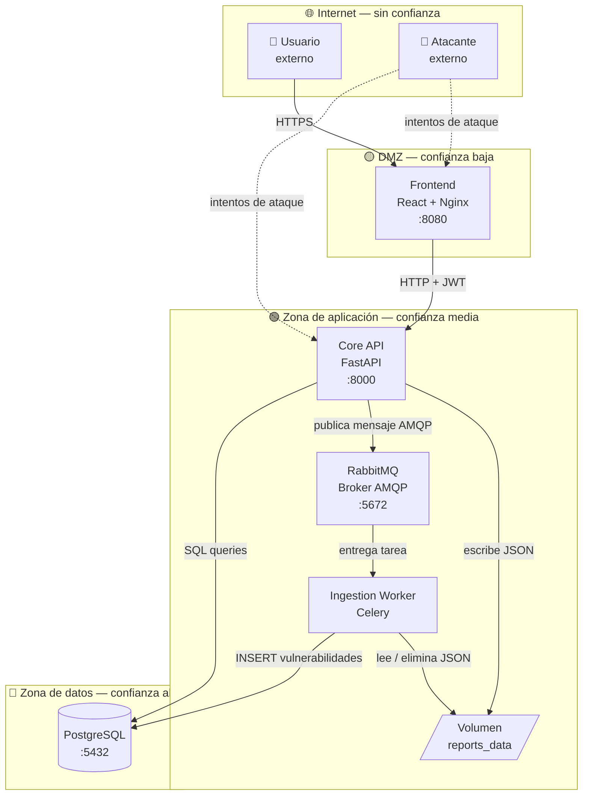

# Modelado de Amenazas — VulnCentral
## Metodología STRIDE · Compatible con OWASP Threat Dragon

**Versión:** 1.0
**Proyecto:** VulnCentral — Plataforma DevSecOps
**Institución:** Fundación Universitaria UNIMINUTO
**Metodología:** STRIDE (Microsoft) + OWASP Threat Dragon
**Autores:** Ing. Argel Ochoa Ronald David · Ing. Baquero Soto Mauricio · Ing. Buitrago Guiot Óscar Javier · Ing. Estefanía Naranjo Novoa

---

## 1. Alcance del Modelo

Este documento cubre el modelado de amenazas de los **seis componentes principales** de VulnCentral y los flujos de datos entre ellos, aplicando la metodología STRIDE para identificar, clasificar y mitigar amenazas de seguridad.

### Componentes en scope

| Componente | Contenedor Docker | Puerto |
|-----------|------------------|--------|
| Frontend | `vulncentral-frontend` | `8080` |
| API Gateway | `vulncentral-core-api` | `8000` |
| Ingestion Worker | `vulncentral-ingestion-worker` | — |
| Message Broker | `vulncentral-rabbitmq` | `5672 / 15672` |
| Base de datos | `vulncentral-postgres` | `5432` |
| Volumen compartido | `reports_data` | — |

### Flujos de datos analizados

| ID | Flujo | Entre |
|----|-------|-------|
| F1 | Login de usuario | Navegador → Frontend → API |
| F2 | Petición autenticada | Frontend → API (JWT) |
| F3 | Subida de informe Trivy | Frontend → API → Volumen → RabbitMQ |
| F4 | Procesamiento asíncrono | RabbitMQ → Worker → PostgreSQL |
| F5 | Consulta de vulnerabilidades | Frontend → API → PostgreSQL |
| F6 | Acceso administración BD | pgAdmin → PostgreSQL |

---

## 2. Actores del Sistema

| Actor | Tipo | Nivel de confianza |
|-------|------|-------------------|
| Usuario autenticado (Inspector / Maestro) | Interno | Medio |
| Administrador del sistema | Interno | Alto |
| Atacante externo | Externo | Ninguno |
| Insider malicioso | Interno | Medio-Alto |
| Sistema CI/CD (GitHub Actions) | Externo controlado | Alto |

---

## 3. Diagrama de Flujo de Datos (DFD) — Nivel 0

> Representación compatible con OWASP Threat Dragon. Los límites de confianza (`trust boundary`) separan zonas con distintos niveles de control.



---

## 4. Modelado STRIDE — Por Componente y Flujo

STRIDE es un acrónimo que cubre seis categorías de amenazas:

| Letra | Categoría | Pregunta clave |
|-------|-----------|---------------|
| **S** | Spoofing | ¿Puede alguien hacerse pasar por otro? |
| **T** | Tampering | ¿Puede alguien modificar datos en tránsito o en reposo? |
| **R** | Repudiation | ¿Puede alguien negar haber realizado una acción? |
| **I** | Information Disclosure | ¿Puede alguien acceder a datos que no le corresponden? |
| **D** | Denial of Service | ¿Puede alguien dejar el sistema inoperativo? |
| **E** | Elevation of Privilege | ¿Puede alguien obtener más permisos de los que tiene? |

---

### 4.1 Frontend — `vulncentral-frontend` (:8080)

| ID | Categoría STRIDE | Amenaza identificada | Riesgo | Contramedida implementada | Estado |
|----|-----------------|---------------------|--------|--------------------------|--------|
| F-S1 | **Spoofing** | Suplantación de sesión mediante robo de token JWT almacenado en el navegador | Alto | JWT con expiración corta (`JWT_EXPIRE_MINUTES=30`). Token almacenado en `sessionStorage` (no `localStorage`) — se borra al cerrar el tab | ✅ Mitigado |
| F-T1 | **Tampering** | Manipulación de peticiones HTTP entre el navegador y el API (MITM) | Alto | HTTPS obligatorio en producción vía Nginx. CORS estricto con lista blanca de orígenes (`CORS_ORIGINS`) | ✅ Mitigado |
| F-I1 | **Information Disclosure** | Exposición de rutas, endpoints o lógica de negocio en el bundle JavaScript | Medio | Nginx sirve solo el artefacto compilado — el código fuente nunca se expone. Variables de entorno inyectadas en build-time (`VITE_*`) | ✅ Mitigado |
| F-I2 | **Information Disclosure** | XSS — inyección de scripts maliciosos en campos de texto que se renderizan en pantalla | Alto | Sanitización con `html.escape` en backend. React escapa por defecto el contenido en el DOM | ✅ Mitigado |
| F-D1 | **Denial of Service** | Flood de peticiones al frontend desde IPs externas | Medio | Nginx con límite de conexiones concurrentes. Rate limiting a nivel de API Gateway para peticiones que generan carga real | ⚠️ Parcial |
| F-E1 | **Elevation of Privilege** | Usuario con rol Inspector accede a rutas del Administrador manipulando la URL | Medio | RBAC aplicado en **backend** en cada endpoint — el frontend solo oculta visualmente. Aunque el usuario manipule la URL, el API rechaza la petición sin el permiso correcto | ✅ Mitigado |

---

### 4.2 API Gateway — `vulncentral-core-api` (:8000)

| ID | Categoría STRIDE | Amenaza identificada | Riesgo | Contramedida implementada | Estado |
|----|-----------------|---------------------|--------|--------------------------|--------|
| A-S1 | **Spoofing** | Uso de tokens JWT expirados o falsificados para autenticarse | Crítico | Validación de firma JWT con `JWT_SECRET` (HS256) en cada petición vía `JWTAuthMiddleware`. Token expirado → HTTP 401 automático | ✅ Mitigado |
| A-S2 | **Spoofing** | Fuerza bruta sobre el endpoint `POST /auth/login` para adivinar credenciales | Alto | Rate limiting con `slowapi` configurable via `RATE_LIMIT_LOGIN` (default: `5/minute` por IP). Respuesta genérica `invalid_credentials` sin indicar si el usuario existe | ✅ Mitigado |
| A-T1 | **Tampering** | Modificación del payload JSON de Trivy antes de que llegue al API (MITM) | Alto | HTTPS en producción. Validación estricta del esquema con Pydantic — cualquier campo inesperado o tipo incorrecto es rechazado antes de procesarse | ✅ Mitigado |
| A-T2 | **Tampering** | Upload de archivo malicioso disfrazado de JSON de Trivy | Alto | Validación de MIME type en el endpoint de subida. Límite de tamaño configurable (`MAX_JSON_BODY_BYTES=10485760` — 10 MiB). Pydantic valida la estructura del JSON | ✅ Mitigado |
| A-R1 | **Repudiation** | Usuario niega haber subido un informe o modificado una vulnerabilidad | Alto | Registro inmutable en tabla `audit_logs` con `user_id`, `action`, `ip`, `timestamp` en cada operación crítica (`login`, `trivy_report_queued`, `scan_create`, etc.) | ✅ Mitigado |
| A-I1 | **Information Disclosure** | SQL Injection para extraer datos de otros usuarios | Crítico | SQLAlchemy ORM con queries parametrizadas — nunca SQL concatenado. Filtros IDOR: `WHERE project_id IN (SELECT ... WHERE user_id = current_user)` | ✅ Mitigado |
| A-I2 | **Information Disclosure** | IDOR — acceso a recursos de otro usuario conociendo su ID | Alto | Validación de ownership en cada query: el API verifica que el recurso pertenece al usuario autenticado antes de devolverlo | ✅ Mitigado |
| A-I3 | **Information Disclosure** | Exposición de stack traces o mensajes de error detallados en producción | Medio | Respuestas de error genéricas en endpoints públicos. Logs detallados solo en servidor, nunca en respuesta HTTP | ✅ Mitigado |
| A-D1 | **Denial of Service** | Subida masiva de archivos JSON enormes para agotar disco y memoria | Alto | `MAX_JSON_BODY_BYTES` limita el tamaño del body. El API responde HTTP 413 si se supera el límite | ✅ Mitigado |
| A-D2 | **Denial of Service** | Flood de peticiones autenticadas para saturar el API | Medio | Rate limiting global con `slowapi`. Límites de memoria del contenedor (384 MB) previenen consumo total del host | ⚠️ Parcial |
| A-E1 | **Elevation of Privilege** | Usuario Inspector llama directamente a endpoint de Administrador con su token válido | Crítico | RBAC granular: cada endpoint verifica `UseCase + Permission` del rol antes de ejecutar. HTTP 403 si no tiene el permiso específico | ✅ Mitigado |

---

### 4.3 Ingestion Worker — `vulncentral-ingestion-worker`

| ID | Categoría STRIDE | Amenaza identificada | Riesgo | Contramedida implementada | Estado |
|----|-----------------|---------------------|--------|--------------------------|--------|
| W-T1 | **Tampering** | Path Traversal — el mensaje AMQP contiene una ruta manipulada que apunta fuera del volumen permitido (`../../etc/passwd`) | Crítico | El Worker valida que `file_path` esté bajo `REPORTS_BASE_DIR` usando ruta canónica antes de abrir el archivo. Si la ruta sale del directorio → tarea fallida sin reintento | ✅ Mitigado |
| W-T2 | **Tampering** | Modificación del mensaje en la cola AMQP antes de que el Worker lo consuma | Alto | RabbitMQ corre en red Docker interna (`vulncentral_net`) — no expuesto a Internet. Credenciales de acceso gestionadas via variables de entorno | ✅ Mitigado |
| W-R1 | **Repudiation** | El Worker procesa un escaneo y no queda registro de qué vulnerabilidades insertó | Medio | Cada operación del Worker actualiza el estado del escaneo en `scans` y las vulnerabilidades en `vulnerabilities` con timestamps. El `audit_log` del API registra el inicio (`trivy_report_queued`) | ⚠️ Parcial |
| W-D1 | **Denial of Service** | Archivo JSON malformado o extremadamente grande bloquea al Worker en un bucle de reintentos | Alto | No reintenta errores de validación (`ValueError`, `ValidationError`, `JSONDecodeError`) — solo errores transitorios (DB, red). Backoff exponencial evita saturar recursos | ✅ Mitigado |
| W-I1 | **Information Disclosure** | El Worker loguea el contenido completo del JSON en los logs del contenedor | Medio | Los logs del Worker registran solo metadata (`scan_id`, `correlation_id`, estado) — nunca el contenido de vulnerabilidades | ✅ Mitigado |

---

### 4.4 RabbitMQ — Broker AMQP (:5672 / :15672)

| ID | Categoría STRIDE | Amenaza identificada | Riesgo | Contramedida implementada | Estado |
|----|-----------------|---------------------|--------|--------------------------|--------|
| MQ-S1 | **Spoofing** | Conexión no autorizada a la cola para inyectar mensajes falsos | Crítico | Autenticación con usuario y contraseña en `RABBITMQ_DEFAULT_USER/PASS`. Virtual host dedicado (`RABBITMQ_DEFAULT_VHOST=vulncentral`) | ✅ Mitigado |
| MQ-I1 | **Information Disclosure** | Exposición del panel de administración `:15672` a Internet | Alto | El puerto `15672` solo debe mapearse en desarrollo local. En producción: acceso solo por VPN o red interna. La red Docker `vulncentral_net` aísla el servicio | ⚠️ Parcial — requiere config prod |
| MQ-D1 | **Denial of Service** | Flood de mensajes a la cola para agotar memoria del broker | Alto | Límite de memoria del contenedor: `512 MB`. Dead-letter queue para mensajes que fallan repetidamente | ✅ Mitigado |
| MQ-E1 | **Elevation of Privilege** | Acceso a la cola desde un contenedor no autorizado en la misma red Docker | Medio | Solo `core-api` y `ingestion-worker` tienen las credenciales AMQP. Red Docker aislada — contenedores externos no pueden acceder | ✅ Mitigado |

---

### 4.5 PostgreSQL — Base de Datos (:5432)

| ID | Categoría STRIDE | Amenaza identificada | Riesgo | Contramedida implementada | Estado |
|----|-----------------|---------------------|--------|--------------------------|--------|
| DB-S1 | **Spoofing** | Conexión directa a PostgreSQL desde fuera del stack Docker usando credenciales robadas | Crítico | El puerto `5432` solo debe mapearse en desarrollo. En producción: sin mapeo de puertos al host. Red interna Docker. Credenciales en variables de entorno / Docker Secrets | ⚠️ Parcial — requiere config prod |
| DB-T1 | **Tampering** | Modificación directa de datos en la BD saltándose la lógica de negocio del API | Alto | Solo el API y el Worker tienen acceso. Cada escritura pasa por SQLAlchemy con validación Pydantic previa. Soft Delete preserva historial — no hay `DELETE` físico en datos críticos | ✅ Mitigado |
| DB-R1 | **Repudiation** | Eliminación de registros de auditoría para ocultar acciones | Alto | Tabla `audit_logs` sin operaciones de `DELETE` en la lógica de negocio. Solo administradores de BD con acceso directo podrían modificarla — registrar accesos a pgAdmin | ⚠️ Parcial |
| DB-I1 | **Information Disclosure** | Volcado de la base de datos completa si se obtiene acceso al contenedor | Crítico | Contraseñas de usuarios hasheadas con bcrypt — nunca en texto plano. Credenciales de BD en `.env` (excluido de Git con `.gitignore`) | ✅ Mitigado |
| DB-I2 | **Information Disclosure** | IDOR a nivel de base de datos — consultar vulnerabilidades de proyectos de otro usuario | Alto | Row Level Security lógico implementado en cada query del API: `WHERE project_id IN (SELECT id FROM projects WHERE user_id = ?)`. Validación de ownership antes de cada operación | ✅ Mitigado |
| DB-D1 | **Denial of Service** | Queries costosas que bloquean la base de datos (full table scan, lock contention) | Medio | Límite de memoria del contenedor: `512 MB`. Índices en columnas de filtrado frecuente (`user_id`, `project_id`, `scan_id`, `severity`) | ⚠️ Parcial |

---

### 4.6 Volumen Compartido — `reports_data`

| ID | Categoría STRIDE | Amenaza identificada | Riesgo | Contramedida implementada | Estado |
|----|-----------------|---------------------|--------|--------------------------|--------|
| V-T1 | **Tampering** | Modificación del archivo JSON en disco entre que el API lo escribe y el Worker lo lee | Alto | El nombre del archivo incluye un UUID aleatorio (`scan_{id}_{uuid}.json`) que hace imposible predecir la ruta. El Worker valida la integridad del JSON al abrirlo con Pydantic | ✅ Mitigado |
| V-I1 | **Information Disclosure** | Acceso al volumen desde otro contenedor en la misma red Docker | Medio | Solo `core-api` y `ingestion-worker` tienen el volumen `reports_data` montado. El Worker elimina el archivo tras commit exitoso — el tiempo de exposición es mínimo | ✅ Mitigado |
| V-D1 | **Denial of Service** | Acumulación de archivos JSON en disco si el Worker falla repetidamente | Medio | El Worker elimina el archivo solo tras commit exitoso. Si falla antes del commit, el archivo persiste — requiere política de limpieza periódica de archivos huérfanos | ⚠️ Requiere mejora |

---

## 5. Resumen Ejecutivo STRIDE

### Conteo de amenazas por categoría

| Categoría STRIDE | Total identificadas | Mitigadas ✅ | Parciales ⚠️ | Requieren mejora 🔴 |
|-----------------|--------------------|-----------|-----------|--------------------|
| Spoofing (S) | 5 | 4 | 1 | 0 |
| Tampering (T) | 6 | 5 | 0 | 1 |
| Repudiation (R) | 3 | 1 | 2 | 0 |
| Information Disclosure (I) | 7 | 6 | 1 | 0 |
| Denial of Service (D) | 6 | 4 | 2 | 0 |
| Elevation of Privilege (E) | 3 | 3 | 0 | 0 |
| **TOTAL** | **30** | **23 (77%)** | **6 (20%)** | **1 (3%)** |

---

### Amenazas por nivel de riesgo

| Nivel | Cantidad | Descripción |
|-------|----------|-------------|
| 🔴 Crítico | 5 | JWT falsificado, SQL Injection, RBAC bypass, Path Traversal, volcado de BD |
| 🟠 Alto | 17 | Fuerza bruta, IDOR, XSS, flood de archivos, exposición RabbitMQ |
| 🟡 Medio | 8 | Stack traces, queries costosas, logs con datos sensibles |

---

## 6. Amenazas Pendientes de Mejora

| ID | Amenaza | Acción recomendada | Prioridad |
|----|---------|-------------------|-----------|
| MQ-I1 | Panel RabbitMQ `:15672` expuesto en producción | No mapear puerto en `docker-compose.prod.yml`. Acceso solo por VPN | Alta |
| DB-S1 | Puerto PostgreSQL `:5432` mapeado al host en producción | Eliminar mapeo de puerto en producción. Usar Docker Secrets | Alta |
| DB-R1 | Tabla `audit_logs` sin protección contra borrado por admin de BD | Implementar usuario de BD de solo lectura para la app; usuario separado para DBA | Media |
| V-D1 | Archivos JSON huérfanos si el Worker falla antes del commit | Implementar job de limpieza periódica (`cron`) de archivos > 24h en `reports_data` | Media |
| W-R1 | El Worker no registra en `audit_logs` el resultado final del procesamiento | Agregar `INSERT audit_log` al finalizar la tarea en el Worker | Baja |
| F-D1 | Sin protección específica contra flood en el frontend | Configurar `limit_req_zone` en Nginx para limitar peticiones por IP | Baja |

---

## 7. Capas de Defensa Implementadas (Defense in Depth)

```
┌─────────────────────────────────────────────────────┐
│  CAPA 1 — Red                                       │
│  Red Docker aislada (vulncentral_net)               │
│  CORS estricto · HTTPS en producción                │
├─────────────────────────────────────────────────────┤
│  CAPA 2 — Autenticación                             │
│  JWT HS256 · bcrypt · expiración corta              │
│  Rate limiting en /auth/login (slowapi)             │
├─────────────────────────────────────────────────────┤
│  CAPA 3 — Autorización                              │
│  RBAC por rol y caso de uso                         │
│  Validación de ownership en cada query              │
│  Filtros IDOR a nivel SQL                           │
├─────────────────────────────────────────────────────┤
│  CAPA 4 — Validación de entrada                     │
│  Pydantic (esquema estricto)                        │
│  Validación MIME · MAX_JSON_BODY_BYTES              │
│  Sanitización html.escape                           │
├─────────────────────────────────────────────────────┤
│  CAPA 5 — Datos                                     │
│  Passwords hasheados (bcrypt)                       │
│  Soft Delete · Sin SQL concatenado                  │
│  Archivos con UUID impredecible                     │
├─────────────────────────────────────────────────────┤
│  CAPA 6 — Auditoría                                 │
│  audit_logs inmutables por lógica de negocio        │
│  Registro de IP, user_id, acción, timestamp         │
├─────────────────────────────────────────────────────┤
│  CAPA 7 — Pipeline CI/CD (Shift-Left)               │
│  Gitleaks · Bandit · Semgrep · Trivy · ZAP          │
│  Pre-commit hooks · pip-audit · npm-audit           │
└─────────────────────────────────────────────────────┘
```

---

## 8. Instrucciones para OWASP Threat Dragon

Para importar este modelo en [OWASP Threat Dragon](https://www.threatdragon.com/):

1. Ir a **[threatdragon.com](https://www.threatdragon.com/)** → **New Model**
2. Crear los siguientes elementos en el diagrama:

**Entidades externas (rectángulos):**
- `Usuario externo`
- `Atacante externo`
- `CI/CD Pipeline`

**Procesos (círculos):**
- `P1 - Frontend (React)`
- `P2 - Core API (FastAPI)`
- `P3 - Ingestion Worker (Celery)`
- `P4 - RabbitMQ`

**Almacenes de datos (líneas dobles):**
- `D1 - PostgreSQL`
- `D2 - Volumen reports_data`

**Límites de confianza (líneas punteadas):**
- `Internet / DMZ`
- `DMZ / Zona de aplicación`
- `Zona de aplicación / Zona de datos`

3. Conectar los elementos con flujos de datos según el DFD del apartado 3
4. En cada flujo, agregar las amenazas STRIDE usando los IDs de las tablas anteriores (F-S1, A-T1, etc.)
5. Marcar el estado de mitigación: **Mitigated / Not Mitigated / Transferred**

---

*Versión 1.0 — VulnCentral · UNIMINUTO · Especialización en Ciberseguridad*
