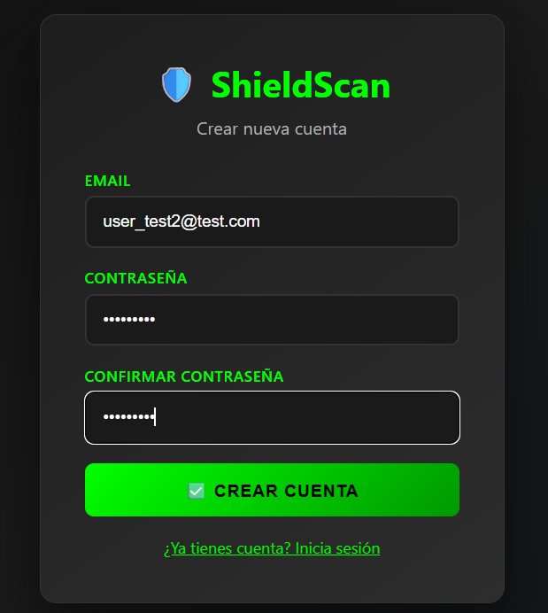
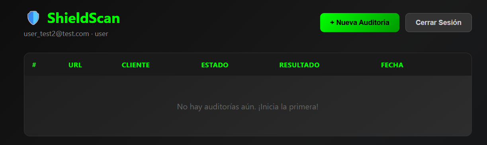
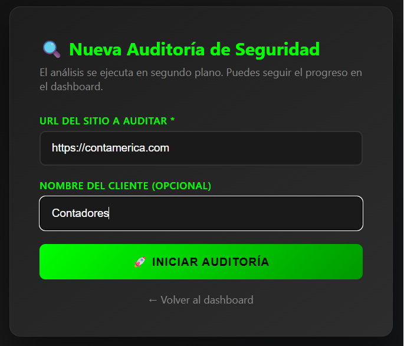
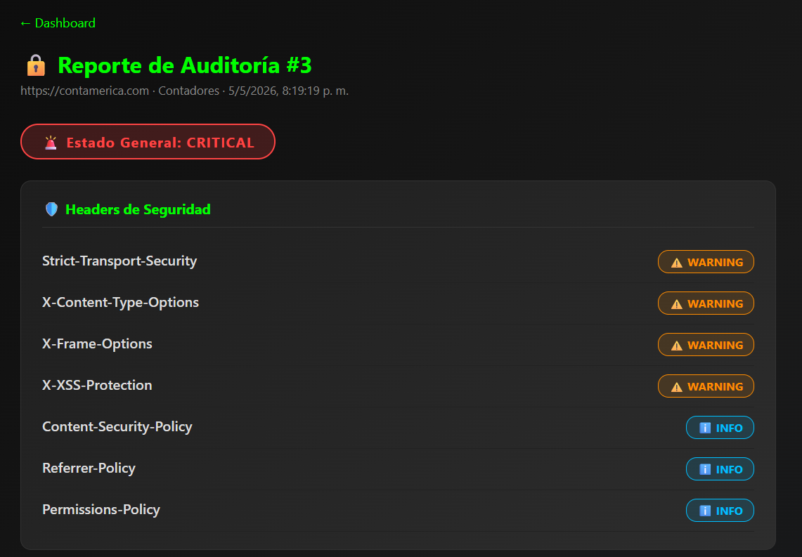

# Cómo poner en marcha ShieldScan

Esta guía te explicará paso a paso cómo ejecutar ShieldScan en tu propio ordenador usando Docker. No necesitas conocimientos de programación — solo sigue los pasos en orden.

**Lo que necesitas:**
- Un ordenador con Windows, macOS o Linux
- Conexión a internet (solo para la configuración inicial)
- Entre 10 y 15 minutos

---

## Paso 1 — Instalar Docker Desktop

Docker Desktop es una aplicación gratuita que permite a tu ordenador ejecutar paquetes de software autocontenidos llamados **contenedores**. Es lo único que necesitas instalar — todo lo demás (la base de datos, el servidor web, la propia aplicación) se ejecuta automáticamente dentro de los contenedores.

1. Ve a [https://www.docker.com/products/docker-desktop](https://www.docker.com/products/docker-desktop) y descarga la versión para tu sistema operativo.
2. Ejecuta el instalador y sigue las instrucciones en pantalla.
3. Una vez instalado, abre Docker Desktop. Verás un **icono de ballena** en la barra de tareas (Windows) o en la barra de menús (Mac) cuando esté en ejecución.

> **Usuarios de Windows:** Durante la instalación, Docker puede pedirte que actives **WSL 2** (Subsistema de Windows para Linux). Haz clic en Aceptar y reinicia el ordenador si se te solicita. Es algo normal y necesario.

No pases al Paso 2 hasta que el icono de ballena de Docker Desktop aparezca y muestre **"Docker está en ejecución"**.

---

## Paso 2 — Obtener los archivos del proyecto

Necesitas una copia de los archivos de ShieldScan en tu ordenador. Elige una de las dos opciones siguientes:

### Opción A — Usando Git (si lo tienes instalado)

Abre una terminal (PowerShell en Windows, Terminal en Mac/Linux) y ejecuta:

```bash
git clone https://github.com/miguel-devsec/ShieldScan.git
cd ShieldScan
```

### Opción B — Descargar como archivo ZIP (sin necesidad de Git)

1. Ve a [https://github.com/miguel-devsec/ShieldScan](https://github.com/miguel-devsec/ShieldScan)
2. Haz clic en el botón verde **"Code"** (Código) en la parte superior derecha
3. Haz clic en **"Download ZIP"** (Descargar ZIP)
4. Una vez descargado, extrae (descomprime) la carpeta en cualquier lugar de tu ordenador
5. Abre una terminal y navega hasta la carpeta extraída:

```bash
# Ejemplo — ajusta la ruta a donde hayas extraído el archivo
cd Descargas/ShieldScan-main
```

---

## Paso 3 — Crear el archivo de configuración

La aplicación necesita un pequeño archivo de configuración (llamado `.env`) que contiene una contraseña y una clave secreta. El proyecto ya incluye una plantilla lista para usar.

**En Windows (PowerShell):**
```powershell
Copy-Item env.example .env
```

**En Mac o Linux:**
```bash
cp env.example .env
```

No necesitas editar este archivo. Los valores predeterminados son seguros para ejecutar la aplicación en tu propio ordenador.

---

## Paso 4 — Iniciar la aplicación

En tu terminal, asegúrate de estar dentro de la carpeta ShieldScan y ejecuta:

```bash
docker compose up --build
```

Docker descargará todos los componentes necesarios e iniciará la aplicación. **La primera vez puede tardar entre 5 y 10 minutos** dependiendo de la velocidad de tu conexión a internet — esto es normal. Los inicios posteriores serán mucho más rápidos.

Verás mucho texto desplazándose por la terminal. Esto es lo esperado. La aplicación está lista cuando el flujo de texto se ralentice y veas mensajes repetidos de servicios como `api`, `worker` y `frontend`.

---

## Paso 5 — Abrir ShieldScan en el navegador

Una vez que la aplicación esté en marcha, abre tu navegador web y ve a:

```
http://localhost:3000
```

Deberías ver la página de bienvenida de ShieldScan.



---

## Paso 6 — Crear tu cuenta

Haz clic en **Register** (Registrarse) y rellena el formulario:

| Campo | Qué introducir |
|-------|---------------|
| **Email** | Cualquier dirección de correo (no tiene que ser real para uso local) |
| **Password** | Cualquier contraseña de al menos 8 caracteres |

Haz clic en **Create Account** (Crear cuenta). Serás redirigido a la página de inicio de sesión.


---

## Paso 7 — Iniciar sesión y ejecutar tu primera auditoría

1. Introduce tu correo electrónico y contraseña, luego haz clic en **Sign In** (Iniciar sesión)
2. Llegarás al **Dashboard** (Panel de control)
3. Haz clic en **New Audit** (Nueva auditoría), introduce la URL de cualquier sitio web (por ejemplo `https://ejemplo.com`) y haz clic en **Start Audit** (Iniciar auditoría)
4. La auditoría se ejecuta en segundo plano — la página se actualizará automáticamente cuando los resultados estén listos







---

## Paso 8 — Detener la aplicación cuando hayas terminado

Vuelve a la terminal donde se está ejecutando la aplicación y pulsa **Ctrl + C** para detenerla. Luego ejecuta:

```bash
docker compose down
```

Esto cierra todos los contenedores de forma ordenada. Tus datos (cuentas registradas e historial de auditorías) se guardan y estarán disponibles la próxima vez que inicies la aplicación.

---

## Volver a iniciar la aplicación más adelante

Una vez completada la configuración, solo necesitas dos comandos para iniciar y detener ShieldScan en el futuro:

**Iniciar:**
```bash
docker compose up -d
```
*(El indicador `-d` lo ejecuta en segundo plano para que tu terminal quede libre)*

**Detener:**
```bash
docker compose down
```

---

## Solución de problemas

### Error "El puerto ya está en uso"

Otra aplicación en tu ordenador está usando el puerto 3000 o el 8000. La solución más sencilla es cerrar la aplicación en conflicto e intentarlo de nuevo.

### El navegador muestra "No se puede acceder a este sitio"

Probablemente Docker todavía esté iniciándose. Espera 30 segundos y actualiza la página.

### Error "Docker no está en ejecución" en la terminal

Abre Docker Desktop y espera a que el icono de ballena muestre **"Docker está en ejecución"**, luego inténtalo de nuevo.

### Los contenedores se reinician continuamente

Ejecuta el siguiente comando para ver los mensajes de error:
```bash
docker compose logs
```
Copia el texto del error y búscalo en internet, o abre un issue en la página de GitHub del proyecto.

---

## Opcional — Activar el panel de monitorización

ShieldScan incluye un stack de monitorización opcional (Prometheus + Grafana) para observar el rendimiento de la aplicación. Para activarlo:

```bash
docker compose --profile monitoring up -d
```

| URL | Herramienta | Credenciales por defecto |
|-----|------------|--------------------------|
| http://localhost:9090 | Prometheus | No se requieren |
| http://localhost:3001 | Grafana | admin / admin |

---

## ¿Necesitas ayuda?

Abre un issue en GitHub: [https://github.com/miguel-devsec/ShieldScan/issues](https://github.com/miguel-devsec/ShieldScan/issues)
