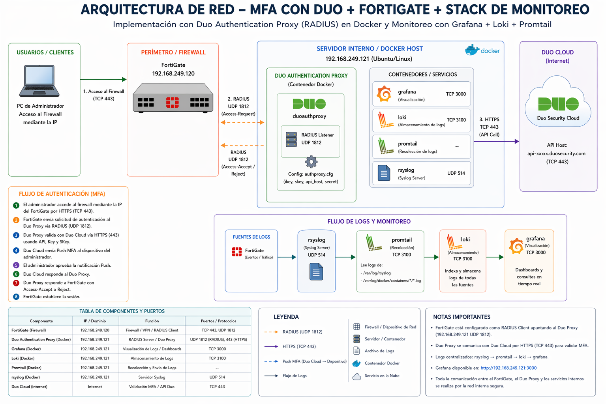

## Descripción del proyecto y propósito

# 1. Descripción del Proyecto
El proyecto consiste en el diseño e implementación de una infraestructura de red híbrida y segura, centrada en la protección de accesos administrativos y la centralización de eventos de seguridad (logs).

La arquitectura integra un cortafuegos perimetral (FortiGate) con un sistema de autenticación multifactor (MFA) basado en Cisco Duo, desplegado mediante contenedores Docker. Paralelamente, se establece un Stack de Monitoreo (Grafana, Loki, Promtail) para la visualización y análisis en tiempo real de los flujos de tráfico y posibles amenazas detectadas por el firewall.

# 2. Propósito del Proyecto
El objetivo primordial de esta implementación es establecer un sistema de observabilidad granular sobre la actividad de red en la LAN, centrándose específicamente en el monitoreo, registro y visualización de todas las consultas de dominios (DNS) realizadas por los usuarios.

<b>Figura 2.</b> diagrama_de_flujo.png. <code></code>.

## Tecnologías empleadas

## Licencia seleccionada

## Insignias (badges) del pipeline: build status, cobertura de pruebas, versión

## Instrucciones de inicio rápido (quick start)
