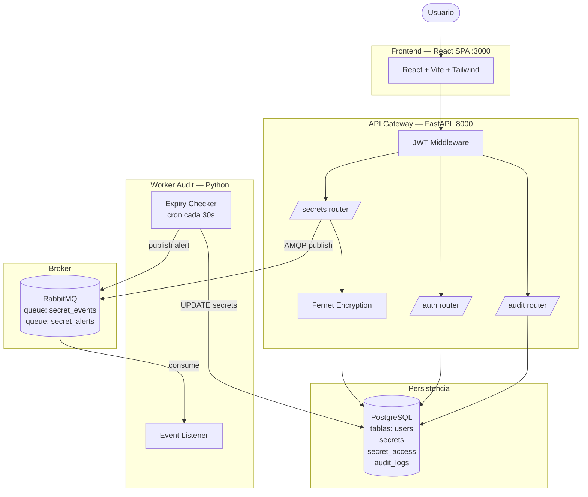
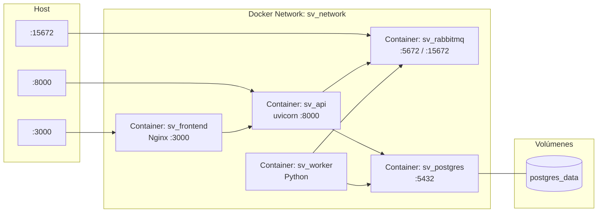
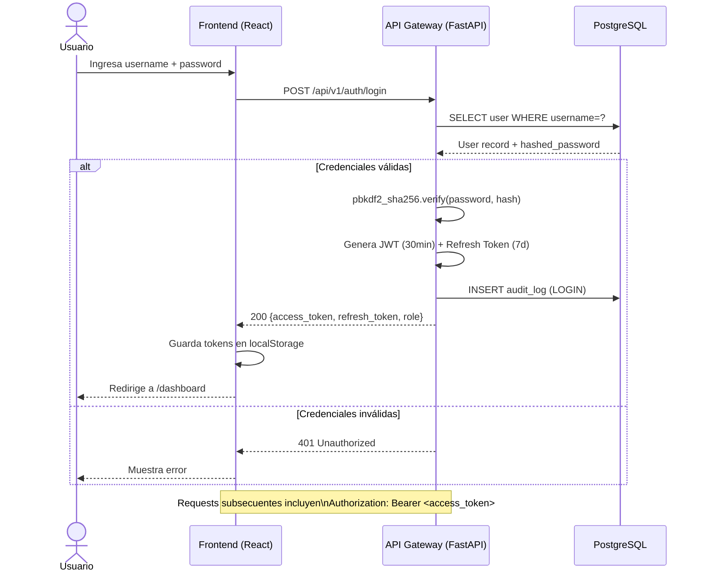
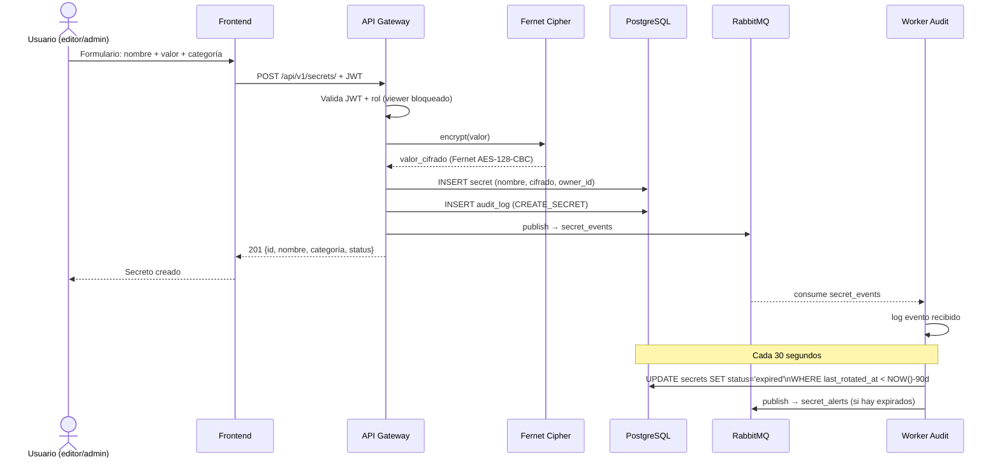
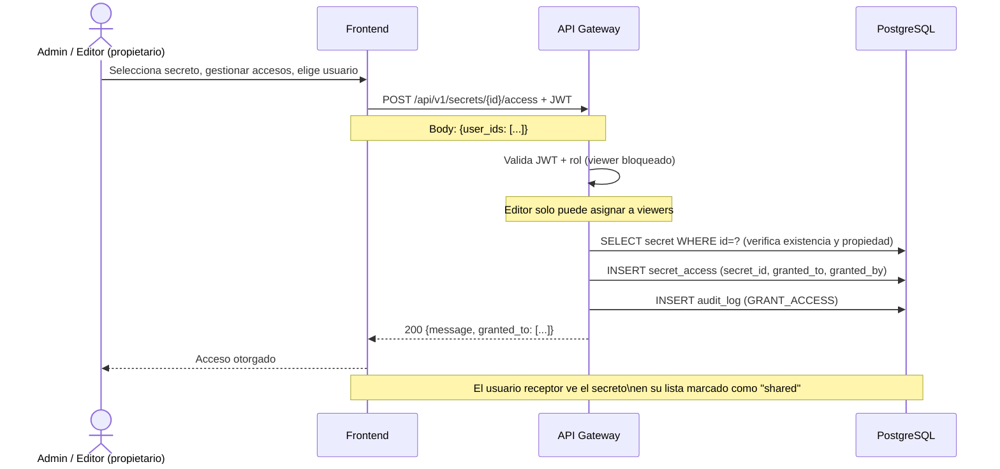
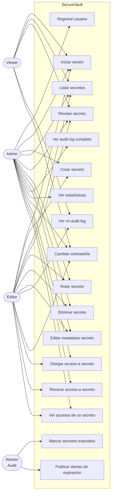
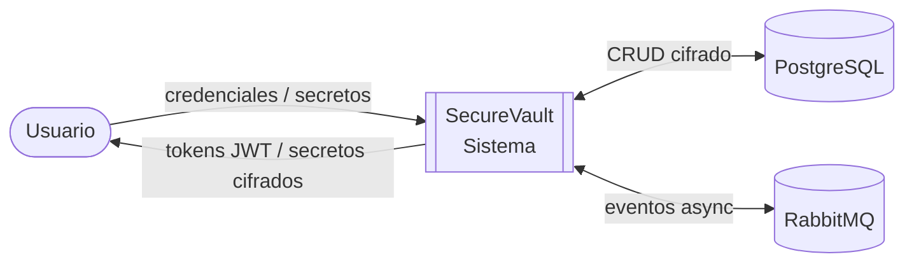
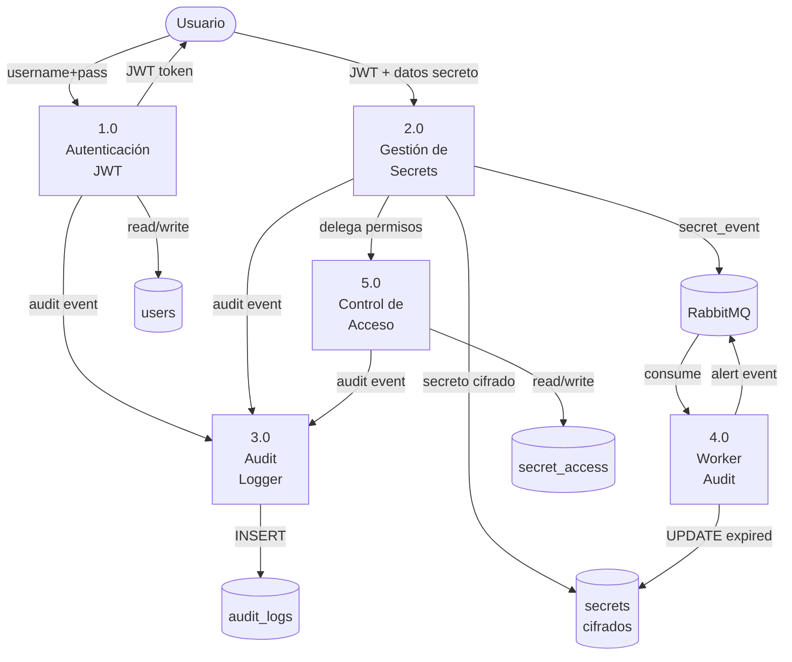
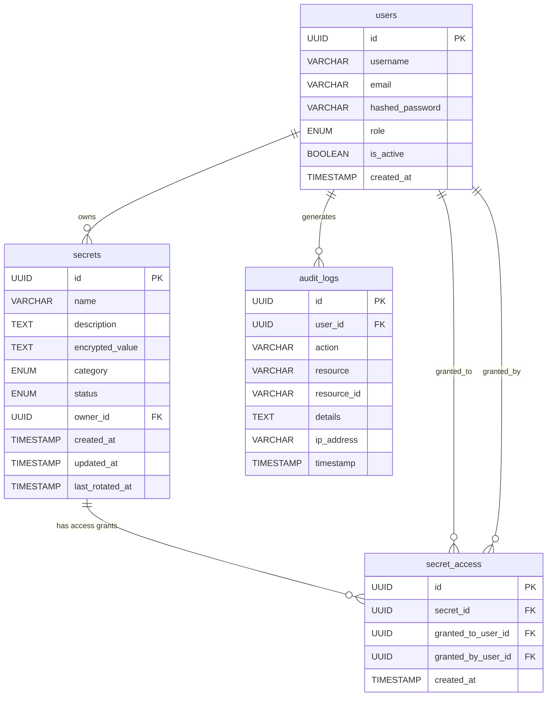

# Manual de Arquitectura — SecureVault

## 1. Descripción General

SecureVault implementa una **arquitectura de microservicios** donde cada componente tiene una responsabilidad única y se comunica a través de interfaces bien definidas: HTTP/REST para comunicación sincrónica y AMQP (RabbitMQ) para comunicación asíncrona.

### Principios de diseño

- **Separación de responsabilidades**: cada servicio hace una sola cosa bien
- **Comunicación asíncrona**: el worker no bloquea al API gateway
- **Cifrado en reposo**: los valores de los secretos se cifran con Fernet (AES-128-CBC) antes de persistirse
- **Principio de mínimo privilegio**: contenedores corren como usuario no-root; roles granulares en la API
- **Control de acceso compartido**: un administrador o editor puede otorgar acceso a secretos específicos a otros usuarios sin transferir la propiedad

---

## 2. Diagrama de Componentes

---

## 3. Diagrama de Despliegue

---

## 4. Diagrama de Secuencia — Autenticación JWT

---

## 5. Diagrama de Secuencia — Almacenar y Rotar Secreto

---

## 6. Diagrama de Secuencia — Compartir un Secreto

---

## 7. Diagrama de Casos de Uso

---

## 8. DFD Nivel 0 — Vista General

---

## 9. DFD Nivel 1 — Flujos Internos

---

## 10. Modelo de Datos

---

## 11. Decisiones de Diseño

### Cifrado con Fernet

Se eligió Fernet de la librería `cryptography` (AES-128-CBC + HMAC-SHA256) por las siguientes razones:

- Cifrado simétrico autenticado: garantiza confidencialidad e integridad del valor cifrado
- API simple y segura por defecto: no expone parámetros criptográficos al desarrollador
- La clave Fernet se inyecta como variable de entorno (`FERNET_KEY`) y nunca se persiste en base de datos

> ⚠️ Si la `FERNET_KEY` se rota en producción, todos los secretos cifrados quedan ilegibles hasta re-cifrarlos con la nueva clave. Este proceso de re-cifrado es responsabilidad del operador y está fuera del alcance de v1.0.

### Autenticación con JWT

- **Access token**: expira en 30 minutos, firmado con HS256 usando `SECRET_KEY`
- **Refresh token**: expira en 7 días, permite obtener un nuevo access token sin re-login
- Las contraseñas se almacenan con **PBKDF2-SHA256** via `passlib`

### Control de Acceso Basado en Roles (RBAC)

Tres roles con permisos distintos:

| Rol | Crear | Rotar/Editar/Eliminar | Ver | Compartir |
|-----|-------|-----------------------|-----|-----------|
| `admin` | ✅ | ✅ todos | ✅ todos | ✅ cualquier usuario |
| `editor` | ✅ | ✅ propios + compartidos | ✅ propios + compartidos | ✅ solo a viewers |
| `viewer` | ❌ | ❌ | ✅ propios + compartidos | ❌ |

### Comunicación Asíncrona con RabbitMQ

El API Gateway publica eventos en la queue `secret_events` tras cada operación sobre secretos. El Worker Audit consume esos eventos de forma independiente, sin bloquear la respuesta al cliente. Esto permite:

- Desacoplamiento entre la lógica de negocio y la lógica de auditoría asíncrona
- El worker además ejecuta un chequeo periódico cada 30 segundos para marcar secretos como `expired` y publicar alertas en `secret_alerts`

### Audit Log como append-only por convención

El audit log se implementa como `INSERT`-only a nivel de aplicación: ningún endpoint expone operaciones de `UPDATE` o `DELETE` sobre `audit_logs`. No existe un constraint de base de datos que lo fuerce técnicamente, por lo que la garantía de inmutabilidad depende de que no se otorguen permisos directos de escritura a la tabla fuera de la aplicación.
