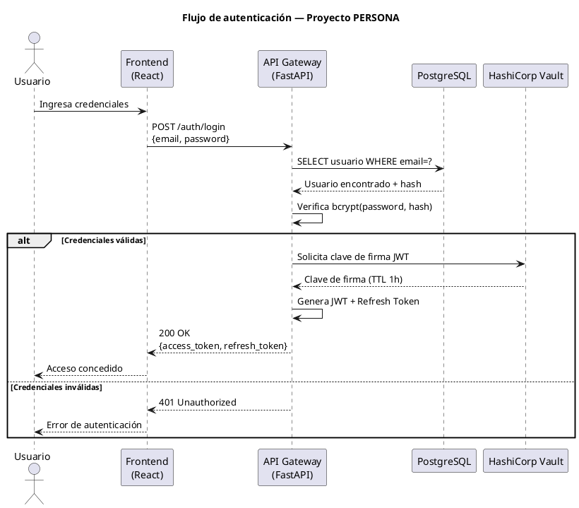

# Trabajo Final de Especialización en Ciberseguridad con Énfasis en DevSecOps

## Pipeline DevSecOps de Ciclo Completo para una Aplicación Contenerizada de Libre Uso

> **Nivel:** Especialización en Ciberseguridad — Énfasis DevSecOps  
> **Modalidad:** Individual o en grupos de máximo dos personas  
> **Licencia obligatoria del producto:** MIT, Apache 2.0 o GPL v3 (a elección del equipo)

---

## Tabla de Contenidos

1. [Propósito y Justificación](#1-propósito-y-justificación)
2. [Libertad de Elección del Tema](#2-libertad-de-elección-del-tema)
3. [Requisitos Técnicos Obligatorios](#3-requisitos-técnicos-obligatorios)
4. [Documentación Obligatoria](#4-documentación-obligatoria)
5. [Entregables](#5-entregables)
6. [Estructura del Informe Técnico](#6-estructura-del-informe-técnico)
7. [Criterios de Evaluación](#7-criterios-de-evaluación)
8. [Aplicación de Ejemplo — Proyecto PERSONA](#8-aplicación-de-ejemplo--proyecto-persona)
9. [Notas Finales](#9-notas-finales)

---

## 1. Propósito y Justificación

El objetivo de este trabajo no es únicamente construir una aplicación funcional. El verdadero desafío consiste en diseñar, implementar, asegurar y automatizar el ciclo de vida completo de esa aplicación, integrando la seguridad como práctica continua en cada etapa del desarrollo y la operación. Esta es la esencia del enfoque DevSecOps: no añadir seguridad al final del proceso, sino incorporarla desde el primer `commit` hasta la producción en tiempo real.

El equipo propondrá libremente la aplicación que construirá, siempre que cumpla los criterios de complejidad técnica descritos en este documento. **La aplicación es el vehículo; el pipeline DevSecOps es el producto evaluado.**

---

## 2. Libertad de Elección del Tema

El equipo puede proponer cualquier aplicación de utilidad real, siempre que satisfaga los requisitos de arquitectura descritos en la sección siguiente. A continuación se ofrecen algunos ejemplos orientativos, no limitantes:

- Plataforma de gestión de identidad digital y presencia en redes sociales
- Sistema de monitoreo y análisis de amenazas en infraestructura de red
- Herramienta OSINT (Inteligencia de Fuentes Abiertas) para investigación de seguridad
- Plataforma de detección de desinformación y verificación de fuentes
- Sistema de gestión segura de credenciales y secretos para equipos de desarrollo
- Aplicación de análisis forense básico de logs y eventos de seguridad
- Panel de control de cumplimiento normativo (ISO 27001, NIST, CIS Controls)

> La propuesta debe ser presentada por escrito durante la primera semana de trabajo para validación por parte del docente.

---

## 3. Requisitos Técnicos Obligatorios

### 3.1 Arquitectura de la Aplicación

La aplicación debe implementarse con **arquitectura de microservicios** y contener como mínimo los siguientes componentes:

| Componente | Descripción mínima |
|---|---|
| **Frontend** | SPA (Single Page Application) en React o Vue.js |
| **Backend / API Gateway** | Python (FastAPI o Flask) o Node.js (Express o Fastify) |
| **Al menos un worker** | Proceso asíncrono independiente con función específica (análisis, scraping, notificaciones, etc.) |
| **Base de datos** | PostgreSQL, MongoDB o equivalente de código abierto |
| **Broker de mensajes** | RabbitMQ o Redis para comunicación asíncrona entre servicios |
| **Autenticación** | Implementación de JWT u OAuth2 con control básico de roles |

### 3.2 Contenerización Completa

Todos los componentes deben estar contenerizados siguiendo buenas prácticas:

- `Dockerfile` individual por servicio (imagen base mínima, usuario no root, capas optimizadas)
- `docker-compose.yml` para entorno de desarrollo local
- Las imágenes deben publicarse en **Docker Hub** bajo una cuenta del equipo, correctamente etiquetadas con versión semántica (ej. `v1.0.0`, `latest`)

### 3.3 Repositorio GitHub

El código fuente completo debe residir en un repositorio **público** en GitHub que incluya:

```
repositorio/
├── LICENSE
├── README.md
├── docker-compose.yml
├── .github/
│   └── workflows/          # Pipelines CI/CD
├── infraestructura/        # IaC: Terraform o Ansible
├── orquestacion/           # K3s / Kubernetes / Swarm
├── servicios/              # Código fuente por microservicio
└── docs/                   # Documentación completa
```

### 3.4 Pipeline CI/CD con Seguridad Integrada (DevSecOps)

Este es el **núcleo evaluativo** del trabajo. El pipeline debe automatizar las fases descritas a continuación e integrar herramientas de seguridad FOSS en cada una de ellas.

#### Fase 1 — Plan

- Modelado de amenazas documentado con **OWASP Threat Dragon**
- Diagramas de Flujo de Datos (DFD) nivel 0 y nivel 1
- Identificación de amenazas mediante el modelo **STRIDE**

#### Fase 2 — Code

- Hooks pre-commit con **Gitleaks** o **TruffleHog** para detectar secretos expuestos
- Análisis estático (SAST) con **Semgrep** y **Bandit** (Python) o ESLint con reglas de seguridad (Node.js)
- Análisis de dependencias (SCA) con **OWASP Dependency-Check** o **Trivy** sobre archivos de dependencias (`requirements.txt`, `package.json`)

#### Fase 3 — Build

- Construcción automática de imágenes Docker en el pipeline
- Escaneo de vulnerabilidades en imágenes con **Trivy** o **Grype**
- El pipeline debe **fallar automáticamente** si se detectan CVEs de severidad crítica sin excepción documentada y justificada

#### Fase 4 — Test

- Pruebas unitarias con **Pytest** (Python) o **Jest** (Node.js / React)
- Pruebas de seguridad dinámicas (DAST) con **OWASP ZAP** en modo automatizado contra el entorno de staging

#### Fase 5 — Release / Deploy

- Despliegue automatizado usando IaC con **Terraform** o **Ansible**
- Escaneo de configuración de infraestructura con **Checkov** o **tfsec**
- Orquestación con **K3s**, **Docker Swarm** o **Docker Compose** en entorno de producción simulado

#### Fase 6 — Operate / Monitor *(opcional — bonificación)*

- Stack de observabilidad con **Prometheus** y **Grafana** para métricas
- Centralización de logs con **Loki + Promtail** o stack **ELK**
- Detección de comportamiento anómalo en tiempo de ejecución con **Falco**

### 3.5 Restricciones de Herramientas

Queda **prohibido el uso de herramientas propietarias o con licencia comercial**. Toda la cadena de herramientas debe ser de código abierto o de libre uso. GitHub Actions es aceptado como servidor de CI/CD en reemplazo de GitLab CI/CD.

---

## 4. Documentación Obligatoria

La documentación es un **entregable de primera clase**, no un anexo. Debe estar escrita en español o inglés, en formato Markdown, estructurada dentro del repositorio de la siguiente manera:

### 4.1 README Principal

- Descripción del proyecto y propósito
- Tecnologías empleadas
- Licencia seleccionada
- Insignias (badges) del pipeline: build status, cobertura de pruebas, versión
- Instrucciones de inicio rápido (`quick start`)

### 4.2 Manual de Arquitectura

Descripción detallada de la arquitectura de microservicios, decisiones de diseño, patrones utilizados y justificación de cada componente.

**Diagramas UML mínimos requeridos:**

| Diagrama | Propósito |
|---|---|
| Diagrama de Componentes | Visión general de la arquitectura |
| Diagrama de Despliegue | Contenedores, redes y volúmenes |
| Diagrama de Secuencia | Al menos un flujo crítico (ej. autenticación) |
| Diagrama de Casos de Uso | Actores e interacciones principales |
| DFD nivel 0 y nivel 1 | Generado con OWASP Threat Dragon |

> Se recomienda el uso de [PlantUML](https://plantuml.com/) o [Mermaid](https://mermaid.js.org/) para los diagramas UML, ya que ambas herramientas permiten definir los diagramas como código versionable dentro del repositorio.

### 4.3 Manual de Desarrollo

Instrucciones paso a paso para:

- Clonar el repositorio y configurar el entorno local
- Ejecutar los servicios en modo desarrollo
- Correr las pruebas unitarias e integración
- Contribuir al proyecto (branching strategy, convención de commits, proceso de revisión)

### 4.4 Manual de Despliegue y Operación

Instrucciones detalladas para desplegar la aplicación desde cero en un entorno limpio:

- Requisitos previos del servidor o máquina de destino
- Variables de entorno necesarias y su gestión segura
- Pasos de configuración de infraestructura (IaC)
- Verificación del despliegue correcto
- Resolución de problemas comunes (`troubleshooting`)

### 4.5 Manual de Seguridad

- Descripción del modelo de amenazas
- Herramientas de seguridad integradas y su configuración
- Interpretación de reportes generados (Trivy, ZAP, Gitleaks, Bandit)
- Proceso de gestión de vulnerabilidades encontradas
- Política de divulgación responsable (`responsible disclosure`)

### 4.6 Manual de Usuario

Guía de uso de la aplicación orientada al usuario final, con capturas de pantalla y descripción de cada funcionalidad disponible.

---

## 5. Entregables

| Entregable | Descripción | Obligatorio |
|---|---|---|
| Repositorio GitHub público | Código fuente completo, pipeline, IaC y documentación | ✅ Sí |
| Imágenes en Docker Hub | Todas las imágenes publicadas y versionadas | ✅ Sí |
| Informe técnico en PDF | Documento estructurado según sección 6 | ✅ Sí |
| Video-demostración | 10–15 minutos mostrando el ciclo completo | ⭐ Opcional (bonificación) |

---

## 6. Estructura del Informe Técnico

El documento PDF debe contener las siguientes secciones en el orden indicado:

1. **Portada** — datos del equipo, nombre del proyecto, fecha y licencia seleccionada
2. **Introducción** — justificación de la aplicación elegida y objetivos del trabajo
3. **Arquitectura** — descripción y diagramas UML del sistema y del pipeline DevSecOps
4. **Modelado de Amenazas** — resultados de OWASP Threat Dragon, amenazas identificadas por categoría STRIDE y contramedidas implementadas
5. **Implementación del Pipeline** — descripción de cada fase, herramientas elegidas, su integración y fragmentos clave del archivo de workflow (`.github/workflows/`)
6. **Resultados de Seguridad** — reportes de ejemplo de Gitleaks, Trivy, ZAP y Bandit/Semgrep; tabla de hallazgos con severidad, estado (resuelto / aceptado / mitigado) y justificación
7. **Monitoreo y Observabilidad** *(si aplica)* — capturas de dashboards de Grafana o Kibana
8. **Conclusiones** — desafíos encontrados, limitaciones, lecciones aprendidas y trabajo futuro propuesto

---

## 7. Criterios de Evaluación

| Criterio | Peso |
|---|---|
| Funcionamiento correcto de la aplicación | 15 % |
| Calidad y completitud del pipeline CI/CD | 25 % |
| Integración efectiva de herramientas de seguridad | 25 % |
| Calidad de la documentación y diagramas UML | 20 % |
| Publicación correcta en GitHub y Docker Hub | 10 % |
| Monitoreo con observabilidad funcional *(opcional)* | +3 % |
| Video-demostración del ciclo completo *(opcional)* | +2 % |

---

## 8. Aplicación de Ejemplo — Proyecto PERSONA

A continuación se presenta el bosquejo de una aplicación de referencia que cumple todos los requisitos del trabajo, diseñada para ilustrar el nivel de complejidad esperado.

> **Nota:** El equipo **no está obligado** a implementar esta aplicación. Se ofrece como guía del nivel esperado y como punto de partida conceptual.

---

### 8.1 Descripción General

**PERSONA** es una plataforma de código abierto para la gestión activa de la identidad digital personal. Permite al usuario centralizar, controlar y auditar su presencia en múltiples redes sociales, gestionar qué información es pública o privada, programar y publicar contenido verificado, y recibir alertas cuando su nombre o datos sensibles aparezcan en fuentes públicas mediante monitoreo OSINT básico.

La plataforma opera bajo el principio de *privacy by design*: el usuario es el único propietario de sus datos y tiene control granular sobre cada aspecto de su visibilidad digital.

---

### 8.2 Funcionalidades Principales

- Conexión con APIs de redes sociales (Mastodon, Reddit y X/Twitter en modo developer) para publicación y lectura de métricas
- Panel de control de privacidad: visualización de qué datos personales son accesibles públicamente en cada plataforma
- Programación y publicación de contenido en múltiples plataformas de forma simultánea
- Motor de alertas: monitoreo periódico de fuentes públicas en busca de menciones del usuario
- Análisis básico de sentimiento de las menciones recibidas mediante NLTK
- Gestión de credenciales de API con cifrado en reposo (HashiCorp Vault o cifrado propio con libsodium)
- Registro de auditoría (*audit log*) de todas las acciones realizadas sobre datos personales

---

### 8.3 Arquitectura de Microservicios

```
                        ┌─────────────────────┐
                        │    Frontend SPA      │
                        │  React · Nginx :3000 │
                        └──────────┬──────────┘
                                   │ HTTP/HTTPS
                        ┌──────────▼──────────┐
                        │    API Gateway       │
                        │  FastAPI · JWT :8000 │
                        └──────────┬──────────┘
                                   │ AMQP
                        ┌──────────▼──────────┐
                        │   Message Broker     │
                        │     RabbitMQ         │
                        └──┬──────┬──────┬────┘
                           │      │      │
              ┌────────────▼┐  ┌──▼───┐ ┌▼──────────────┐
              │Worker Publi-│  │Worker│ │Worker Análisis │
              │cación       │  │OSINT │ │NLTK Sentimiento│
              │APIs Sociales│  │BeatS │ │                │
              └──────┬──────┘  └──┬───┘ └───────┬────────┘
                     │            │              │
              ┌──────▼────────────▼──┐  ┌────────▼──────────┐
              │    PostgreSQL         │  │  HashiCorp Vault   │
              │  (cifrada en reposo) │  │  (secretos y creds)│
              └──────────────────────┘  └───────────────────┘
```

---

### 8.4 Stack Tecnológico

Todos los componentes son FOSS, sin excepción.

| Capa | Tecnología | Licencia |
|---|---|---|
| Frontend | React 18 + Vite + Tailwind CSS | MIT |
| API Gateway | FastAPI (Python 3.11+) | MIT |
| Workers | Python + Celery | BSD |
| Broker | RabbitMQ | MPL 2.0 |
| Base de datos | PostgreSQL + SQLAlchemy | PostgreSQL License |
| Secretos | HashiCorp Vault OSS | MPL 2.0 |
| NLP | NLTK + TextBlob | Apache 2.0 |
| Contenerización | Docker + Docker Compose | Apache 2.0 |
| Orquestación | K3s o Docker Swarm | Apache 2.0 |
| CI/CD | GitHub Actions | Gratis (FOSS projects) |
| SAST | Semgrep + Bandit | LGPL / Apache 2.0 |
| Escaneo imágenes | Trivy | Apache 2.0 |
| DAST | OWASP ZAP | Apache 2.0 |
| Detección secretos | Gitleaks | MIT |
| IaC scan | Checkov | Apache 2.0 |
| Métricas | Prometheus + Grafana | Apache 2.0 |
| Logs | Loki + Promtail | Apache 2.0 |
| Runtime security | Falco | Apache 2.0 |

---

### 8.5 Flujo del Pipeline CI/CD DevSecOps

```
┌─────────┐     ┌─────────┐     ┌─────────┐     ┌─────────────┐
│  PLAN   │────▶│  CODE   │────▶│  BUILD  │────▶│    TEST     │
│         │     │         │     │         │     │             │
│Threat   │     │Gitleaks │     │Docker   │     │Pytest / Jest│
│Dragon   │     │Bandit   │     │build    │     │OWASP ZAP    │
│STRIDE   │     │Semgrep  │     │Trivy    │     │DAST scan    │
│         │     │Dep-Check│     │Grype    │     │             │
└─────────┘     └─────────┘     └────┬────┘     └──────┬──────┘
                                     │                  │
                              CVE crítico?         ¿Pruebas OK?
                                     │ Sí               │ No
                                     ▼                  ▼
                              ❌ FALLA BUILD      ❌ FALLA BUILD
                              (notificación       (notificación
                               al equipo)          al equipo)
                                     │ No               │ Sí
                                     └────────┬─────────┘
                                              ▼
                                      ┌───────────────┐
                                      │    RELEASE    │
                                      │               │
                                      │Checkov / tfsec│
                                      │semver tag     │
                                      │Docker Hub push│
                                      └───────┬───────┘
                                              │
                                              ▼
                                      ┌───────────────┐
                                      │    DEPLOY     │
                                      │               │
                                      │Ansible / TF   │
                                      │K3s / Swarm    │
                                      └───────┬───────┘
                                              │
                                              ▼
                         ┌────────────────────────────────────┐
                         │         OPERATE & MONITOR          │
                         │                                    │
                         │  Prometheus · Grafana · Loki       │
                         │  Falco · alertas en tiempo real    │
                         └────────────────────────────────────┘
```

---

### 8.6 Estructura del Repositorio

```
persona/
├── LICENSE                           # Licencia de libre uso
├── README.md                         # Portada con badges y quickstart
├── docker-compose.yml                # Entorno de desarrollo local
├── docker-compose.prod.yml           # Configuración de producción
│
├── frontend/
│   ├── Dockerfile
│   ├── src/
│   └── package.json
│
├── api-gateway/
│   ├── Dockerfile
│   ├── app/
│   │   ├── main.py
│   │   ├── routers/
│   │   ├── models/
│   │   └── auth/
│   ├── tests/
│   └── requirements.txt
│
├── worker-publication/
│   ├── Dockerfile
│   ├── tasks.py
│   └── requirements.txt
│
├── worker-osint/
│   ├── Dockerfile
│   ├── monitor.py
│   └── requirements.txt
│
├── worker-analysis/
│   ├── Dockerfile
│   ├── sentiment.py
│   └── requirements.txt
│
├── infrastructure/
│   ├── terraform/
│   │   ├── main.tf
│   │   ├── variables.tf
│   │   └── outputs.tf
│   ├── ansible/
│   │   ├── site.yml
│   │   └── roles/
│   └── k8s/
│       ├── namespace.yaml
│       ├── deployments/
│       ├── services/
│       └── ingress.yaml
│
├── monitoring/
│   ├── prometheus/
│   │   └── prometheus.yml
│   ├── grafana/
│   │   └── dashboards/
│   └── loki/
│       └── loki-config.yml
│
├── .github/
│   └── workflows/
│       ├── ci.yml                    # Build, SAST, DAST, escaneo
│       └── deploy.yml                # Release y despliegue
│
└── docs/
    ├── architecture/
    │   ├── README.md
    │   ├── component-diagram.puml
    │   ├── deployment-diagram.puml
    │   ├── sequence-auth.puml
    │   ├── use-cases.puml
    │   └── threat-model.json         # OWASP Threat Dragon
    ├── development-manual.md
    ├── deployment-manual.md
    ├── security-manual.md
    └── user-manual.md
```

---

### 8.7 Ejemplo de Workflow CI/CD (`.github/workflows/ci.yml`)

```yaml
name: CI — Build & Security Pipeline

on:
  push:
    branches: [main, develop]
  pull_request:
    branches: [main]

jobs:

  sast-scan:
    name: Análisis Estático (SAST)
    runs-on: ubuntu-latest
    steps:
      - uses: actions/checkout@v4
      - name: Escaneo con Bandit
        run: |
          pip install bandit
          bandit -r api-gateway/app/ -f json -o bandit-report.json || true
      - name: Escaneo con Semgrep
        uses: returntocorp/semgrep-action@v1
        with:
          config: p/python p/owasp-top-ten
      - uses: actions/upload-artifact@v4
        with:
          name: sast-reports
          path: bandit-report.json

  secrets-scan:
    name: Detección de Secretos
    runs-on: ubuntu-latest
    steps:
      - uses: actions/checkout@v4
        with:
          fetch-depth: 0
      - name: Gitleaks
        uses: gitleaks/gitleaks-action@v2

  dependency-check:
    name: Análisis de Dependencias (SCA)
    runs-on: ubuntu-latest
    steps:
      - uses: actions/checkout@v4
      - name: Trivy sobre requirements.txt
        uses: aquasecurity/trivy-action@master
        with:
          scan-type: fs
          scan-ref: api-gateway/requirements.txt
          severity: HIGH,CRITICAL
          exit-code: 1

  build-and-scan:
    name: Build Docker + Escaneo de Imagen
    runs-on: ubuntu-latest
    needs: [sast-scan, secrets-scan, dependency-check]
    steps:
      - uses: actions/checkout@v4
      - name: Build imagen API Gateway
        run: docker build -t persona/api-gateway:${{ github.sha }} ./api-gateway
      - name: Trivy — escaneo de imagen
        uses: aquasecurity/trivy-action@master
        with:
          image-ref: persona/api-gateway:${{ github.sha }}
          severity: CRITICAL
          exit-code: 1

  unit-tests:
    name: Pruebas Unitarias
    runs-on: ubuntu-latest
    needs: build-and-scan
    steps:
      - uses: actions/checkout@v4
      - name: Pytest
        run: |
          pip install -r api-gateway/requirements.txt
          pytest api-gateway/tests/ --cov=app --cov-report=xml
      - uses: actions/upload-artifact@v4
        with:
          name: coverage-report
          path: coverage.xml

  dast-scan:
    name: Análisis Dinámico (DAST) — OWASP ZAP
    runs-on: ubuntu-latest
    needs: unit-tests
    steps:
      - uses: actions/checkout@v4
      - name: Levantar entorno de staging
        run: docker compose -f docker-compose.yml up -d
      - name: OWASP ZAP Baseline Scan
        uses: zaproxy/action-baseline@v0.10.0
        with:
          target: http://localhost:8000
          rules_file_name: .zap/rules.tsv
          fail_action: warn
      - name: Bajar entorno de staging
        run: docker compose down
```

---

### 8.8 Ejemplo de Diagrama UML de Secuencia — Autenticación



---

### 8.9 Modelado de Amenazas — Categorías STRIDE para PERSONA

| Categoría | Amenaza identificada | Contramedida implementada |
|---|---|---|
| **Spoofing** | Suplantación de identidad de usuario | JWT con expiración corta + refresh tokens rotados |
| **Tampering** | Manipulación de credenciales de API almacenadas | Cifrado con libsodium, acceso exclusivo vía Vault |
| **Repudiation** | Negación de acciones realizadas sobre datos | Audit log inmutable en base de datos |
| **Information Disclosure** | Filtración de tokens de redes sociales en código | Gitleaks en pre-commit, secretos nunca en texto plano |
| **Denial of Service** | Abuso del endpoint de publicación masiva | Rate limiting en API Gateway con slowapi |
| **Elevation of Privilege** | Acceso a credenciales de otro usuario | Row Level Security en PostgreSQL + validación de ownership en API |

---

## 9. Notas Finales

La complejidad de este trabajo es deliberada. En el ámbito profesional, un ingeniero DevSecOps no solo escribe código: construye la infraestructura que permite que ese código sea confiable, rastreable y seguro a lo largo del tiempo. La aplicación elegida es el contexto; el pipeline construido alrededor de ella es la demostración de competencia.

Es esperable encontrar obstáculos reales durante el desarrollo: APIs sociales con restricciones inesperadas, herramientas de seguridad que generan falsos positivos, configuraciones de red entre contenedores que requieren ajuste, manifiestos de Kubernetes que necesitan iteración. **Documentar esos obstáculos y cómo fueron resueltos** —o por qué se decidió aceptar el riesgo residual— es tan valioso como el pipeline funcionando de forma impecable.

> El trabajo es del equipo. La seguridad también.

---

## Referencias y Recursos

### Herramientas Principales

| Herramienta | URL |
|---|---|
| OWASP Threat Dragon | https://owasp.org/www-project-threat-dragon/ |
| Gitleaks | https://github.com/gitleaks/gitleaks |
| Semgrep | https://semgrep.dev |
| Bandit | https://bandit.readthedocs.io |
| OWASP Dependency-Check | https://owasp.org/www-project-dependency-check/ |
| Trivy | https://aquasecurity.github.io/trivy/ |
| Grype | https://github.com/anchore/grype |
| OWASP ZAP | https://www.zaproxy.org |
| Checkov | https://www.checkov.io |
| Falco | https://falco.org |
| Prometheus | https://prometheus.io |
| Grafana | https://grafana.com/oss/grafana/ |
| Loki | https://grafana.com/oss/loki/ |
| HashiCorp Vault OSS | https://www.vaultproject.io |
| PlantUML | https://plantuml.com |
| Mermaid | https://mermaid.js.org |

### Lecturas Recomendadas

- OWASP DevSecOps Guideline: https://owasp.org/www-project-devsecops-guideline/
- NIST SP 800-190 — Application Container Security Guide
- CIS Docker Benchmark: https://www.cisecurity.org/benchmark/docker
- The Twelve-Factor App: https://12factor.net

---

*Especialización en Ciberseguridad — Énfasis DevSecOps.*  
*Todos los recursos mencionados son de código abierto o libre uso. La licencia del proyecto producido es de libre elección entre MIT, Apache 2.0 y GPL v3.*
